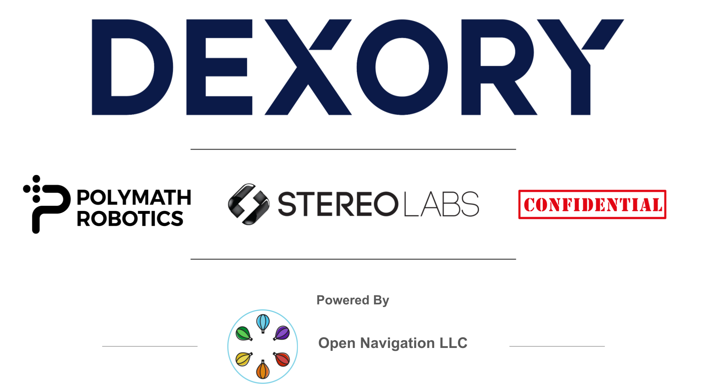

# Nav2
[](https://github.com/ros-planning/navigation2/actions/workflows/update_ci_image.yaml)
[](https://codecov.io/gh/ros-planning/navigation2)

<p align="center">
  
</p>

For detailed instructions on how to:
- [Getting Started](https://navigation.ros.org/getting_started/index.html)
- [Concepts](https://navigation.ros.org/concepts/index.html)
- [Build](https://navigation.ros.org/build_instructions/index.html#build)
- [Install](https://navigation.ros.org/build_instructions/index.html#install)
- [General Tutorials](https://navigation.ros.org/tutorials/index.html) and [Algorithm Developer Tutorials](https://navigation.ros.org/plugin_tutorials/index.html)
- [Configure](https://navigation.ros.org/configuration/index.html)
- [Navigation Plugins](https://navigation.ros.org/plugins/index.html)
- [Migration Guides](https://navigation.ros.org/migration/index.html)
- [Container Images for Building Nav2](https://github.com/orgs/ros-planning/packages/container/package/navigation2)
- [Contribute](https://navigation.ros.org/development_guides/involvement_docs/index.html)

Please visit our [documentation site](https://navigation.ros.org/). [Please visit our community Slack here](https://join.slack.com/t/navigation2/shared_invite/zt-hu52lnnq-cKYjuhTY~sEMbZXL8p9tOw) (if this link does not work, please contact maintainers to reactivate).

## Our Sponsors

Please thank our amazing sponsors for their generous support of Nav2 on behalf of the community to allow the project to continue to be professionally maintained, developed, and supported for the long-haul! [Open Navigation LLC](https://www.opennav.org/) provides project leadership, maintenance, development, and support services to the Nav2 & ROS community. 

<p align="center">
  
</p>

### [Dexory](https://www.dexory.com/) develops robotics and AI logistics solutions to drive better business decisions using a digital twin of warehouses to provide inventory insights.

### [Polymath Robotics](https://www.polymathrobotics.com/) creates safety-critical navigation systems for industrial vehicles that are radically simple to enable and deploy.

### [Stereolabs](https://www.stereolabs.com/) produces the high-quality ZED stereo cameras with a complete vision pipeline from neural depth to SLAM, 3D object tracking, AI and more.

### Confidential is just happy to support Nav2's mission!


## Citation

If you use the navigation framework, an algorithm from this repository, or ideas from it
please cite this work in your papers!

 - S. Macenski, F. Martín, R. White, J. Clavero. [**The Marathon 2: A Navigation System**](https://arxiv.org/abs/2003.00368). IEEE/RSJ International Conference on Intelligent Robots and Systems (IROS), 2020.
 
 ```bibtex
 @InProceedings{macenski2020marathon2,
   title = {The Marathon 2: A Navigation System},
   author = {Macenski, Steve and Martín, Francisco and White, Ruffin and Ginés Clavero, Jonatan},
   year = {2020},
   booktitle = {2020 IEEE/RSJ International Conference on Intelligent Robots and Systems (IROS)},
   url = {https://github.com/ros-planning/navigation2},
   pdf = {https://arxiv.org/abs/2003.00368}
 }
```

 If you use our work on VSLAM and formal comparisons for service robot needs, please cite the paper:

 - A. Merzlyakov, S. Macenski. [**A Comparison of Modern General-Purpose Visual SLAM Approaches**](https://arxiv.org/abs/2107.07589). IEEE/RSJ International Conference on Intelligent Robots and Systems (IROS), 2021.

 ```bibtex
 @InProceedings{vslamComparison2021,
   title = {A Comparison of Modern General-Purpose Visual SLAM Approaches},
   author = {Merzlyakov, Alexey and Macenski, Steven},
   year = {2021},
   booktitle = {2021 IEEE/RSJ International Conference on Intelligent Robots and Systems (IROS)},
   pdf = {https://arxiv.org/abs/2107.07589}
 }
```

## Build Status

| Service | Foxy  | Humble | Main |
| :---: | :---: | :---: | :---: |
| ROS Build Farm | [](http://build.ros2.org/job/Fdev__navigation2__ubuntu_focal_amd64/) | [](https://build.ros2.org/job/Hdev__navigation2__ubuntu_jammy_amd64/) | N/A |
| Circle CI | N/A | N/A | [](https://circleci.com/gh/ros-planning/navigation2/tree/main) |


| Package | Foxy Source | Foxy Debian | Humble Source | Humble Debian |
| :---: | :---: | :---: | :---: | :---: |
| Navigation2 | [](http://build.ros2.org/job/Fsrc_uF__navigation2__ubuntu_focal__source/) | [](http://build.ros2.org/job/Fbin_uF64__navigation2__ubuntu_focal_amd64__binary/) | [](https://build.ros2.org/job/Hsrc_uJ__navigation2__ubuntu_jammy__source/) | [](https://build.ros2.org/job/Hbin_uJ64__navigation2__ubuntu_jammy_amd64__binary/) | 
| nav2_amcl | [](http://build.ros2.org/job/Fsrc_uF__nav2_amcl__ubuntu_focal__source/) | [](http://build.ros2.org/job/Fbin_uF64__nav2_amcl__ubuntu_focal_amd64__binary/) | [](https://build.ros2.org/job/Hsrc_uJ__nav2_amcl__ubuntu_jammy__source/) | [](https://build.ros2.org/job/Hbin_uJ64__nav2_amcl__ubuntu_jammy_amd64__binary/) |
| nav2_behavior_tree | [](http://build.ros2.org/job/Fsrc_uF__nav2_behavior_tree__ubuntu_focal__source/) | [](http://build.ros2.org/job/Fbin_uF64__nav2_behavior_tree__ubuntu_focal_amd64__binary/) | [](https://build.ros2.org/job/Hsrc_uJ__nav2_behavior_tree__ubuntu_jammy__source/) | [](https://build.ros2.org/job/Hbin_uJ64__nav2_behavior_tree__ubuntu_jammy_amd64__binary/) | 
| nav2_{recoveries, behaviors} | [](http://build.ros2.org/job/Fsrc_uF__nav2_recoveries__ubuntu_focal__source/) | [](http://build.ros2.org/job/Fbin_uF64__nav2_recoveries__ubuntu_focal_amd64__binary/) | [](https://build.ros2.org/job/Hsrc_uJ__nav2_behaviors__ubuntu_jammy__source/) | [](https://build.ros2.org/job/Hbin_uJ64__nav2_behaviors__ubuntu_jammy_amd64__binary/) |
| nav2_bringup | [](http://build.ros2.org/job/Fsrc_uF__nav2_bringup__ubuntu_focal__source/) | [](http://build.ros2.org/job/Fbin_uF64__nav2_bringup__ubuntu_focal_amd64__binary/) | [](https://build.ros2.org/job/Hsrc_uJ__nav2_bringup__ubuntu_jammy__source/) | [](https://build.ros2.org/job/Hbin_uJ64__nav2_bringup__ubuntu_jammy_amd64__binary/) |
| nav2_bt_navigator | [](http://build.ros2.org/job/Fsrc_uF__nav2_bt_navigator__ubuntu_focal__source/) | [](http://build.ros2.org/job/Fbin_uF64__nav2_bt_navigator__ubuntu_focal_amd64__binary/) | [](https://build.ros2.org/job/Hsrc_uJ__nav2_bt_navigator__ubuntu_jammy__source/) | [](https://build.ros2.org/job/Hbin_uJ64__nav2_bt_navigator__ubuntu_jammy_amd64__binary/) |
| nav2_common | [](http://build.ros2.org/job/Fsrc_uF__nav2_common__ubuntu_focal__source/) | [](http://build.ros2.org/job/Fbin_uF64__nav2_common__ubuntu_focal_amd64__binary/) | [](https://build.ros2.org/job/Hsrc_uJ__nav2_common__ubuntu_jammy__source/) | [](https://build.ros2.org/job/Hbin_uJ64__nav2_common__ubuntu_jammy_amd64__binary/) |
| nav2_constrained_smoother | N/A | N/A | N/A | N/A | [](https://build.ros2.org/job/Hsrc_uJ__nav2_constrained_smoother__ubuntu_jammy__source/) | [](https://build.ros2.org/job/Hbin_uJ64__nav2_constrained_smoother__ubuntu_jammy_amd64__binary/) |
| nav2_controller | [](http://build.ros2.org/job/Fsrc_uF__nav2_controller__ubuntu_focal__source/) | [](http://build.ros2.org/job/Fbin_uF64__nav2_controller__ubuntu_focal_amd64__binary/) | [](https://build.ros2.org/job/Hsrc_uJ__nav2_controller__ubuntu_jammy__source/) | [](https://build.ros2.org/job/Hbin_uJ64__nav2_controller__ubuntu_jammy_amd64__binary/) |
| nav2_core | [](http://build.ros2.org/job/Fsrc_uF__nav2_core__ubuntu_focal__source/) | [](http://build.ros2.org/job/Fbin_uF64__nav2_core__ubuntu_focal_amd64__binary/) | [](https://build.ros2.org/job/Hsrc_uJ__nav2_core__ubuntu_jammy__source/) | [](https://build.ros2.org/job/Hbin_uJ64__nav2_core__ubuntu_jammy_amd64__binary/) |
| nav2_costmap_2d | [](http://build.ros2.org/job/Fsrc_uF__nav2_costmap_2d__ubuntu_focal__source/) | [](http://build.ros2.org/job/Fbin_uF64__nav2_costmap_2d__ubuntu_focal_amd64__binary/) | [](https://build.ros2.org/job/Hsrc_uJ__nav2_costmap_2d__ubuntu_jammy__source/) | [](https://build.ros2.org/job/Hbin_uJ64__nav2_costmap_2d__ubuntu_jammy_amd64__binary/) |
| nav2_dwb_controller | [](http://build.ros2.org/job/Fsrc_uF__nav2_dwb_controller__ubuntu_focal__source/) | [](http://build.ros2.org/job/Fbin_uF64__nav2_dwb_controller__ubuntu_focal_amd64__binary/) | [](https://build.ros2.org/job/Hsrc_uJ__nav2_dwb_controller__ubuntu_jammy__source/) | [](https://build.ros2.org/job/Hbin_uJ64__nav2_dwb_controller__ubuntu_jammy_amd64__binary/) |
| nav2_lifecycle_manager | [](http://build.ros2.org/job/Fsrc_uF__nav2_lifecycle_manager__ubuntu_focal__source/) | [](http://build.ros2.org/job/Fbin_uF64__nav2_lifecycle_manager__ubuntu_focal_amd64__binary/) | [](https://build.ros2.org/job/Hsrc_uJ__nav2_lifecycle_manager__ubuntu_jammy__source/) | [](https://build.ros2.org/job/Hbin_uJ64__nav2_lifecycle_manager__ubuntu_jammy_amd64__binary/) |
| nav2_map_server | [](http://build.ros2.org/job/Fsrc_uF__nav2_map_server__ubuntu_focal__source/) | [](http://build.ros2.org/job/Fbin_uF64__nav2_map_server__ubuntu_focal_amd64__binary/) | [](https://build.ros2.org/job/Hsrc_uJ__nav2_map_server__ubuntu_jammy__source/) | [](https://build.ros2.org/job/Hbin_uJ64__nav2_map_server__ubuntu_jammy_amd64__binary/) |
| nav2_msgs | [](http://build.ros2.org/job/Fsrc_uF__nav2_msgs__ubuntu_focal__source/) | [](http://build.ros2.org/job/Fbin_uF64__nav2_msgs__ubuntu_focal_amd64__binary/) | [](https://build.ros2.org/job/Hsrc_uJ__nav2_msgs__ubuntu_jammy__source/) | [](https://build.ros2.org/job/Hbin_uJ64__nav2_msgs__ubuntu_jammy_amd64__binary/) |
| nav2_navfn_planner | [](http://build.ros2.org/job/Fsrc_uF__nav2_navfn_planner__ubuntu_focal__source/) | [](http://build.ros2.org/job/Fbin_uF64__nav2_navfn_planner__ubuntu_focal_amd64__binary/) | [](https://build.ros2.org/job/Hsrc_uJ__nav2_navfn_planner__ubuntu_jammy__source/) | [](https://build.ros2.org/job/Hbin_uJ64__nav2_navfn_planner__ubuntu_jammy_amd64__binary/) |
| nav2_planner | [](http://build.ros2.org/job/Fsrc_uF__nav2_planner__ubuntu_focal__source/) | [](http://build.ros2.org/job/Fbin_uF64__nav2_planner__ubuntu_focal_amd64__binary/) | [](https://build.ros2.org/job/Hsrc_uJ__nav2_planner__ubuntu_jammy__source/) | [](https://build.ros2.org/job/Hbin_uJ64__nav2_planner__ubuntu_jammy_amd64__binary/) |
| nav2_regulated_pure_pursuit | [](http://build.ros2.org/job/Fsrc_uF__nav2_regulated_pure_pursuit_controller__ubuntu_focal__source/) | [](https://build.ros2.org/job/Fbin_uF64__nav2_regulated_pure_pursuit_controller__ubuntu_focal_amd64__binary/) | [](https://build.ros2.org/job/Hsrc_uJ__nav2_regulated_pure_pursuit_controller__ubuntu_jammy__source/) | [](https://build.ros2.org/job/Hbin_uJ64__nav2_regulated_pure_pursuit_controller__ubuntu_jammy_amd64__binary/) | 
| nav2_rotation_shim_controller | N/A | N/A | N/A | N/A | [](https://build.ros2.org/job/Hsrc_uJ__nav2_rotation_shim_controller__ubuntu_jammy__source/) | [](https://build.ros2.org/job/Hbin_uJ64__nav2_rotation_shim_controller__ubuntu_jammy_amd64__binary/) |
| nav2_rviz_plugins | [](http://build.ros2.org/job/Fsrc_uF__nav2_rviz_plugins__ubuntu_focal__source/) | [](http://build.ros2.org/job/Fbin_uF64__nav2_rviz_plugins__ubuntu_focal_amd64__binary/) | [](https://build.ros2.org/job/Hsrc_uJ__nav2_rviz_plugins__ubuntu_jammy__source/) | [](https://build.ros2.org/job/Hbin_uJ64__nav2_rviz_plugins__ubuntu_jammy_amd64__binary/) |
| nav2_simple_commander | N/A | N/A | [](https://build.ros2.org/job/Hsrc_uJ__nav2_simple_commander__ubuntu_jammy__source/) | [](https://build.ros2.org/job/Hbin_uJ64__nav2_simple_commander__ubuntu_jammy_amd64__binary/) |
| nav2_smac_planner | [](http://build.ros2.org/job/Fsrc_uF__smac_planner__ubuntu_focal__source/) | [](http://build.ros2.org/job/Fbin_uF64__smac_planner__ubuntu_focal_amd64__binary/) | [](https://build.ros2.org/job/Hsrc_uJ__nav2_smac_planner__ubuntu_jammy__source/) | [](https://build.ros2.org/job/Hbin_uJ64__nav2_smac_planner__ubuntu_jammy_amd64__binary/) | 
| nav2_smoother | N/A | N/A | N/A | N/A | [](https://build.ros2.org/job/Hsrc_uJ__nav2_smoother__ubuntu_jammy__source/) | [](https://build.ros2.org/job/Hbin_uJ64__nav2_smoother__ubuntu_jammy_amd64__binary/) |
| nav2_system_tests | [](http://build.ros2.org/job/Fsrc_uF__nav2_system_tests__ubuntu_focal__source/) | [](http://build.ros2.org/job/Fbin_uF64__nav2_system_tests__ubuntu_focal_amd64__binary/) | [](https://build.ros2.org/job/Hsrc_uJ__nav2_system_tests__ubuntu_jammy__source/) | [](https://build.ros2.org/job/Hbin_uJ64__nav2_system_tests__ubuntu_jammy_amd64__binary/) |
| nav2_theta_star_planner | N/A | N/A | [](https://build.ros2.org/job/Hsrc_uJ__nav2_theta_star_planner__ubuntu_jammy__source/) | [](https://build.ros2.org/job/Hbin_uJ64__nav2_theta_star_planner__ubuntu_jammy_amd64__binary/) |
| nav2_util | [](http://build.ros2.org/job/Fsrc_uF__nav2_util__ubuntu_focal__source/) | [](http://build.ros2.org/job/Fbin_uF64__nav2_util__ubuntu_focal_amd64__binary/) | [](https://build.ros2.org/job/Hsrc_uJ__nav2_util__ubuntu_jammy__source/) | [](https://build.ros2.org/job/Hbin_uJ64__nav2_util__ubuntu_jammy_amd64__binary/) |
| nav2_voxel_grid | [](https://build.ros2.org/job/Fsrc_uF__nav2_voxel_grid__ubuntu_focal__source/) | [](https://build.ros2.org/job/Fbin_uF64__nav2_voxel_grid__ubuntu_focal_amd64__binary/) | [](https://build.ros2.org/job/Hsrc_uJ__nav2_voxel_grid__ubuntu_jammy__source/) | [](https://build.ros2.org/job/Hbin_uJ64__nav2_voxel_grid__ubuntu_jammy_amd64__binary/) |
| nav2_waypoint_follower | [](http://build.ros2.org/job/Fsrc_uF__nav2_waypoint_follower__ubuntu_focal__source/) | [](http://build.ros2.org/job/Fbin_uF64__nav2_waypoint_follower__ubuntu_focal_amd64__binary/) | [](https://build.ros2.org/job/Hsrc_uJ__nav2_waypoint_follower__ubuntu_jammy__source/) | [](https://build.ros2.org/job/Hbin_uJ64__nav2_waypoint_follower__ubuntu_jammy_amd64__binary/) |
