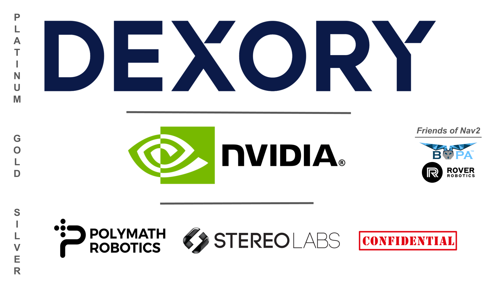

# Nav2
[](https://github.com/ros-navigation/navigation2/actions/workflows/update_ci_image.yaml)
[](https://codecov.io/gh/ros-navigation/navigation2)
[](https://circleci.com/gh/ros-navigation/navigation2/tree/main)

<p align="center">
  
</p>

For detailed instructions on how to:
- [Getting Started](https://docs.nav2.org/getting_started/index.html)
- [Concepts](https://docs.nav2.org/concepts/index.html)
- [Build](https://docs.nav2.org/development_guides/build_docs/index.html#build)
- [Install](https://docs.nav2.org/development_guides/build_docs/index.html#install)
- [General Tutorials](https://docs.nav2.org/tutorials/index.html) and [Algorithm Developer Tutorials](https://docs.nav2.org/plugin_tutorials/index.html)
- [Configure](https://docs.nav2.org/configuration/index.html)
- [Navigation Plugins](https://docs.nav2.org/plugins/index.html)
- [Migration Guides](https://docs.nav2.org/migration/index.html)
- [Container Images for Building Nav2](https://github.com/orgs/ros-navigation/packages/container/package/navigation2)
- [Contribute](https://docs.nav2.org/development_guides/involvement_docs/index.html)

Please visit our [documentation site](https://docs.nav2.org/). [Please visit our community Slack here](https://join.slack.com/t/navigation2/shared_invite/zt-uj428p0x-jKx8U7OzK1IOWp5TnDS2rA) (if this link does not work, please contact maintainers to reactivate).

**⚠️ If you need professional services related to Nav2, please contact [Open Navigation](https://www.opennav.org/) at info@opennav.org.**

## Our Sponsors

Please thank our amazing sponsors for their generous support of Nav2 on behalf of the community to allow the project to continue to be professionally maintained, developed, and supported for the long-haul! [Open Navigation LLC](https://www.opennav.org/) provides project leadership, maintenance, development, and support services to the Nav2 & ROS community. 

<p align="center">
  
</p>

### [Dexory](https://www.dexory.com/) develops robotics and AI logistics solutions to drive better business decisions using a digital twin of warehouses to provide inventory insights.

### [Nvidia](https://www.nvidia.com/en-us/deep-learning-ai/industries/robotics/) develops GPU and AI technologies that power modern robotics, autonomous driving, data centers, gaming, and more.

### [Polymath Robotics](https://www.polymathrobotics.com/) creates safety-critical navigation systems for industrial vehicles that are radically simple to enable and deploy.

### [Stereolabs](https://www.stereolabs.com/) produces the high-quality ZED stereo cameras with a complete vision pipeline from neural depth to SLAM, 3D object tracking, AI and more.

### Confidential is just happy to support Nav2's mission!


## Citation

If you use the navigation framework, an algorithm from this repository, or ideas from it
please cite this work in your papers!

 - S. Macenski, F. Martín, R. White, J. Clavero. [**The Marathon 2: A Navigation System**](https://arxiv.org/abs/2003.00368). IEEE/RSJ International Conference on Intelligent Robots and Systems (IROS), 2020.
 
 ```bibtex
 @InProceedings{macenski2020marathon2,
   title = {The Marathon 2: A Navigation System},
   author = {Macenski, Steve and Martín, Francisco and White, Ruffin and Ginés Clavero, Jonatan},
   year = {2020},
   booktitle = {2020 IEEE/RSJ International Conference on Intelligent Robots and Systems (IROS)},
   url = {https://github.com/ros-planning/navigation2},
   pdf = {https://arxiv.org/abs/2003.00368}
 }
```

If you use **any** of the algorithms in Nav2 or the analysis of the algorithms in your work, please cite this work in your papers!

- S. Macenski, T. Moore, DV Lu, A. Merzlyakov, M. Ferguson, [**From the desks of ROS maintainers: A survey of modern & capable mobile robotics algorithms in the robot operating system 2**](https://arxiv.org/pdf/2307.15236.pdf), Robotics and Autonomous Systems, 2023.

```bibtex
  @article{macenski2023survey,
        title={From the desks of ROS maintainers: A survey of modern & capable mobile robotics algorithms in the robot operating system 2}, 
        author={S. Macenski, T. Moore, DV Lu, A. Merzlyakov, M. Ferguson},
        year={2023},
        journal = {Robotics and Autonomous Systems}
  }
```

If you use the Smac Planner (Hybrid A*, State Lattice, 2D), please cite this work in your papers!

- S. Macenski, M. Booker, J. Wallace, [**Open-Source, Cost-Aware Kinematically Feasible Planning for Mobile and Surface Robotics**](https://arxiv.org/abs/2401.13078). 2024.

```bibtex
@article{macenski2024smac,
      title={Open-Source, Cost-Aware Kinematically Feasible Planning for Mobile and Surface Robotics}, 
      author={Steve Macenski and Matthew Booker and Josh Wallace},
      year={2024},
      journal = {Arxiv}
}
```

If you use the Regulated Pure Pursuit Controller algorithm or software from this repository, please cite this work in your papers!

- S. Macenski, S. Singh, F. Martin, J. Gines, [**Regulated Pure Pursuit for Robot Path Tracking**](https://arxiv.org/abs/2305.20026). Autonomous Robots, 2023.

```bibtex
@article{macenski2023regulated,
      title={Regulated Pure Pursuit for Robot Path Tracking}, 
      author={Steve Macenski and Shrijit Singh and Francisco Martin and Jonatan Gines},
      year={2023},
      journal = {Autonomous Robots}
}
```

 If you use our work on VSLAM and formal comparisons for service robot needs, please cite the paper:

 - A. Merzlyakov, S. Macenski. [**A Comparison of Modern General-Purpose Visual SLAM Approaches**](https://arxiv.org/abs/2107.07589). IEEE/RSJ International Conference on Intelligent Robots and Systems (IROS), 2021.

 ```bibtex
 @InProceedings{vslamComparison2021,
   title = {A Comparison of Modern General-Purpose Visual SLAM Approaches},
   author = {Merzlyakov, Alexey and Macenski, Steven},
   year = {2021},
   booktitle = {2021 IEEE/RSJ International Conference on Intelligent Robots and Systems (IROS)},
   pdf = {https://arxiv.org/abs/2107.07589}
 }
```

## Build Status

| Package | humble Source | humble Debian | iron Source | iron Debian | jazzy Source | jazzy Debian | 
| :---: | :---: | :---: | :---: | :---: | :---: | :---: |
| navigation2 | [](https://build.ros2.org/job/Hsrc_uj__navigation2__ubuntu_jammy__source/) | [](https://build.ros2.org/job/Hbin_uj64__navigation2__ubuntu_jammy_amd64__binary/) | [](https://build.ros2.org/job/Isrc_uj__navigation2__ubuntu_jammy__source/) | [](https://build.ros2.org/job/Ibin_uj64__navigation2__ubuntu_jammy_amd64__binary/) | [](https://build.ros2.org/job/Jsrc_un__navigation2__ubuntu_noble__source/) | [](https://build.ros2.org/job/Jbin_un64__navigation2__ubuntu_noble_amd64__binary/) | 
| nav2_amcl | [](https://build.ros2.org/job/Hsrc_uj__nav2_amcl__ubuntu_jammy__source/) | [](https://build.ros2.org/job/Hbin_uj64__nav2_amcl__ubuntu_jammy_amd64__binary/) | [](https://build.ros2.org/job/Isrc_uj__nav2_amcl__ubuntu_jammy__source/) | [](https://build.ros2.org/job/Ibin_uj64__nav2_amcl__ubuntu_jammy_amd64__binary/) | [](https://build.ros2.org/job/Jsrc_un__nav2_amcl__ubuntu_noble__source/) | [](https://build.ros2.org/job/Jbin_un64__nav2_amcl__ubuntu_noble_amd64__binary/) | 
| nav2_behavior_tree | [](https://build.ros2.org/job/Hsrc_uj__nav2_behavior_tree__ubuntu_jammy__source/) | [](https://build.ros2.org/job/Hbin_uj64__nav2_behavior_tree__ubuntu_jammy_amd64__binary/) | [](https://build.ros2.org/job/Isrc_uj__nav2_behavior_tree__ubuntu_jammy__source/) | [](https://build.ros2.org/job/Ibin_uj64__nav2_behavior_tree__ubuntu_jammy_amd64__binary/) | [](https://build.ros2.org/job/Jsrc_un__nav2_behavior_tree__ubuntu_noble__source/) | [](https://build.ros2.org/job/Jbin_un64__nav2_behavior_tree__ubuntu_noble_amd64__binary/) | 
| nav2_behaviors | [](https://build.ros2.org/job/Hsrc_uj__nav2_behaviors__ubuntu_jammy__source/) | [](https://build.ros2.org/job/Hbin_uj64__nav2_behaviors__ubuntu_jammy_amd64__binary/) | [](https://build.ros2.org/job/Isrc_uj__nav2_behaviors__ubuntu_jammy__source/) | [](https://build.ros2.org/job/Ibin_uj64__nav2_behaviors__ubuntu_jammy_amd64__binary/) | [](https://build.ros2.org/job/Jsrc_un__nav2_behaviors__ubuntu_noble__source/) | [](https://build.ros2.org/job/Jbin_un64__nav2_behaviors__ubuntu_noble_amd64__binary/) | 
| nav2_bringup | [](https://build.ros2.org/job/Hsrc_uj__nav2_bringup__ubuntu_jammy__source/) | [](https://build.ros2.org/job/Hbin_uj64__nav2_bringup__ubuntu_jammy_amd64__binary/) | [](https://build.ros2.org/job/Isrc_uj__nav2_bringup__ubuntu_jammy__source/) | [](https://build.ros2.org/job/Ibin_uj64__nav2_bringup__ubuntu_jammy_amd64__binary/) | [](https://build.ros2.org/job/Jsrc_un__nav2_bringup__ubuntu_noble__source/) | [](https://build.ros2.org/job/Jbin_un64__nav2_bringup__ubuntu_noble_amd64__binary/) | 
| nav2_bt_navigator | [](https://build.ros2.org/job/Hsrc_uj__nav2_bt_navigator__ubuntu_jammy__source/) | [](https://build.ros2.org/job/Hbin_uj64__nav2_bt_navigator__ubuntu_jammy_amd64__binary/) | [](https://build.ros2.org/job/Isrc_uj__nav2_bt_navigator__ubuntu_jammy__source/) | [](https://build.ros2.org/job/Ibin_uj64__nav2_bt_navigator__ubuntu_jammy_amd64__binary/) | [](https://build.ros2.org/job/Jsrc_un__nav2_bt_navigator__ubuntu_noble__source/) | [](https://build.ros2.org/job/Jbin_un64__nav2_bt_navigator__ubuntu_noble_amd64__binary/) | 
| nav2_collision_monitor | [](https://build.ros2.org/job/Hsrc_uj__nav2_collision_monitor__ubuntu_jammy__source/) | [](https://build.ros2.org/job/Hbin_uj64__nav2_collision_monitor__ubuntu_jammy_amd64__binary/) | [](https://build.ros2.org/job/Isrc_uj__nav2_collision_monitor__ubuntu_jammy__source/) | [](https://build.ros2.org/job/Ibin_uj64__nav2_collision_monitor__ubuntu_jammy_amd64__binary/) | [](https://build.ros2.org/job/Jsrc_un__nav2_collision_monitor__ubuntu_noble__source/) | [](https://build.ros2.org/job/Jbin_un64__nav2_collision_monitor__ubuntu_noble_amd64__binary/) | 
| nav2_common | [](https://build.ros2.org/job/Hsrc_uj__nav2_common__ubuntu_jammy__source/) | [](https://build.ros2.org/job/Hbin_uj64__nav2_common__ubuntu_jammy_amd64__binary/) | [](https://build.ros2.org/job/Isrc_uj__nav2_common__ubuntu_jammy__source/) | [](https://build.ros2.org/job/Ibin_uj64__nav2_common__ubuntu_jammy_amd64__binary/) | [](https://build.ros2.org/job/Jsrc_un__nav2_common__ubuntu_noble__source/) | [](https://build.ros2.org/job/Jbin_un64__nav2_common__ubuntu_noble_amd64__binary/) | 
| nav2_constrained_smoother | [](https://build.ros2.org/job/Hsrc_uj__nav2_constrained_smoother__ubuntu_jammy__source/) | [](https://build.ros2.org/job/Hbin_uj64__nav2_constrained_smoother__ubuntu_jammy_amd64__binary/) | [](https://build.ros2.org/job/Isrc_uj__nav2_constrained_smoother__ubuntu_jammy__source/) | [](https://build.ros2.org/job/Ibin_uj64__nav2_constrained_smoother__ubuntu_jammy_amd64__binary/) | [](https://build.ros2.org/job/Jsrc_un__nav2_constrained_smoother__ubuntu_noble__source/) | [](https://build.ros2.org/job/Jbin_un64__nav2_constrained_smoother__ubuntu_noble_amd64__binary/) | 
| nav2_controller | [](https://build.ros2.org/job/Hsrc_uj__nav2_controller__ubuntu_jammy__source/) | [](https://build.ros2.org/job/Hbin_uj64__nav2_controller__ubuntu_jammy_amd64__binary/) | [](https://build.ros2.org/job/Isrc_uj__nav2_controller__ubuntu_jammy__source/) | [](https://build.ros2.org/job/Ibin_uj64__nav2_controller__ubuntu_jammy_amd64__binary/) | [](https://build.ros2.org/job/Jsrc_un__nav2_controller__ubuntu_noble__source/) | [](https://build.ros2.org/job/Jbin_un64__nav2_controller__ubuntu_noble_amd64__binary/) | 
| nav2_core | [](https://build.ros2.org/job/Hsrc_uj__nav2_core__ubuntu_jammy__source/) | [](https://build.ros2.org/job/Hbin_uj64__nav2_core__ubuntu_jammy_amd64__binary/) | [](https://build.ros2.org/job/Isrc_uj__nav2_core__ubuntu_jammy__source/) | [](https://build.ros2.org/job/Ibin_uj64__nav2_core__ubuntu_jammy_amd64__binary/) | [](https://build.ros2.org/job/Jsrc_un__nav2_core__ubuntu_noble__source/) | [](https://build.ros2.org/job/Jbin_un64__nav2_core__ubuntu_noble_amd64__binary/) | 
| nav2_costmap_2d | [](https://build.ros2.org/job/Hsrc_uj__nav2_costmap_2d__ubuntu_jammy__source/) | [](https://build.ros2.org/job/Hbin_uj64__nav2_costmap_2d__ubuntu_jammy_amd64__binary/) | [](https://build.ros2.org/job/Isrc_uj__nav2_costmap_2d__ubuntu_jammy__source/) | [](https://build.ros2.org/job/Ibin_uj64__nav2_costmap_2d__ubuntu_jammy_amd64__binary/) | [](https://build.ros2.org/job/Jsrc_un__nav2_costmap_2d__ubuntu_noble__source/) | [](https://build.ros2.org/job/Jbin_un64__nav2_costmap_2d__ubuntu_noble_amd64__binary/) | 
| nav2_docking | [](https://build.ros2.org/job/Hsrc_uj__opennav_docking__ubuntu_jammy__source/) | [](https://build.ros2.org/job/Hbin_uj64__opennav_docking__ubuntu_jammy_amd64__binary/) | N/A | N/A | [](https://build.ros2.org/job/Jsrc_un__opennav_docking__ubuntu_noble__source/) | [](https://build.ros2.org/job/Jbin_un64__opennav_docking__ubuntu_noble_amd64__binary/) | 
| nav2_dwb_controller | [](https://build.ros2.org/job/Hsrc_uj__nav2_dwb_controller__ubuntu_jammy__source/) | [](https://build.ros2.org/job/Hbin_uj64__nav2_dwb_controller__ubuntu_jammy_amd64__binary/) | [](https://build.ros2.org/job/Isrc_uj__nav2_dwb_controller__ubuntu_jammy__source/) | [](https://build.ros2.org/job/Ibin_uj64__nav2_dwb_controller__ubuntu_jammy_amd64__binary/) | [](https://build.ros2.org/job/Jsrc_un__nav2_dwb_controller__ubuntu_noble__source/) | [](https://build.ros2.org/job/Jbin_un64__nav2_dwb_controller__ubuntu_noble_amd64__binary/) | 
| nav2_graceful_controller | [](https://build.ros2.org/job/Hsrc_uj__nav2_graceful_controller__ubuntu_jammy__source/) | [](https://build.ros2.org/job/Hbin_uj64__nav2_graceful_controller__ubuntu_jammy_amd64__binary/) | N/A | N/A | [](https://build.ros2.org/job/Jsrc_un__nav2_graceful_controller__ubuntu_noble__source/) | [](https://build.ros2.org/job/Jbin_un64__nav2_graceful_controller__ubuntu_noble_amd64__binary/) | 
| nav2_lifecycle_manager | [](https://build.ros2.org/job/Hsrc_uj__nav2_lifecycle_manager__ubuntu_jammy__source/) | [](https://build.ros2.org/job/Hbin_uj64__nav2_lifecycle_manager__ubuntu_jammy_amd64__binary/) | [](https://build.ros2.org/job/Isrc_uj__nav2_lifecycle_manager__ubuntu_jammy__source/) | [](https://build.ros2.org/job/Ibin_uj64__nav2_lifecycle_manager__ubuntu_jammy_amd64__binary/) | [](https://build.ros2.org/job/Jsrc_un__nav2_lifecycle_manager__ubuntu_noble__source/) | [](https://build.ros2.org/job/Jbin_un64__nav2_lifecycle_manager__ubuntu_noble_amd64__binary/) | 
| nav2_map_server | [](https://build.ros2.org/job/Hsrc_uj__nav2_map_server__ubuntu_jammy__source/) | [](https://build.ros2.org/job/Hbin_uj64__nav2_map_server__ubuntu_jammy_amd64__binary/) | [](https://build.ros2.org/job/Isrc_uj__nav2_map_server__ubuntu_jammy__source/) | [](https://build.ros2.org/job/Ibin_uj64__nav2_map_server__ubuntu_jammy_amd64__binary/) | [](https://build.ros2.org/job/Jsrc_un__nav2_map_server__ubuntu_noble__source/) | [](https://build.ros2.org/job/Jbin_un64__nav2_map_server__ubuntu_noble_amd64__binary/) | 
| nav2_mppi_controller | [](https://build.ros2.org/job/Hsrc_uj__nav2_mppi_controller__ubuntu_jammy__source/) | [](https://build.ros2.org/job/Hbin_uj64__nav2_mppi_controller__ubuntu_jammy_amd64__binary/) | [](https://build.ros2.org/job/Isrc_uj__nav2_mppi_controller__ubuntu_jammy__source/) | [](https://build.ros2.org/job/Ibin_uj64__nav2_mppi_controller__ubuntu_jammy_amd64__binary/) | [](https://build.ros2.org/job/Jsrc_un__nav2_mppi_controller__ubuntu_noble__source/) | [](https://build.ros2.org/job/Jbin_un64__nav2_mppi_controller__ubuntu_noble_amd64__binary/) | 
| nav2_msgs | [](https://build.ros2.org/job/Hsrc_uj__nav2_msgs__ubuntu_jammy__source/) | [](https://build.ros2.org/job/Hbin_uj64__nav2_msgs__ubuntu_jammy_amd64__binary/) | [](https://build.ros2.org/job/Isrc_uj__nav2_msgs__ubuntu_jammy__source/) | [](https://build.ros2.org/job/Ibin_uj64__nav2_msgs__ubuntu_jammy_amd64__binary/) | [](https://build.ros2.org/job/Jsrc_un__nav2_msgs__ubuntu_noble__source/) | [](https://build.ros2.org/job/Jbin_un64__nav2_msgs__ubuntu_noble_amd64__binary/) | 
| nav2_navfn_planner | [](https://build.ros2.org/job/Hsrc_uj__nav2_navfn_planner__ubuntu_jammy__source/) | [](https://build.ros2.org/job/Hbin_uj64__nav2_navfn_planner__ubuntu_jammy_amd64__binary/) | [](https://build.ros2.org/job/Isrc_uj__nav2_navfn_planner__ubuntu_jammy__source/) | [](https://build.ros2.org/job/Ibin_uj64__nav2_navfn_planner__ubuntu_jammy_amd64__binary/) | [](https://build.ros2.org/job/Jsrc_un__nav2_navfn_planner__ubuntu_noble__source/) | [](https://build.ros2.org/job/Jbin_un64__nav2_navfn_planner__ubuntu_noble_amd64__binary/) | 
| nav2_planner | [](https://build.ros2.org/job/Hsrc_uj__nav2_planner__ubuntu_jammy__source/) | [](https://build.ros2.org/job/Hbin_uj64__nav2_planner__ubuntu_jammy_amd64__binary/) | [](https://build.ros2.org/job/Isrc_uj__nav2_planner__ubuntu_jammy__source/) | [](https://build.ros2.org/job/Ibin_uj64__nav2_planner__ubuntu_jammy_amd64__binary/) | [](https://build.ros2.org/job/Jsrc_un__nav2_planner__ubuntu_noble__source/) | [](https://build.ros2.org/job/Jbin_un64__nav2_planner__ubuntu_noble_amd64__binary/) | 
| nav2_regulated_pure_pursuit | [](https://build.ros2.org/job/Hsrc_uj__nav2_regulated_pure_pursuit_controller__ubuntu_jammy__source/) | [](https://build.ros2.org/job/Hbin_uj64__nav2_regulated_pure_pursuit_controller__ubuntu_jammy_amd64__binary/) | [](https://build.ros2.org/job/Isrc_uj__nav2_regulated_pure_pursuit_controller__ubuntu_jammy__source/) | [](https://build.ros2.org/job/Ibin_uj64__nav2_regulated_pure_pursuit_controller__ubuntu_jammy_amd64__binary/) | [](https://build.ros2.org/job/Jsrc_un__nav2_regulated_pure_pursuit_controller__ubuntu_noble__source/) | [](https://build.ros2.org/job/Jbin_un64__nav2_regulated_pure_pursuit_controller__ubuntu_noble_amd64__binary/) | 
| nav2_rotation_shim_controller | [](https://build.ros2.org/job/Hsrc_uj__nav2_rotation_shim_controller__ubuntu_jammy__source/) | [](https://build.ros2.org/job/Hbin_uj64__nav2_rotation_shim_controller__ubuntu_jammy_amd64__binary/) | [](https://build.ros2.org/job/Isrc_uj__nav2_rotation_shim_controller__ubuntu_jammy__source/) | [](https://build.ros2.org/job/Ibin_uj64__nav2_rotation_shim_controller__ubuntu_jammy_amd64__binary/) | [](https://build.ros2.org/job/Jsrc_un__nav2_rotation_shim_controller__ubuntu_noble__source/) | [](https://build.ros2.org/job/Jbin_un64__nav2_rotation_shim_controller__ubuntu_noble_amd64__binary/) | 
| nav2_rviz_plugins | [](https://build.ros2.org/job/Hsrc_uj__nav2_rviz_plugins__ubuntu_jammy__source/) | [](https://build.ros2.org/job/Hbin_uj64__nav2_rviz_plugins__ubuntu_jammy_amd64__binary/) | [](https://build.ros2.org/job/Isrc_uj__nav2_rviz_plugins__ubuntu_jammy__source/) | [](https://build.ros2.org/job/Ibin_uj64__nav2_rviz_plugins__ubuntu_jammy_amd64__binary/) | [](https://build.ros2.org/job/Jsrc_un__nav2_rviz_plugins__ubuntu_noble__source/) | [](https://build.ros2.org/job/Jbin_un64__nav2_rviz_plugins__ubuntu_noble_amd64__binary/) | 
| nav2_simple_commander | [](https://build.ros2.org/job/Hsrc_uj__nav2_simple_commander__ubuntu_jammy__source/) | [](https://build.ros2.org/job/Hbin_uj64__nav2_simple_commander__ubuntu_jammy_amd64__binary/) | [](https://build.ros2.org/job/Isrc_uj__nav2_simple_commander__ubuntu_jammy__source/) | [](https://build.ros2.org/job/Ibin_uj64__nav2_simple_commander__ubuntu_jammy_amd64__binary/) | [](https://build.ros2.org/job/Jsrc_un__nav2_simple_commander__ubuntu_noble__source/) | [](https://build.ros2.org/job/Jbin_un64__nav2_simple_commander__ubuntu_noble_amd64__binary/) | 
| nav2_smac_planner | [](https://build.ros2.org/job/Hsrc_uj__nav2_smac_planner__ubuntu_jammy__source/) | [](https://build.ros2.org/job/Hbin_uj64__nav2_smac_planner__ubuntu_jammy_amd64__binary/) | [](https://build.ros2.org/job/Isrc_uj__nav2_smac_planner__ubuntu_jammy__source/) | [](https://build.ros2.org/job/Ibin_uj64__nav2_smac_planner__ubuntu_jammy_amd64__binary/) | [](https://build.ros2.org/job/Jsrc_un__nav2_smac_planner__ubuntu_noble__source/) | [](https://build.ros2.org/job/Jbin_un64__nav2_smac_planner__ubuntu_noble_amd64__binary/) | 
| nav2_smoother | [](https://build.ros2.org/job/Hsrc_uj__nav2_smoother__ubuntu_jammy__source/) | [](https://build.ros2.org/job/Hbin_uj64__nav2_smoother__ubuntu_jammy_amd64__binary/) | [](https://build.ros2.org/job/Isrc_uj__nav2_smoother__ubuntu_jammy__source/) | [](https://build.ros2.org/job/Ibin_uj64__nav2_smoother__ubuntu_jammy_amd64__binary/) | [](https://build.ros2.org/job/Jsrc_un__nav2_smoother__ubuntu_noble__source/) | [](https://build.ros2.org/job/Jbin_un64__nav2_smoother__ubuntu_noble_amd64__binary/) | 
| nav2_system_tests | [](https://build.ros2.org/job/Hsrc_uj__nav2_system_tests__ubuntu_jammy__source/) | [](https://build.ros2.org/job/Hbin_uj64__nav2_system_tests__ubuntu_jammy_amd64__binary/) | [](https://build.ros2.org/job/Isrc_uj__nav2_system_tests__ubuntu_jammy__source/) | [](https://build.ros2.org/job/Ibin_uj64__nav2_system_tests__ubuntu_jammy_amd64__binary/) | [](https://build.ros2.org/job/Jsrc_un__nav2_system_tests__ubuntu_noble__source/) | [](https://build.ros2.org/job/Jbin_un64__nav2_system_tests__ubuntu_noble_amd64__binary/) | 
| nav2_theta_star_planner | [](https://build.ros2.org/job/Hsrc_uj__nav2_theta_star_planner__ubuntu_jammy__source/) | [](https://build.ros2.org/job/Hbin_uj64__nav2_theta_star_planner__ubuntu_jammy_amd64__binary/) | [](https://build.ros2.org/job/Isrc_uj__nav2_theta_star_planner__ubuntu_jammy__source/) | [](https://build.ros2.org/job/Ibin_uj64__nav2_theta_star_planner__ubuntu_jammy_amd64__binary/) | [](https://build.ros2.org/job/Jsrc_un__nav2_theta_star_planner__ubuntu_noble__source/) | [](https://build.ros2.org/job/Jbin_un64__nav2_theta_star_planner__ubuntu_noble_amd64__binary/) | 
| nav2_util | [](https://build.ros2.org/job/Hsrc_uj__nav2_util__ubuntu_jammy__source/) | [](https://build.ros2.org/job/Hbin_uj64__nav2_util__ubuntu_jammy_amd64__binary/) | [](https://build.ros2.org/job/Isrc_uj__nav2_util__ubuntu_jammy__source/) | [](https://build.ros2.org/job/Ibin_uj64__nav2_util__ubuntu_jammy_amd64__binary/) | [](https://build.ros2.org/job/Jsrc_un__nav2_util__ubuntu_noble__source/) | [](https://build.ros2.org/job/Jbin_un64__nav2_util__ubuntu_noble_amd64__binary/) | 
| nav2_velocity_smoother | [](https://build.ros2.org/job/Hsrc_uj__nav2_velocity_smoother__ubuntu_jammy__source/) | [](https://build.ros2.org/job/Hbin_uj64__nav2_velocity_smoother__ubuntu_jammy_amd64__binary/) | [](https://build.ros2.org/job/Isrc_uj__nav2_velocity_smoother__ubuntu_jammy__source/) | [](https://build.ros2.org/job/Ibin_uj64__nav2_velocity_smoother__ubuntu_jammy_amd64__binary/) | [](https://build.ros2.org/job/Jsrc_un__nav2_velocity_smoother__ubuntu_noble__source/) | [](https://build.ros2.org/job/Jbin_un64__nav2_velocity_smoother__ubuntu_noble_amd64__binary/) | 
| nav2_voxel_grid | [](https://build.ros2.org/job/Hsrc_uj__nav2_voxel_grid__ubuntu_jammy__source/) | [](https://build.ros2.org/job/Hbin_uj64__nav2_voxel_grid__ubuntu_jammy_amd64__binary/) | [](https://build.ros2.org/job/Isrc_uj__nav2_voxel_grid__ubuntu_jammy__source/) | [](https://build.ros2.org/job/Ibin_uj64__nav2_voxel_grid__ubuntu_jammy_amd64__binary/) | [](https://build.ros2.org/job/Jsrc_un__nav2_voxel_grid__ubuntu_noble__source/) | [](https://build.ros2.org/job/Jbin_un64__nav2_voxel_grid__ubuntu_noble_amd64__binary/) | 
| nav2_waypoint_follower | [](https://build.ros2.org/job/Hsrc_uj__nav2_waypoint_follower__ubuntu_jammy__source/) | [](https://build.ros2.org/job/Hbin_uj64__nav2_waypoint_follower__ubuntu_jammy_amd64__binary/) | [](https://build.ros2.org/job/Isrc_uj__nav2_waypoint_follower__ubuntu_jammy__source/) | [](https://build.ros2.org/job/Ibin_uj64__nav2_waypoint_follower__ubuntu_jammy_amd64__binary/) | [](https://build.ros2.org/job/Jsrc_un__nav2_waypoint_follower__ubuntu_noble__source/) | [](https://build.ros2.org/job/Jbin_un64__nav2_waypoint_follower__ubuntu_noble_amd64__binary/) | 
