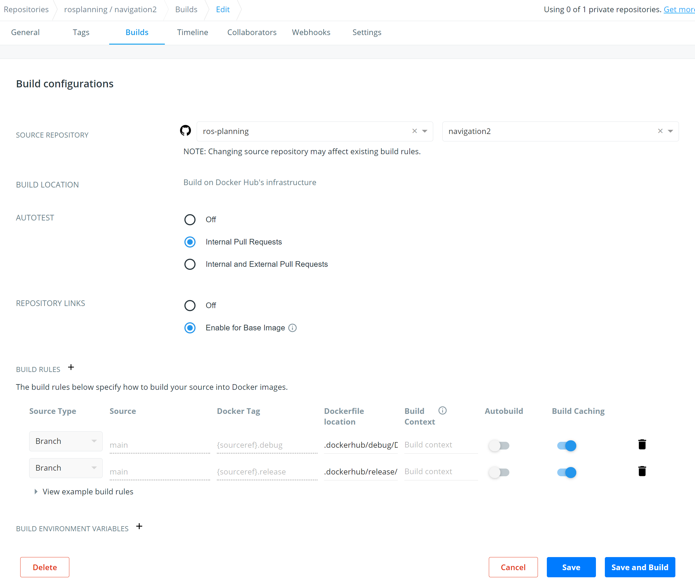

# DockerHub Documentation

DockerHub is a service used to build docker images from the project's Dockerfiles, as well as a registry used to host tagged images built. Using a docker registry permits the project to offload much of the environmental setup from the rest of the CI pipeline. More info on DockerHub can be found here:

* [DockerHub](https://hub.docker.com/)
* [Docker Hub Quickstart](https://docs.docker.com/docker-hub)

The tagged images in the project's registry repo are eventually used by the CI pipeline to spawn containers to build and test the project. The advantage of hosting branch specific image tags in a registry to pull from, rather than merely re-building the Dockerfiles at CI runtime, enables frontloading much of the principled environmental setup prior to the start of CI jobs. This saves CI time, spares resources/credits for other jobs, and helps to accelerate the development cycle. The project's DockerHub repo can be found here:

* [Navigation2 on DockerHub](https://hub.docker.com/r/rosplanning/navigation2)

While DockerHub does not require the use of configuration files in the source repo, the Dockerfiles and respective scripts used to customize automated builds of images are tracked in the [`.dockerhub`](/.dockerhub) directory. These scripts include custom build phase hooks used by DockerHub during automated builds. More info on automated builds can be found here:

* [How Automated Builds work](https://docs.docker.com/docker-hub/builds)
* [Advanced options for Autobuild and Autotest](https://docs.docker.com/docker-hub/builds/advanced)

Automated Builds are controlled via the build configurations menu within the repo's administrative console on DockerHub. For reference, a figure of the project's build configurations is shown here:

Here the repo's source repository is linked to the project's GitHub repo, while Autotest is disabled given a dedicated CI service is separately used to run test jobs. Repository linking can be used so that whenever a parent image repo is updated on DockerHub, it will also trigger a build for the project's DockerHub repository. Note that this only works for non-official library images, and only for build rules where Autobuild is is enabled. Two build rules are added for the main branch, providing both a release and debug tag for CI to pull from. The relative Dockerfiles paths are designated, while the build context is intentionally left empty, ensuring the build phase hooks within the same paths are used appropriately. Build caching is also enabled to shorten image turnaround time if multiple rebuilds a day are triggered.

The build hooks, e.g. [build](/.dockerhub/debug/hooks/build), are for customizing docker build `ARG`s in the Dockerfile; such as changing the base `FROM_IMAGE` between release or debug tags, adjusting the colcon mixins for each workspace to enable code coverage, or disabling fail on build failure, preventing source build breakages from blocking CI image tag updates. This also allows the slower debug CI to build and test only using the default RMW, while allowing the faster release CI jobs to build and test from an image with more RMWs installed.

## Autobuild

While the free registry for hosting is great, allowing projects gigabytes of free storage/bandwidth to cache pre-configured images for various branches or CI scenarios, that would otherwise take CI instances far longer to rebuild from scratch rather than pull from the registry, the automated build integration for DockerHub is basic. Rather than trigging build rules via pushed commits to matching GitHub branches, Autobuild is left disabled and the Build Trigger API is used instead. This Build Trigger API is evoked from scheduled cron jobs to rate limit DockerHub rebuilds; e.g. preventing hourly merge commits from needlessly churning CI image tags.

### Build Trigger API

Rather than configuring the build rules on DockerHub, a build trigger URL can be generated for the linked repo and used to programmatically specify build parameters such as: tag names, context path, source branch or version, etc. More info on Build Trigger can be found here:

* [Remote Build Triggers](https://github.com/docker/docker.github.io/blob/v17.06-release/docker-hub/builds.md#remote-build-triggers)
  * Legacy docs on using build triggers
* [Example GitHub Action](https://github.com/osrf/docker_images/blob/master/.github/workflows/trigger_nightly.yaml)
  * Scheduled cron job used to rebuild a nightly image
* [Example Build Hook](https://github.com/osrf/docker_images/blob/master/ros2/nightly/nightly/hooks/post_push)
  * A hook to rebuild a child image post push or parent tag

However, triggering builds via the API rather than relying on the DockerHub build rules also means forgoing the convenience of repository linking, where a repo's image can be sure to be rebuilt as soon as a new version of the parent image tag is pushed to the registry without needing to monitor the parent image repos oneself. This helps keep the CI environment uptodate and in sync with upstream development. However, for finer control flow when triggering DockerHub build rules, this API can be called from any scheduled cron job to periodically update images when a project is least active.

## Alternatives

### Outsource Image Builds

Instead of using DockerHub as the remote builder, any CI that supports Docker can similarly be used to build and push images to DockerHub's registry. As of writing however, aside from username/password authentication, DockerHub only provides personal access tokens tied to individual usernames rather than an organizations. This is a bit tedious, as to manage the CI as an organization, a separate machine account must be created and delegated with user permissions to push to the DockerHub repo. More info on CI integration with Docker can be found here:

* [Docker Hub: Managing access tokens](https://docs.docker.com/docker-hub/access-tokens/)
* [Docker + GitHub Actions](https://github.com/marketplace/actions/build-and-push-docker-images)
* [Docker + CircleCI Orbs](https://circleci.com/orbs/registry/orb/circleci/docker)
* [Docker + Azure Tasks](https://docs.microsoft.com/en-us/azure/devops/pipelines/tasks/build/docker?view=azure-devops#build-and-push)

Additionally, local build caching is often a premium feature for most other services, thus to benefit from docker build caching, one must manage a build agent for docker builds, or pony up to upgrade from a conventional open source free tier CI plan.

### Alternate Docker Registry

In addition to DockerHub, one can also self host a docker registry, or use alternate Docker Registry providers. This may be helpful if you anticipate exceeding DockerHub's free tier limits or would like co-locate the docker registry and CI runners within the same service provider or local network.

* [DockerHub Download rate limit](https://docs.docker.com/docker-hub/download-rate-limit/)
* [Self Hosted Registry](https://docs.docker.com/registry/)
* [GitHub Cloud Registry](https://github.com/features/packages)
* [AWS Elastic Container Registry](https://aws.amazon.com/ecr/)
* [Google Cloud Registry](https://cloud.google.com/container-registry)
* [GitLab Container Registry](https://about.gitlab.com/blog/2016/05/23/gitlab-container-registry/)
