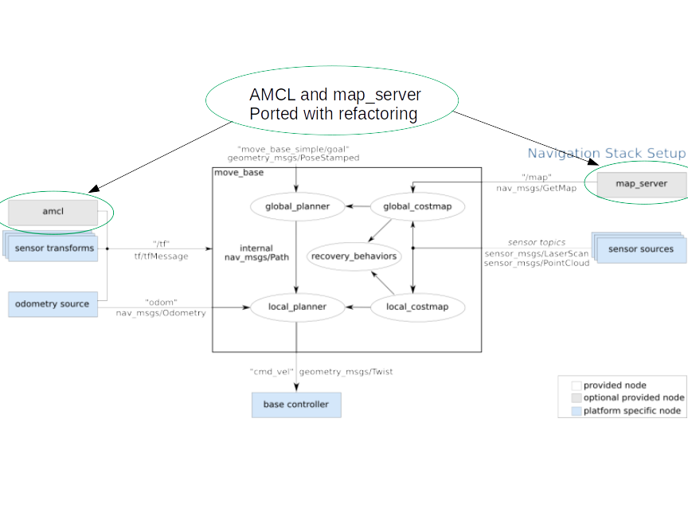

# Navigation 2 System Overview

## Comparison to Move Base in ROS
AMCL and map_server were ported to ROS2 with minimal functional changes, but some refactoring.

  * amcl -> [nav2_amcl](/nav2_amcl/README.md)
  * map_server -> [nav2_map_server](/nav2_map_server/README.md)

In addition, move_base itself has been split into multiple components:

  * [nav2_bt_navigator](/nav2_bt_navigator/README.md) (replaces move_base)
  * [nav2_navfn_planner](/nav2_navfn_planner/README.md) (replaces global_planner)
  * [nav2_dwb_controller](/nav2_dwb_controller/README.md) (replaces local_planner)

The *nav2_bt_navigator* replaces move_base at the top level, with an *Action* interface to call the global planner and controller with a configurable tree-based action model.

The *nav2_bt_navigator* itself is also an *Action Server* and can also be replaced with other implementations. It uses *Behavior Trees* to make it possible to have more complex state machines and to add in recovery behaviors as additional *Action Servers*. See *nav2_bt_navigator* for that implementation. (currently WIP in [Pull request 91](https://github.com/ros-planning/navigation2/pull/91))

The *nav2_navfn_planner* is ported from the *navfn* package in ROS, but adds the *Task Server* interface to enable it to be strongly decoupled from the nav2_bt_navigator.

Similarly, the *nav2_dwb_controller* is ported from the [dwb controller](https://github.com/locusrobotics/robot_navigation/tree/master/dwb_local_planner) package, and also adds a *Task Server* interface to also enable it to be decoupled from the *nav2_bt_navigator*.

All these changes make it possible to replace any of these nodes at launch/run time with any other algorithm that implements that same interface.

**See each package README.md for more details**
