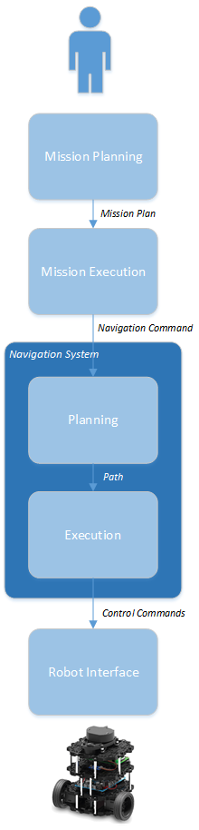

.. _requirements:

ROS 2 Navigation System Requirements
####################################

The ROS 2 Navigation System ("Navigation System") is the control system
that enables a robot to autonomously reach a goal state, such as a
specific position and orientation relative to a given map. Provided with
a navigation command to execute, the Navigation System generates a plan
to achieve the desired result and outputs control commands to
autonomously direct the robot, respecting any safety constraints and
avoiding obstacles encountered along the way.

This document lists the requirements for the ROS 2 Navigation System.
The ROS 2 Navigation System is intended to be a generalization of the
ROS 1 navigation stack and will address some of its known limitations.

1. Introduction
===============

This section describes the format of each requirement, the keywords
available for use in the definition of each requirement, and the basic
concepts needed to define and understand the requirements.

1.1 Requirement Fields
----------------------

Each requirement is presented in tabular form with the following fields:

-  **Id** - A unique identifier for the requirement
-  **Handle** - A short, scoped, description summarizing the essence of
   the requirement
-  **Priority** - An associated priority level: **1** (high), **2**
   (medium), and **3** (low)
-  **Requirement** - The requirement itself, stated in clear, concise
   requirements language
-  **Notes** - Elaboration and related information for the requirement

1.2 Requirement Language Keywords
---------------------------------

In the requirements specified below, certain keywords have a specific
meaning as they appear in the text. These keywords are defined as
follows and must be capitalized whenever used in a manner intended to
specify a behavior or requirement.

1. **MUST**: This word, or the terms "REQUIRED" or "SHALL", mean that
   the definition is an absolute requirement of the specification.

2. **MUST NOT**: This phrase, or the phrase "SHALL NOT", mean that the
   definition is an absolute prohibition of the specification.

3. **SHOULD**: This word, or the adjective "RECOMMENDED", mean that
   there may exist valid reasons in particular circumstances to ignore a
   particular item, but the full implications must be understood and
   carefully weighed before choosing a different course.

4. **SHOULD NOT**: This phrase, or the phrase "NOT RECOMMENDED" mean
   that there may exist valid reasons in particular circumstances when
   the particular behavior is acceptable or even useful, but the full
   implications should be understood and the case carefully weighed
   before implementing any behavior described with this label.

5. **MAY**: This word, or the adjective "OPTIONAL", mean that an item is
   truly optional. An implementation which does not include a particular
   option MUST be prepared to interoperate with another implementation
   which does include the option, though perhaps with reduced
   functionality. In the same vein an implementation which does include
   a particular option MUST be prepared to interoperate with another
   implementation which does not include the option (except, of course,
   for the feature the option provides).

These definitions are derived from the `IETF Best Current Practices
Document 14 <https://tools.ietf.org/html/bcp14>`__.

1.3 Terminology
---------------

This section defines some common terminology as used in this document.

+-------+-------------+
| Term  | Definition  |
+=======+=============+
| Path  | A *Path* is |
|       | an ordered  |
|       | sequence of |
|       | points in   |
|       | space.      |
+-------+-------------+
| Route | A *Route*   |
|       | is a        |
|       | synonym for |
|       | Path.       |
+-------+-------------+
| Traje | A           |
| ctory | *Trajectory*|
|       |             |
|       | is a path   |
|       | parameteriz |
|       | ed          |
|       | by time.    |
+-------+-------------+
| Path  | *Path       |
| Plann | Planning*   |
| ing   | refers to   |
|       | the process |
|       | of finding  |
|       | an optimal  |
|       | path        |
|       | between     |
|       | multiple    |
|       | locations.  |
|       | Path        |
|       | planning is |
|       | typically   |
|       | characteriz |
|       | ed          |
|       | as a graph  |
|       | traversal   |
|       | problem and |
|       | algorithms  |
|       | such as     |
|       | A\ *, D*,   |
|       | and RRT are |
|       | common      |
|       | choices for |
|       | implementat |
|       | ion.        |
+-------+-------------+
| Motio | *Motion     |
| n     | Planning*   |
| Plann | refers to   |
| ing   | the process |
|       | of          |
|       | specifying  |
|       | the motion  |
|       | of the      |
|       | robot over  |
|       | time to     |
|       | follow a    |
|       | specific    |
|       | path.       |
+-------+-------------+

1.4 Use Cases
-------------

The Navigation System is part of a larger system that includes a person
or automated system ("the user") directing the operation of one or more
robots. To provide context for the Navigation System, this section lists
the expected interactions between the user and the robot system.

1.4.1 Mapping Use Cases
-----------------------

The user will typically create a map of the area in which the robot is
to navigate, either manually or using the SLAM algorithm. This map
identifies significant features of the environment, including fixed
features, such as walls and fixed obstacles, and virtual features, such
as navigation lanes and safety zones. While the creation of the map
itself is outside the scope of the Navigation System, the system is
dependent on the map format(s). The map will need to be rich enough to
support the Navigation System requirements listed in this document.

The following use case diagram shows an example of the kinds of
operations provided by a mapping interface.

.. figure:: ./images/Mapping-Use-Cases.png
   :alt: Mapping Use Cases

   Mapping Use Cases

1.4.2 Mission Planning Use Cases
--------------------------------

Another area in which the user interacts with the system is in the
creation of a mission plan for the robot. The user composes a sequence
of primitive navigation commands, such as **Navigate to Pose**,
**Navigate to Area**, **Maintain Pose**, etc., into an overall plan.
While mission planning is also outside the scope of the Navigation
System, the mission plan format should be sufficient to meet the
Navigation System requirements listed in this document.

.. figure:: ./images/Mission-Planning-Use-Cases.png
   :alt: Mission Planning Use Cases

   Mission Planning Use Cases

1.4.3 Mission Execution Use Cases
---------------------------------

The user will be able to initiate the execution of specific mission
plans ("missions") and should also be able to view the status of the
mission in progress, as well as cancel the mission that is currently in
progress. In addition, the user may be required to provide the robot
with its initial pose if the robot is not able to determine it
automatically.

.. figure:: ./images/Mission-Execution-Use-Cases.png
   :alt: Mission Execution Use Cases

   Mission Execution Use Cases

1.5 Architectural Components
----------------------------

The Navigation System is part of a larger software system. This document
does not specify the architecture for the complete system, but simply
gives a conceptual overview for the purpose of requirements definition.

The Navigation System has a *command chain*, where each level refines
its command input into successively more specific operations for the
lext level down, and *support modules* which are used by modules in the
command chain.

1.5.1 Command Chain
-------------------

The command chain is the sequence of modules that comprise the chain of
command from the user, at the top, to the robot, at the bottom.

-  **Mission Planning** - Mission Planning provides an interface to the
   user to allow the user to create mission plans and assign them to
   robots for execution. A *Mission Plan* is a sequence of *Navigation
   Commands* along with associated information about how the commands
   should be carried out.
-  **Mission Execution** - Mission Execution receives the Mission Plan
   and is responsible to execute the plan and report progress on its
   execution.
-  **Navigation System** - The Navigation System receives a segment of
   an overall plan to execute (a *Navigation Command*) and generates the
   control commands to the robot to carry it out.
-  **Robot Interface** - The Robot Interface is an abstraction of the
   robot platform, providing the means for the Navigation System to
   control the robot, learn about its capabilities, and receive feedback
   from the robot.

The following diagram shows the modules in the command chain and the
successive refinement of the control commands:

.. figure:: ./images/Context.png
   :alt: Command Chain

   Command Chain

The Navigation System itself can be decomposed into two general
responsibilities, *Planning*, and *Execution*.

-  **Planning** - The Planning Module is responsible to execute
   Navigation Commands. To do so, this module can evaluate input maps
   and continually assess the robot's environment to plan motion and
   provide the path for the robot to follow to achieve completion of the
   Navigation Command.
-  **Execution** - The Execution Module is responsible to execute the
   path provided by Planning, generating the control commands required
   to follow the path.

.. figure:: ./images/Navigation-System.png
   :alt: Navigation System

   Navigation System

Decomposing the Navigation System, the overall command chain is as
follows:

   Command Pipeline

1.5.2 Support Modules
---------------------

In addition to the command chain, there are several supporting modules
and subsystems required for a complete system. The implementation of
these modules is outside the scope of the Navigation System. However,
the interface to these components is in scope and the associated
requirements should be defined. Together, the support modules provide
the robot with a full picture of the robot's environment.

-  **Mapping** - The Mapping Subsystem generates maps that can be used
   by the Navigation System to plan the robot's motion. Maps are
   typically created in advance and are available to the Navigation
   System. A map can be updated to reflect changes in the environment.
   The frequency of these updates will vary among implementations.
-  **Perception** - The Perception Subsystem utilizes sensors to develop
   an understanding of the dynamic environment around the robot. This
   information is available to the Navigation System, such as when
   avoiding obstacles in the robot's path.
-  **Prediction** - The Prediction Subsystem anticipates future motion
   trajectories of any perceived objects.
-  **Localization** - The Localization Subsystem provides the current
   location of the robot.

In a complete robot system these modules are available to the core
navigation modules (the command chain), as shown in the following
diagram:

.. figure:: ./images/With-Support-Modules.png
   :alt: Command Pipeline with Support

   Command Pipeline with Support

To facilitate error recovery, each module in the command chain, if it is
unable to carry out its task, should be able to propagate error
information to its predecessor in the chain.

1.6 Design Goals
----------------

The Navigation System should meet the following high-level design goals:

-  **Extensibility** - The Navigation System should be a *pluggable
   framework* to allow for other developers to easily extend the
   capabilities of the Navigation System, such as adding the ability to
   handle new navigation commands.
-  **Modularity** - The Navigation System should allow developers to
   *easily replace components* with alternative implementations.
-  **Generality** - The Navigation System should not introduce inherent
   limitations in the architectural blocks. For example, it should
   support multiple kinds of robots, not making assumptions about robot
   capabilities and limitations and should support various map types and
   orientations.
-  **Performance** - *TODO: What are the performance goals?*
-  **Scalability** - *TODO: What are the scalability goals?*
-  *TODO: Other important design goals to call out?*

2.0 Requirements
================

This section lists the requirements for the Navigation System.

2.1 Implementation Constraints
------------------------------

There are various constraints on the development of the ROS 2 Navigation
stack.

+-----+---------+-----------+--------------+--------+
| Id  | Handle  | Priority  | Description  | Notes  |
+=====+=========+===========+==============+========+
| IC0 | Develop | 1         | The          | `ROS 2 |
| 01  | er's    |           | Navigation   | Develo |
|     | Guide   |           | System       | per's  |
|     |         |           | SHOULD be    | Guide  |
|     |         |           | developed in | <https |
|     |         |           | accordance   | ://git |
|     |         |           | with the ROS | hub.co |
|     |         |           | 2            | m/ros2 |
|     |         |           | Developer's  | /ros2/ |
|     |         |           | Guide        | wiki/D |
|     |         |           |              | evelop |
|     |         |           |              | er-Gui |
|     |         |           |              | de>`__ |
+-----+---------+-----------+--------------+--------+
| IC0 | Impleme | 1         | Developers   | Per    |
| 02  | ntation |           | SHALL assume | the    |
|     | Languag |           | the          | ROS 2  |
|     | e.C++.V |           | availability | Develo |
|     | ersion  |           | of C++14     | per's  |
|     |         |           | language     | Guide  |
|     |         |           | features     |        |
+-----+---------+-----------+--------------+--------+
| IC0 | Impleme | 1         | Developers   | Boost  |
| 03  | ntation |           | SHOULD       | may be |
|     | Languag |           | prefer       | used   |
|     | e.C++.A |           | standard     | if     |
|     | PI      |           | C++, then    | equiva |
|     | Prefere |           | Boost, then  | lent   |
|     | nce     |           | custom code, | functi |
|     |         |           | in that      | onalit |
|     |         |           | order.       | y      |
|     |         |           |              | is not |
|     |         |           |              | alread |
|     |         |           |              | y      |
|     |         |           |              | availa |
|     |         |           |              | ble    |
|     |         |           |              | in the |
|     |         |           |              | C++    |
|     |         |           |              | standa |
|     |         |           |              | rd     |
|     |         |           |              | librar |
|     |         |           |              | y      |
+-----+---------+-----------+--------------+--------+
| IC0 | Impleme | 1         | The          |        |
| 04  | ntation |           | Navigation   |        |
|     | Languag |           | System code  |        |
|     | e.C++.S |           | SHALL        |        |
|     | upporte |           | compile with |        |
|     | d       |           | gcc 5.4 or   |        |
|     | Compile |           | newer        |        |
|     | rs.g++  |           |              |        |
+-----+---------+-----------+--------------+--------+
| IC0 | Impleme | 1         | The          |        |
| 05  | ntation |           | Navigation   |        |
|     | Languag |           | System code  |        |
|     | e.C++.S |           | SHALL        |        |
|     | upporte |           | compile with |        |
|     | d       |           | Clang,       |        |
|     | Compile |           | version *x*  |        |
|     | rs.Clan |           |              |        |
|     | g       |           |              |        |
+-----+---------+-----------+--------------+--------+
| IC0 | Impleme | 1         | The          | Could  |
| 06  | ntation |           | Navigation   | be     |
|     | Languag |           | System code  | useful |
|     | e.C++.S |           | SHOULD       | for    |
|     | upporte |           | compile with | optimi |
|     | d       |           | the Intel    | zation |
|     | Compile |           | C++          | purpos |
|     | rs.Inte |           | Compiler,    | es     |
|     | l       |           | version *x*  |        |
|     | C++     |           |              |        |
|     | Compile |           |              |        |
|     | r       |           |              |        |
+-----+---------+-----------+--------------+--------+
| IC0 | Impleme | 1         | Any Python   |        |
| 07  | ntation |           | code         |        |
|     | Languag |           | developed    |        |
|     | e.Pytho |           | for the      |        |
|     | n.Versi |           | Navigation   |        |
|     | on      |           | System MUST  |        |
|     |         |           | use Python 3 |        |
+-----+---------+-----------+--------------+--------+
| IC0 | Impleme | 1         | Any GUIs     | *Which |
| 08  | ntation |           | developed as | versio |
|     | Languag |           | part of the  | n?*    |
|     | e.GUI   |           | Navigation   |        |
|     |         |           | System       |        |
|     |         |           | SHOULD use   |        |
|     |         |           | the Qt       |        |
|     |         |           | library, via |        |
|     |         |           | C++ or       |        |
|     |         |           | Python       |        |
|     |         |           | (PyQt)       |        |
+-----+---------+-----------+--------------+--------+
| IC0 | Impleme | 1         | Any GUIs     |        |
| 09  | ntation |           | developed as |        |
|     | Languag |           | part of the  |        |
|     | e.GUI.Q |           | Navigation   |        |
|     | ML      |           | System MAY   |        |
|     |         |           | use QML      |        |
+-----+---------+-----------+--------------+--------+
| IC0 | ROS2.Ve | 1         | The first    | We     |
| 10  | rsion   |           | revision of  | should |
|     |         |           | the          | develo |
|     |         |           | Navigation   | p      |
|     |         |           | System WILL  | agains |
|     |         |           | target the   | t      |
|     |         |           | Crystal      | the    |
|     |         |           | Clemmys      | latest |
|     |         |           | release of   | ROS2   |
|     |         |           | ROS2.        | code   |
|     |         |           |              | whenev |
|     |         |           |              | er     |
|     |         |           |              | possib |
|     |         |           |              | le.    |
+-----+---------+-----------+--------------+--------+

2.2 Target Platforms
--------------------

Navigation System will run on the latest versions of the operating
systems supported by the core ROS 2 code.

+-----+---------+-----------+--------------+--------+
| Id  | Handle  | Priority  | Description  | Notes  |
+=====+=========+===========+==============+========+
| TP0 | Target  | 1         | The          |        |
| 01  | Platfor |           | Navigation   |        |
|     | ms.Oper |           | System MUST  |        |
|     | ating   |           | support      |        |
|     | Systems |           | Ubuntu       |        |
|     | .Ubuntu |           | Desktop      |        |
|     |         |           | 16.04 and    |        |
|     |         |           | Ubuntu       |        |
|     |         |           | Desktop      |        |
|     |         |           | 18.04        |        |
+-----+---------+-----------+--------------+--------+
| TP0 | Target  | 1         | The          |        |
| 02  | Platfor |           | Navigation   |        |
|     | ms.Oper |           | System MUST  |        |
|     | ating   |           | support      |        |
|     | Systems |           | MacOS 10.13  |        |
|     | .MacOS  |           | (High        |        |
|     |         |           | Sierra) and  |        |
|     |         |           | MacOS 10.14  |        |
|     |         |           | (Mohave)     |        |
+-----+---------+-----------+--------------+--------+
| TP0 | Target  | 1         | The          |        |
| 03  | Platfor |           | Navigation   |        |
|     | ms.Oper |           | System MUST  |        |
|     | ating   |           | support      |        |
|     | Systems |           | Windows 10   |        |
|     | .Window |           | Professional |        |
|     | s       |           |              |        |
+-----+---------+-----------+--------------+--------+
| TP0 | Target  | 1         | The          | Clear  |
| 04  | Platfor |           | Navigation   | Linux  |
|     | ms.Oper |           | System       | uses a |
|     | ating   |           | SHOULD       | contin |
|     | Systems |           | support the  | uous   |
|     | .Clear  |           | Intel's      | deploy |
|     | Linux   |           | Clear Linux  | ment   |
|     |         |           | distribution | model. |
+-----+---------+-----------+--------------+--------+
| TP0 | Target  | 1         | The          | Don't  |
| 05  | Platfor |           | Navigation   | assume |
|     | ms.CPU. |           | System SHALL | a      |
|     | Word    |           | support      | specif |
|     | Size    |           | 64-bit       | ic     |
|     |         |           | processors   | pointe |
|     |         |           |              | r      |
|     |         |           |              | size   |
+-----+---------+-----------+--------------+--------+
| TP0 | Target  | 1         | *TODO:       |        |
| 06  | Platfor |           | Should we    |        |
|     | ms.Mini |           | specify a    |        |
|     | mum     |           | minimum      |        |
|     | Platfor |           | target       |        |
|     | m       |           | platform?    |        |
|     |         |           | Or, should   |        |
|     |         |           | this be      |        |
|     |         |           | expressed as |        |
|     |         |           | minimum      |        |
|     |         |           | platform     |        |
|     |         |           | requirements |        |
|     |         |           | ?*           |        |
+-----+---------+-----------+--------------+--------+

2.3 Command Chain Modules
-------------------------

This section lists the requirements for the core command chain modules
in the Navigation System.

2.3.1 Mission Planning
~~~~~~~~~~~~~~~~~~~~~~

A complete system should have some kind of Mission Planning subsystem to
convey the user's intentions to the robot. The User interacts with this
Mission Planning subsystem to generate a Mission Plan for the robot. The
Mission Plan is defined as a sequence of Navigation Commands, along with
any associated information about how and when the plan should be carried
out. The design and implementation of a Mission Planning subsystem is
outside the scope of the Navigation System. However, in order to
understand the larger system context and how Mission Planning interacts
with the Navigation System, this section will consider the nature of a
mission plan and the kinds of operations it may contain.

+-----+---------+-----------+--------------+--------+
| Id  | Handle  | Priority  | Description  | Notes  |
+=====+=========+===========+==============+========+
| MP0 | Mission | 1         | The Mission  | Could  |
| 01  | Plannin |           | Plan MUST be | includ |
|     | g.Navig |           | able to      | e      |
|     | ation   |           | express the  | time   |
|     | Command |           | plan as a    | and    |
|     | s       |           | coordinated  | policy |
|     |         |           | sequence of  | aspect |
|     |         |           | Navigation   | s      |
|     |         |           | Commands.    | (*when |
|     |         |           |              | *      |
|     |         |           |              | and    |
|     |         |           |              | *how*, |
|     |         |           |              | not    |
|     |         |           |              | just   |
|     |         |           |              | *what* |
|     |         |           |              | )      |
+-----+---------+-----------+--------------+--------+
| MP0 | Mission | 1         | The Mission  | Build  |
| 02  | Plannin |           | Plan SHOULD  | up     |
|     | g.Navig |           | allow for    | levels |
|     | ation   |           | the          | of     |
|     | Command |           | composition  | abstra |
|     | s.Compo |           | and naming   | ction. |
|     | sition  |           | of new       | For    |
|     |         |           | Navigation   | exampl |
|     |         |           | Commands     | e,     |
|     |         |           | from a       | Enter- |
|     |         |           | sequence of  | Elevat |
|     |         |           | previously-d | or     |
|     |         |           | efined       | could  |
|     |         |           | Navigation   | be     |
|     |         |           | Commands.    | expres |
|     |         |           |              | sed    |
|     |         |           |              | as     |
|     |         |           |              | Naviga |
|     |         |           |              | te-to- |
|     |         |           |              | Pose   |
|     |         |           |              | (right |
|     |         |           |              | outsid |
|     |         |           |              | e      |
|     |         |           |              | of     |
|     |         |           |              | elevat |
|     |         |           |              | or),   |
|     |         |           |              | Wait   |
|     |         |           |              | (for   |
|     |         |           |              | door   |
|     |         |           |              | to     |
|     |         |           |              | open), |
|     |         |           |              | Naviga |
|     |         |           |              | te-to- |
|     |         |           |              | Pose   |
|     |         |           |              | (insid |
|     |         |           |              | e      |
|     |         |           |              | the    |
|     |         |           |              | elevat |
|     |         |           |              | or).   |
+-----+---------+-----------+--------------+--------+
| MP0 | Mission | 1         | The Mission  |        |
| 03  | Plannin |           | Plan MUST be |        |
|     | g.Navig |           | able to      |        |
|     | ation   |           | convey the   |        |
|     | Command |           | information  |        |
|     | s.Navig |           | required for |        |
|     | ate     |           | a robot to   |        |
|     | to Pose |           | navigate     |        |
|     |         |           | from its     |        |
|     |         |           | current      |        |
|     |         |           | location to  |        |
|     |         |           | a specific   |        |
|     |         |           | destination  |        |
|     |         |           | pose.        |        |
+-----+---------+-----------+--------------+--------+
| MP0 | Mission | 2         | The Mission  | An     |
| 04  | Plannin |           | Plan SHOULD  | "area" |
|     | g.Navig |           | be able to   | could  |
|     | ation   |           | convey the   | be a   |
|     | Command |           | information  | rectan |
|     | s.Navig |           | required for | gular  |
|     | ate     |           | a robot to   | region |
|     | to Area |           | navigate     | or a   |
|     |         |           | from its     | more   |
|     |         |           | current      | comple |
|     |         |           | location to  | x      |
|     |         |           | a specific   | shape. |
|     |         |           | area.        | It may |
|     |         |           |              | be     |
|     |         |           |              | define |
|     |         |           |              | d      |
|     |         |           |              | as     |
|     |         |           |              | tolera |
|     |         |           |              | nce    |
|     |         |           |              | to a   |
|     |         |           |              | goal   |
|     |         |           |              | (ie.   |
|     |         |           |              | within |
|     |         |           |              | +/- 1  |
|     |         |           |              | meter  |
|     |         |           |              | distan |
|     |         |           |              | ce).   |
+-----+---------+-----------+--------------+--------+
| MP0 | Mission | 2         | The Mission  |        |
| 05  | Plannin |           | Plan SHOULD  |        |
|     | g.Navig |           | be able to   |        |
|     | ation   |           | convey the   |        |
|     | Command |           | information  |        |
|     | s.Enque |           | required for |        |
|     | ue      |           | a robot to   |        |
|     |         |           | navigate     |        |
|     |         |           | from its     |        |
|     |         |           | current      |        |
|     |         |           | location to  |        |
|     |         |           | a position   |        |
|     |         |           | behind       |        |
|     |         |           | another      |        |
|     |         |           | specified    |        |
|     |         |           | robot.       |        |
+-----+---------+-----------+--------------+--------+
| MP0 | Mission | 2         | The Mission  | This   |
| 06  | Plannin |           | Plan SHOULD  | one    |
|     | g.Navig |           | be able to   | doesn' |
|     | ation   |           | convey the   | t      |
|     | Command |           | information  | have a |
|     | s.Follo |           | required for | comple |
|     | w       |           | a robot to   | tion   |
|     |         |           | be able to   | state  |
|     |         |           | follow       | (reach |
|     |         |           | another      | ing    |
|     |         |           | specified    | the    |
|     |         |           | robot.       | goal), |
|     |         |           |              | unless |
|     |         |           |              | it     |
|     |         |           |              | specif |
|     |         |           |              | ies    |
|     |         |           |              | additi |
|     |         |           |              | onal   |
|     |         |           |              | inform |
|     |         |           |              | ation  |
|     |         |           |              | such   |
|     |         |           |              | as     |
|     |         |           |              | "follo |
|     |         |           |              | w      |
|     |         |           |              | until  |
|     |         |           |              | destin |
|     |         |           |              | ation  |
|     |         |           |              | reache |
|     |         |           |              | d."    |
+-----+---------+-----------+--------------+--------+
| MP0 | Mission | 1         | The Mission  | Could  |
| 07  | Plannin |           | Plan SHOULD  | be     |
|     | g.Navig |           | be able to   | indefi |
|     | ation   |           | convey the   | nite   |
|     | Command |           | information  | or     |
|     | s.Maint |           | required for | time-b |
|     | ain     |           | a robot to   | ased.  |
|     | Pose    |           | maintain its |        |
|     |         |           | current      |        |
|     |         |           | pose.        |        |
+-----+---------+-----------+--------------+--------+
| MP0 | Mission | 2         | The Mission  | The    |
| 08  | Plannin |           | Plan SHOULD  | implem |
|     | g.Navig |           | be able to   | entati |
|     | ation   |           | convey the   | on     |
|     | Command |           | information  | of the |
|     | s.Park  |           | required for | parkin |
|     |         |           | a robot to   | g      |
|     |         |           | park itself. | comman |
|     |         |           |              | d      |
|     |         |           |              | could  |
|     |         |           |              | intera |
|     |         |           |              | ct     |
|     |         |           |              | with   |
|     |         |           |              | the    |
|     |         |           |              | robot  |
|     |         |           |              | to     |
|     |         |           |              | cause  |
|     |         |           |              | it,    |
|     |         |           |              | for    |
|     |         |           |              | exampl |
|     |         |           |              | e,     |
|     |         |           |              | to     |
|     |         |           |              | shut   |
|     |         |           |              | down   |
|     |         |           |              | or     |
|     |         |           |              | enter  |
|     |         |           |              | a      |
|     |         |           |              | low-po |
|     |         |           |              | wer    |
|     |         |           |              | state. |
+-----+---------+-----------+--------------+--------+
| MP0 | Mission | 2         | The Mission  |        |
| 09  | Plannin |           | Plan SHOULD  |        |
|     | g.Navig |           | be able to   |        |
|     | ation   |           | convey the   |        |
|     | Command |           | information  |        |
|     | s.Dock  |           | required for |        |
|     | to      |           | a robot to   |        |
|     | Charger |           | dock to a    |        |
|     |         |           | specific     |        |
|     |         |           | charging     |        |
|     |         |           | station.     |        |
+-----+---------+-----------+--------------+--------+
| MP0 | Mission | 1         | The Mission  | Time   |
| 10  | Plannin |           | Plan SHOULD  | and    |
|     | g.Polic |           | be able to   | safety |
|     | y       |           | express      | constr |
|     |         |           | information  | aints. |
|     |         |           | about how    |        |
|     |         |           | and when the |        |
|     |         |           | navigation   |        |
|     |         |           | commands are |        |
|     |         |           | to be        |        |
|     |         |           | carried out. |        |
+-----+---------+-----------+--------------+--------+
| MP0 | Mission | 1         | The Mission  |        |
| 11  | Plannin |           | Plan SHOULD  |        |
|     | g.Polic |           | be able to   |        |
|     | y.Time. |           | convey when  |        |
|     | Initiat |           | a mission    |        |
|     | ion     |           | should       |        |
|     |         |           | begin.       |        |
+-----+---------+-----------+--------------+--------+
| MP0 | Mission | 1         | The Mission  |        |
| 12  | Plannin |           | Plan SHOULD  |        |
|     | g.Polic |           | be able to   |        |
|     | y.Time. |           | convey by    |        |
|     | Complet |           | when a       |        |
|     | ion     |           | mission      |        |
|     |         |           | should end.  |        |
+-----+---------+-----------+--------------+--------+
| MP0 | Mission | 1         | The Mission  | The    |
| 13  | Plannin |           | Plan SHOULD  | robot  |
|     | g.Polic |           | be able to   | would  |
|     | y.Safet |           | convey a     | respec |
|     | y.Maxim |           | maximum      | t      |
|     | um      |           | speed for    | this   |
|     | Speed   |           | the robot.   | value  |
|     |         |           |              | in     |
|     |         |           |              | carryi |
|     |         |           |              | ng     |
|     |         |           |              | out    |
|     |         |           |              | the    |
|     |         |           |              | plan.  |
|     |         |           |              | This   |
|     |         |           |              | could  |
|     |         |           |              | be     |
|     |         |           |              | site-s |
|     |         |           |              | pecifi |
|     |         |           |              | c      |
|     |         |           |              | policy |
|     |         |           |              | .      |
+-----+---------+-----------+--------------+--------+
| MP0 | Mission | 1         | The Mission  | The    |
| 14  | Plannin |           | Plan SHOULD  | robot  |
|     | g.Polic |           | be able to   | would  |
|     | y.Safet |           | convey a     | respec |
|     | y.Minim |           | minimum      | t      |
|     | um      |           | safety       | this   |
|     | Safety  |           | buffer       | value  |
|     | Buffer  |           | distance.    | and    |
|     |         |           |              | mainta |
|     |         |           |              | in     |
|     |         |           |              | the    |
|     |         |           |              | distan |
|     |         |           |              | ce     |
|     |         |           |              | from   |
|     |         |           |              | other  |
|     |         |           |              | object |
|     |         |           |              | s      |
|     |         |           |              | at all |
|     |         |           |              | times. |
|     |         |           |              | Should |
|     |         |           |              | vary   |
|     |         |           |              | with   |
|     |         |           |              | relati |
|     |         |           |              | ve     |
|     |         |           |              | veloci |
|     |         |           |              | ties.  |
+-----+---------+-----------+--------------+--------+

2.3.2 Mission Execution
~~~~~~~~~~~~~~~~~~~~~~~

The Mission Execution module has the responsibility to execute a
provided mission. It provides each successive Navigation Command to the
Navigation Subsystem, monitoring and reporting progress towards
completion of the plan.

+-----+---------+-----------+--------------+--------+
| Id  | Handle  | Priority  | Description  | Notes  |
+=====+=========+===========+==============+========+
| ME0 | Mission | 1         | The Mission  |        |
| 01  | Executi |           | Execution    |        |
|     | on.Inpu |           | module MUST  |        |
|     | ts.Miss |           | accept the   |        |
|     | ion     |           | Mission Plan |        |
|     | Plan    |           | to execute.  |        |
+-----+---------+-----------+--------------+--------+
| ME0 | Mission | 1         | When         |        |
| 02  | Executi |           | commanded to |        |
|     | on.Inpu |           | do so, the   |        |
|     | ts.Comm |           | Mission      |        |
|     | ands.Ex |           | Execution    |        |
|     | ecute   |           | module MUST  |        |
|     | Mission |           | execute the  |        |
|     |         |           | provided     |        |
|     |         |           | Mission      |        |
|     |         |           | Plan,        |        |
|     |         |           | respecting   |        |
|     |         |           | any          |        |
|     |         |           | specified    |        |
|     |         |           | constraints. |        |
+-----+---------+-----------+--------------+--------+
| ME0 | Mission | 1         | When         |        |
| 03  | Executi |           | commanded to |        |
|     | on.Inpu |           | do so, the   |        |
|     | ts.Comm |           | Mission      |        |
|     | ands.Ca |           | Execution    |        |
|     | ncel    |           | module MUST  |        |
|     | Mission |           | interrupt    |        |
|     |         |           | the Robot's  |        |
|     |         |           | navigation   |        |
|     |         |           | and cancel   |        |
|     |         |           | the current  |        |
|     |         |           | mission.     |        |
+-----+---------+-----------+--------------+--------+
| ME0 | Mission | 1         | Upon         |        |
| 04  | Executi |           | completion   |        |
|     | on.Outp |           | of each      |        |
|     | uts.Nav |           | Navigation   |        |
|     | igation |           | Command, the |        |
|     | Command |           | Mission      |        |
|     |         |           | Execution    |        |
|     |         |           | module SHALL |        |
|     |         |           | output the   |        |
|     |         |           | next         |        |
|     |         |           | Navigation   |        |
|     |         |           | Command to   |        |
|     |         |           | execute.     |        |
+-----+---------+-----------+--------------+--------+
| ME0 | Mission | 1         | The Mission  |        |
| 05  | Executi |           | Execution    |        |
|     | on.Comm |           | module MUST  |        |
|     | and     |           | monitor for  |        |
|     | Sequenc |           | completion   |        |
|     | ing     |           | of each      |        |
|     |         |           | Navigation   |        |
|     |         |           | Command      |        |
|     |         |           | before       |        |
|     |         |           | sending the  |        |
|     |         |           | next         |        |
|     |         |           | command.     |        |
+-----+---------+-----------+--------------+--------+
| ME0 | Mission | 1         | The Mission  | In     |
| 06  | Executi |           | Execution    | case   |
|     | on.Logg |           | module       | of     |
|     | ing     |           | SHOULD log   | forens |
|     |         |           | its          | ic     |
|     |         |           | activity.    | analys |
|     |         |           |              | is     |
|     |         |           |              | of a   |
|     |         |           |              | safety |
|     |         |           |              | event, |
|     |         |           |              | for    |
|     |         |           |              | exampl |
|     |         |           |              | e.     |
+-----+---------+-----------+--------------+--------+
| ME0 | Mission | 1         | Upon receipt |        |
| 07  | Executi |           | of a         |        |
|     | on.Feed |           | downstream   |        |
|     | back.In |           | failure      |        |
|     | puts.Er |           | (unable to   |        |
|     | ror     |           | execute the  |        |
|     | Recover |           | Navigation   |        |
|     | y       |           | Command),    |        |
|     |         |           | the Mission  |        |
|     |         |           | Execution    |        |
|     |         |           | module       |        |
|     |         |           | SHOULD       |        |
|     |         |           | attempt to   |        |
|     |         |           | recover and  |        |
|     |         |           | continue     |        |
|     |         |           | execution of |        |
|     |         |           | the mission. |        |
+-----+---------+-----------+--------------+--------+
| ME0 | Mission | 1         | The Mission  | Interm |
| 08  | Executi |           | Execution    | ediate |
|     | on.Feed |           | module SHALL | steps  |
|     | back.Ou |           | provide      | of     |
|     | tputs.P |           | progress     | intere |
|     | rogress |           | notification | st.    |
|     | Notific |           | s            |        |
|     | ation   |           | on the       |        |
|     |         |           | execution of |        |
|     |         |           | the mission. |        |
+-----+---------+-----------+--------------+--------+
| ME0 | Mission | 1         | Upon         |        |
| 09  | Executi |           | successfull  |        |
|     | on.Feed |           | completion   |        |
|     | back.Ou |           | of the       |        |
|     | tputs.M |           | mission, the |        |
|     | ission  |           | Mission      |        |
|     | Complet |           | Execution    |        |
|     | ed      |           | module SHALL |        |
|     |         |           | output a     |        |
|     |         |           | correspondin |        |
|     |         |           | g            |        |
|     |         |           | notification |        |
|     |         |           | .            |        |
+-----+---------+-----------+--------------+--------+
| ME0 | Mission | 1         | Upon         |        |
| 10  | Executi |           | receiving a  |        |
|     | on.Feed |           | cancellation |        |
|     | back.Ou |           | command and  |        |
|     | tputs.M |           | cancelling   |        |
|     | ission  |           | the mission, |        |
|     | Cancele |           | the Mission  |        |
|     | d       |           | Execution    |        |
|     |         |           | module SHALL |        |
|     |         |           | output a     |        |
|     |         |           | correspondin |        |
|     |         |           | g            |        |
|     |         |           | notification |        |
|     |         |           | .            |        |
+-----+---------+-----------+--------------+--------+
| ME0 | Mission | 1         | If the       | This   |
| 11  | Executi |           | Mission      | would  |
|     | on.Feed |           | Execution    | be     |
|     | back.Ou |           | module is    | receiv |
|     | tputs.M |           | unable to    | ed     |
|     | ission  |           | execute the  | by the |
|     | Failure |           | mission, it  | user-l |
|     |         |           | MUST output  | evel   |
|     |         |           | a failure    | interf |
|     |         |           | notification | ace    |
|     |         |           | .            | and    |
|     |         |           |              | could  |
|     |         |           |              | necess |
|     |         |           |              | itate  |
|     |         |           |              | user   |
|     |         |           |              | interv |
|     |         |           |              | ention |
|     |         |           |              | ,      |
|     |         |           |              | such   |
|     |         |           |              | as     |
|     |         |           |              | having |
|     |         |           |              | a      |
|     |         |           |              | remote |
|     |         |           |              | operat |
|     |         |           |              | ing    |
|     |         |           |              | center |
|     |         |           |              | where  |
|     |         |           |              | the    |
|     |         |           |              | remote |
|     |         |           |              | operat |
|     |         |           |              | or     |
|     |         |           |              | "rescu |
|     |         |           |              | es"    |
|     |         |           |              | the    |
|     |         |           |              | robot. |
+-----+---------+-----------+--------------+--------+
| ME0 | Mission | 1         | If the       | The    |
| 12  | Executi |           | Mission      | failur |
|     | on.Safe |           | Execution    | e      |
|     | State   |           | module is    | could  |
|     | Upon    |           | unable to    | be for |
|     | Failure |           | execute the  | a      |
|     |         |           | mission, it  | variet |
|     |         |           | MUST direct  | y      |
|     |         |           | the robot to | of     |
|     |         |           | a safe       | reason |
|     |         |           | state.       | s      |
|     |         |           |              | -      |
|     |         |           |              | sensor |
|     |         |           |              | failur |
|     |         |           |              | es,    |
|     |         |           |              | algori |
|     |         |           |              | thmic  |
|     |         |           |              | failur |
|     |         |           |              | e,     |
|     |         |           |              | a      |
|     |         |           |              | collis |
|     |         |           |              | ion,   |
|     |         |           |              | etc.   |
+-----+---------+-----------+--------------+--------+
| ME0 | Mission | 1         | The          | For    |
| 13  | Executi |           | Navigation   | exampl |
|     | on.Sele |           | System       | e,     |
|     | ction   |           | SHOULD allow | a user |
|     | of      |           | the          | may    |
|     | Planner |           | association  | want   |
|     | s       |           | and use of   | to     |
|     |         |           | specific     | have   |
|     |         |           | Planning and | compon |
|     |         |           | Execution    | ents   |
|     |         |           | Modules for  | for    |
|     |         |           | a given      | classi |
|     |         |           | Navigation   | c      |
|     |         |           | Command.     | point- |
|     |         |           |              | A-to-p |
|     |         |           |              | oint-B |
|     |         |           |              | travel |
|     |         |           |              | ,      |
|     |         |           |              | but    |
|     |         |           |              | upon   |
|     |         |           |              | reachi |
|     |         |           |              | ng     |
|     |         |           |              | point  |
|     |         |           |              | B,     |
|     |         |           |              | have   |
|     |         |           |              | specia |
|     |         |           |              | lized  |
|     |         |           |              | compon |
|     |         |           |              | ents   |
|     |         |           |              | that   |
|     |         |           |              | contro |
|     |         |           |              | l      |
|     |         |           |              | a      |
|     |         |           |              | series |
|     |         |           |              | of     |
|     |         |           |              | maneuv |
|     |         |           |              | ers    |
|     |         |           |              | such   |
|     |         |           |              | as     |
|     |         |           |              | dockin |
|     |         |           |              | g      |
|     |         |           |              | to a   |
|     |         |           |              | chargi |
|     |         |           |              | ng     |
|     |         |           |              | statio |
|     |         |           |              | n      |
|     |         |           |              | or a   |
|     |         |           |              | convey |
|     |         |           |              | or     |
|     |         |           |              | belt.  |
+-----+---------+-----------+--------------+--------+

2.3.3 Navigation System.Planning
~~~~~~~~~~~~~~~~~~~~~~~~~~~~~~~~

The Navigation System's Planning Module receives the Navigation Command
from the Mission Execution module and is responsible to implement that
command. To do so, the Planning Module can use information from the
Mapping Subsystem to plan a route and use input from the Perception
Subsystem to evaluate the dynamic environment and avoid collisions with
objects crossing its path.

+-----+---------+-----------+--------------+--------+
| Id  | Handle  | Priority  | Description  | Notes  |
+=====+=========+===========+==============+========+
| PLN | Plannin | 1         | The          |        |
| 001 | g       |           | Navigation   |        |
|     |         |           | System       |        |
|     |         |           | SHOULD have  |        |
|     |         |           | a Planning   |        |
|     |         |           | Module that  |        |
|     |         |           | generates    |        |
|     |         |           | the Path for |        |
|     |         |           | the robot to |        |
|     |         |           | follow to    |        |
|     |         |           | implement a  |        |
|     |         |           | specified    |        |
|     |         |           | Navigation   |        |
|     |         |           | Command.     |        |
+-----+---------+-----------+--------------+--------+
| PLN | Plannin | 1         | The Planning |        |
| 002 | g.Input |           | Module SHALL |        |
|     | s.Navig |           | receive the  |        |
|     | ation   |           | Navigation   |        |
|     | Command |           | Command to   |        |
|     |         |           | execute.     |        |
+-----+---------+-----------+--------------+--------+
| PLN | Plannin | 1         | The Planning | This   |
| 003 | g.Input |           | Module SHALL | could  |
|     | s.Polic |           | receive      | be     |
|     | y       |           | policy       | global |
|     |         |           | information  | policy |
|     |         |           | associated   | and/or |
|     |         |           | with the     | per-co |
|     |         |           | Navigation   | mmand  |
|     |         |           | Command to   | policy |
|     |         |           | execute.     | .      |
|     |         |           |              | Policy |
|     |         |           |              | could  |
|     |         |           |              | contai |
|     |         |           |              | n,     |
|     |         |           |              | for    |
|     |         |           |              | exampl |
|     |         |           |              | e,     |
|     |         |           |              | a list |
|     |         |           |              | of     |
|     |         |           |              | conven |
|     |         |           |              | tions  |
|     |         |           |              | for    |
|     |         |           |              | the    |
|     |         |           |              | robot  |
|     |         |           |              | to     |
|     |         |           |              | follow |
|     |         |           |              | (navig |
|     |         |           |              | ate    |
|     |         |           |              | on the |
|     |         |           |              | right  |
|     |         |           |              | side   |
|     |         |           |              | of a   |
|     |         |           |              | path,  |
|     |         |           |              | for    |
|     |         |           |              | exampl |
|     |         |           |              | e).    |
+-----+---------+-----------+--------------+--------+
| PLN | Plannin | 1         | The Planning |        |
| 004 | g.Input |           | Module MUST  |        |
|     | s.Mappi |           | have access  |        |
|     | ng.Maps |           | to one or    |        |
|     |         |           | more maps    |        |
|     |         |           | available    |        |
|     |         |           | that         |        |
|     |         |           | describe the |        |
|     |         |           | robot's      |        |
|     |         |           | environment. |        |
+-----+---------+-----------+--------------+--------+
| PLN | Plannin | 1         | The Planning |        |
| 005 | g.Input |           | Module MUST  |        |
|     | s.Perce |           | have access  |        |
|     | ption.S |           | to data from |        |
|     | ensory  |           | the          |        |
|     | Input   |           | Perception   |        |
|     |         |           | Subsystem.   |        |
+-----+---------+-----------+--------------+--------+
| PLN | Plannin | 1         | The Planning | In     |
| 006 | g.Input |           | Module MAY   | simple |
|     | s.Predi |           | have access  | planne |
|     | ction.P |           | to predicted | rs,    |
|     | redicte |           | trajectories | there  |
|     | d       |           | of objects   | is no  |
|     | Traject |           | detected by  | predic |
|     | ories   |           | the          | tion   |
|     |         |           | Perception   | of     |
|     |         |           | Subsystem.   | moving |
|     |         |           |              | object |
|     |         |           |              | s,     |
|     |         |           |              | but in |
|     |         |           |              | more   |
|     |         |           |              | comple |
|     |         |           |              | x      |
|     |         |           |              | planne |
|     |         |           |              | rs,    |
|     |         |           |              | this   |
|     |         |           |              | may be |
|     |         |           |              | consid |
|     |         |           |              | ered.  |
+-----+---------+-----------+--------------+--------+
| PLN | Plannin | 1         | The Planning | The    |
| 007 | g.Input |           | Module MUST  | pose   |
|     | s.Local |           | have access  | could  |
|     | ization |           | to the       | be be  |
|     | .Curren |           | robot's      | provid |
|     | t       |           | current      | ed     |
|     | Pose    |           | pose.        | manual |
|     |         |           |              | ly     |
|     |         |           |              | or     |
|     |         |           |              | automa |
|     |         |           |              | ticall |
|     |         |           |              | y      |
|     |         |           |              | determ |
|     |         |           |              | ined   |
|     |         |           |              | (outsi |
|     |         |           |              | de     |
|     |         |           |              | of     |
|     |         |           |              | this   |
|     |         |           |              | module |
|     |         |           |              | ).     |
+-----+---------+-----------+--------------+--------+
| PLN | Plannin | 1         | The Planning |        |
| 008 | g.Outpu |           | Module       |        |
|     | ts.Path |           | SHOULD       |        |
|     |         |           | output the   |        |
|     |         |           | Path for the |        |
|     |         |           | robot to     |        |
|     |         |           | follow to    |        |
|     |         |           | execute the  |        |
|     |         |           | input        |        |
|     |         |           | Navigation   |        |
|     |         |           | Command and  |        |
|     |         |           | MUST respect |        |
|     |         |           | any          |        |
|     |         |           | associated   |        |
|     |         |           | policy.      |        |
+-----+---------+-----------+--------------+--------+
| PLN | Plannin | 1         | The Planning | So     |
| 009 | g.Feedb |           | Module MAY   | that   |
|     | ack.Inp |           | receive      | it can |
|     | uts     |           | error input  | attemp |
|     |         |           | from the     | t      |
|     |         |           | downstream   | to     |
|     |         |           | Execution    | recove |
|     |         |           | Module.      | r      |
|     |         |           |              | from   |
|     |         |           |              | execut |
|     |         |           |              | ion    |
|     |         |           |              | failur |
|     |         |           |              | es.    |
+-----+---------+-----------+--------------+--------+
| PLN | Plannin | 1         | Upon receipt | Handli |
| 010 | g.Feedb |           | of a         | ng     |
|     | ack.Inp |           | downstream   | a      |
|     | uts.Err |           | failure, the | robot  |
|     | or      |           | Planning     | that   |
|     | Recover |           | Module       | gets   |
|     | y       |           | SHOULD       | stuck  |
|     |         |           | attempt to   | or     |
|     |         |           | automaticall | handli |
|     |         |           | y            | ng     |
|     |         |           | recover from | a      |
|     |         |           | the error.   | collis |
|     |         |           |              | ion,   |
|     |         |           |              | for    |
|     |         |           |              | exampl |
|     |         |           |              | e.     |
+-----+---------+-----------+--------------+--------+
| PLN | Plannin | 1         | Upon         |        |
| 011 | g.Feedb |           | completing   |        |
|     | ack.Out |           | the provided |        |
|     | puts.Co |           | Navigation   |        |
|     | mmand   |           | Command, the |        |
|     | Complet |           | Planning     |        |
|     | ed      |           | Module MUST  |        |
|     |         |           | report this  |        |
|     |         |           | event on its |        |
|     |         |           | feedback     |        |
|     |         |           | output.      |        |
+-----+---------+-----------+--------------+--------+
| PLN | Plannin | 1         | If the       | It     |
| 012 | g.Feedb |           | Planning     | should |
|     | ack.Out |           | Module is    | handle |
|     | puts.Un |           | unable to    | errors |
|     | able    |           | execute the  | if     |
|     | to      |           | Navigation   | possib |
|     | Execute |           | Command, it  | le,    |
|     | Command |           | SHALL report | but    |
|     |         |           | the error on | report |
|     |         |           | its feedback | back   |
|     |         |           | output.      | if it  |
|     |         |           |              | can't. |
+-----+---------+-----------+--------------+--------+
| PLN | Plannin | 1         | The Planning |        |
| 013 | g.Feedb |           | Module       |        |
|     | ack.Out |           | SHOULD       |        |
|     | puts.Er |           | propagate    |        |
|     | ror     |           | errors that  |        |
|     | Propaga |           | it can't     |        |
|     | tion    |           | handle.      |        |
+-----+---------+-----------+--------------+--------+
| PLN | Plannin | 1         | The Planning | Comman |
| 014 | g.Loggi |           | Module       | ds     |
|     | ng      |           | SHOULD log   | comple |
|     |         |           | significant  | ted,   |
|     |         |           | events.      | failur |
|     |         |           |              | es,    |
|     |         |           |              | recove |
|     |         |           |              | ries,  |
|     |         |           |              | etc.   |
+-----+---------+-----------+--------------+--------+
| PLN | Plannin | 1         | The          |        |
| 015 | g.Docum |           | Navigation   |        |
|     | entatio |           | System       |        |
|     | n       |           | SHOULD       |        |
|     |         |           | provided     |        |
|     |         |           | detailed     |        |
|     |         |           | documentatio |        |
|     |         |           | n            |        |
|     |         |           | on how to    |        |
|     |         |           | develop a    |        |
|     |         |           | Planning     |        |
|     |         |           | Module.      |        |
+-----+---------+-----------+--------------+--------+
| PLN | Plannin | 1         | The          | An     |
| 016 | g.Simpl |           | Navigation   | easily |
|     | e       |           | System       | unders |
|     | Example |           | SHOULD       | tood   |
|     |         |           | provided a   | module |
|     |         |           | simple       | that   |
|     |         |           | example of a | develo |
|     |         |           | Planning     | pers   |
|     |         |           | Module.      | and    |
|     |         |           |              | studen |
|     |         |           |              | ts     |
|     |         |           |              | could  |
|     |         |           |              | use as |
|     |         |           |              | a      |
|     |         |           |              | starti |
|     |         |           |              | ng     |
|     |         |           |              | point. |
+-----+---------+-----------+--------------+--------+

2.3.4 Navigation System.Execution
~~~~~~~~~~~~~~~~~~~~~~~~~~~~~~~~~

The Navigation System's Execution Module is responsible to execute the
Path specified by the Planning Module. It has available to it all of the
information from the support modules and must respect any policy
guidance.

+-----+---------+-----------+--------------+--------+
| Id  | Handle  | Priority  | Description  | Notes  |
+=====+=========+===========+==============+========+
| EXE | Executi | 1         | The          |        |
| 001 | on      |           | Navigation   |        |
|     |         |           | System       |        |
|     |         |           | SHOULD have  |        |
|     |         |           | an Execution |        |
|     |         |           | Module that  |        |
|     |         |           | generates    |        |
|     |         |           | commands to  |        |
|     |         |           | the robot to |        |
|     |         |           | achieve a    |        |
|     |         |           | specific     |        |
|     |         |           | Path.        |        |
+-----+---------+-----------+--------------+--------+
| EXE | Executi | 1         | The          |        |
| 002 | on.Inpu |           | Execution    |        |
|     | ts.Path |           | Module SHALL |        |
|     |         |           | receive a    |        |
|     |         |           | Path that    |        |
|     |         |           | the robot is |        |
|     |         |           | to follow.   |        |
+-----+---------+-----------+--------------+--------+
| EXE | Executi | 1         | The          | Could  |
| 003 | on.Inpu |           | Execution    | filter |
|     | ts.Poli |           | Module SHALL | down   |
|     | cy      |           | receive      | from   |
|     |         |           | policy       | higher |
|     |         |           | information  | -level |
|     |         |           | associated   | policy |
|     |         |           | with the     | specif |
|     |         |           | Path to      | icatio |
|     |         |           | follow.      | n.     |
+-----+---------+-----------+--------------+--------+
| EXE | Executi | 1         | The          |        |
| 004 | on.Coll |           | Execution    |        |
|     | ision   |           | Module MUST  |        |
|     | Avoidan |           | direct the   |        |
|     | ce.Avoi |           | robot such   |        |
|     | d       |           | that it      |        |
|     | Station |           | avoids       |        |
|     | ary     |           | colliding    |        |
|     | Objects |           | into         |        |
|     |         |           | stationary   |        |
|     |         |           | objects in   |        |
|     |         |           | its          |        |
|     |         |           | environment. |        |
+-----+---------+-----------+--------------+--------+
| EXE | Executi | 1         | The          |        |
| 005 | on.Coll |           | Execution    |        |
|     | ision   |           | Module MUST  |        |
|     | Avoidan |           | direct the   |        |
|     | ce.Avoi |           | robot such   |        |
|     | d       |           | that it      |        |
|     | Moving  |           | avoids       |        |
|     | Objects |           | colliding    |        |
|     |         |           | into moving  |        |
|     |         |           | objects that |        |
|     |         |           | intercept    |        |
|     |         |           | its path.    |        |
+-----+---------+-----------+--------------+--------+
| EXE | Executi | 1         | The          |        |
| 006 | on.Coll |           | Execution    |        |
|     | ision   |           | Module       |        |
|     | Detecti |           | SHOULD       |        |
|     | on      |           | detect if a  |        |
|     |         |           | collision    |        |
|     |         |           | has          |        |
|     |         |           | occurred.    |        |
+-----+---------+-----------+--------------+--------+
| EXE | Executi | 1         | The          | *TODO: |
| 007 | on.Coll |           | Execution    | What   |
|     | ision   |           | Module       | is the |
|     | Detecti |           | SHOULD       | right  |
|     | on.Late |           | detect       | value?*|
|     | ncy     |           | collisions   |        |
|     |         |           | within 50ms. |        |
+-----+---------+-----------+--------------+--------+
| EXE | Executi | 1         | The          | A      |
| 008 | on.Feed |           | Execution    | sensor |
|     | back.In |           | Module       | failur |
|     | puts.Ro |           | SHOULD       | e,     |
|     | bot     |           | receive      | for    |
|     | Malfunc |           | notification | exampl |
|     | tion    |           | s            | e.     |
|     |         |           | of any robot |        |
|     |         |           | malfunctions |        |
|     |         |           | from the     |        |
|     |         |           | downstream   |        |
|     |         |           | robot        |        |
|     |         |           | interface.   |        |
+-----+---------+-----------+--------------+--------+
| EXE | Executi | 1         | The          | So     |
| 009 | on.Feed |           | Execution    | that   |
|     | back.Ou |           | Module       | the    |
|     | tputs.C |           | SHOULD       | Planni |
|     | ollisio |           | report the   | ng     |
|     | n       |           | detection of | Module |
|     | Detecte |           | a collision. | can    |
|     | d       |           |              | attemp |
|     |         |           |              | t      |
|     |         |           |              | recove |
|     |         |           |              | ry     |
|     |         |           |              | or     |
|     |         |           |              | otherw |
|     |         |           |              | ise    |
|     |         |           |              | respon |
|     |         |           |              | d.     |
+-----+---------+-----------+--------------+--------+
| EXE | Executi | 1         | The          |        |
| 010 | on.Feed |           | Execution    |        |
|     | back.Ou |           | Module       |        |
|     | tputs.E |           | SHOULD       |        |
|     | rror    |           | propagate    |        |
|     | Propaga |           | errors that  |        |
|     | tion    |           | it can't     |        |
|     |         |           | handle.      |        |
+-----+---------+-----------+--------------+--------+
| EXE | Executi | 1         | The          |        |
| 011 | on.Docu |           | Navigation   |        |
|     | mentati |           | System       |        |
|     | on      |           | SHOULD       |        |
|     |         |           | provided     |        |
|     |         |           | detailed     |        |
|     |         |           | documentatio |        |
|     |         |           | n            |        |
|     |         |           | on how to    |        |
|     |         |           | develop an   |        |
|     |         |           | Execution    |        |
|     |         |           | Module.      |        |
+-----+---------+-----------+--------------+--------+
| EXE | Executi | 1         | The          | An     |
| 012 | on.Simp |           | Navigation   | easily |
|     | le      |           | System       | unders |
|     | Example |           | SHOULD       | tood   |
|     |         |           | provided a   | module |
|     |         |           | simple       | that   |
|     |         |           | example of   | develo |
|     |         |           | an Execution | pers   |
|     |         |           | Module       | and    |
|     |         |           |              | studen |
|     |         |           |              | ts     |
|     |         |           |              | could  |
|     |         |           |              | use as |
|     |         |           |              | a      |
|     |         |           |              | starti |
|     |         |           |              | ng     |
|     |         |           |              | point. |
+-----+---------+-----------+--------------+--------+

2.3.5 Robot Interface
~~~~~~~~~~~~~~~~~~~~~

There should be a uniform interface to the various supported robots. The
abstraction of different robots may be handled by current mechanisms,
such as UDRF, Twist commands, etc. We should consider if anything else
is needed here. The user should be able to specify different types of
robot drive types, such as Ackerman (automobile) steering, and robot
shapes.

+-----+---------+-----------+--------------+--------+
| Id  | Handle  | Priority  | Description  | Notes  |
+=====+=========+===========+==============+========+
| RI0 | Robot   | 1         | Holonomicity |        |
| 01  | Interfa |           | ,            |        |
|     | ce.Attr |           | max/min      |        |
|     | ibutes  |           | speeds and   |        |
|     |         |           | acceleration |        |
|     |         |           | s,           |        |
|     |         |           | etc.         |        |
+-----+---------+-----------+--------------+--------+
| RI0 | Robot   | 1         | Can the      |        |
| 02  | Interfa |           | robot        |        |
|     | ce.Dyna |           | dynamically  |        |
|     | mic     |           | change       |        |
|     | Switchi |           | attributes?  |        |
|     | ng      |           |              |        |
+-----+---------+-----------+--------------+--------+
| RI0 | Robot   | 1         | A list of    |        |
| 03  | Interfa |           | parameters   |        |
|     | ce.Safe |           | used to      |        |
|     | ty.Limi |           | limit        |        |
|     | ted     |           | certain      |        |
|     | Paramet |           | circumstance |        |
|     | ers     |           | s            |        |
|     |         |           | and provide  |        |
|     |         |           | the hooks    |        |
|     |         |           | for users to |        |
|     |         |           | set those    |        |
|     |         |           | values if    |        |
|     |         |           | they want    |        |
+-----+---------+-----------+--------------+--------+
| RI0 | Robot   | 1         | *TODO*       |        |
| 04  | Interfa |           |              |        |
|     | ce.Safe |           |              |        |
|     | ty.Spee |           |              |        |
|     | d       |           |              |        |
|     | Limitin |           |              |        |
|     | g       |           |              |        |
+-----+---------+-----------+--------------+--------+
| RI0 | Robot   | 1         | *TODO*       |        |
| 05  | Interfa |           |              |        |
|     | ce.Safe |           |              |        |
|     | ty.Forc |           |              |        |
|     | e       |           |              |        |
|     | Limitin |           |              |        |
|     | g       |           |              |        |
+-----+---------+-----------+--------------+--------+
| RI0 | Robot   | 1         | *TODO*       |        |
| 06  | Interfa |           |              |        |
|     | ce.EMO  |           |              |        |
|     | Button  |           |              |        |
+-----+---------+-----------+--------------+--------+
| RI0 | Robot   | 1         | *TODO*       |        |
| 07  | Interfa |           |              |        |
|     | ce.Feed |           |              |        |
|     | back.Ou |           |              |        |
|     | tputs   |           |              |        |
+-----+---------+-----------+--------------+--------+

2.4 Support Modules
-------------------

There are a few support modules and subsystems that are not part of the
Navigation System proper, but are necessary components in a complete
system. The Navigation System depends on the data interfaces to these
components. This section describes the requirements and assumptions of
these interface.

2.4.1 Mapping
~~~~~~~~~~~~~

The map data format should be capable of describing typical indoor and
outdoor environments encoutered by the robots.

+-----+---------+-----------+--------------+--------+
| Id  | Handle  | Priority  | Description  | Notes  |
+=====+=========+===========+==============+========+
| MAP | Mapping | 1         | The Mapping  |        |
| 001 |         |           | System SHALL |        |
|     |         |           | provide map  |        |
|     |         |           | information  |        |
|     |         |           | to the       |        |
|     |         |           | Navigation   |        |
|     |         |           | System.      |        |
+-----+---------+-----------+--------------+--------+
| MAP | Mapping | 1         | Maps         |        |
| 002 | .Data   |           | provided by  |        |
|     | Model.O |           | Mapping      |        |
|     | bstacle |           | Subsystem    |        |
|     | s       |           | MUST         |        |
|     |         |           | indicate the |        |
|     |         |           | location of  |        |
|     |         |           | known        |        |
|     |         |           | obstacles.   |        |
+-----+---------+-----------+--------------+--------+
| MAP | Mapping | 1         | Each known   |        |
| 003 | .Data   |           | obstacle in  |        |
|     | Model.C |           | a map SHALL  |        |
|     | onfiden |           | have a       |        |
|     | ce      |           | confidence   |        |
|     | Metric  |           | metric       |        |
|     |         |           | associated   |        |
|     |         |           | with it.     |        |
+-----+---------+-----------+--------------+--------+
| MAP | Mapping | 1         | Maps         | Such   |
| 004 | .Data   |           | provided by  | as     |
|     | Model.U |           | the Mapping  | areas  |
|     | nknown  |           | Subsystem    | beyond |
|     | Space   |           | MUST         | the    |
|     |         |           | indicate     | edge   |
|     |         |           | unmapped/unk | of the |
|     |         |           | nown         | map,   |
|     |         |           | space.       | or     |
|     |         |           |              | areas  |
|     |         |           |              | within |
|     |         |           |              | the    |
|     |         |           |              | map    |
|     |         |           |              | for    |
|     |         |           |              | which  |
|     |         |           |              | we     |
|     |         |           |              | didn't |
|     |         |           |              | have   |
|     |         |           |              | any    |
|     |         |           |              | observ |
|     |         |           |              | ations |
|     |         |           |              | during |
|     |         |           |              | map    |
|     |         |           |              | buildi |
|     |         |           |              | ng.    |
+-----+---------+-----------+--------------+--------+
| MAP | Mapping | 1         | The map data | Can    |
| 005 | .Data   |           | format SHALL | descri |
|     | Model.S |           | be capable   | be     |
|     | urface  |           | of           | uneven |
|     | Planari |           | describing   | ground |
|     | ty      |           | the          | .      |
|     |         |           | planarity of |        |
|     |         |           | traversable  |        |
|     |         |           | surfaces.    |        |
+-----+---------+-----------+--------------+--------+
| MAP | Mapping | 1         | The map data |        |
| 006 | .Data   |           | format SHALL |        |
|     | Model.S |           | be capable   |        |
|     | afety   |           | of defining  |        |
|     | Zone    |           | regions      |        |
|     |         |           | where the    |        |
|     |         |           | robot may    |        |
|     |         |           | have to      |        |
|     |         |           | adjust its   |        |
|     |         |           | operations   |        |
|     |         |           | according to |        |
|     |         |           | specified    |        |
|     |         |           | constraints. |        |
+-----+---------+-----------+--------------+--------+
| MAP | Mapping | 1         | The map data | *TODO: |
| 007 | .Data   |           | format       | Does   |
|     | Model.S |           | SHOULD allow | it     |
|     | afety   |           | for naming   | need   |
|     | Zone.Na |           | each safety  | to be  |
|     | me      |           | zone.        | a      |
|     |         |           |              | unique |
|     |         |           |              | name?* |
+-----+---------+-----------+--------------+--------+
| MAP | Mapping | 1         | The map data | To     |
| 008 | .Data   |           | format       | allow  |
|     | Model.S |           | SHOULD allow | for    |
|     | afety   |           | for defining | re-use |
|     | Zone.Ty |           | types of     | of a   |
|     | pe      |           | safety       | safety |
|     |         |           | zones.       | zone   |
|     |         |           |              | type   |
|     |         |           |              | withou |
|     |         |           |              | t      |
|     |         |           |              | redefi |
|     |         |           |              | ning   |
|     |         |           |              | policy |
|     |         |           |              | .      |
|     |         |           |              | Could  |
|     |         |           |              | be an  |
|     |         |           |              | "inter |
|     |         |           |              | sectio |
|     |         |           |              | n"     |
|     |         |           |              | type,  |
|     |         |           |              | for    |
|     |         |           |              | exampl |
|     |         |           |              | e.     |
|     |         |           |              | May    |
|     |         |           |              | want   |
|     |         |           |              | to     |
|     |         |           |              | slot   |
|     |         |           |              | down   |
|     |         |           |              | at all |
|     |         |           |              | inters |
|     |         |           |              | ection |
|     |         |           |              | s,     |
|     |         |           |              | for    |
|     |         |           |              | exampl |
|     |         |           |              | e.     |
+-----+---------+-----------+--------------+--------+
| MAP | Mapping | 1         | The map data | Maximu |
| 009 | .Data   |           | format SHALL | m      |
|     | Model.S |           | be capable   | speed, |
|     | afety   |           | of           | (incre |
|     | Zone.Po |           | expressing   | ased)  |
|     | licy    |           | policy       | distan |
|     |         |           | associated   | ce     |
|     |         |           | with each    | to     |
|     |         |           | safety zone  | people |
|     |         |           | and safety   | ,      |
|     |         |           | zone type.   | etc.   |
+-----+---------+-----------+--------------+--------+
| MAP | Mapping | 1         | The map data |        |
| 010 | .Data   |           | format SHALL |        |
|     | Model.S |           | be capable   |        |
|     | afety   |           | of           |        |
|     | Zone.Po |           | expressing   |        |
|     | licy.Ke |           | that a robot |        |
|     | ep      |           | must not     |        |
|     | Out     |           | navigate     |        |
|     | Zone    |           | through this |        |
|     |         |           | zone.        |        |
+-----+---------+-----------+--------------+--------+
| MAP | Mapping | 1         | The map data | May    |
| 011 | .Data   |           | format SHALL | prefer |
|     | Model.L |           | be able to   | specif |
|     | anes    |           | specify      | ied    |
|     |         |           | virtual      | lanes  |
|     |         |           | lanes.       | in a   |
|     |         |           |              | wareho |
|     |         |           |              | use,   |
|     |         |           |              | for    |
|     |         |           |              | exampl |
|     |         |           |              | e.     |
+-----+---------+-----------+--------------+--------+
| MAP | Mapping | 1         | The map data |        |
| 012 | .Data   |           | format SHALL |        |
|     | Model.B |           | be able to   |        |
|     | uilding |           | specify      |        |
|     | Levels  |           | single and   |        |
|     |         |           | multi-level  |        |
|     |         |           | buildings.   |        |
+-----+---------+-----------+--------------+--------+
| MAP | Mapping | 1         | The map data |        |
| 013 | .Data   |           | format SHALL |        |
|     | Model.B |           | be able to   |        |
|     | uilding |           | specify      |        |
|     | Levels. |           | level-connec |        |
|     | Level   |           | ting         |        |
|     | Connect |           | features,    |        |
|     | ing     |           | such as      |        |
|     | Feature |           | elevators,   |        |
|     | s       |           | stairways,   |        |
|     |         |           | and ramps.   |        |
+-----+---------+-----------+--------------+--------+
| MAP | Mapping | 1         | The Mapping  | Such   |
| 014 | .Multip |           | System MAY   | as for |
|     | le      |           | provide      | differ |
|     | Maps    |           | multiple     | ent    |
|     | Per     |           | maps of the  | scales |
|     | Environ |           | same         | and    |
|     | ment    |           | environment. | elevat |
|     |         |           |              | ions.  |
+-----+---------+-----------+--------------+--------+
| MAP | Mapping | 1         | The Mapping  |        |
| 015 | .Data   |           | System       |        |
|     | Model.E |           | SHOULD be    |        |
|     | xtensib |           | extensible,  |        |
|     | ility   |           | to allow for |        |
|     |         |           | the          |        |
|     |         |           | description  |        |
|     |         |           | of           |        |
|     |         |           | additional   |        |
|     |         |           | entities in  |        |
|     |         |           | the          |        |
|     |         |           | environment. |        |
+-----+---------+-----------+--------------+--------+
| MAP | Mapping | 1         | The Mapping  |        |
| 016 | .Dimens |           | System MUST  |        |
|     | ionalit |           | provide 2D   |        |
|     | y.2D    |           | map          |        |
|     |         |           | information. |        |
+-----+---------+-----------+--------------+--------+
| MAP | Mapping | 1         | The Mapping  |        |
| 017 | .Dimens |           | System MAY   |        |
|     | ionalit |           | provide 2D+  |        |
|     | y.2D+   |           | map          |        |
|     |         |           | information. |        |
+-----+---------+-----------+--------------+--------+
| MAP | Mapping | 1         | The Mapping  |        |
| 018 | .Dimens |           | System MAY   |        |
|     | ionalit |           | provide 3D   |        |
|     | y.3D    |           | map          |        |
|     |         |           | information. |        |
+-----+---------+-----------+--------------+--------+
| MAP | Mapping | 1         | The Mapping  | Allow  |
| 019 | .Dynami |           | System       | for    |
|     | c       |           | SHOULD       | update |
|     | Updates |           | provide      | s      |
|     |         |           | real-time    | to the |
|     |         |           | updates of   | map to |
|     |         |           | map          | be     |
|     |         |           | information. | pushed |
|     |         |           |              | to     |
|     |         |           |              | client |
|     |         |           |              | s.     |
+-----+---------+-----------+--------------+--------+
| MAP | Mapping | 1         | The Mapping  | Could  |
| 020 | .Memory |           | System MAY   | provid |
|     | Optimiz |           | provide the  | e      |
|     | ation.T |           | Navigation   | releva |
|     | iling   |           | System with  | nt     |
|     |         |           | local map    | map    |
|     |         |           | regions,     | tiles, |
|     |         |           | sufficient   | for    |
|     |         |           | for          | exampl |
|     |         |           | navigation.  | e,     |
|     |         |           |              | saving |
|     |         |           |              | memory |
|     |         |           |              | in the |
|     |         |           |              | planne |
|     |         |           |              | rs.    |
+-----+---------+-----------+--------------+--------+

2.4.2 Perception
~~~~~~~~~~~~~~~~

The Perception Subsystem provides information about objects detected in
the robot's environment. This information would typically be generated
from a fusion of sensor input.

+-----+---------+-----------+--------------+--------+
| Id  | Handle  | Priority  | Description  | Notes  |
+=====+=========+===========+==============+========+
| PER | Percept | 1         | The          | Info   |
| 001 | ion     |           | Perception   | suffic |
|     |         |           | Subsystem    | ient   |
|     |         |           | SHALL        | to     |
|     |         |           | provide      | carry  |
|     |         |           | information  | out    |
|     |         |           | about the    | the    |
|     |         |           | dynamic      | Naviga |
|     |         |           | environment  | tion   |
|     |         |           | of the       | System |
|     |         |           | robot.       | requir |
|     |         |           |              | ements |
|     |         |           |              | .      |
+-----+---------+-----------+--------------+--------+
| PER | Percept | 1         | *TODO*       |        |
| 002 | ion.Lat |           |              |        |
|     | ency    |           |              |        |
+-----+---------+-----------+--------------+--------+

2.4.3 Prediction
~~~~~~~~~~~~~~~~

The Prediction Subsystem uses input from the Perception Subsystem and
predicts the trajectories of the detected objects over time.

+-----+---------+-----------+--------------+--------+
| Id  | Handle  | Priority  | Description  | Notes  |
+=====+=========+===========+==============+========+
| PRE | Predict | 1         | The          | One of |
| 001 | ion.Obj |           | Prediction   | the    |
|     | ect     |           | Subsystem    | bigges |
|     | Predict |           | SHOULD       | t      |
|     | ion     |           | predict the  | shortc |
|     |         |           | trajectories | omings |
|     |         |           | of detected  | of the |
|     |         |           | objects.     | curren |
|     |         |           |              | t      |
|     |         |           |              | system |
|     |         |           |              | is the |
|     |         |           |              | inabil |
|     |         |           |              | ity    |
|     |         |           |              | to     |
|     |         |           |              | model/ |
|     |         |           |              | predic |
|     |         |           |              | t      |
|     |         |           |              | where  |
|     |         |           |              | obstac |
|     |         |           |              | les    |
|     |         |           |              | will   |
|     |         |           |              | be in  |
|     |         |           |              | the    |
|     |         |           |              | future |
|     |         |           |              | .      |
|     |         |           |              | This   |
|     |         |           |              | leads  |
|     |         |           |              | to     |
|     |         |           |              | collis |
|     |         |           |              | ions   |
|     |         |           |              | with   |
|     |         |           |              | other  |
|     |         |           |              | moving |
|     |         |           |              | object |
|     |         |           |              | s      |
+-----+---------+-----------+--------------+--------+
| PRE | Predict | 1         | *TODO: How   |        |
| 002 | ion.Obj |           | far into the |        |
|     | ect     |           | future       |        |
|     | Predict |           | should the   |        |
|     | ion.Tim |           | object       |        |
|     | e       |           | prediction   |        |
|     | Horizon |           | work?*       |        |
+-----+---------+-----------+--------------+--------+

2.4.4 Localization
~~~~~~~~~~~~~~~~~~

The Navigation System requires the Robot's current pose, provided by an
external Localization module. This section lists the requirements for
the information provided by the the Localization Module.

+-----+---------+-----------+--------------+--------+
| Id  | Handle  | Priority  | Description  | Notes  |
+=====+=========+===========+==============+========+
| LOC | Localiz | 1         | The          | This   |
| 001 | ation.R |           | Localization | could  |
|     | obot    |           | module MUST  | be     |
|     | Pose    |           | provide the  | manual |
|     |         |           | robot's      | or as  |
|     |         |           | current pose | a      |
|     |         |           | to the       | result |
|     |         |           | Navigation   | of     |
|     |         |           | System.      | automa |
|     |         |           |              | tic    |
|     |         |           |              | locali |
|     |         |           |              | zation |
|     |         |           |              | ;      |
|     |         |           |              | the    |
|     |         |           |              | Naviga |
|     |         |           |              | tion   |
|     |         |           |              | System |
|     |         |           |              | wouldn |
|     |         |           |              | 't     |
|     |         |           |              | know   |
|     |         |           |              | either |
|     |         |           |              | way.   |
+-----+---------+-----------+--------------+--------+
| LOC | Localiz | 1         | The          | So     |
| 002 | ation.R |           | Localization | that   |
|     | obot    |           | Module MUST  | Planni |
|     | Pose.Ac |           | provide the  | ng     |
|     | curacy  |           | estimated    | module |
|     |         |           | accuracy of  | s      |
|     |         |           | the pose.    | can    |
|     |         |           |              | determ |
|     |         |           |              | ine    |
|     |         |           |              | if a   |
|     |         |           |              | partic |
|     |         |           |              | ular   |
|     |         |           |              | Locali |
|     |         |           |              | zation |
|     |         |           |              | module |
|     |         |           |              | has    |
|     |         |           |              | suffic |
|     |         |           |              | ient   |
|     |         |           |              | accura |
|     |         |           |              | cy.    |
|     |         |           |              | Could  |
|     |         |           |              | use    |
|     |         |           |              | PoseWi |
|     |         |           |              | thCova |
|     |         |           |              | riance |
|     |         |           |              | messag |
|     |         |           |              | e.     |
+-----+---------+-----------+--------------+--------+

2.5 Open Issues
---------------

-  What are the performance goals for the ROS2 Navigation System?
-  What are the scalability for the ROS2 Navigaton System?
-  Any other important design goals to call out?
-  Should we specify a minimum target platform? Or, should this be
   expressed as minimum platform requirements?
-  What is the right latency value for detecting a collision?
-  Should we add any safety-related functionality at the robot interface
   level?
-  Do safety zones need unique names?
-  What is the target latency for the perception subsystem?
-  How far into the future should the object prediction work?
