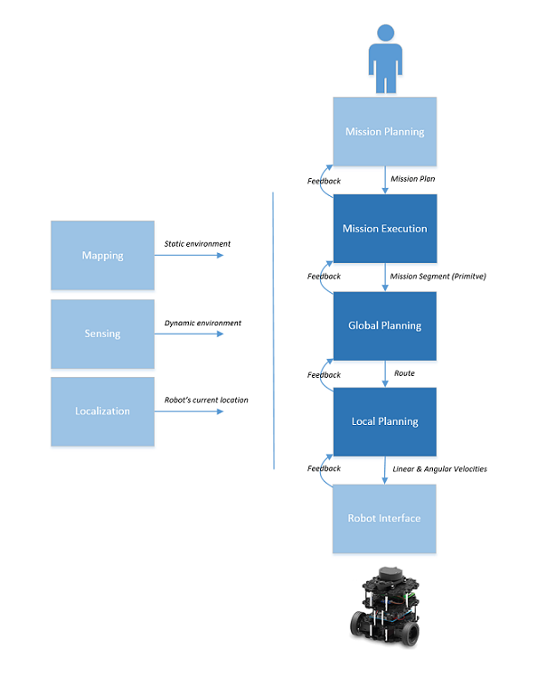

# ROS 2 Navigation System Requirements

The ROS 2 Navigation System ("Navigation System") is the control system that enables a robot to autonomously reach a goal state, such as a specific position and orientation relative to a specific map. Given a current pose, a map, and a goal, such as a destination pose, the navigation system generates a plan to reach the goal, and outputs commands to autonomously drive the robot, respecting any safety constraints and avoiding obstacles encountered along the way. 

This document lists the requirements for the ROS 2 Navigation System.

# 1. Introduction

This section describes the format of each requirement, the keywords used in the requirements, and the basic concepts needed to define and understand the requirements.

## 1.1 Requirement Fields

Each requirement is presented in tabular form with the following fields:

* **Id** - A unique identifier for the requirement
* **Handle** - A short, scoped, description summarizing the essence of the requirement
* **Priority** - An associated priority level: **1** (high), **2** (medium), and **3** (low)
* **Requirement** - The requirement itself, stated in clear, concise requirements language
* **Notes** - Elaboration and related information for the requirement

## 1.2 Requirement Language Keywords

In the requirements specified below, certain keywords have a specific meaning as they appear in the text. These keywords are defined as follows and must be capitalized whenever used in a manner intended to specify a behavior or requirement.

1. **MUST**: This word, or the terms "REQUIRED" or "SHALL", mean that the definition is an absolute requirement of the specification.

2. **MUST NOT**: This phrase, or the phrase "SHALL NOT", mean that the definition is an absolute prohibition of the specification.

3. **SHOULD**: This word, or the adjective "RECOMMENDED", mean that there may exist valid reasons in particular circumstances to ignore a particular item, but the full implications must be understood and carefully weighed before choosing a different course.

4. **SHOULD NOT**: This phrase, or the phrase "NOT RECOMMENDED" mean that there may exist valid reasons in particular circumstances when the particular behavior is acceptable or even useful, but the full implications should be understood and the case carefully weighed before implementing any behavior described with this label.

5. **MAY**: This word, or the adjective "OPTIONAL", mean that an item is truly optional.  One vendor may choose to include the item because a particular marketplace requires it or because the vendor feels that it enhances the product while another vendor may omit the same item. An implementation which does not include a particular option MUST be prepared to interoperate with another implementation which does include the option, though perhaps with reduced functionality. In the same vein an implementation which does include a particular option MUST be prepared to interoperate with another implementation which does not include the option (except, of course, for the feature the option provides.)

These definitions are derived from the IETF Best Current Practices Document #14.

## 1.3 Use Cases

The Navigation System is part of a larger system that involves a person or automated system ("the user") directing the operation of one or more robots. To provide context for the Navigation System, this section lists the expected interactions between the user and the robot system.  

## 1.3.1 Mapping Use Cases

The user will typically create a map of the area in which the robot is to navigate. This map identifies significant features of the environment, such as safety zones, known obstacles, walls, virtual lanes, etc. While the creation of the map itself is outside the scope of the Navigation System, the system is dependent on the map format(s). The map will need to be rich enough to support the Navigation System requirements listed in this document.

The following use case diagram shows an example of the kinds of operations provided by a mapping interface.

## 1.3.2 Mission Planning Use Cases

Another area in which the user interacts with the system is in the creation of a mission plan for the robot. The user composes a sequence of primitive functions, such as **Navigate to Position**, **Navigate to Area**, **Wait**, etc., into an overall plan. While mission planning is also outside the scope of the Navigation Stack, the mission plan format should be sufficient to meet the Navigation System requirements listed in this document.

## 1.3.2 Mission Execution Use Cases

The user will be able to initiate the execution of specific mission plans ("missions") and should also be able to view the status of the mission in progress, as well as cancel any mission that is in progress. In addition, the user may be required to provide the robot with its initial location if the robot is not able to determine it automatically.

## 1.4 Architectural Components

The design of the ROS 2 Navigation System will attempt to generalize the navigation system from ROS 1 and address some of its limitations. While this document does not attempt to define the ROS 2 Navigation System architecture, there are some expected modules that are convenient to call out for the purposes of defining more detailed requirements for the system. It is useful to split these modules into two general categories: those that are involved in the *command chain*, where each level refines its command input into successively more specific operations for the lext level down, and those modules that are *support modules* used by modules in the command chain. 

## 1.4.1 Command Chain

The command chain is the sequence of modules that comprise the chain of command from the user, at the top, to the robot, at the bottom.

* **User** - The user interacts with a Mission Planning subsystem to specify a plan for the robot. 
* **Mission Planning** - The Mission Planning module provides an interface to the user to allow the user to create mission plans. The resulting plans are available for assignment to robots and subsequent execution. The Mission Planning subsystem is outside the scope of the Navigation System. However, the data format, or messages, required to interact with the subsystem area within scope and must be specified as the Navigation System needs to receive this information to be able to execute the mission plans.
* **Mission Execution** - The Mission Execution module receives the mission plan as input and is responsible to execute it. It can select the appropriate global and local planners to use to perform each primitive maneuver. It also reports back progress on the execution of the mission plan. 
* **Global Planning** - The Global Planning module, of which there could be several specialied implementations, use information from the map(s) to determine a route for the robot to achieve its goal.
* **Local Planning** - The Local Planning module, of which there could also be several specialized implementations, uses the defined route from the Global Planner and information from robot sensors to handle any required deviations from the route to achieve its goal. 
* **Robot Interface** - The Robot Interface is an abstraction of the robot platform, providing the means to control the robot and learn about its capabilities. There should be a standard set of messages to control the robot and, perhaps, a standard way to determine a robot's capabilities and attributes. This may require a layer on top of the vendor interface.

## 1.4.2 Support Modules

In addition to the main command chain, there are several supporting modules and subsystems required for a complete system. The implementation of these modules are all outside the scope of the Navigation System. However, the inteface to these components is in scope and the associated requirements are defined. 

* **Mapping** - The Navigation System uses a map to plan the robot's route. The map contains information about known (static) obstacles in the environment. The map is typically created in advance and is available to the Navigation System. The map can also be dynamically updated, to reflect the current state of the environment.
* **Sensing** - There is a sensing subsystem that can utilize various sensors (and sensor fusion), the goal of which is to develop an understanding of the dynamic environment around the robot. This information is available to the Navigation System, especially the Local Planning module, in directing the robot's motion.  
* **Localization** - The Navigation System also needs a Localization module to provide the current location of the robot. 

In a complete robot system these modules are utilized by the core navigation modules (the command chain). This document does not specify the architecture for the complete system, but simply names the various comonents and subsystems for the purpose of listing their associated requirements. The information provided by these modules should be available to all of the modules in the command pipeline.

To facilitate error recovery, each module in the chain, if it is unable to carry out its task, its able to propagate error information to its predecessor in the command chain.

## 1.5 Design Goals

The Navigation System designers should strive to meet the following high-level design goals:

* **Modularity** - The Navigation Stack should allow for other implementers to easily replace architectural level components with alternative implementations, in particular, the global and local planners.
* **Portability** - The Navigation Stack should not introduce inherent limitations in the architectural blocks. For example, it should support multiple kinds of robots, not making assumptions about robot capabilities and limitations and should support various map types and orientations.
* **Performance** - *TODO: What are the performance goals?* 
* **Scalability** - *TODO: How low should the implementation scale?* *Specify a minimum platform?*
* *Other important design goals?*

In particular, there are several specific goals for the ROS 2 Navigation System with respect to improving the existing ROS navigation stack:

* The global and local planners should be easy to replace and chain together in a dynamic way. For example, a user may want to have a global planner for classic point-A-to-point-B travel, but upon reaching point B, have a special planner then control a series of maneuvers such as docking to a charging station or a conveyor belt. 
* The user should be able to plan complex missions which include a series of movements, and the Navigation System should be able to accept those mission plans and execute them. 
* The user should be able to specify different types of Robot drive types, such as Ackerman (automobile) steering, and Robot shapes (the current navigation stack is very limited in these areas).
* The Navigation System should be able to handle more map types and orientations, including outdoor and 2D+ terrain.

# 2.0 Requirements

This section lists the requirements for the Navigation System.

## 2.1 Implementation Constraints

There are various constraints on the development of the ROS 2 Navigation stack.

Id | Handle | Priority | Description | Notes
-- | ------ | -------- | ----------- | -----
IC001 | Developer's Guide | 1 | The Navigation System SHALL be developed in accordance with the ROS 2 Devloper's Guide | [ROS 2 Developer's Guide](https://github.com/ros2/ros2/wiki/Developer-Guide)
IC002 | Implementation Language.C++.Version | 1 | Developers SHALL assume the availability of C++14 language features | Per the ROS 2 Developer's Guide
IC003 | Implementation Language.C++.API Preference | 1 | Developers SHALL prefer standard C++, then Boost, then custom code, in that order. | Boost may be used if equivalent functionality is not already available in the C++ standard library
IC004 | Implementation Language.C++.Supported Compilers.g++ | 1 | The Navigation System code SHALL compile with gcc 5.4 or newer
IC004 | Implementation Language.C++.Supported Compilers.Clang | 1 | The Navigation System code SHALL compile with Clang, version *x*
IC004 | Implementation Language.C++.Supported Compilers.Intel C++ Compiler | 1 | The Navigation System code SHOULD compile with the Intel C++ Compiler, version *x* | Could be useful for optimization purposes
IC005 | Implementation Language.Python.Version | 1 | Any Python code developed for the Navigation System MUST use Python 3
IC006 | Implementation Language.GUI | 1 | Any GUIs developed as part of the Navigation System MUST use the Qt library, via C++ or Python (PyQt) | *Which version?*
IC006 | Implementation Language.GUI.QML | 1 | Any GUIs developed as part of the Navigation System MAY use QML

## 2.2 Development Tools

This section specifies the development tools and associated targets that will be used for the project.

Id | Handle | Priority | Description | Notes
-- | ------ | -------- | ----------- | -----
DEV001 | Tools.ROS2.Version | 1 | The Navigation System WILL be developed against the latest stable version of the ROS 2 stack | *What is the current latest version?*
DEV002 | Tools.Unit Test.Library | 1 | *TODO: GTest and GMock?*
DEV003 | Tools.Unit Test.Module Requirements | 1 | *TODO: What are the module level requirements?*
DEV004 | Tools.Static Analysis | 1 | *TODO: What is the static analysis tool to use?*
DEV005 | Tools.Static Analysis.Quality Targets | 1 | *TODO: What are the static analysis targets?*
DEV006 | Tools.Dynamic Analysis | 1 | *TODO: What dynamic analysis tool(s) to use?*
DEV007 | Tools.Dynamic Analysis.Code Coverage Targets | 1 | *TODO: What are the code coverage targets?*
DEV008 | Tools.Dynamic Analysis.Memory Checking | 1 | *TODO: What is/are the memory checking tool(s) to use?*

## 2.3 Target Platforms

The Navigation System will run on the latest versions of the operating systems supported by the core ROS 2 code.

Id | Handle | Priority | Description | Notes
-- | ------ | -------- | ----------- | -----
PLT001 | Target Platforms.Operating Systems.Ubuntu | 1 | The Navigation System MUST support Ubuntu Desktop 16.04 and Ubuntu Desktop 18.04
PLT002 | Target Platforms.Operating Systems.MacOS | 1 | The Navigation System MUST support MacOS 10.13 (High Sierra) and MacOS 10.14 (Mohave)
PLT003 | Target Platforms.Operating Systems.Windows | 1 | The Navigation System MUST support Windows 10 Professional
PLT004 | Target Platforms.Operating Systems.Clear Linux | 1 | The Navigation System SHOULD support the latest version of Intel's Clear Linux distribution | What is the latest version number?
PLT005 | Target Platforms.CPU.Word Size | 1 | The Navigation System SHALL support 64-bit processors | Don't assume a specific pointer size
PLT006 | Target Platforms.Minimum Platform | 1 | *Should we specify a minimum target platform?* *Or, should this be expressed as minimum platform requirements?*

## 2.4 Command Chain Modules

This section lists the requirements for the core command chain modules in the Navigation System.

### 2.4.1 Mission Planning

A complete system, which incorporates the Navigation System, would also have a Mission Planning subsystem that generates a Mission Plan from input provided by the User. The Mission Plan is a sequence of primitive operations and any associated policy about how the plan should be carried out. The design and implementation of the subsystem that creates the Mission Plan is outside the scope of the Navigation System, but its output, the Mission Plan, has a direct relationship to the capabilities that the Navigation System must provide. 

Id | Handle | Priority | Description | Notes
-- | ------ | -------- | ----------- | -----
MP001 | Mission Planning.Primitives | 1 | The Mission Plan MUST be able to express the plan as a sequence of the following Primitives (MP002 - MP010)
MP002 | Mission Planning.Primitives.Navigate to Position | 1 | The Navigation System MUST be able to navigate the Robot from its current location to a specified destination pose.
MP003 | Mission Planning.Primitives.Navigate to Area | 1 | The Navigation System MUST be able to navigate the Robot from its current location to a specified area. | *TODO: How to define "area"?*
MP004 | Mission Planning.Primitives.Enqueue | 1 | The Navigation System MUST be able to navigate the Robot from its current location to a position behind another specified robot. 
MP005 | Mission Planning.Primitives.Follow | 1 | The Navigation System MUST be able to direct the Robot to follow another specified robot. | This one doesn't have a completion state (reaching the goal), unless it specifies some more information such as "follow until destination reached"
MP006 | Mission Planning.Primitives.Orbit | 1 | *TODO: How is this defined?* | Similar to Follow in that it doesn't complete (unless it specifies time)
MP007 | Mission Planning.Primitives.Wait | 1 | The Navigation System MUST be able to idle at the current location until directed otherwise 
MP008 | Mission Planning.Primitives.Park | 1 | *TODO: What does parking mean? Some low-power state?*
MP009 | Mission Planning.Primitives.Enter Elevator | 1 | The Navigation System MUST be able to navigate the Robot from its current location onto an elevator. | *TODO: Would the elevator door be automated?*
MP010 | Mission Planning.Primitives.Exit Elevator | 1 | The Navigation System MUST be able to navigate the Robot from its position in an elevator to a specified location outside the elevator. 
MP011 | Mission Planning.Policy | 1 | The Mission Plan MUST be able to express the following policy associated with how to carry out the mission (MP012 - MP015)| *What are the important qualities for how the primitives should be carried out? Should there be per-primitive policy?*
MP012 | Mission Planning.Policy.Timeliness | 1 | The Navigation System MUST respect any timeliness constraints in the Mission Plan | *TODO: Is it important to specify by when the mission should be completed, for example?*
MP013 | Mission Planning.Policy.Safety Constraints | 1 | The Navigation System MUST respect any safety constraints in the Mission Plan | *TODO: Is there a set of global safety-related policy for the robot to follow?*
MP014 | Mission Planning.Policy.Safety Constraints.Maximum Speed | 1 | The Navigation System MUST respect the maximum speed specified in the Mission Plan 
MP015 | Mission Planning.Policy.Safety Constraints.Minimum Safety Buffer | 1 | The Navigation System MUST maintain a minimum safe distance between the robot and other objects at all times, as specified int he Mission Plan | Configurable safety zone around the robot. *TODO: Variable with speed? Differ in each direction?*

*TODO: How to handle reverse direction? Does each primitive include this information?*

### 2.4.2 Mission Execution

The Mission Execution module has the responsibility to execute a provided mission. It provides each successive primitive operation to the global planner, monitoring and reporting progress towards the goal. This is similar to the current navigation stack's **move_base** module.

Id | Handle | Priority | Description | Notes
-- | ------ | -------- | ----------- | -----
ME001 | Mission Execution.Inputs.Mission Plan | 1 | The Mission Execution module MUST accept the Mission Plan to execute.
ME002 | Mission Execution.Inputs.Commands.Execute Mission | 1 | The Mission Execution module MUST execute the provided Mission Plan, respecting any specified constraints.
ME003 | Mission Execution.Inputs.Commands.Cancel Mission | 1 | The Mission Execution module MUST be able to interrupt the Robot's navigation and cancel the current mission.
ME004 | Mission Execution.Select Planners | 1 | The Mission Execution module SHOULD select the best planners to use for each mission primitive | Can dynamically utilize planners
ME005 | Mission Execution.Outputs | 1 | At each stage of the Mission Plan, the Mission Execution module SHALL output the next primitive to execute and WILL monitor for completion of each primitive before sending the next. | Tracks completion of the mission and sequences the operations. *TODO: What about primitives that don't complete? Would they be defined with a time element so that they can complete?*
ME006 | Mission Execution.Feedback.Outputs.Notify Progress | 1 | The Mission Execution module MUST provide progress notifications on the execution of the mission, including mission completion. | The current stack, once it reaches a goal, publishes a message. This would be a generalization of that feature. We can determine the elapsed time using the message timestamp.
ME007 | Mission Execution.Logging | 1 | The Mission Execution module SHOULD log activity for later analysis. | In case of forensic analysis of a safety event, for example.
ME008 | Mission Execution.Feedback.Inputs.Error Notification.Automatic Error Recovery | 1 | Upon receipt of a downstream failure (from a Global Planner), the Mission Execution module SHOULD attempt to automatically recover from the error | For example, if the robot gets stuck, the Mission Execution module could have the robot perform a recovery maneuver of some kind, before continuing with execution of the mission plan.
ME009 | Mission Execution.Feedback.Outputs.Error Information | 1 | If the Mission Execution module is unable to execute the mission, it MUST report the failure | This would be received by the higher-level software. Perhaps a remote operating center where the remote operator "rescues" the robot. 
ME010 | Mission Execution.Safe State Upon Failure | 1 | If the Mission Execution module is unable to execute the mission, it MUST direct the robot to a safe state. | *TODO: Define "safe state"* The failure could be for a variety of reasons - sensor failures, algorithmic failure, a collision, etc.

### 2.4.3 Global Planning

The Global Planning module compute the intended route for the robot, typically using a static map, the robot's initial pose, and the desired primitive to execute. 

Id | Handle | Priority | Description | Notes
-- | ------ | -------- | ----------- | -----
GP001 | Global Planning | 1 | The Navigation System SHOULD have a Global Planning module which generates the route for the robot to follow for the specified primitive, respecting any policy guidance contained in the Mission Plan | Could use pluggable cost functions 
GP002 | Global Planning.Inputs.Static Map | 1 | The Global Planner SHALL have a static map available that describes the environment | Assumes the map has already been created and available as an input
GP003 | Global Planning.Inputs.Current Pose | 1 | The Global Planner SHALL have the robot's current pose | The pose could be be provided manually or automatically determined (outside of this module)
GP004 | Global Planning.Inputs.Primitive to Execute | 1 | The Global Planner SHALL have the primitive operation to execute
GP005 | Global Planning.Inputs.Policy | 1 | The Global Planner SHALL have policy guidance associated with the primitive operation to execute | This could be global policy and/or per-primitive policy
GP006 | Global Planning.Multiple Global Planners | 1 | As part of the Navigation System, there SHOULD be multiple global planners available and chosen depending on the primite to be executed | Dynamic selection of global planners
GP007 | Global Planning.High-End Planner | 1 | The Navigation System SHOULD implement a state-of-the-art planner | Can serve as an example to others developing global planners
GP008 | Global Planning.Low-End Planner | 1 | The Navigation System SHOULD implement a planner for low-compute targets | Can serve as an example to others developing global planners
GP009 | Global Planning.Conventions | 1 | *TODO: Should there be a specification of conventions for the robot to follow? Navigate on the right side of a path, for example.*
GP010 | Global Planning.Feedback.Inputs | 1 | The Global Planner MUST receive error input from the Local Planner so that it can attempt to recover | For example, if a local planner can't execute the route, because it is blocked, the global planner has an opportunity to define an alternative route
GP011 | Global Planning.Feedback.Outputs | 1 | If the Global Planner is unable to define a route to its goal state, it SHALL report the error on its error output channel
GP012 | Global Planning.Outputs.Route | 1 | The Global Planning module should output a route that the robot is to follow to execute the primitive | *TODO: Should there be attributes associated, such as time to be at particular waypoints?*

### 2.4.4 Local Planning

The Local Planning module receives the route from the Global Planner and is responsible to carry it out. To do so, it evaluates the dynamic environment using input from the sensory subsystem and possibly makes local adjustments to the route, such as when avoiding collisions with objects crossing its path. 

Id | Handle | Priority | Description | Notes
-- | ------ | -------- | ----------- | -----
LP001 | Local Planning | 1 | The Navigation System SHOULD have a Local Planning module which carries out the route provided by the Global Planner
LP002 | Local Planning.Inputs.Route | 1 | The Local Planning module MUST receive the Route from the Global Planning module.
LP003 | Local Planning.Inputs.Route.Negative Velocity | 1 | To support reverse motion, the Local Planning module MUST support negative velocity values
LP004 | Local Planning.Inputs.Policy | 1 | The Local Planning module MUST receive any policy information which could inform its planning
LP005 | Local Planning.Inputs.Sensory Input | 1 | The Local Planning module MUST receive object-level data from the Sensory Subsystem 
LP006 | Local Planning.Collision Avoidance.Avoid Stationary Objects | 1 | The Robot MUST avoid colliding into stationary objects in its environment | Fixed parts of the environment, such as walls or shelving. 
LP007 | Local Planning.Collision Avoidance.Avoid Stationary Objects.*Qualities* | 1 | *TODO: How close can it come? Does it depend on the robot's speed?*
LP008 | Local Planning.Collision Avoidance.Avoid Moving Objects | 1 | The Robot MUST avoid colliding into moving objects that intercept its path | Such as people and other robots
LP009 | Local Planning.Collision Avoidance.Avoid Moving Objects.*Qualities* | 1 | *TODO: How close can it come? Does it depend on the robot speed?*
LP010 | Local Planning.Collision Avoidance.Parameters | 1 | *TODO: Any specific parameters foer the collision avoidance? Perhaps different global values for object-specific properties in the environment.*
LP011 | Local Planning.Collision Detection | 1 | *TODO: What module first detects if there has been a collision?* Some way of detecting if a collision has occurred within some low latency (50ms?). This could be additional HW such as bumpers (like Turtlebot has), or other sensor input such as wheel feedback
LP012 | Local Planning.Collision Reporting | 1 | *TODO: What happens in the error/exception reporting chain to report a collision?*
LP013 | Local Planning.Collision Recovery | 1 | The Local Planning module MUST provide a way to recover from collisions | Like back up slowly, notify user, etc., which could be configurable based on the robot/environment/application
LP014 | Local Planning.Feedback.Inputs | 1 | TODO | Could be failures from the sensors, for example
LP015 | Local Planning.Feedback.Outputs | 1 | TODO | Could provide failure to execute the route. Perhaps the passageway is blocked, for example
LP016 | Local Planning.Outputs | 1 | The Local Planning module interfaces to the robot to command its actuators. | TBD if this is through an abstraction of the robot or directly to a vendor's interface.

### 2.4.5 Robot Interface

*TODO: What to say about the robot interface?* *Should there be a robot abstraction?* *Perhaps this would be a convenient place to put some safety-related functionality*

Id | Handle | Priority | Description | Notes
-- | ------ | -------- | ----------- | -----
ROB001 | Robot Interface.Attributes | 1 | Holonomicity, max/min speeds and accelerations, etc. 
ROB002 | Robot Interface.Dynamic Switching | 1 | Can the robot dynamically change attributes?
ROB003 | Robot Interface.Safety.Limited Parameters | 1 | A list of parameters used to limit certain circumstances and provide the hooks for users to set those values if they want
ROB004 | Robot Interface.Safety.Speed Limiting | 1 | TODO
ROB005 | Robot Interface.Safety.Force Limiting | 1 | TODO
ROB006 | Robot Interface.EMO Button | 1 | TODO
ROB007 | Robot Interface.Feedback.Outputs | 1 | TODO

## 2.5 Support Modules

There are a few support modules and subsystems that are not part of the Navigation System proper, but are necessary components in a complete system. The Navigation System depends on the data interfaces to these components. This section describes the requirements and assumptions of these interface.

### 2.5.1 Mapping

The map data format should be capable of describing common indoor and outdoor environments.

Id | Handle | Priority | Description | Notes
-- | ------ | -------- | ----------- | -----
MAP001 | Mapping | 1 | The Mapping System SHALL provide map information to the Navigation System | So that the Mapping System has a basic understanding of its static environment. Used in global planning
MAP002 | Mapping.Dimensionality.2D | 1 | The Mapping System MUST provide 2D map information
MAP003 | Mapping.Dimensionality.2D+ | 1 | The Mapping System MUST provide 2D+ map information | *TODO: How is this defined?*
MAP004 | Mapping.Dimensionality.3D | 1 | The Mapping System SHOULD provide 3D map information | *TODO: Use voxel-based?*
MAP005 | Mapping.Multiple Maps Per Environment | 1 | The Mapping system SHOULD provide multiple maps of the same environment. | *TODO: Different scales and elevations?*
MAP006 | Mapping.Dynamic Updates | 1 | The Mapping System SHOULD provide real-time updates of map information | For example, to create a keep-out zone in the event of a spill hazard.
MAP007 | Mapping.Data Model.Traversable Surface | 1 | Planar (2D) surface (street, floor). 
MAP008 | Mapping.Data Model.Traversable Surface.Planarity | 1 | The map data format SHALL be capable of describing the planarity of traversable surfaces | Uneven ground
MAP009 | Mapping.Data Model.Safety Zone | 1 | Specify limitations to be respected while the robot is in this zone. Speed, (increased) distance to people.
MAP010 | Mapping.Data Model.Safety Zone.Keep Out Zone | 1 | Robot MUST NOT navigate through a keep-out zone
MAP011 | Mapping.Data Model.Safety Zone.Intersection | 1 | May want to slow down (or even stop), for example, when approaching an intersection | Robots can slow down when coming to an intersection in order to ensure that they can see anyone coming and other people/robots can see them
MAP012 | Mapping.Data Model.Lanes | 1 | Able to specify virtual lanes. Prefer the specified lanes (such as in a warehouse)
MAP013 | Mapping.Data Model.Building Levels | 1 | Able to specify single and multi-level buildings
MAP014 | Mapping.Data Model.Building Levels.Level Connecting Features | 1 | Able to specify level connecting features, such as elevators, stairways, ramps.
MAP015 | Mapping.Data Model.Unknown Space | 1 | To be dynamically mapped? In global maps, it can be areas beyond the edge of the map, or areas within the center of the map for which we didn't have any observations during map building. In the current system, this is the "dark grey" portion of the map (free space is light grey, obstacles are black)
MAP016 | Mapping.Data Model.Extensibility | 1 | *TODO: Map attributes. Layers concept?*

### 2.5.2 Sensing

The Navigation System requires dyanamic information about objects in its environment. This information is provided by a Sensory Subsystem that is outside the scope of the Navigation System. This information would typically be provided by a set of sensors on the robot and a sensor fusion capability. This section lists the requirements on the data that the Sensory Subsystem provides. 

Id | Handle | Priority | Description | Notes
-- | ------ | -------- | ----------- | -----
SEN001 | Sensing | 1 | The Sensory Subsystem SHALL provide information about the dynamic environment of the robot | Info sufficient to carry out the Navigation System requirements
SEN002 | Sensing.Latency | 1 | TODO
SEN003 | Sensing.Environment Model | 1 | *TODO: What, specifically, should be in the environment model?*
SEN004 | Sensing.Environment Model.Object Prediction | 1 | The Sensing Subsystem SHOULD provide an object prediction capability that projects the position of the objects into the future. | One of the biggest shortcomings of the current system is the inability to model/predict where obstacles will be in the future. This leads to collisions with other moving objects
SEN005 | Sensing.Environment Model.Object Prediction.Time Horizon | 1 | *TODO: How far into the future should the object prediction work?*

### 2.5.5 Localization

The Navigation System requires the Robot's current pose, provided by an external Localization module. This section lists the requirements for the information from the Localization module.

Id | Handle | Priority | Description | Notes
-- | ------ | -------- | ----------- | -----
LOC001 | Localization.Robot Pose | 1 | The Localization module MUST provide the robot's current pose to the Navigation System | This could be manual or as a result of automatic localization; the Navigation System wouldn't know either way 
LOC002 | Localization.Robot Pose.Accuracy | 1 | *TODO: What are the requirements on the accuracy of this pose?*
