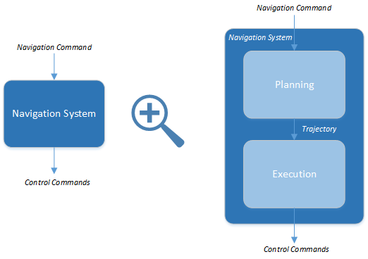
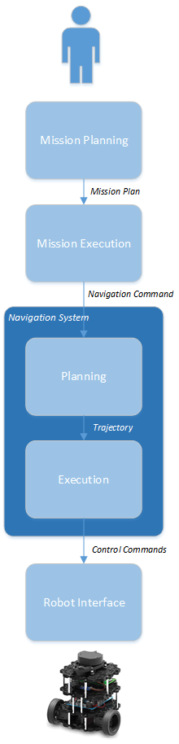
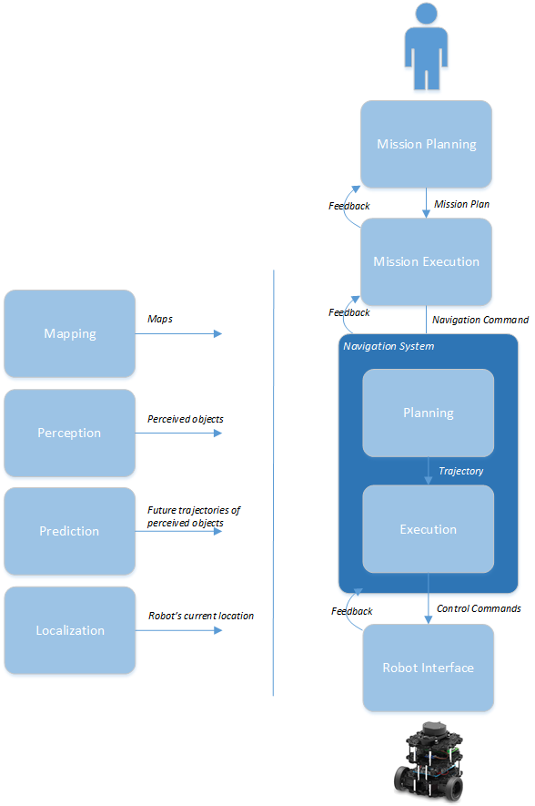

# ROS 2 Navigation System Requirements

The ROS 2 Navigation System ("Navigation System") is the control system that enables a robot to autonomously reach a goal state, such as a specific position and orientation relative to a given map. Provided with a navigation command to execute, the Navigation System generates a plan to achieve the desired result and outputs control commands to autonomously direct the robot, respecting any safety constraints and avoiding obstacles encountered along the way.

This document lists the requirements for the ROS 2 Navigation System. The ROS 2 Navigation System is intended to be a generalization of the ROS 1 navigation stack and will address some of its known limitations.

# 1. Introduction

This section describes the format of each requirement, the keywords available for use in the definition of each requirement, and the basic concepts needed to define and understand the requirements.

## 1.1 Requirement Fields

Each requirement is presented in tabular form with the following fields:

* **Id** - A unique identifier for the requirement
* **Handle** - A short, scoped, description summarizing the essence of the requirement
* **Priority** - An associated priority level: **1** (high), **2** (medium), and **3** (low)
* **Requirement** - The requirement itself, stated in clear, concise requirements language
* **Notes** - Elaboration and related information for the requirement

## 1.2 Requirement Language Keywords

In the requirements specified below, certain keywords have a specific meaning as they appear in the text. These keywords are defined as follows and must be capitalized whenever used in a manner intended to specify a behavior or requirement.

1. **MUST**: This word, or the terms "REQUIRED" or "SHALL", mean that the definition is an absolute requirement of the specification.

2. **MUST NOT**: This phrase, or the phrase "SHALL NOT", mean that the definition is an absolute prohibition of the specification.

3. **SHOULD**: This word, or the adjective "RECOMMENDED", mean that there may exist valid reasons in particular circumstances to ignore a particular item, but the full implications must be understood and carefully weighed before choosing a different course.

4. **SHOULD NOT**: This phrase, or the phrase "NOT RECOMMENDED" mean that there may exist valid reasons in particular circumstances when the particular behavior is acceptable or even useful, but the full implications should be understood and the case carefully weighed before implementing any behavior described with this label.

5. **MAY**: This word, or the adjective "OPTIONAL", mean that an item is truly optional. An implementation which does not include a particular option MUST be prepared to interoperate with another implementation which does include the option, though perhaps with reduced functionality. In the same vein an implementation which does include a particular option MUST be prepared to interoperate with another implementation which does not include the option (except, of course, for the feature the option provides).

These definitions are derived from the [IETF Best Current Practices Document 14](https://tools.ietf.org/html/bcp14).

## 1.3 Terminology

This section defines some common terminology as used in this document.

Term | Definition
---- | ----------
Path | A *Path* is an ordered sequence of points in space.
Route | A *Route* is a synonym for Path.
Trajectory | A *Trajectory* is a path parameterized by time.
Path Planning | *Path Planning* refers to the process of finding an optimal path between multiple locations. Path planning is typically characterized as a graph traversal problem and algorithms such as A*, D*, and RRT are common choices for implementation.
Motion Planning | *Motion Planning* refers to the process of specifying the motion of the robot over time to follow a specific path.

## 1.4 Use Cases

The Navigation System is part of a larger system that includes a person or automated system ("the user") directing the operation of one or more robots. To provide context for the Navigation System, this section lists the expected interactions between the user and the robot system.

## 1.4.1 Mapping Use Cases

The user will typically create a map of the area in which the robot is to navigate, either manually or using the SLAM algorithm. This map identifies significant features of the environment, including fixed features, such as walls and fixed obstacles, and virtual features, such as navigation lanes and safety zones. While the creation of the map itself is outside the scope of the Navigation System, the system is dependent on the map format(s). The map will need to be rich enough to support the Navigation System requirements listed in this document.

The following use case diagram shows an example of the kinds of operations provided by a mapping interface.

## 1.4.2 Mission Planning Use Cases

Another area in which the user interacts with the system is in the creation of a mission plan for the robot. The user composes a sequence of primitive navigation commands, such as **Navigate to Pose**, **Navigate to Area**, **Maintain Pose**, etc., into an overall plan. While mission planning is also outside the scope of the Navigation System, the mission plan format should be sufficient to meet the Navigation System requirements listed in this document.

## 1.4.3 Mission Execution Use Cases

The user will be able to initiate the execution of specific mission plans ("missions") and should also be able to view the status of the mission in progress, as well as cancel the mission that is currently in progress. In addition, the user may be required to provide the robot with its initial pose if the robot is not able to determine it automatically.

## 1.5 Architectural Components

The Navigation System is part of a larger software system. This document does not specify the architecture for the complete system, but simply gives a conceptual overview for the purpose of requirements definition.

The Navigation System has a *command chain*, where each level refines its command input into successively more specific operations for the lext level down, and *support modules* which are used by modules in the command chain.

## 1.5.1 Command Chain

The command chain is the sequence of modules that comprise the chain of command from the user, at the top, to the robot, at the bottom.

* **Mission Planning** - Mission Planning provides an interface to the user to allow the user to create mission plans and assign them to robots for execution. A *Mission Plan* is a sequence of *Navigation Commands* along with associated information about how the commands should be carried out.
* **Mission Execution** - Mission Execution receives the Mission Plan and is responsible to execute the plan and report progress on its execution.
* **Navigation System** - The Navigation System receives a segment of an overall plan to execute (a *Navigation Command*) and generates the control commands to the robot to carry it out.
* **Robot Interface** - The Robot Interface is an abstraction of the robot platform, providing the means for the Navigation System to control the robot, learn about its capabilities, and receive feedback from the robot.

The following diagram shows the modules in the command chain and the successive refinement of the control commands:

The Navigation System itself can be decomposed into two general responsibilities, *Planning*, and *Execution*.

* **Planning** - The Planning Module is responsible to execute Navigation Commands. To do so, this module can evaluate input maps and continually assess the robot's environment to plan motion and provide the path for the robot to follow to achieve completion of the Navigation Command.
* **Execution** - The Execution Module is responsible to execute the path provided by Planning, generating the control commands required to follow the path.

Decomposing the Navigation System, the overall command chain is as follows:

## 1.5.2 Support Modules

In addition to the command chain, there are several supporting modules and subsystems required for a complete system. The implementation of these modules is outside the scope of the Navigation System. However, the interface to these components is in scope and the associated requirements should be defined. Together, the support modules provide the robot with a full picture of the robot's environment.

* **Mapping** - The Mapping Subsystem generates maps that can be used by the Navigation System to plan the robot's motion. Maps are typically created in advance and are available to the Navigation System. A map can be updated to reflect changes in the environment. The frequency of these updates will vary among implementations.
* **Perception** - The Perception Subsystem utilizes sensors to develop an understanding of the dynamic environment around the robot. This information is available to the Navigation System, such as when avoiding obstacles in the robot's path.
* **Prediction** - The Prediction Subsystem anticipates future motion trajectories of any perceived objects.
* **Localization** - The Localization Subsystem provides the current location of the robot.

In a complete robot system these modules are available to the core navigation modules (the command chain), as shown in the following diagram:

To facilitate error recovery, each module in the command chain, if it is unable to carry out its task, should be able to propagate error information to its predecessor in the chain.

## 1.6 Design Goals

The Navigation System should meet the following high-level design goals:

* **Extensibility** - The Navigation System should be a *pluggable framework* to allow for other developers to easily extend the capabilities of the Navigation System, such as adding the ability to handle new navigation commands.
* **Modularity** - The Navigation System should allow developers to *easily replace components* with alternative implementations.
* **Generality** - The Navigation System should not introduce inherent limitations in the architectural blocks. For example, it should support multiple kinds of robots, not making assumptions about robot capabilities and limitations and should support various map types and orientations.
* **Performance** - *TODO: What are the performance goals?*
* **Scalability** - *TODO: What are the scalability goals?*
* *TODO: Other important design goals to call out?*

# 2.0 Requirements

This section lists the requirements for the Navigation System.

## 2.1 Implementation Constraints

There are various constraints on the development of the ROS 2 Navigation stack.

Id | Handle | Priority | Description | Notes
-- | ------ | -------- | ----------- | -----
IC001 | Developer's Guide | 1 | The Navigation System SHOULD be developed in accordance with the ROS 2 Developer's Guide | [ROS 2 Developer's Guide](https://github.com/ros2/ros2/wiki/Developer-Guide)
IC002 | Implementation Language.C++.Version | 1 | Developers SHALL assume the availability of C++14 language features | Per the ROS 2 Developer's Guide
IC003 | Implementation Language.C++.API Preference | 1 | Developers SHOULD prefer standard C++, then Boost, then custom code, in that order. | Boost may be used if equivalent functionality is not already available in the C++ standard library
IC004 | Implementation Language.C++.Supported Compilers.g++ | 1 | The Navigation System code SHALL compile with gcc 5.4 or newer
IC005 | Implementation Language.C++.Supported Compilers.Clang | 1 | The Navigation System code SHALL compile with Clang, version *x*
IC006 | Implementation Language.C++.Supported Compilers.Intel C++ Compiler | 1 | The Navigation System code SHOULD compile with the Intel C++ Compiler, version *x* | Could be useful for optimization purposes
IC007 | Implementation Language.Python.Version | 1 | Any Python code developed for the Navigation System MUST use Python 3
IC008 | Implementation Language.GUI | 1 | Any GUIs developed as part of the Navigation System SHOULD use the Qt library, via C++ or Python (PyQt) | *Which version?*
IC009 | Implementation Language.GUI.QML | 1 | Any GUIs developed as part of the Navigation System MAY use QML
IC010 | ROS2.Version | 1 | The first revision of the Navigation System WILL target the Crystal Clemmys release of ROS2. | We should develop against the latest ROS2 code whenever possible.

## 2.2 Target Platforms

 Navigation System will run on the latest versions of the operating systems supported by the core ROS 2 code.

Id | Handle | Priority | Description | Notes
-- | ------ | -------- | ----------- | -----
TP001 | Target Platforms.Operating Systems.Ubuntu | 1 | The Navigation System MUST support Ubuntu Desktop 16.04 and Ubuntu Desktop 18.04
TP002 | Target Platforms.Operating Systems.MacOS | 1 | The Navigation System MUST support MacOS 10.13 (High Sierra) and MacOS 10.14 (Mohave)
TP003 | Target Platforms.Operating Systems.Windows | 1 | The Navigation System MUST support Windows 10 Professional
TP004 | Target Platforms.Operating Systems.Clear Linux | 1 | The Navigation System SHOULD support the Intel's Clear Linux distribution | Clear Linux uses a continuous deployment model. 
TP005 | Target Platforms.CPU.Word Size | 1 | The Navigation System SHALL support 64-bit processors | Don't assume a specific pointer size
TP006 | Target Platforms.Minimum Platform | 1 | *TODO: Should we specify a minimum target platform? Or, should this be expressed as minimum platform requirements?*

## 2.3 Command Chain Modules

This section lists the requirements for the core command chain modules in the Navigation System.

### 2.3.1 Mission Planning

A complete system should have some kind of Mission Planning subsystem to convey the user's intentions to the robot. The User interacts with this Mission Planning subsystem to generate a Mission Plan for the robot. The Mission Plan is defined as a sequence of Navigation Commands, along with any associated information about how and when the plan should be carried out. The design and implementation of a Mission Planning subsystem is outside the scope of the Navigation System. However, in order to understand the larger system context and how Mission Planning interacts with the Navigation System, this section will consider the nature of a mission plan and the kinds of operations it may contain.

Id | Handle | Priority | Description | Notes
-- | ------ | -------- | ----------- | -----
MP001 | Mission Planning.Navigation Commands | 1 | The Mission Plan MUST be able to express the plan as a coordinated sequence of Navigation Commands. | Could include time and policy aspects (*when* and *how*, not just *what*)
MP002 | Mission Planning.Navigation Commands.Composition | 1 | The Mission Plan SHOULD allow for the composition and naming of new Navigation Commands from a sequence of previously-defined Navigation Commands. | Build up levels of abstraction. For example, Enter-Elevator could be expressed as Navigate-to-Pose (right outside of elevator), Wait (for door to open), Navigate-to-Pose (inside the elevator).
MP003 | Mission Planning.Navigation Commands.Navigate to Pose | 1 | The Mission Plan MUST be able to convey the information required for a robot to navigate from its current location to a specific destination pose.
MP004 | Mission Planning.Navigation Commands.Navigate to Area | 2 | The Mission Plan SHOULD be able to convey the information required for a robot to navigate from its current location to a specific area. | An "area" could be a rectangular region or a more complex shape. It may be defined as tolerance to a goal (ie. within +/- 1 meter distance).
MP005 | Mission Planning.Navigation Commands.Enqueue | 2 | The Mission Plan SHOULD be able to convey the information required for a robot to navigate from its current location to a position behind another specified robot.
MP006 | Mission Planning.Navigation Commands.Follow | 2 | The Mission Plan SHOULD be able to convey the information required for a robot to be able to follow another specified robot. | This one doesn't have a completion state (reaching the goal), unless it specifies additional information such as "follow until destination reached."
MP007 | Mission Planning.Navigation Commands.Maintain Pose | 1 | The Mission Plan SHOULD be able to convey the information required for a robot to maintain its current pose. | Could be indefinite or time-based.
MP008 | Mission Planning.Navigation Commands.Park | 2 | The Mission Plan SHOULD be able to convey the information required for a robot to park itself. | The implementation of the parking command could interact with the robot to cause it, for example, to shut down or enter a low-power state.
MP009 | Mission Planning.Navigation Commands.Dock to Charger | 2 | The Mission Plan SHOULD be able to convey the information required for a robot to dock to a specific charging station. 
MP010 | Mission Planning.Policy | 1 | The Mission Plan SHOULD be able to express information about how and when the navigation commands are to be carried out. | Time and safety constraints.
MP011 | Mission Planning.Policy.Time.Initiation | 1 | The Mission Plan SHOULD be able to convey when a mission should begin.
MP012 | Mission Planning.Policy.Time.Completion | 1 | The Mission Plan SHOULD be able to convey by when a mission should end.
MP013 | Mission Planning.Policy.Safety.Maximum Speed | 1 | The Mission Plan SHOULD be able to convey a maximum speed for the robot. | The robot would respect this value in carrying out the plan. This could be site-specific policy.
MP014 | Mission Planning.Policy.Safety.Minimum Safety Buffer | 1 | The Mission Plan SHOULD be able to convey a minimum safety buffer distance. | The robot would respect this value and maintain the distance from other objects at all times. Should vary with relative velocities.

### 2.3.2 Mission Execution

The Mission Execution module has the responsibility to execute a provided mission. It provides each successive Navigation Command to the Navigation Subsystem, monitoring and reporting progress towards completion of the plan.

Id | Handle | Priority | Description | Notes
-- | ------ | -------- | ----------- | -----
ME001 | Mission Execution.Inputs.Mission Plan | 1 | The Mission Execution module MUST accept the Mission Plan to execute.
ME002 | Mission Execution.Inputs.Commands.Execute Mission | 1 | When commanded to do so, the Mission Execution module MUST execute the provided Mission Plan, respecting any specified constraints.
ME003 | Mission Execution.Inputs.Commands.Cancel Mission | 1 | When commanded to do so, the Mission Execution module MUST interrupt the Robot's navigation and cancel the current mission.
ME004 | Mission Execution.Outputs.Navigation Command | 1 | Upon completion of each Navigation Command, the Mission Execution module SHALL output the next Navigation Command to execute.
ME005 | Mission Execution.Command Sequencing | 1 | The Mission Execution module MUST monitor for completion of each Navigation Command before sending the next command.
ME006 | Mission Execution.Logging | 1 | The Mission Execution module SHOULD log its activity. | In case of forensic analysis of a safety event, for example.
ME007 | Mission Execution.Feedback.Inputs.Error Recovery | 1 | Upon receipt of a downstream failure (unable to execute the Navigation Command), the Mission Execution module SHOULD attempt to recover and continue execution of the mission.
ME008 | Mission Execution.Feedback.Outputs.Progress Notification | 1 | The Mission Execution module SHALL provide progress notifications on the execution of the mission. | Intermediate steps of interest.
ME009 | Mission Execution.Feedback.Outputs.Mission Completed | 1 | Upon successfull completion of the mission, the Mission Execution module SHALL output a corresponding notification.
ME010 | Mission Execution.Feedback.Outputs.Mission Canceled | 1 | Upon receiving a cancellation command and cancelling the mission, the Mission Execution module SHALL output a corresponding notification.
ME011 | Mission Execution.Feedback.Outputs.Mission Failure | 1 | If the Mission Execution module is unable to execute the mission, it MUST output a failure notification. | This would be received by the user-level interface and could necessitate user intervention, such as having a remote operating center where the remote operator "rescues" the robot.
ME012 | Mission Execution.Safe State Upon Failure | 1 | If the Mission Execution module is unable to execute the mission, it MUST direct the robot to a safe state. | The failure could be for a variety of reasons - sensor failures, algorithmic failure, a collision, etc.
ME013 | Mission Execution.Selection of Planners | 1 | The Navigation System SHOULD allow the association and use of specific Planning and Execution Modules for a given Navigation Command. | For example, a user may want to have components for classic point-A-to-point-B travel, but upon reaching point B, have specialized components that control a series of maneuvers such as docking to a charging station or a conveyor belt.

### 2.3.3 Navigation System.Planning

The Navigation System's Planning Module receives the Navigation Command from the Mission Execution module and is responsible to implement that command. To do so, the Planning Module can use information from the Mapping Subsystem to plan a route and use input from the Perception Subsystem to evaluate the dynamic environment and avoid collisions with objects crossing its path.

Id | Handle | Priority | Description | Notes
-- | ------ | -------- | ----------- | -----
PLN001 | Planning | 1 | The Navigation System SHOULD have a Planning Module that generates the Path for the robot to follow to implement a specified Navigation Command.
PLN002 | Planning.Inputs.Navigation Command | 1 | The Planning Module SHALL receive the Navigation Command to execute.
PLN003 | Planning.Inputs.Policy | 1 | The Planning Module SHALL receive policy information associated with the Navigation Command to execute. | This could be global policy and/or per-command policy. Policy could contain, for example, a list of conventions for the robot to follow (navigate on the right side of a path, for example).
PLN004 | Planning.Inputs.Mapping.Maps | 1 | The Planning Module MUST have access to one or more maps available that describe the robot's environment.
PLN005 | Planning.Inputs.Perception.Sensory Input | 1 | The Planning Module MUST have access to data from the Perception Subsystem.
PLN006 | Planning.Inputs.Prediction.Predicted Trajectories | 1 | The Planning Module MAY have access to predicted trajectories of objects detected by the Perception Subsystem. | In simple planners, there is no prediction of moving objects, but in more complex planners, this may be considered. 
PLN007 | Planning.Inputs.Localization.Current Pose | 1 | The Planning Module MUST have access to the robot's current pose. | The pose could be be provided manually or automatically determined (outside of this module).
PLN008 | Planning.Outputs.Path | 1 | The Planning Module SHOULD output the Path for the robot to follow to execute the input Navigation Command and MUST respect any associated policy.
PLN009 | Planning.Feedback.Inputs | 1 | The Planning Module MAY receive error input from the downstream Execution Module. | So that it can attempt to recover from execution failures.
PLN010 | Planning.Feedback.Inputs.Error Recovery | 1 | Upon receipt of a downstream failure, the Planning Module SHOULD attempt to automatically recover from the error. | Handling a robot that gets stuck or handling a collision, for example.
PLN011 | Planning.Feedback.Outputs.Command Completed | 1 | Upon completing the provided Navigation Command, the Planning Module MUST report this event on its feedback output.
PLN012 | Planning.Feedback.Outputs.Unable to Execute Command | 1 | If the Planning Module is unable to execute the Navigation Command, it SHALL report the error on its feedback output. | It should handle errors if possible, but report back if it can't.
PLN013 | Planning.Feedback.Outputs.Error Propagation | 1 | The Planning Module SHOULD propagate errors that it can't handle.
PLN014 | Planning.Logging | 1 | The Planning Module SHOULD log significant events. | Commands completed, failures, recoveries, etc.
PLN015 | Planning.Documentation | 1 | The Navigation System SHOULD provided detailed documentation on how to develop a Planning Module.
PLN016 | Planning.Simple Example | 1 | The Navigation System SHOULD provided a simple example of a Planning Module. | An easily understood module that developers and students could use as a starting point.

### 2.3.4 Navigation System.Execution

The Navigation System's Execution Module is responsible to execute the Path specified by the Planning Module. It has available to it all of the information from the support modules and must respect any policy guidance.

Id | Handle | Priority | Description | Notes
-- | ------ | -------- | ----------- | -----
EXE001 | Execution | 1 | The Navigation System SHOULD have an Execution Module that generates commands to the robot to achieve a specific Path.
EXE002 | Execution.Inputs.Path | 1 | The Execution Module SHALL receive a Path that the robot is to follow.
EXE003 | Execution.Inputs.Policy | 1 | The Execution Module SHALL receive policy information associated with the Path to follow. | Could filter down from higher-level policy specification.
EXE004 | Execution.Collision Avoidance.Avoid Stationary Objects | 1 | The Execution Module MUST direct the robot such that it avoids colliding into stationary objects in its environment.
EXE005 | Execution.Collision Avoidance.Avoid Moving Objects | 1 | The Execution Module MUST direct the robot such that it avoids colliding into moving objects that intercept its path.
EXE006 | Execution.Collision Detection | 1 | The Execution Module SHOULD detect if a collision has occurred.
EXE007 | Execution.Collision Detection.Latency | 1 | The Execution Module SHOULD detect collisions within 50ms. | *TODO: What is the right value?*
EXE008 | Execution.Feedback.Inputs.Robot Malfunction | 1 | The Execution Module SHOULD receive notifications of any robot malfunctions from the downstream robot interface. | A sensor failure, for example.
EXE009 | Execution.Feedback.Outputs.Collision Detected | 1 | The Execution Module SHOULD report the detection of a collision. | So that the Planning Module can attempt recovery or otherwise respond.
EXE010 | Execution.Feedback.Outputs.Error Propagation | 1 | The Execution Module SHOULD propagate errors that it can't handle.
EXE011 | Execution.Documentation | 1 | The Navigation System SHOULD provided detailed documentation on how to develop an Execution Module.
EXE012 | Execution.Simple Example | 1 | The Navigation System SHOULD provided a simple example of an Execution Module| An easily understood module that developers and students could use as a starting point.

### 2.3.5 Robot Interface

There should be a uniform interface to the various supported robots. The abstraction of different robots may be handled by current mechanisms, such as UDRF, Twist commands, etc. We should consider if anything else is needed here. The user should be able to specify different types of robot drive types, such as Ackerman (automobile) steering, and robot shapes.

Id | Handle | Priority | Description | Notes
-- | ------ | -------- | ----------- | -----
RI001 | Robot Interface.Attributes | 1 | Holonomicity, max/min speeds and accelerations, etc.
RI002 | Robot Interface.Dynamic Switching | 1 | Can the robot dynamically change attributes?
RI003 | Robot Interface.Safety.Limited Parameters | 1 | A list of parameters used to limit certain circumstances and provide the hooks for users to set those values if they want
RI004 | Robot Interface.Safety.Speed Limiting | 1 | *TODO*
RI005 | Robot Interface.Safety.Force Limiting | 1 | *TODO*
RI006 | Robot Interface.EMO Button | 1 | *TODO*
RI007 | Robot Interface.Feedback.Outputs | 1 | *TODO*

## 2.4 Support Modules

There are a few support modules and subsystems that are not part of the Navigation System proper, but are necessary components in a complete system. The Navigation System depends on the data interfaces to these components. This section describes the requirements and assumptions of these interface.

### 2.4.1 Mapping

The map data format should be capable of describing typical indoor and outdoor environments encoutered by the robots.

Id | Handle | Priority | Description | Notes
-- | ------ | -------- | ----------- | -----
MAP001 | Mapping | 1 | The Mapping System SHALL provide map information to the Navigation System.
MAP002 | Mapping.Data Model.Obstacles | 1 | Maps provided by Mapping Subsystem MUST indicate the location of known obstacles.
MAP003 | Mapping.Data Model.Confidence Metric | 1 | Each known obstacle in a map SHALL have a confidence metric associated with it.
MAP004 | Mapping.Data Model.Unknown Space | 1 | Maps provided by the Mapping Subsystem MUST indicate unmapped/unknown space. | Such as areas beyond the edge of the map, or areas within the map for which we didn't have any observations during map building.
MAP005 | Mapping.Data Model.Surface Planarity | 1 | The map data format SHALL be capable of describing the planarity of traversable surfaces. | Can describe uneven ground.
MAP006 | Mapping.Data Model.Safety Zone | 1 | The map data format SHALL be capable of defining regions where the robot may have to adjust its operations according to specified constraints.
MAP007 | Mapping.Data Model.Safety Zone.Name | 1 | The map data format SHOULD allow for naming each safety zone. | *TODO: Does it need to be a unique name?*
MAP008 | Mapping.Data Model.Safety Zone.Type | 1 | The map data format SHOULD allow for defining types of safety zones. | To allow for re-use of a safety zone type without redefining policy. Could be an "intersection" type, for example. May want to slot down at all intersections, for example.
MAP009 | Mapping.Data Model.Safety Zone.Policy | 1 | The map data format SHALL be capable of expressing policy associated with each safety zone and safety zone type. | Maximum speed, (increased) distance to people, etc.
MAP010 | Mapping.Data Model.Safety Zone.Policy.Keep Out Zone | 1 | The map data format SHALL be capable of expressing that a robot must not navigate through this zone.
MAP011 | Mapping.Data Model.Lanes | 1 | The map data format SHALL be able to specify virtual lanes. | May prefer specified lanes in a warehouse, for example.
MAP012 | Mapping.Data Model.Building Levels | 1 | The map data format SHALL be able to specify single and multi-level buildings.
MAP013 | Mapping.Data Model.Building Levels.Level Connecting Features | 1 | The map data format SHALL be able to specify level-connecting features, such as elevators, stairways, and ramps.
MAP014 | Mapping.Multiple Maps Per Environment | 1 | The Mapping System MAY provide multiple maps of the same environment. | Such as for different scales and elevations.
MAP015 | Mapping.Data Model.Extensibility | 1 | The Mapping System SHOULD be extensible, to allow for the description of additional entities in the environment.
MAP016 | Mapping.Dimensionality.2D | 1 | The Mapping System MUST provide 2D map information.
MAP017 | Mapping.Dimensionality.2D+ | 1 | The Mapping System MAY provide 2D+ map information.
MAP018 | Mapping.Dimensionality.3D | 1 | The Mapping System MAY provide 3D map information.
MAP019 | Mapping.Dynamic Updates | 1 | The Mapping System SHOULD provide real-time updates of map information. | Allow for updates to the map to be pushed to clients.
MAP020 | Mapping.Memory Optimization.Tiling | 1 | The Mapping System MAY provide the Navigation System with local map regions, sufficient for navigation. | Could provide relevant map tiles, for example, saving memory in the planners.

### 2.4.2 Perception

The Perception Subsystem provides information about objects detected in the robot's environment. This information would typically be generated from a fusion of sensor input.

Id | Handle | Priority | Description | Notes
-- | ------ | -------- | ----------- | -----
PER001 | Perception | 1 | The Perception Subsystem SHALL provide information about the dynamic environment of the robot. | Info sufficient to carry out the Navigation System requirements.
PER002 | Perception.Latency | 1 | *TODO*

### 2.4.3 Prediction

The Prediction Subsystem uses input from the Perception Subsystem and predicts the trajectories of the detected objects over time. 

Id | Handle | Priority | Description | Notes
-- | ------ | -------- | ----------- | -----
PRE001 | Prediction.Object Prediction | 1 | The Prediction Subsystem SHOULD predict the trajectories of detected objects. | One of the biggest shortcomings of the current system is the inability to model/predict where obstacles will be in the future. This leads to collisions with other moving objects
PRE002 | Prediction.Object Prediction.Time Horizon | 1 | *TODO: How far into the future should the object prediction work?*

### 2.4.4 Localization

The Navigation System requires the Robot's current pose, provided by an external Localization module. This section lists the requirements for the information provided by the the Localization Module.

Id | Handle | Priority | Description | Notes
-- | ------ | -------- | ----------- | -----
LOC001 | Localization.Robot Pose | 1 | The Localization module MUST provide the robot's current pose to the Navigation System. | This could be manual or as a result of automatic localization; the Navigation System wouldn't know either way.
LOC002 | Localization.Robot Pose.Accuracy | 1 | The Localization Module MUST provide the estimated accuracy of the pose. | So that Planning modules can determine if a particular Localization module has sufficient accuracy. Could use PoseWithCovariance message.

## 2.5 Open Issues

* What are the performance goals for the ROS2 Navigation System?
* What are the scalability for the ROS2 Navigaton System?
* Any other important design goals to call out?
* Should we specify a minimum target platform? Or, should this be expressed as minimum platform requirements?
* What is the right latency value for detecting a collision? 
* Should we add any safety-related functionality at the robot interface level? 
* Do safety zones need unique names? 
* What is the target latency for the perception subsystem?
* How far into the future should the object prediction work? 
