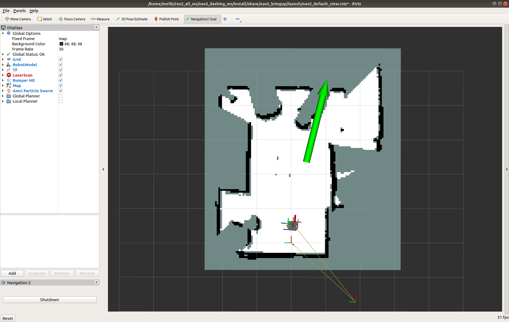

# Navigation2 on a Real Turtlebot 3

- [Overview](#overview)
- [Requirments](#requirements)
- [Navigation2 with a real Turtlebot 3](#navigation2-with-a-real-turtlebot-3)
- [Videos](#videos)

# Overview:

This tutorial shows how to control and navigate Turtlebot 3 using the ROS2 Navigation2 on a real Turtlebot 3 robot. Before completing this tutorials, completing the [Navigation2 with Turtlebot 3 in Gazebo](navigation2_with_turtlebot3_in_gazebo.md) is highly recommended espesially if you are new to ROS and Navigation2.

Turtlebot is a low-cost, personal robot kit with open-source software (ROS2). Turtblebot robots are widely supported by the ROS community. You can find many applications and examples of Turtlebot projects on the Internet. You can find more information about Turtlebot3 [here.](http://emanual.robotis.com/docs/en/platform/turtlebot3/overview/)

Links to the robot kits and Github repo.

- [Turtlebot Burger](http://www.robotis.us/turtlebot-3-burger-us/)
- [Turtlebot Waffle](http://www.robotis.us/turtlebot-3-waffle-pi/)
- [Turtlebot 3 Github](https://github.com/ROBOTIS-GIT/turtlebot3)

This tutorial consists of two parts. In the first part, you learned how to use Turtlebot 3 robots in simulation (Gazebo). And in this part, you will learn how to control a real Turtlebot Waffle using Navigation2.

```ROS2 Dashing``` and ```Navigation2 Dashing 0.2.4``` are used to create this tutorial.

This tutorial may take about 1-2 hours to complete. It depends on your experience with ROS, robots, and what computer system you have.

## Requirements:

- [Install ROS2](https://index.ros.org/doc/ros2/Installation/)

- Install Navigation2

    - ```sudo apt install ros-<ros2-distro>-navigation2 ros-<ros2-distro>-nav2-bringup```

- Install Turtlebot 3 

    - ```sudo apt install ros-<ros2-distro>-turtlebot3*```

- [Setup Turtlebot 3](http://emanual.robotis.com/docs/en/platform/turtlebot3/ros2/#setup)


## Navigation2 with a Real Turtlebot 3

### 0- Setup Your Enviroment Variables

Run the following commands first whenever you open a new terminal during this tutorial.

- ```source /opt/ros/<ros2-distro>/setup.bash```
- ```export TURTLEBOT3_MODEL=waffle```

### 1- Launch Turtlebot 3 Robot State Publisher

Launch Turtlebot 3 robot state publisher,

    ros2 launch turtlebot3_bringup turtlebot3_state_publisher.launch.py use_sim_time:=False

Make sure use_sim_time is set to **False**.

### 2- Launch Navigation2 
 
 You need to have a map of the environment where you want to Navigate Turtlebot 3. Required files:

   - ```your-map.map```
   - ```your-map.yaml```

`<your_map>.yaml` is the configuration file for the map we want to provide Navigation2. In this case, it has the map resolution value, threshold values for obstacles and free spaces, and a map file location. You need to make sure these values are correct. More information about the map.yaml can be found [here](http://wiki.ros.org/map_server).

Launch Navigation 2. If you set autostart:=False, you need to click on the start button in RViz to initialize the nodes. Make sure `use_sim time` is set to **False**, because we want to use the system time instead of the time simulation time from Gazebo.

```
ros2 launch nav2_bringup nav2_bringup_launch.py use_sim_time:=False autostart:=False map:=/path/to/your-map.yaml
```
Don't forget to change **/path/to/your-map.yaml** to the actual path to the your-map.yaml file.

### 3-  Launch RVIZ

Launch RVIZ with a pre-defined configuration file.

    ros2 run rviz2 rviz2 -d $(ros2 pkg prefix nav2_bringup)/share/nav2_bringup/launch/nav2_default_view.rviz

Now, you should see a shadow of Turtlebot 3 robot model in the center of the plot in Rviz. Click on the Start button (Bottom Left) if you set the auto_start parameter to false.


Now, the map should appear in RViz.


### 4- Initialize the Location of Turtlebot 3

First, find where the robot is on the map. Check where your robot is in the room.

Set the pose of the robot in RViz. Click on the 2D Pose Estimate button and point the location of the robot on the map. The direction of the green arrow is the orientation of Turtlebot.
  


Now, the 3D model of Turtlebot should move to that location. A small error in the estimated location is tolerable.

### 5-  Send a Goal Pose

Pick a target location for Turtlebot on the map. You can send Turtlebot 3 a goal position and a goal orientation by using the **Navigation2 Goal** and the **GoalTool** buttons.

*Note*: Difference between buttons. Navigation2 Goal button uses a ROS2 Action to send the goal and GoalTool publishes the goal to a topic.



Once you define the target pose,  Navigation2 will find a global path and start navigating the robot on the map.


Now, you can see that Turtlebot 3 moves towards the goal position in the room. See the video below.

## Videos
[](https://www.youtube.com/watch?time_continue=8&v=ZeCds7Sv-5Q "Nav2")
