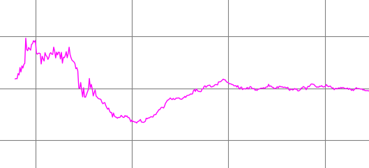
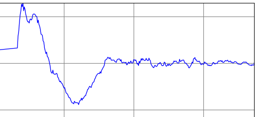
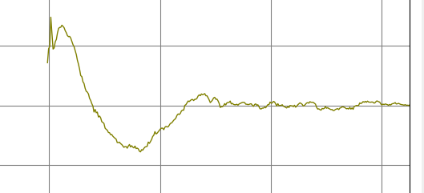
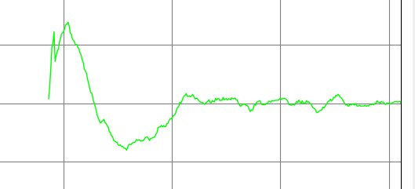
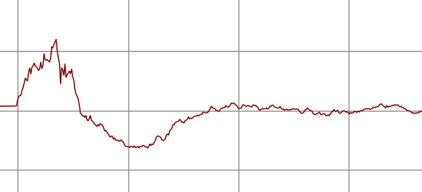
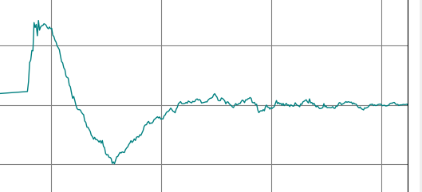
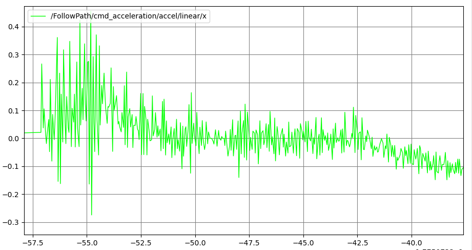
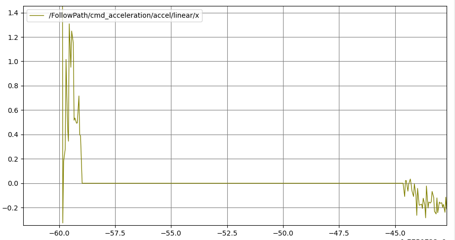
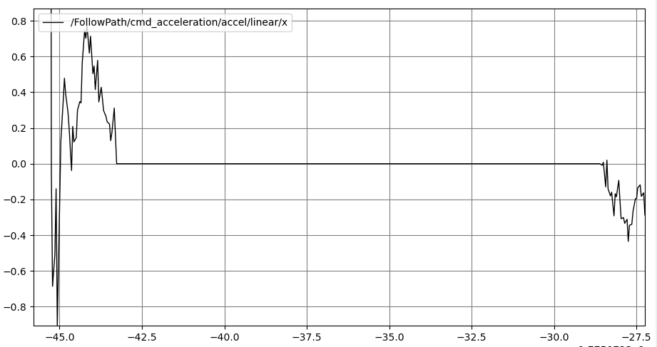
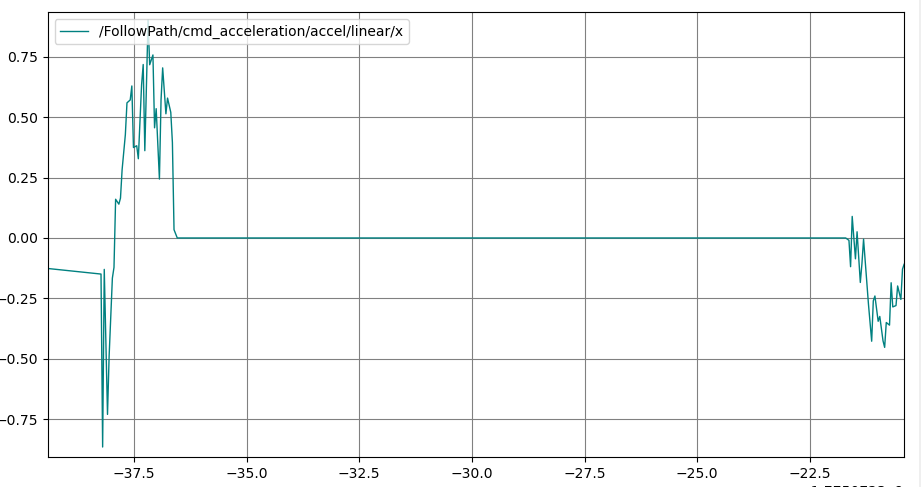

# Dexory Low - Acceleration Integrartion

## Overview

The aim is to support low-accelerations in the MPPI controller, which is currently configured with limits that are much higher than what we want to achieve.
We also want to support highly asymmetric accelerations, to have higher acceleration than deceleration.

## Topic 1: Low - Acceleration Limits

We want to adjust the defaults to using low accelerations for Dexory's platform requirements:

```yaml
# Defaults
ax_max: 3.0
ax_min: -3.0
ay_max: 3.0
ay_min: -3.0
az_max: 3.5
```

```yaml
# Dexory tower lowered limits
low_state_max_accel: [0.25, 0.0, 1.2]
low_state_max_decel: [-0.5, 0.0, -1.2]
```

### Tony's Notes

Tony notes that when setting the limits to 0.25/-0.25 m/s^2 the controller averages accelerations around 0.15 m/s^2.

### Technical Review

Tony's remark rhythmes with some previous behavior of MPPI that users noted when sending a maximum velocity of X m/s it would only achieve some lesser but close Y m/s. This was identified at the time due to the softmax function of MPPI - samples are quashed to the maximum limits in the motion model. When averaging the best candidate trajectories, the others in the averaging bring down the velocity since its capped at the maximum in the vx/vy/wz dimensions. Over many iterations, you can approach but not obtain the maximum velocity.

As as result, we moved to use the softmaxed function to use the raw controls `cvx` rather than velocities after applying the motion model `vx`. The motion model is supposed to simulate the behavior of the vehicle if a control was applied, so we should compute our control trajectories from that in theory. We still apply the acceleration limits and SG filtered smoothing to make sure the final trajectory is drivable.

[PR #5266](https://github.com/ros-navigation/navigation2/pull/5266) implemented an analog change for the acceleration handling to not update the controls based on the acceleration limitations, only the velocities.

```cpp
- state.cvx.col(i - 1) = state.cvx.col(i - 1)
- .cwiseMax(lower_bound_vx)
- .cwiseMin(upper_bound_vx);
- state.vx.col(i) = state.cvx.col(i - 1);
+ state.vx.col(i) = state.cvx.col(i - 1)
+  .cwiseMax(lower_bound_vx)
+  .cwiseMin(upper_bound_vx);
```

However (funnily enough), Tony commented that it broke [his acceleration limitation behavior](https://github.com/ros-navigation/navigation2/pull/5266#issuecomment-3200647428). Some more discussion is found in [Issue 5464](https://github.com/ros-navigation/navigation2/issues/5464) and [Issue 5214](https://github.com/ros-navigation/navigation2/issues/5214).

I believe the disconnect is that the motion model is supposed to model the robot's actual capabilities. You send a `cvx` and you get a `vx` out (thus `vx` used for trajectory rollouts of what the vehicle actually does for scoring, yet `cvx` is used in the optimization softmax). When setting the acceleration limits artificially lower in the motion model, then there needs to be a complimentary system between the controller and the base hardware to enact that limit (i.e. the velocity smoother or base controller) such that the system acts the way the prediction of the motion model implied.

With that interpretation, I believe the change from [PR #5266](https://github.com/ros-navigation/navigation2/pull/5266) is technically correct and was why I merged it in the first place. I believe now that this should once more be considered, so lets dive into the two open issue topics to discuss: [Issue 5464](https://github.com/ros-navigation/navigation2/issues/5464) and [Issue 5214](https://github.com/ros-navigation/navigation2/issues/5214).

[**Original Issue #5214**:](https://github.com/ros-navigation/navigation2/issues/5214)

> [unclamping control velocity with accel seems to solve an issue when the acceleration is low.(e.g < 0.5 m/s^2 or 0.5 rad/s^2)](https://github.com/ros-navigation/navigation2/issues/5214#issuecomment-3002566015)

Removing the `cvx` clamping reportedly allows for lower acceleration limits. Nominally that makes sense to me from my experience with using `vx` for the softmax optimization that caused the complete limits to work with velocities during original development. Thus I'm going to take this for now at face value as correct.

>[ But this has a side effect of changing the meaning of the gamma cost:](https://github.com/ros-navigation/navigation2/issues/5214#issuecomment-3126248380)  Now the gamma is not computed anymore on the actual "bounded"/limited control used to integrate the trajectories, since the PR removed the clipping of cvx, cwz.

I believe that is the intended interpretation of the MPPI technique and gamma cost. We are actually *wrong* now in the way its using clamped controls. This person is just flatly wrong with confidence.

> [Seeing oscillations from this PR (this comment and under)](https://github.com/ros-navigation/navigation2/issues/5214#issuecomment-3162767761) 

This seems like a real problem that will need to be addressed. Removing the `cvx` clamping will cause the importance sampling to be updated to use the raw controls **which is actually correct**. As well, it will update the main optimization to now use the raw, more noised controls:

```cpp
control_sequence_.vx = state_.cvx.transpose().matrix() * softmax_mat;
```

I would intuitively understand this to be noisier and could be interpreted as a 'wobble' effect.
This could be simply down to retuning the values of `temperature` and `gamma` to account for this, but realistically I would not expect it to be that easy. We already use such a small number of samples for softmax from the current settings that decreasing it more would likely not be a good idea.

Instead, some work would need to be done in order to improve the smoothness (i.e. better smoothing techniques, running multiple rounds of SGF, etc) or deciding to break some of the theoretical correctness of the MPPI technique to use `vx` for the optimization rather than `cvx` which would include the clamping effects and thus not have that behavior -  that would have downstream effects though on reaching the maximum velocity limits though as previously mentioned (so not a good idea). Also look if the Importance Sampling factor can/should be removed, some literature implies that this doesn't do much.

Additionally, can look into using different sampling distributions that would result in smoother trajectories (i.e. in the acceleration or frequency domain).

This seems like it is a real problem that required some investigation and testing to resolve.

>  [By changing that way \[OPEN LOOP\], I am able to make MPPI run at low acceleration and do not see wobbling effect.](https://github.com/ros-navigation/navigation2/issues/5214#issuecomment-3396340148) This is because when the model_dt is 0.05 and the acceleration constrain is low(e.g 0.5m/s), the step between each command velocity is very tight that make the motor hard to respond in time. So if I keep using the odometry , it results in bad behavior.  This change works really well for me, on a 4 tons vehicle with 4 wheel steering and motor delay. I need the original change from #5266 which I used so far, but was causing the "wobbling".

I don't have an immediate answer to why this would help, but I suspect it doesn't actually help in the way that they think. I believe what's happening is that the odometry from executing noisy controls causes the noise affects to be amplified. So this is really a bandaid solution.

[**Tony's 5464 follow up ticket:**](https://github.com/ros-navigation/navigation2/issues/5464#issue-3334544954)

>  [This behavior, I think matches with the predict function, the MPPI prediction must stop it beforehand like we do with teleop_keyboard. So that's why MPPI produce such a steep velocity, but later it will be clamp by the driver.](https://github.com/ros-navigation/navigation2/issues/5464#issuecomment-3204050729)

I think that this is actually correct, as mentioned above the assumption is that the motion model is modeling the actual behavior of the vehicle, so if you send a control that would cause a velocity change that violates the acceleration limits, then the vehicle / base controller / velocity smoother should be handling that in the way that the motion model settings predicted.

### Next Steps

A question for Tony: when generating [these plots](https://github.com/ros-navigation/navigation2/pull/5266#issuecomment-3200647428), were these with `applyControlSequenceConstraints()` called and using the Velocity Smoother / Base Controller to enact the acceleration limits? The `applyControlSequenceConstraints()` should in fact make sure its within the acceleration limits, so I'm not sure how this is possible unless with your set acceleration limits this indeed was a valid acceleration.
  * Answer: Cannot reproduce; ignor.

It seems worth to revive the original pull request since I totally believe this should be the correct interpretation of the motion model.

However there are issues to consider:
* Ensuring that these resolve the issue of allowing to use of the full acceleration limits (especially when set to low values)
* Ensuring that these do not cause oscillations or other issues in the controller behavior, perhaps requiring retuning due to the changes? Perhaps need to evaluate why this is happening and why OPEN LOOP odometry use seems to resolve (just lag)? Why wwas this not an issue before?
* Testing and adjusting (if needed) the behavior with Open vs Closed Loop odometry use as well as `cvx` vs `vx` use for the softmax optimization. Test the 2x2 matrix of settings to ensure they comply both with (a) normal, high accelerations and (b) low accelerations.
* Investing is likely required in improved smoothness techniques.


Investigation:
1. Using unbounded raw control velocities as proposed in the original (I believe correct) PR
  * Plotting / printing
2. Set low acceleration / deceleration values to see if we accomplish them fully and constrained to them
3. Evaluate the oscillation / wobble behavior observed
4. Attempt to remove the Importance Sampling (gamma) update to see if that helps with the behavior defects (implied in some literature that it doesn't help)
5. Attempt to tune it away using Gamma and Temperature and STDs; characterize the differences using Open vs Closed Loop odometry (but not a real solution)
5. Attempt to use different SGF parameters for aggressive smoothing and/or running both before and after the constraints are applied to the optimal trajectory.
6. Investigate different methods of smoothness improvements if required: new post-processing smoothing, new sampling distributions, new sampling spaces (i.e. acceleration or frequency domain), adding acceleration to the constraint scoring critic.

https://claude.ai/chat/3c35049c-d16d-4356-823c-c1384125b4fe

### Working Notes

#### Investigation 1: Unbounded Raw Control Velocities, Open/Closed Loop, and Low Acceleration Limits

Creating a basic test which sends a path to the controller server that is 0.5m to the left of the platform which is 8m long, we can see the original behavior and the behavior after adjusting the motion model to unclamp the controls.

This is the CLI command used to generate the straight-line path to remove any variabilities due to path planning

```bash
POSE=$(ros2 topic echo /odom --once | head -20)
PX=$(echo "$POSE" | grep -A3 'position:' | awk '/x:/{print $2}')
PY=$(echo "$POSE" | grep -A3 'position:' | awk '/y:/{print $2}')
PZ=$(echo "$POSE" | grep -A3 'position:' | awk '/z:/{print $2; exit}')
OX=$(echo "$POSE" | grep -A4 'orientation:' | awk '/x:/{print $2}')
OY=$(echo "$POSE" | grep -A4 'orientation:' | awk '/y:/{print $2}')
OZ=$(echo "$POSE" | grep -A4 'orientation:' | awk '/z:/{print $2}')
OW=$(echo "$POSE" | grep -A4 'orientation:' | awk '/w:/{print $2}')

YAW=$(awk "BEGIN{print atan2(2*($OW*$OZ + $OX*$OY), 1 - 2*($OY*$OY + $OZ*$OZ))}")

ros2 action send_goal /follow_path nav2_msgs/action/FollowPath \
"{path: {header: {frame_id: 'odom'}, poses: [
$(for i in $(seq 0 5 800); do
  D=$(awk "BEGIN{printf \"%.4f\", $i/100}")
  X=$(awk "BEGIN{printf \"%.4f\", $PX + $D*cos($YAW) - 0.5*sin($YAW)}")
  Y=$(awk "BEGIN{printf \"%.4f\", $PY + $D*sin($YAW) + 0.5*cos($YAW)}")
  echo "  {header: {frame_id: 'odom'}, pose: {position: {x: $X, y: $Y, z: $PZ}, orientation: {x: $OX, y: $OY, z: $OZ, w: $OW}}},"
done)
]}}"
```

This uses the acceleration values corresponding to the low-acceleration limits of the tower lowered configurations

```yaml
ax_max: 0.25
ax_min: -0.5
ay_max: 3.0
ay_min: -3.0
az_max: 1.2
```

Before unclamping the controls:



After unclamping the controls:



The scale of each box is 0.2m/s. As you can see the after has a wider initial correction towards the path and correction from the original as well as additional noise while tracking the straightline path. However they both converge nicely -- it appears though that the after converges slightly faster due to the sharpness of the response.

Note that the before and after for using the full acceleration seems very related, just with a bit more noise at steady state:

 

Using `open_loop: true` with low-acceleration limits we again see the higher maximum velocities (possibly more noise between the two?) but consistent convergence times to the path. The noise compared to the original after unclamped controls certainly is improved so I can see why the original authors thought that Open Loop would be a viable short-term solution. 

 

So far so good; just more noise in tracking which we expected.

#### Investigation 2: Low Acceleration Limits Respected

Now, I am curious though: what accelerations are being used on these plots? Its curious to me that the after would have seemingly higher accelerations than before looking at the shapes of the curves. The sharpness of the dip and adjustment back onto the path also implies less lag/smoothing occurring -- which would make sense if we're using unbounded controls for the optimization rather than the bounded velocities. However I'm concerned that the acceleration limits aren't being respected for some reason. 

I added the following block at the end of `optimize()` which does not trigger, which proves that acceleration constraints within the optimal control sequence are being respected. A small `episilon` is used to ensure that we don't trigger on numerical issues with the acceleration calculations.

Minor a very minor edge case that rarely happens (which I fixed), this worked as intended. So checkmark, acceleration constraints are being respected within the optimal control sequence.

```cpp
const int n = control_sequence_.vx.size();
if (n > 1) {
  const float dt = settings_.model_dt;
  Eigen::ArrayXf ax = (control_sequence_.vx.tail(n - 1) - control_sequence_.vx.head(n - 1)) / dt;
  Eigen::ArrayXf az = (control_sequence_.wz.tail(n - 1) - control_sequence_.wz.head(n - 1)) / dt;
  const auto & c = settings_.constraints;
  constexpr float eps = 1e-3f;
  for (int j = 0; j < n - 1; ++j) {
    bool ax_violated = false, az_violated = false;
    if (control_sequence_.vx(j) >= 0) {
      ax_violated = (ax(j) < c.ax_min - eps || ax(j) > c.ax_max + eps);
    } else {
      ax_violated = (ax(j) < -c.ax_max - eps || ax(j) > -c.ax_min + eps);
    }
    az_violated = (az(j) < -c.az_max - eps || az(j) > c.az_max + eps);
    if (ax_violated || az_violated) {
      RCLCPP_WARN(
        logger_,
        "Iter %zu idx %d - accel violation! ax: %.3f m/s^2, az: %.3f rad/s^2",
        i, j, ax(j), az(j));
    }
  }
}
```

The other source of potential acceleration constraint violations is due to the initialization of the candidate velocities at the robot's odometric speed. When we are in closed-loop mode, the odometry in will seed the velocities based on the speed provided by the controller server. In open-loop mode, the last control sequence's sent command velocity is used instead (assuming perfect execution, to handle issues due to odometry lag or noise).

In publishing that data, we use the following code block in `evalControl()`:

```cpp
geometry_msgs::msg::AccelStamped accel_msg;
accel_msg.header.stamp = plan.header.stamp;
accel_msg.header.frame_id = costmap_ros_->getGlobalFrameID();
accel_msg.accel.linear.x =
  (control.twist.linear.x - last_command_vel_.linear.x) / controller_period_;
accel_msg.accel.angular.z =
  (control.twist.angular.z - last_command_vel_.angular.z) / controller_period_;
```

For the respective before unclamping the control velocities and after:

 

This is interesting because we see much more smoothness in the acceleration term with unclamped controls, but its limits are not respected at the start during the acceleration phase. The clamped controls shows that we stay within the bounds but have an immense amount of chattering. I don't fully understand this as fact, but intuitively the additional velocity noise in the unclamped controls is due to the higher noise in the controls used in the softmax (more noise before averaging -> more noise after averaging). The jitter in the in the acceleration is removed since the softmax is scoring trajectory points based on clamped values, so it can't see 'how bad its violated' (scoring bad trajectories worse -> less used in final output).

We see however that the acceleration constraints are being consistently violated. Perhaps this is because the model_dt and control period are not the same. The controller_period running at 20 hz (0.05s) but the model_dt used in the optimizer being 0.1s. The acceleration limits are applied within the trajectory optimization. That means the acceleration constraints applied within the optimizer are simulated twice long as when they're grabbed by the controller to execute (virtually doubling the acceleration limits of cmd_vel out). When we make them the same we see the following:



Moreover when we set it to use open-loop so there is no odometry contribution, we see virtually the same thing with no meaningful differentiation:



We're still regularly violating the acceleration constraints externally without clamped controls.

---

(a)

Add acceleration constraint on vx(0) in applyControlSequenceConstraints relative to state_.speed, before the existing velocity clamp. This is the only place that closes the inter-iteration gap, and since it operates on the final output (not on cvx), it doesn't interfere with optimization freedom. Same for wz(0) and vy(0).

(b) 

Adjust the values of cvx.col(0) to be feasible before rollouts (motion model? updateInitialStateVelocities?)

use model_dt (not controller period) for cvx(0) samplign constraint. the constraint on vx(0) should conceptually use controller_period since it's the real-world gap between iterations — but since model_dt == controller_period is now enforced, this is moot.

---

TODO STEVE
* test more with open loop + matching -- why any violation?
* Test more with closed loop + matching -- why the vilations we see?
* Propose solution to this to handle and support dynamic feasibility even in this case (or throw exceptions requiring some more consistency)
  * Do acceleration constraints between iterations too? 
  * Or from the odom / open loop state.speed from last as seed or something?
  * Recenter the cvx (not just vx) in updateInitialStateVelocities around the starting speed.

But there's a subtlety: the internal acceleration constraints at line 359 use model_dt, not controller_period_. 
So if you want to compare this published acceleration against the constraint limits (ax_max, ax_min, az_max), the units are consistent (both m/s²), but the constraints were enforced within the sequence at model_dt spacing, while this measures the jump between iterations at controller_period_ spacing.

Go back around to the original issue: does unclamping, closed/open loop, and model_dt vs control period matter? Which changes should we take away from this?

## Topic 2: Asymmetric Acceleration Limits

Check the signs of the motion model / clamping as working; it could be trivial as that
Else, characterize and dig in.


