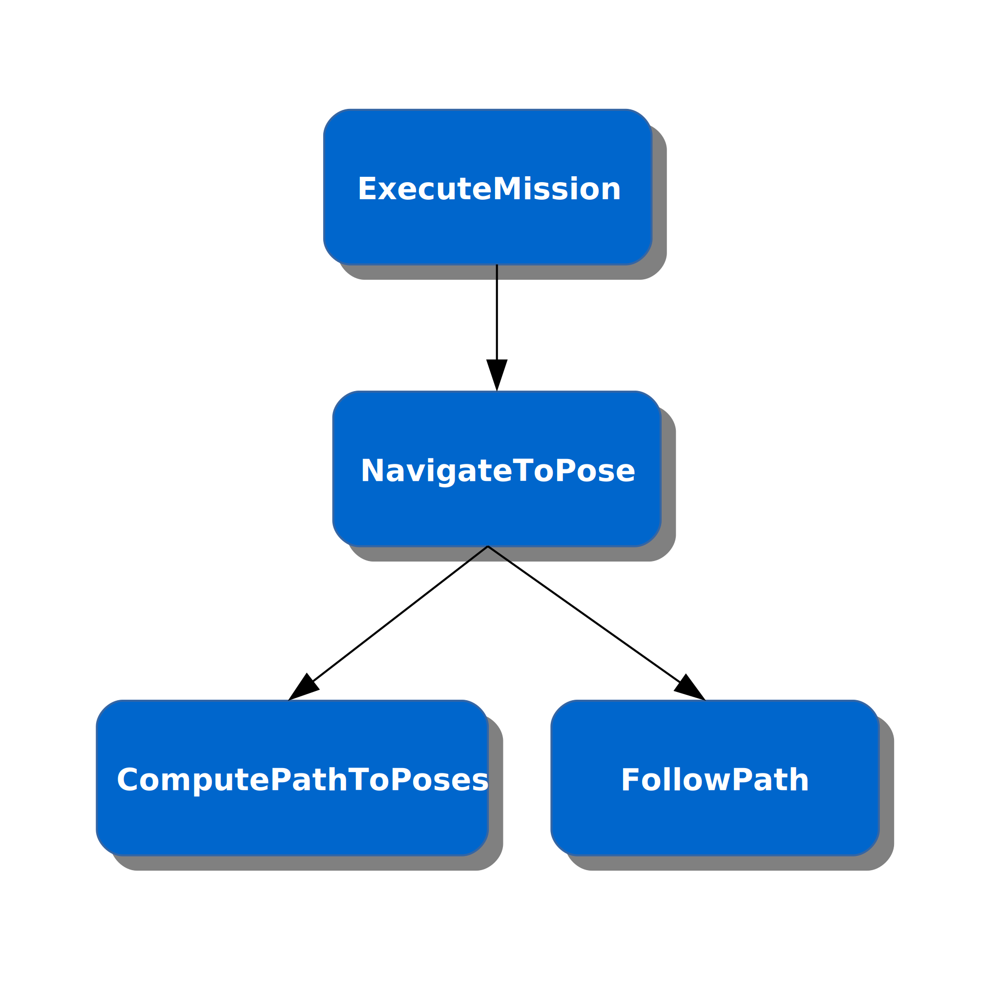

# Nav2 Tasks

A *task* is an abstraction roughly modeled after ROS1's SimpleActionClient/Server (which is not yet available in ROS2). A *task client* issues a command to *task server*, which receives the command, performs a (typically long-running) task, and asynchronously returns a result to the client. The task client may cancel the task during its execution. After cancellation or completion, the task client may issue another task to the task server.  

The **nav2_behavior_tree** library defines:

* [TaskServer](include/nav2_behavior_tree/task_server.hpp) and [TaskClient](include/nav2_behavior_tree/task_client.hpp) templates which are used as base classes to implement task servers and their associated task clients
* A few derived classes, such as [ComputePathToPoseTask](include/nav2_behavior_tree/compute_path_to_pose_task.hpp), that define specific task clients and servers

For convenience the nav_tasks library also provides:
* A [ServiceClient](include/nav2_behavior_tree/service_client.hpp) template used to define clients for ROS2 services
* A couple specific service client classes, such as [MapServiceClient](include/nav2_behavior_tree/map_service_client.hpp) that use the ServiceClient template

## Overview

The Navigation2 architecture implements a *task hierarchy* where commands are sent to modules which are organized in a hierarchy. Each module implements a task and can utilize sub-tasks, which are themselves modules that implement tasks.

For example, the Navigation2 software currently implements four tasks: **ExecuteMission**, **NavigateToPose**, **ComputePathToPose**, and **FollowPath**, which are organized as follows:



This approach allows for easily replacing any task with an alternative implementation. The replacement module must simply implement the correct task interface. 

One can define additional tasks using the TaskClient and TaskSever templates. To do so, one specifies the command message that the task is to receive as well as the result message (similar in spirit to ROS1's .action file). 

For example, to define a new task, named *DoSomething*, that takes a String as input and an Empty message as a result, 

```C++
namespace nav2_behavior_tree
{

using DoSomethingCommand = std_msgs::msg::String;
using DoSomethingResult = std_msgs::msg::Empty;

using DoSomethingTaskClient = TaskClient<DoSomethingCommand, DoSomethingResult>;
using DoSomethingTaskServer = TaskServer<DoSomethingCommand, DoSomethingResult>;

template<>
inline const char * getTaskName<DoSomethingCommand, DoSomethingResult>()
{
  return "DoSomethingTask";
}
```

**Note**: The getTaskName template is required (it's used to name the topics used by the implementation).

Then, to implement the task server, a derived class inherits from this newly-defined task type and overrides the execute() method. For example,

```C++
class DoSomethingImplementation : public nav2_behavior_tree::DoSomethingTaskServer
{
public:
  DoSomethingImplementation();
  ~DoSomethingImplementation();

  nav2_behavior_tree::TaskStatus execute(
    const nav2_behavior_tree::DoSomethingCommand::SharedPtr command) override;
};

TaskStatus
DoSomethingImplementation::execute(const nav2_behavior_tree::DoSomethingCommand::SharedPtr command)
{  
  for (;;) {
    
    // TODO: Do a bit of the task        

    // Before we loop again to do more work, check if we've been canceled
    if (cancelRequested()) {
      RCLCPP_INFO(get_logger(), "DwaController::execute: task has been canceled");
      setCanceled();
      return TaskStatus::CANCELED;
    }
    
    // If we've successfully completed the task, return the result
    if (done) {
      nav2_behavior_tree::DoSomethingResult result; 
      
      // TODO: Set fields in the result message, if any
      
      setResult(result);
      return TaskStatus::SUCCEEDED;
    }
  }  
}
```

## Implementation

The implementation of TaskClient and TaskServer is intentionally simplistic as it is a temporary stand-in for missing ActionLib functionality. The current implementation uses four ROS topics for task client/server communication. Associated with these topics are four message types: **Command**, **Cancel**, **Result**, and **Status**. The Command and Result messages are provided by the user of the TaskClient and TaskServer classes and are the input and output of the task from the client's point of view. The Cancel and Status messages are internal to the implementation; the Status message is used to communicate from the task server to the task client, indicating whether a task has succeeded, failed, or has been canceled, and the Cancel message is sent from the task client to the task server when the client invokes the cancel() method. To keep things simple, the task library does not implement a feedback mechanism to provide task updates.

## Open Issues

* __TaskServer *is a Node* versus *receives a Node*__

  + The currently implementation makes the TaskServer itself a Node. Instead, it should receive the Node to use. This would allow a Node to have multiple TaskServers. 

* **Override virtual method versus registering a callback**
  
  + The implementation currently requires a derived class to override a virtual method. Instead, this could be more like ActionLib where a callback is registered.

## Plans

* **Automatic task cancelation**

  + For convenience, upon receiving a new command before the previous command has completed, the task server could automatically cancel the current command and take up the new command.

