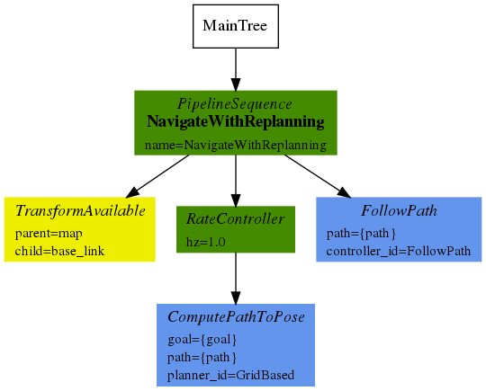
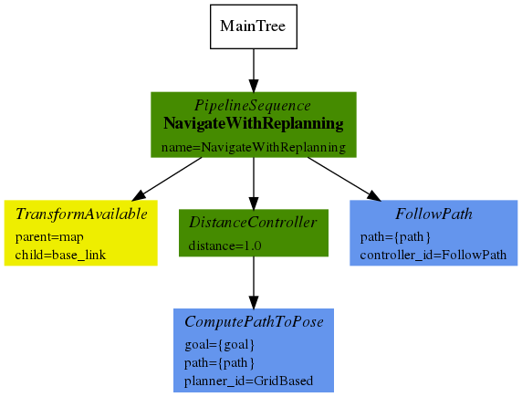
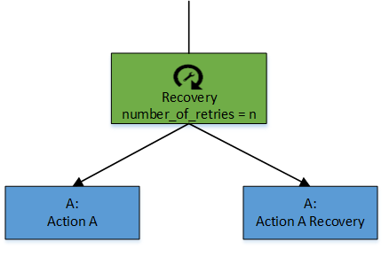
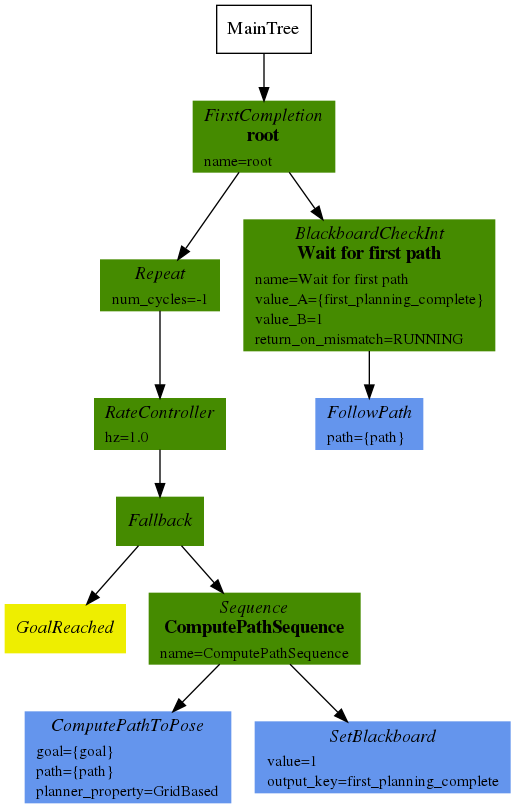
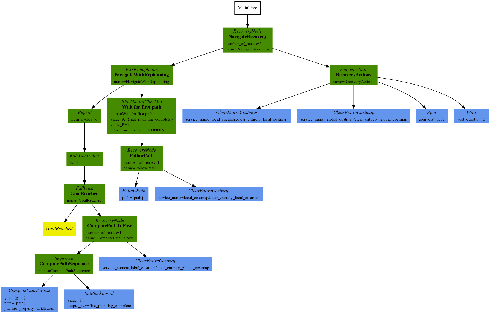
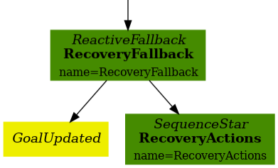
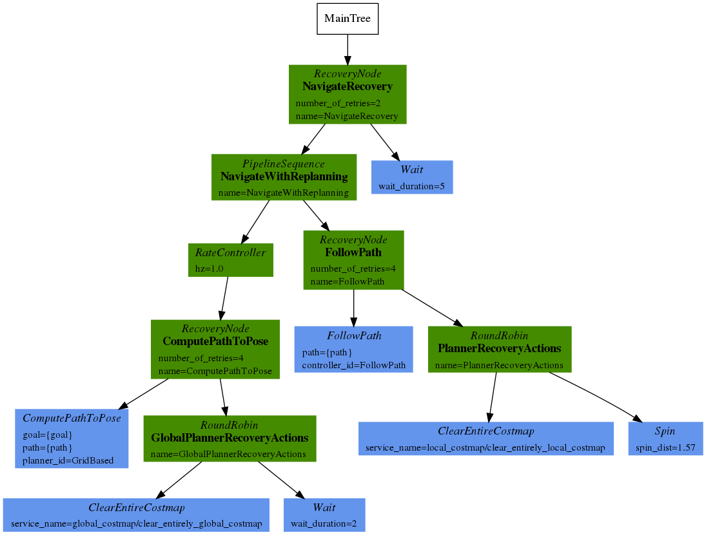
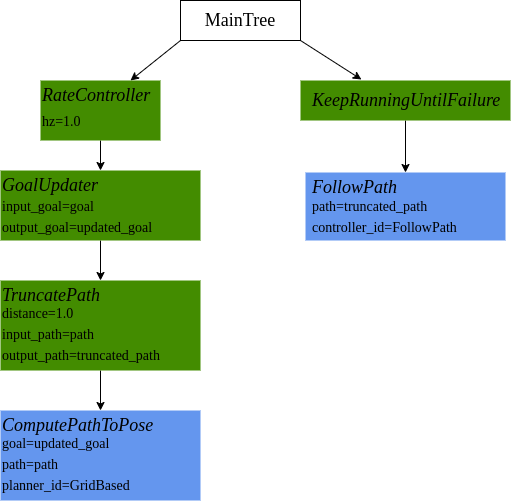
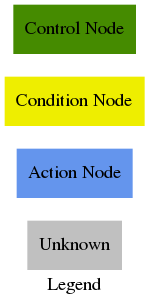

# BT Navigator

The BT Navigator (Behavior Tree Navigator) module implements the [NavigateToPose task interface](../nav2_behavior_tree/include/nav2_behavior_tree/navigate_to_pose_action.hpp). It is a [Behavior Tree](https://github.com/BehaviorTree/BehaviorTree.CPP/blob/master/docs/BT_basics.md)-based implementation of navigation that is intended to allow for flexibility in the navigation task and provide a way to easily specify complex robot behaviors, including [recovery](#recovery).

## Overview

The BT Navigator receives a goal pose and navigates the robot to the specified destination. To do so, the module reads an XML description of the Behavior Tree from a file, as specified by a Node parameter, and passes that to a generic [BehaviorTreeEngine class](../nav2_behavior_tree/include/nav2_behavior_tree/behavior_tree_engine.hpp) which uses the [Behavior-Tree.CPP library](https://github.com/BehaviorTree/BehaviorTree.CPP) to dynamically create and execute the BT.

## Specifying an input XML file

The BtNavigator node has a parameter, *bt_xml_filename*, that can be specified using a ROS2 parameters YAML file, like this:

```
BtNavigator:
  ros__parameters:
    bt_xml_filename: <path-to-xml-file>
```

Using the XML filename as a parameter makes it easy to change or extend the logic used for navigation. Once can simply update the XML description for the BT and the BtNavigator task server will use the new description.

## Behavior Tree nodes

A Behavior Tree consists of control flow nodes, such as fallback, sequence, parallel, and decorator, as well as two execution nodes: condition and action nodes. Execution nodes are the leaf nodes of the tree. When a leaf node is ticked, the node does some work and it returns either SUCCESS, FAILURE or RUNNING.  The current Navigation2 software implements a few custom nodes, including Conditions and Actions. The user can also define and register additional node types that can then be used in BTs and the corresponding XML descriptions.

## Navigation Behavior Trees

The BT Navigator package has four sample XML-based descriptions of BTs.  
These trees are [navigate_w_replanning_time.xml](behavior_trees/navigate_w_replanning_time.xml), [navigate_w_replanning_distance.xml](behavior_trees/navigate_w_replanning_distance.xml), [navigate_w_replanning_and_recovery.xml](behavior_trees/navigate_w_replanning_and_recovery.xml) and 
[followpoint.xml](behavior_trees/followpoint.xml).  
The user may use any of these sample trees or develop a more complex tree which could better suit the user's needs.

### Navigate with Replanning (time-based)

[navigate_w_replanning_time.xml](behavior_trees/navigate_w_replanning_time.xml) implements basic navigation by continuously computing and updating the path at a rate of 1Hz. The default controller, the nav2_dwb_controller, implements path following at a rate of 10Hz.



### Navigate with Replanning (distace-based)

[navigate_w_replanning_distance.xml](behavior_trees/navigate_w_replanning_distance.xml) implements basic navigation by continuously computing and updating the path after every 1 meter distance traveled by the robot.



#### Navigate with replanning is composed of the following custom decorator, condition, control and action nodes:

#### Control Nodes
* PipelineSequence: This is a variant of a Sequence Node. When this node is ticked,
it will tick the first child till it succeeds. Then it will tick the first two
children till the second one succeeds. Then it will tick the first three till the
third succeeds and so on, till there are no more children. This will return RUNNING,
till the last child succeeds, at which time it also returns SUCCESS. If any child
returns FAILURE, all nodes are halted and this node returns FAILURE.
* RoundRobin: This is a custom control node introduced to the Behavior Tree. When this node is ticked, it will tick the first child until it returns SUCCESS or FAILURE. If the child returns either SUCCESS or FAILURE, it will tick its next child. Once the node reaches the last child, it will restart ticking from the first child. The main difference between the RoundRobin node versus the Sequence node is that when a child returns FAILURE the RoundRobin node will tick the next child but in the Sequence node, it will return FAILURE.

* Recovery: This is a control flow type node with two children.  It returns success if and only if the first child returns success. The second child will be executed only if the first child returns failure.  The second child is responsible for recovery actions such as re-initializing system or other recovery behaviors. If the recovery behaviors are succeeded, then the first child will be executed again.  The user can specify how many times the recovery actions should be taken before returning failure. The figure below depicts a simple recovery node.

<p align="center">

</p>
<br/>


#### Decorator Nodes
* RateController: A custom control flow node, which throttles down the tick rate.  This custom node has only one child and its tick rate is defined with a pre-defined frequency that the user can set.  This node returns RUNNING when it is not ticking its child. Currently, in the navigation, the `RateController` is used to tick the  `ComputePathToPose` and `GoalReached` node at 1 Hz.

* DistanceController: A custom control flow node, which controls the tick rate based on the distance traveled.  This custom node has only one child. The user can set the distance after which the planner should replan a new path.  This node returns RUNNING when it is not ticking its child. Currently, in navigation, the `DistanceController` is used to tick the  `ComputePathToPose` and `GoalReached` node after every 0.5 meters.

* SpeedController: A custom control flow node, which controls the tick rate based on the current speed.  This decorator offers the most flexibility as the user can set the minimum/maximum tick rate which is adjusted according to the current speed.

* GoalUpdater: A custom control node, which updates the goal pose. It subscribes to a topic in which it can receive an updated goal pose to use instead of the one commanded in action. It is useful for dynamic object following tasks.


#### Condition Nodes
* GoalReached: Checks the distance to the goal, if the distance to goal is less than the pre-defined threshold, the tree returns SUCCESS, which in that case the `ComputePathToPose` action node will not get ticked.

#### Action Nodes
* ComputePathToPose: When this node is ticked, the goal will be placed on the blackboard which will be shared to the Behavior tree.  The bt action node would then utilizes the action server to send a request to the global planner to recompute the global path.  Once the global path is recomputed, the result will be sent back via action server and then the updated path will be placed on the blackboard. The `planner` parameter will tell the planning server which of the loaded planning plugins to utilize, in case of desiring different parameters, planners, or behaviors. The name of the planner should correspond with the high level task it accomplishes and align with the `planner_ids` name given to it in the planner server. If no planner name is provided, it will use the only planner in the planner server when only one is available.

The graphical version of this Behavior Tree:

<p align="center">

</p>
<br/>

The navigate with replanning BT first ticks the `RateController` node which specifies how frequently the `GoalReached` and `ComputePathToPose` should be invoked. Then the `GoalReached` nodes check the distance to the goal to determine if the `ComputePathToPose` should be ticked or not. The `ComputePathToPose` gets the incoming goal pose from the blackboard, computes the path and puts the result back on the blackboard, where `FollowPath` picks it up. Each time a new path is computed, the blackboard gets updated and then `FollowPath` picks up the new goal to compute a control effort for. `controller_id` will specify the type of control effort you'd like to compute such as `FollowPath` `FollowPathSlow` `FollowPathExactly`, etc.


* TruncatePath: A custom control node, which modifies a path making it shorter. It removes parts of the path closer than a distance to the goal pose. The resulting last pose of the path orientates the robot to the original goal pose.

### Navigate with replanning and simple recovery actions

With the recovery node, simple recoverable navigation with replanning can be implemented by utilizing the [navigate_w_replanning_time.xml](behavior_trees/navigate_w_replanning_time.xml) and a sequence of recovery actions. Our custom behavior actions for recovery are:  `clearEntirelyCostmapServiceRequest` for both global and local costmaps, `spin` and `wait`. A graphical version of this simple recoverable Behavior Tree is depicted in the figure below.

<p align="center">

</p>
<br/>


This tree is currently our default tree in the stack and the xml file is located here: [navigate_w_replanning_and_recovery.xml](behavior_trees/navigate_w_replanning_and_recovery.xml).


#### Halting recoveries on navigation goal (Preemption reference design)
In general, the recovery behaviours and any other long running process should be stopped when the navigation goal is issued (e.g. preemption). In the default tree in the stack, this behaviour is accomplished using a condition node checking the global navigation goal and a reactive fallback controller node:

<p align="center">

</p>

This way, the recovery actions can be interrupted if a new goal is sent to the bt_navigator. Adding other condition nodes to this structure, it is possible to halt the recoveries in other cases (e.g, giving a time limit for their execution). This is the recommended design pattern for preempting a node or tree branch under specific conditions such as a new navigation request. Please notice that the order of definition of the nodes in the xml file can alter the behaviour of this structure, and that all conditions should be placed before the recovery behaviour node or branch.


#### Multi-Scope Recoveries
Scope-based failure handling: Utilizing Behavior Trees with a recovery node allows one to handle failures at multiple scopes. With this capability, any action in a large system can be constructed with specific recovery actions suitable for that action. Thus, failures in these actions can be handled locally within the scope. With such design, a system can be recovered at multiple levels based on the nature of the failure. Higher level recovery actions could be recovery actions such as re-initializing the system, re-calibrating the robot, bringing the system to a good known state, etc.

### Navigate with replanning and simple Multi-Scope Recoveries
In the navigation stack, multi-scope recovery actions are implemented for each module.  Currently, the recovery actions for the Global planner are: Clear Entire Global Costmap and Wait.  The recovery actions for the Local planner are: Clear Entire Local Costmap and Spin; the recovery actions for the system level is just Wait. The figure below highlights a simple multi-scope recovery handling for the navigation task.  With this tree, if the Global Planner fails, the ClearEntireCostmap which is the first recovery action for this module will be ticked, then the ComputePathToPose will be ticked again. If the ComputePathToPose fails again, the Wait which is the second recovery action for this module will be ticked. After trying the second recovery action, the ComputePathToPose will be ticked again. These actions can be repeated n times until ComputePathToPose succeeds.  If the ComputePathToPose fails and the Global Planner cannot be recovered locally, the higher-level recovery actions will be ticked.  In this simple example, our higher-level recovery action is just a longer wait. The same strategy is applied to the Local Planner. If the Local Planner fails, the tree will first tick the ClearEntireCostmap and then if it fails again the tree will tick the Spin.

<br/>

<p align="center">

</p>

This tree currently is not our default tree in the stack. The xml file is located here: [navigate_w_replanning_and_round_robin_recovery.xml](behavior_trees/navigate_w_replanning_and_round_robin_recovery.xml).

### Navigate following a dynamic point to a certain distance
This tree is an example of how behavior trees can be used to make the robot do more than navigate the current position to the desired pose. In this case, the robot will follow a point that changes dynamically during the execution of the action. The robot will stop its advance and will be oriented towards the target position when it reaches a distance to the target established in the tree. The UpdateGoal decorator node will be used to update the target position. The TruncatePath node will modify the generated path by removing the end part of this path, to maintain a distance from the target, and changes the orientation of the last position. This tree never returns that the action has finished successfully, but must be canceled when you want to stop following the target position.



This tree currently is not our default tree in the stack. The xml file is located here: [follow_point.xml](behavior_trees/follow_point.xml).

<br/>

## Open Issues

* **Schema definition and XML document validation** - Currently, there is no dynamic validation of incoming XML. The Behavior-Tree.CPP library is using tinyxml2, which doesn't have a validator. Instead, we can create a schema for the Mission Planning-level XML and use build-time validation of the XML input to ensure that it is well-formed and valid.

## Legend
Legend for the behavior tree diagrams:


