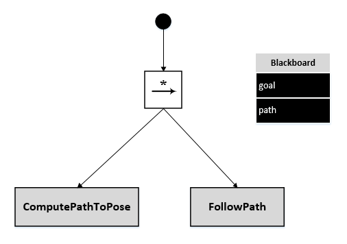
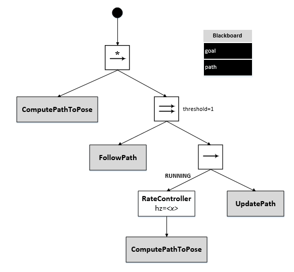
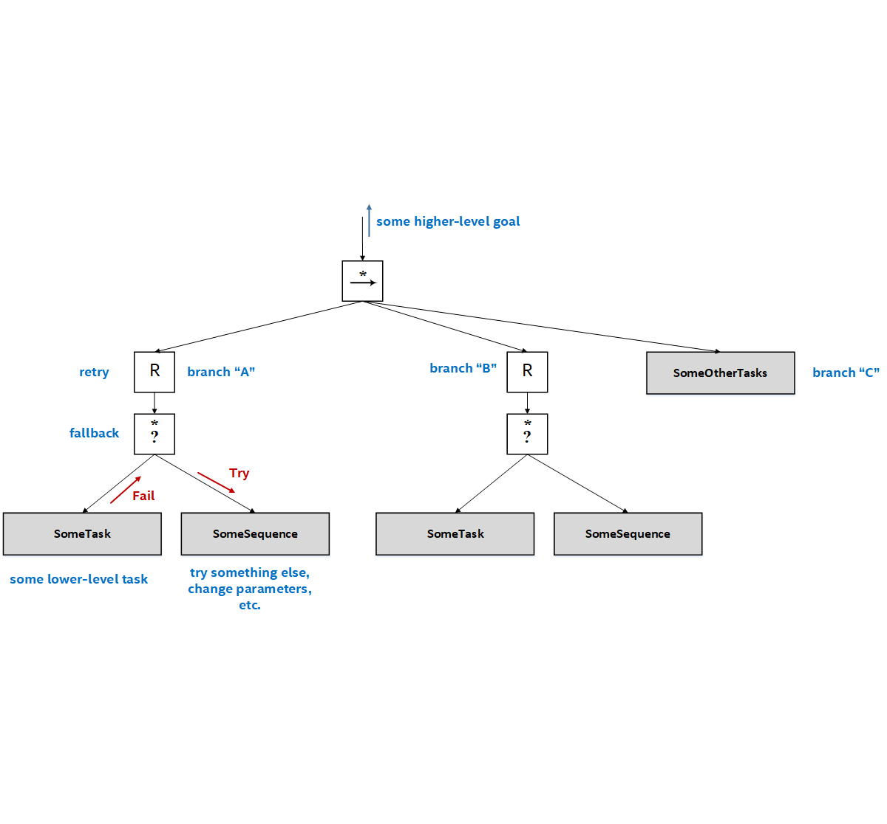
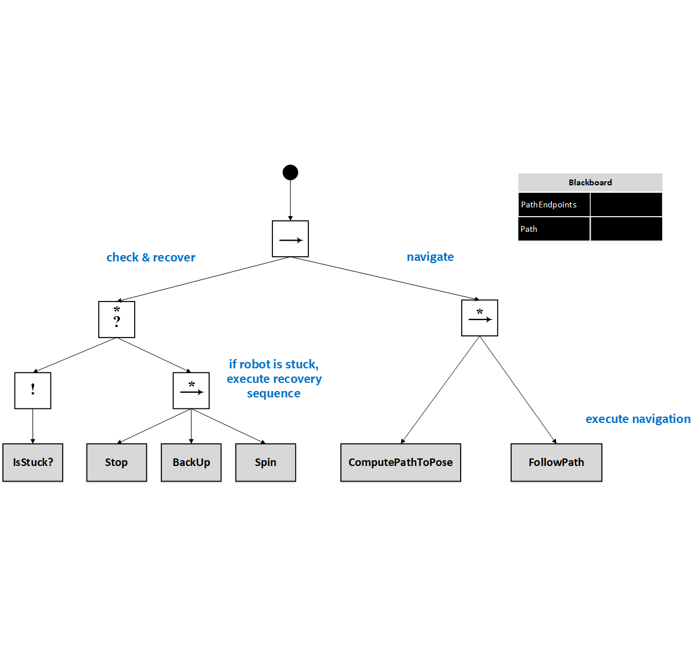
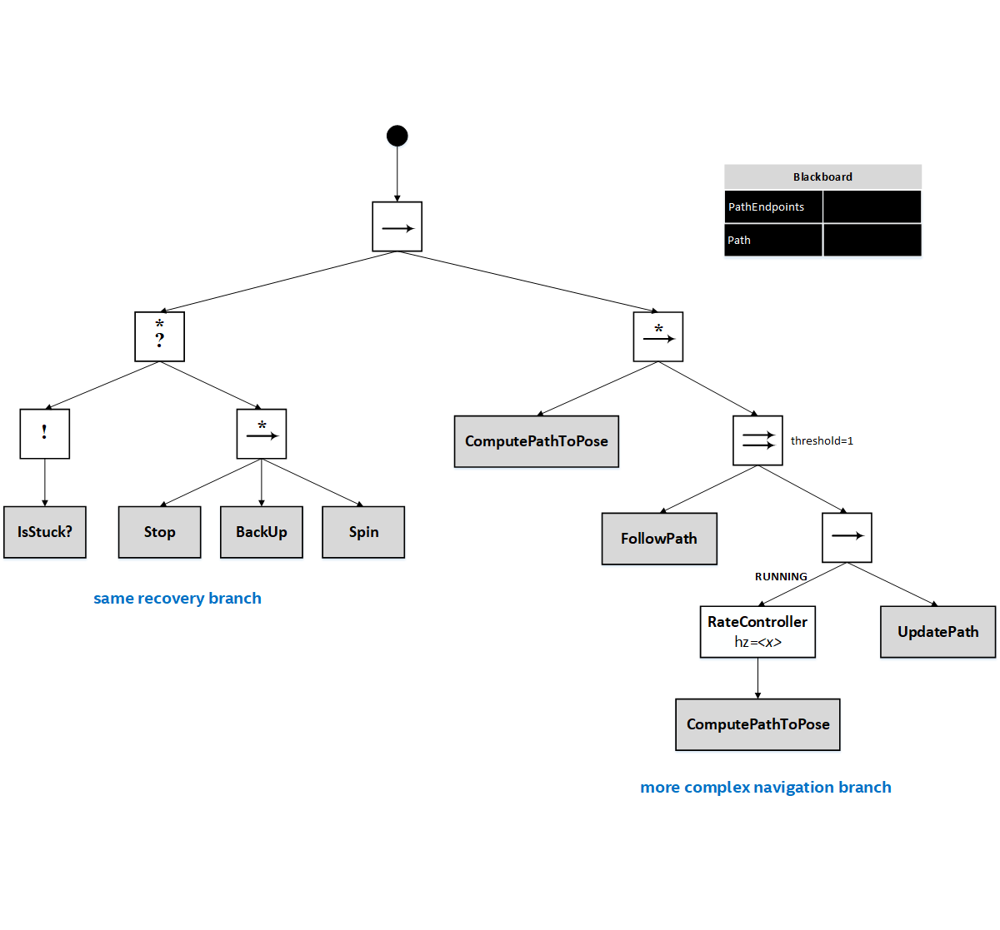
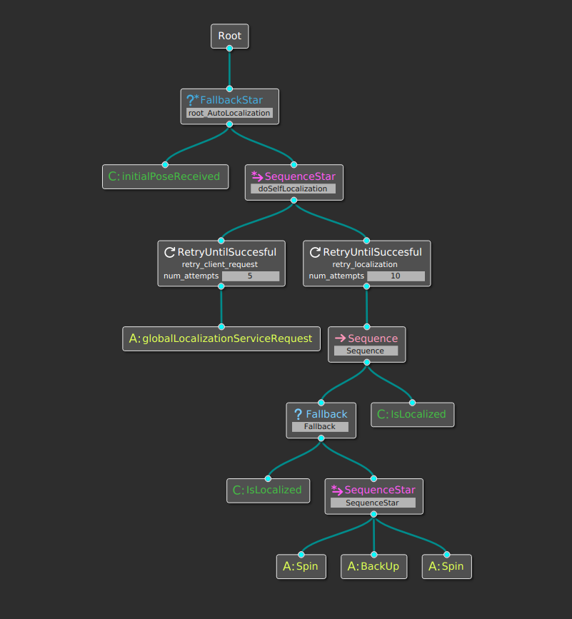
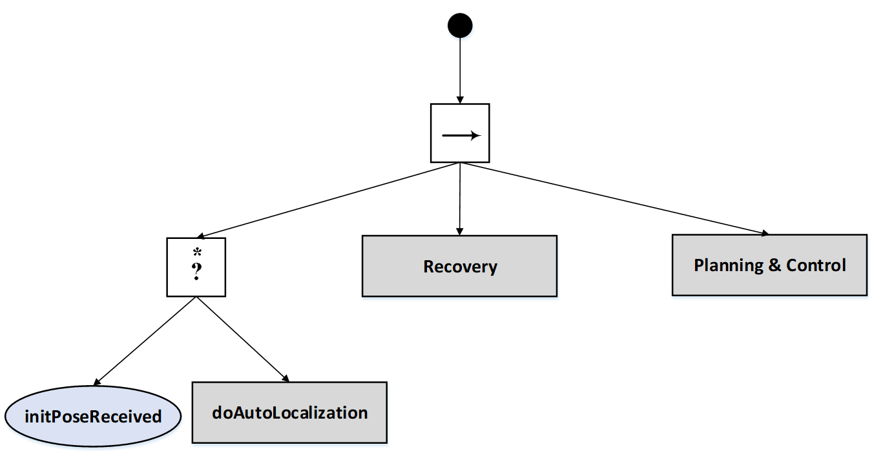

# BT Navigator

The BT Navigator (Behavior Tree Navigator) module implements the [NavigateToPose task interface](../nav2_tasks/include/nav2_tasks/navigate_to_pose_task.hpp). It is a [Behavior Tree](https://github.com/BehaviorTree/BehaviorTree.CPP/blob/master/docs/BT_basics.md)-based implementation of navigation that is intended to allow for flexibility in the navigation task and provide a way to easily specify complex robot behaviors, including [recovery](#recovery).

## Overview

The BT Navigator receives a goal pose and navigates the robot to the specified destination. To do so, the module reads an XML description of the Behavior Tree from a file, as specified by a Node parameter, and passes that to a generic [BehaviorTreeEngine class](../nav2_tasks/include/nav2_tasks/behavior_tree_engine.hpp) which uses the [Behavior-Tree.CPP library](https://github.com/BehaviorTree/BehaviorTree.CPP) to dynamically create and execute the BT.

## Specifying an input XML file

The BtNavigator node has a parameter, *bt_xml_filename*, that can be specified using a ROS2 parameters YAML file, like this:

```
BtNavigator:
  ros__parameters:
    bt_xml_filename: <path-to-xml-file>
```

Using the XML filename as a parameter makes it easy to change or extend the logic used for navigation. Once can simply update the XML description for the BT and the BtNavigator task server will use the new description.

## Navigation Behavior Trees

The BT Navigator package has a few sample XML-based descriptions of BTs.

### Simple sequential invocation of planning and control

[Simple_sequential.xml](behavior_trees/simple_sequential.xml) implements a basic navigation by first computing the path and then following the path.

```XML
<root main_tree_to_execute="MainTree">
  <BehaviorTree ID="MainTree">
    <SequenceStar name="root">
      <ComputePathToPose goal="${goal}" path="${path}"/>
      <FollowPath path="${path}"/>
    </SequenceStar>
  </BehaviorTree>
</root>
```

The graphical version of this Behavior Tree:



**ComputePathToPose** gets the incoming goal pose from the blackboard, computes the path and puts the result back on the blackboard, where **FollowPath** picks it up.

### Parallel planning and control

An alternative approach is to run planning and control in parallel. [Parallel.xml](behavior_trees/parallel.xml) implements one possible BT for doing this:

```XML
<root main_tree_to_execute="MainTree">
  <BehaviorTree ID="MainTree">
    <SequenceStar name="root">
      <ComputePathToPose goal="${goal}" path="${path}"/>
      <ParallelNode threshold="1">
        <FollowPath path="${path}"/>
        <Sequence>
          <RateController hz="1.0">
            <ComputePathToPose goal="${goal}" path="${path}"/>
          </RateController>
          <UpdatePath/>
        </Sequence>
      </ParallelNode>
    </SequenceStar>
  </BehaviorTree>
</root>
```

The graphical version of this Behavior Tree:



In this case, the BT first calls **ComputePathToPose** to generate an initial path. It then runs **FollowPath** and a rate-controlled **ComputePathToPose** in parallel. The **RateController** node specifies how frequently the **ComputePathToPose** task should be invoked. Each time a new path is computed, it is sent to the local planner/controller using **UpdatePath**.

## Recovery Behavior Trees

With Behavior Trees, a recovery pattern can be implemented using [fallback](https://github.com/BehaviorTree/BehaviorTree.CPP/blob/master/docs/FallbackNode.md) and [recovery](https://github.com/BehaviorTree/BehaviorTree.CPP/blob/master/docs/DecoratorNode.md) nodes. For example, on the diagram below, branch "A" contains a retry node `R` in series with a fallback node `?*`. If the leaf node **SomeTask** returns *Fail*, the fallback node will tick **SomeSequence** which could execute an alternative approach to accomplish the task. If **SomeSequence** also returns *Fail*, the retry node will tick again the "A" branch before returning *Fail* to the parent node. This pattern can be used for any number of tasks, as shown for branches "B" and "C".


<br/>

The pattern described above can be extended to check for preconditions before attempting **SomeTask**. For example, the BT below will initially tick the node leaf **HasIssues?**. If it returns *Fail*, meaning it failed to detect the issue, the [inverter](https://github.com/BehaviorTree/BehaviorTree.CPP/blob/master/docs/DecoratorNode.md) `!` will report *Success* and **SomeTask** will be ticked (after ticking its parent nodes). However, if it returns *Success*, meaning it did detect an issue, a sequence of nodes **DoA**, **DoB**, **DoC** will be ticked, which possibly execute a sequence of corrective actions. Notice that if any of these report *Fail* it will propagate to the root node possibly halting execution.

<br/>

<br/>

There are versions of the navigation BTs, [simple_sequential_w_recovery.xml](behavior_trees/simple_sequential_w_recovery.xml) and [parallel_w_recovery.xml](behavior_trees/parallel_w_recovery.xml) that add recovery sub-trees to the navigation task.

For example, in the `simple_sequential` version, there is node, **IsStuck** that checks whether the robot is no longer making progress toward its goal pose. If this condition is detected, a few maneuvers - **Stop**, **BackUp**, and **Spin** - are executed to attempt to free up the robot.


<br/>

And in the `parallel` version, only the navigation branch is modified while the recovery branch remains the same. Notice how this allows for independent development.

<br/>

<br/>

### AutoLocalization Behavior Tree
**Warning**: AutoLocalization actuates robot; currently, obstacle avoidance has not been integrated into this feature. The user is advised to not use this feature on a physical robot for safety reasons.  As of now, this feature should only be used in simulations.

[auto_localization.xml](behavior_trees/auto_localization.xml) Allows differential type robot to automatically localize its initial position when Nav Goal command is given to the robot without the initial pose.


Below is the `xml` representation of the tree.
```XML
<root main_tree_to_execute="MainTree">
  <BehaviorTree ID="MainTree">
    <FallbackStar name="root_AutoLocalization">
      <initialPoseReceived/>
      <SequenceStar name="doSelfLocalization">
        <RetryUntilSuccesful num_attempts="5" name="retry_client_request">
          <globalLocalizationServiceRequest/>
        </RetryUntilSuccesful>
        <RetryUntilSuccesful num_attempts="10" name="retry_localization">
          <Sequence>
            <Fallback>
              <IsLocalized/>
              <SequenceStar>
               <Spin/>
               <BackUp/>
               <Spin/>
             </SequenceStar>
            </Fallback>
            <IsLocalized/>
          </Sequence>
        </RetryUntilSuccesful>
      </SequenceStar>
    </FallbackStar>
  </BehaviorTree>
</root>
```

Image below depicts the graphical version of this Behavior Tree:


AutoLocalization branch is composed of the following condition and action nodes:

#### Condition Nodes
* initialPoseReceived: Checks `initial_pose` topic to determine if the initial pose has been received. Upon completion, this node returns either Success or Failure.
* isLocalized: Subscribes to `amcl_pose` and it checks the amcl pose covariance values for (x,y,rot) to determine if the robot is localized based on pre-defined tolerance. Upon completion, this node returns either Success or Failure.
#### Action Nodes
* globalLocalizationServiceRequest: Invokes a service call to amcl’s global localization to disperse particle cloud in free space of the map.
* Spin: Rotates the robot by sending angular velocity commands. This node currently is time based; the control based method has not been implemented yet. It returns either Success, Failure, or Running.
* BackUp: Backs up the robot by sending linear velocity commands in -x direction. This node currently is time based; the control based method has not been implemented yet. It returns either Success, Failure, or Running. Be advised that currently **obstacle avoidance** has not been integrated in the back up task yet.

The AutoLocalization branch starts by first determining if the initial robot pose has been received or not. If there is an initial pose, it will simply return Success and the AutoLocalization will not proceed. On the other hand, if initial pose is not received, it will return failure which causes the doAutoLocalization SequenceStar node to invoke. In this branch, first, the globalLocalizationServiceRequest gets ticked to generate uniform particle cloud in the free space of the map. Then, robot starts to spin and back up while simultaneously isLocalized node checks to determine if the robot is localized. If the robot location cannot be determined, the retry node will attempt the AutoLocalization process with pre-determined number of tries. Once the robot is localized, the tree will return success. If the robot is not localized by attempting all the retries, AutoLocalization branch will return Failure.

To run AutoLocalization branch, the `bt_navigator_params.yaml` file needs to be modified to include `auto_localization.xml` file. To run AutoLocalization with Recovery and Parallel Planning and Control, the `auto_localization_w_parallel_recovery.xml` needs to be included in the `bt_navigator_params.yaml` file.

Image below depicts the graphical version of the complete Navigation Task with AutoLocalization, Recovery, Parallel Planning and Control Behavior Tree:




## Creating custom Behavior Tree nodes

A Behavior Tree consists of various kinds of nodes: control flow nodes, such as fallback, sequence, parallel, and decorator, as well as condition and action nodes. The current Navigation2 software implements a few custom nodes, including Conditions and Actions. The user can also define and register additional node types that can then be used in BTs and the corresponding XML descriptions. See the code for examples.

## Open Issues

* **Schema definition and XML document validation** - Currently, there is no dynamic validation of incoming XML. The Behavior-Tree.CPP library is using tinyxml2, which doesn't have a validator. Instead, we can create a schema for the Mission Planning-level XML and use build-time validation of the XML input to ensure that it is well-formed and valid.
