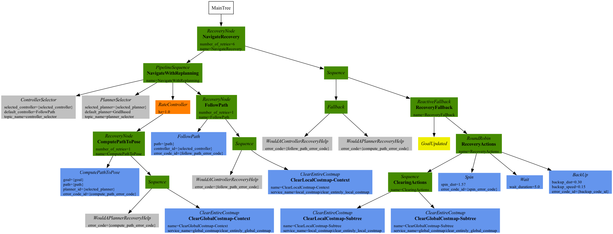

# BT Navigator

The BT Navigator (Behavior Tree Navigator) module implements the [NavigateToPose task interface](../nav2_behavior_tree/include/nav2_behavior_tree/navigate_to_pose_task.hpp). It is a [Behavior Tree](https://github.com/BehaviorTree/BehaviorTree.CPP/blob/master/docs/BT_basics.md)-based implementation of navigation that is intended to allow for flexibility in the navigation task and provide a way to easily specify complex robot behaviors, including [recovery](#recovery).

## Overview

The BT Navigator receives a goal pose and navigates the robot to the specified destination. To do so, the module reads an XML description of the Behavior Tree from a file, as specified by a Node parameter, and passes that to a generic [BehaviorTreeEngine class](../nav2_behavior_tree/include/nav2_behavior_tree/behavior_tree_engine.hpp) which uses the [Behavior-Tree.CPP library](https://github.com/BehaviorTree/BehaviorTree.CPP) to dynamically create and execute the BT.

## Specifying an input XML file

The BtNavigator node has a parameter, *bt_xml_filename*, that can be specified using a ROS2 parameters YAML file, like this:

```
BtNavigator:
  ros__parameters:
    bt_xml_filename: <path-to-xml-file>
```

Using the XML filename as a parameter makes it easy to change or extend the logic used for navigation. Once can simply update the XML description for the BT and the BtNavigator task server will use the new description.

## Behavior Tree nodes

A Behavior Tree consists of control flow nodes, such as fallback, sequence, parallel, and decorator, as well as two execution nodes: condition and action nodes. Execution nodes are the leaf nodes of the tree. When a leaf node is ticked, the node does some work and it returns either SUCCESS, FAILURE or RUNNING.  The current Navigation2 software implements a few custom nodes, including Conditions and Actions. The user can also define and register additional node types that can then be used in BTs and the corresponding XML descriptions.

## Navigation Behavior Trees

The BT Navigator package has two sample XML-based descriptions of BTs.  These trees are [navigate_w_replanning.xml](behavior_trees/navigate_w_replanning.xml) and [navigate_w_replanning_and_recovery.xml](behavior_trees/navigate_w_replanning_and_recovery.xml).  The user may use any of these sample trees or develop a more complex tree which could better suit the user's needs.

### Navigate with Replanning

[navigate_w_replanning.xml](behavior_trees/navigate_w_replanning.xml) implements basic navigation by continuously computing and updating the path at a rate of 1Hz. The default local planner, the nav2_dwb_controller, implements path following at a rate of 10Hz.

```XML
<root main_tree_to_execute="MainTree">
  <BehaviorTree ID="MainTree">
    <Sequence name="root">
      <RateController hz="1.0">
        <Fallback>
          <GoalReached/>
          <ComputePathToPose goal="${goal}"/>
        </Fallback>
      </RateController>
      <FollowPath path="${path}"/>
    </Sequence>
  </BehaviorTree>
</root>
```

Navigate with replanning is composed of the following custom decorator, condition and action nodes:

#### Decorator Nodes
* RateController: A custom control flow node, which throttles down the tick rate.  This custom node has only one child and its tick rate is defined with a pre-defined frequency that the user can set.  This node returns RUNNING when it is not ticking its child. Currently, in the navigation, the `RateController` is used to tick the  `ComputePathToPose` and `GoalReached` node at 1 Hz.

#### Condition Nodes
* GoalReached: Checks the distance to the goal, if the distance to goal is less than the pre-defined threshold, the tree returns SUCCESS, which in that case the `ComputePathToPose` action node will not get ticked. 

#### Action Nodes
* ComputePathToPose: When this node is ticked, the goal will be placed on the blackboard which will be shared to the Behavior tree.  The bt action node would then utilizes the action server to send a request to the global planner to recompute the global path.  Once the global path is recomputed, the result will be sent back via action server and then the updated path will be placed on the blackboard.


The graphical version of this Behavior Tree:


<br/>

The navigate with replanning BT first ticks the `RateController` node which specifies how frequently the `GoalReached` and `ComputePathToPose` should be invoked. Then the `GoalReached` nodes check the distance to the goal to determine if the `ComputePathToPose` should be ticked or not. The `ComputePathToPose` gets the incoming goal pose from the blackboard, computes the path and puts the result back on the blackboard, where `FollowPath` picks it up. Each time a new path is computed, the blackboard gets updated and then `FollowPath` picks up the new goal.

### Recovery Node
In this section, the recovery node is being introduced to the navigation package.

Recovery node is a control flow type node with two children.  It returns success if and only if the first child returns success. The second child will be executed only if the first child returns failure.  The second child is responsible for recovery actions such as re-initializing system or other recovery behaviors. If the recovery behaviors are succeeded, then the first child will be executed again.  The user can specify how many times the recovery actions should be taken before returning failure. The figure below depicts a simple recovery node.


<br/>

### Navigate with replanning and simple recovery actions

With the recovery node, simple recoverable navigation with replanning can be implemented by utilizing the [navigate_w_replanning.xml](behavior_trees/navigate_w_replanning.xml) and a sequence of recovery actions. Our custom behavior actions for recovery are:  `clearEntirelyCostmapServiceRequest` for both global and local costmaps and `spin`. A graphical version of this simple recoverable Behavior Tree is depicted in the figure below. 


<br/>


This tree is currently our default tree in the stack and the xml file is located here: [navigate_w_replanning_and_recovery.xml](behavior_trees/navigate_w_replanning_and_recovery.xml).

## Future Work
Scope-based failure handling: Utilizing Behavior Trees with a recovery node allows one to handle failures at multiple scopes. With this capability, any action in a large system can be constructed with specific recovery actions suitable for that action. Thus, failures in these actions can be handled locally within the scope. With such design, a system can be recovered at multiple levels based on the nature of the failure. Higher level recovery actions could be recovery actions such as re-initializing the system, re-calibrating the robot, bringing the system to a good known state, etc.  Currently, in the navigation stack, multi-scope recovery actions are not implemented. The figure below highlights a simple multi-scope recovery handling for the navigation task.


<br/>

## Open Issues

* **Schema definition and XML document validation** - Currently, there is no dynamic validation of incoming XML. The Behavior-Tree.CPP library is using tinyxml2, which doesn't have a validator. Instead, we can create a schema for the Mission Planning-level XML and use build-time validation of the XML input to ensure that it is well-formed and valid.
