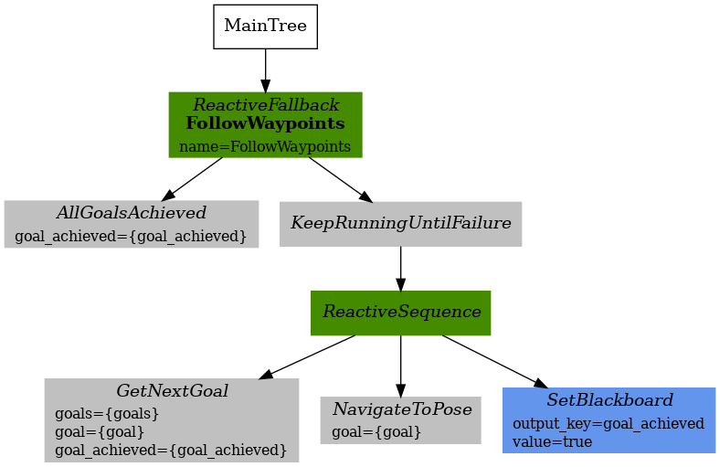
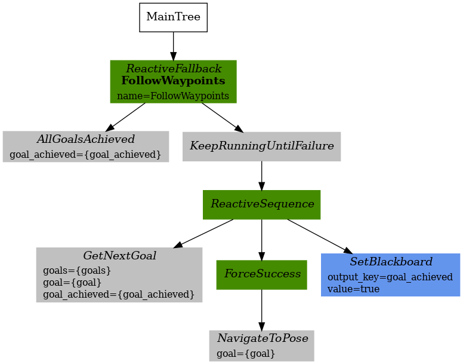
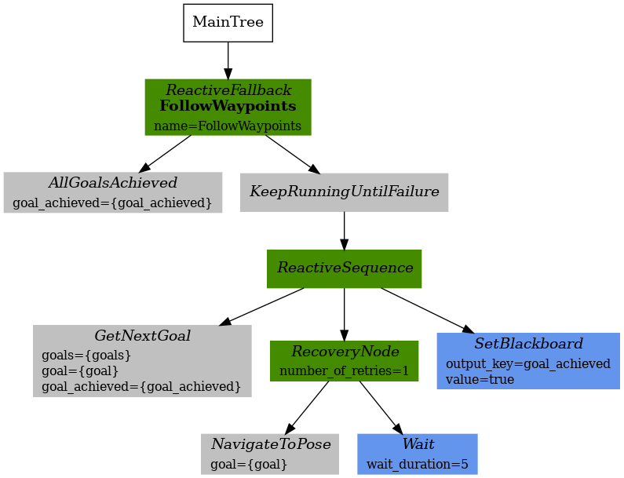
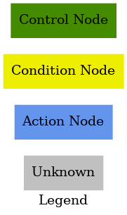

# Nav2 BT Waypoint Follower

The Nav2 BT(Behavior Tree) Waypoint Follower module implements the [FollowWaypoints action](../nav2_msgs/action/FollowWaypoints.action). It is a [Behavior Tree](https://github.com/BehaviorTree/BehaviorTree.CPP/blob/master/docs/BT_basics.md)-based implementation of waypoint following that is intended to allow for flexibility in the navigation task and provide a way to easily specify complex robot behaviors.

## Overview

The BT Waypoint Follower receives goal poses and navigates the robot to the specified destination. To do so, the module reads an XML description of the Behavior Tree from a file, as specified by a Node parameter, and passes that to a generic [BehaviorTreeEngine class](../nav2_behavior_tree/include/nav2_behavior_tree/behavior_tree_engine.hpp) which uses the [Behavior-Tree.CPP library](https://github.com/BehaviorTree/BehaviorTree.CPP) to dynamically create and execute the BT.

## Specifying an input XML file

The BT Waypoint Follower node has a parameter, *bt_xml_filename*, that can be specified using a ROS2 parameters YAML file, like this:

```
bt_waypoint_follower:
  ros__parameters:
    bt_xml_filename: <path-to-xml-file>
```

Using the XML filename as a parameter makes it easy to change or extend the logic used for navigation. Once can simply update the XML description for the BT and the BT Waypoint follower task server will use the new description.

## Behavior Tree nodes

A Behavior Tree consists of control flow nodes, such as fallback, sequence, parallel, and decorator, as well as two execution nodes: condition and action nodes. Execution nodes are the leaf nodes of the tree. When a leaf node is ticked, the node does some work and it returns either SUCCESS, FAILURE or RUNNING.  The current Navigation2 software implements a few custom nodes, including Conditions and Actions. The user can also define and register additional node types that can then be used in BTs and the corresponding XML descriptions.

## FollowWaypoints Behavior Trees

The BT Waypoint Follower package has three sample XML-based descriptions of BTs.  
These trees are [follow_waypoints.xml](behavior_trees/follow_waypoints.xml), [follow_waypoints_with_skip.xml](behavior_trees/follow_waypoints_with_skip.xml) and [follow_waypoints_with_wait.xml](behavior_trees/follow_waypoints_with_wait.xml).  
The user may use any of these sample trees or develop a more complex tree which could better suit the user's needs.

### FollowWaypoints

This BT fails if NavigateToPose fails.



### FollowWaypoints with skipping

It will go to the next waypoint if NavigateToPose fails.



### FollowWaypoints with simple recovery action

With the recovery node, simple recoverable navigation with replanning can be implemented by utilizing the [follow_waypoints_with_wait.xml](behavior_trees/follow_waypoints_with_wait.xml) and a recovery action `wait`. A graphical version of this simple recoverable Behavior Tree is depicted in the figure below.

<p align="center">

</p>
<br/>

#### FollowWaypoints is composed of the following custom condition, control and action nodes:

#### Control Nodes
* Recovery: This is a control flow type node with two children.  It returns success if and only if the first child returns success. The second child will be executed only if the first child returns failure.  The second child is responsible for recovery actions such as re-initializing system or other recovery behaviors. If the recovery behaviors are succeeded, then the first child will be executed again.  The user can specify how many times the recovery actions should be taken before returning failure. The figure below depicts a simple recovery node.

<p align="center">

</p>
<br/>

#### Condition Nodes
* AllGoalsAchieved: If the last goal has been achieved, it return SUCCESS.

#### Action Nodes
* GetNextGoal: If the current goal has been achieved, set the next goal.

## Legend
Legend for the behavior tree diagrams:


