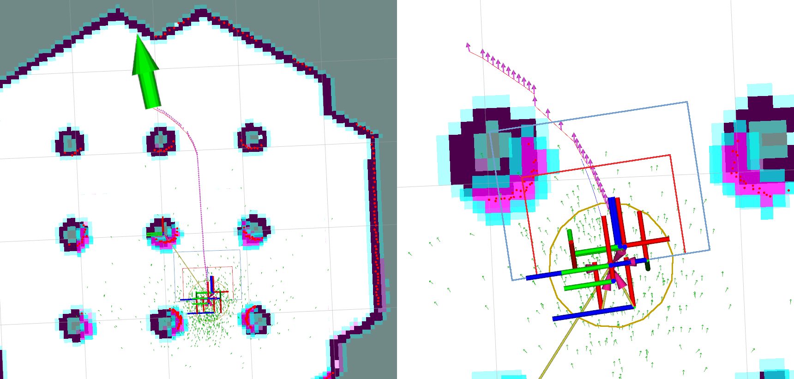
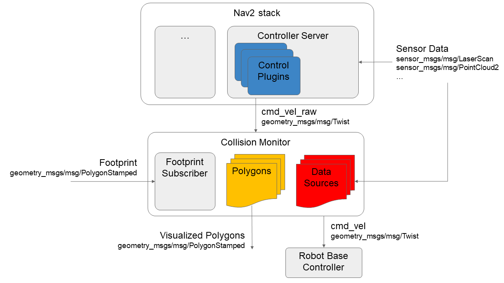

# Nav2 Collision Monitor

The Collision Monitor is a node providing an additional level of robot safety.
It performs several collision avoidance related tasks using incoming data from the sensors, bypassing the costmap and trajectory planners, to monitor for and prevent potential collisions at the emergency-stop level.

This is analogous to safety sensor and hardware features; take in laser scans from a real-time certified safety scanner, detect if there is to be an imminent collision in a configurable bounding box, and either emergency-stop the certified robot controller or slow the robot to avoid such collision.
However, this node is done at the CPU level with any form of sensor.
As such, this does not provide hard real-time safety certifications, but uses the same types of techniques with the same types of data for users that do not have safety-rated laser sensors, safety-rated controllers, or wish to use any type of data input (e.g. pointclouds from depth or stereo or range sensors).

This is a useful and integral part of large heavy industrial robots, or robots moving with high velocities, around people or other dynamic agents (e.g. other robots) as a safety mechanism for high-response emergency stopping.
The costmaps / trajectory planners will handle most situations, but this is to handle obstacles that virtually appear out of no where (from the robot's perspective) or approach the robot at such high speed it needs to immediately stop to prevent collision.

## Features

The Collision Monitor uses polygons relative the robot's base frame origin to define "zones".
Data that fall into these zones trigger an operation depending on the model being used.
A given instance of the Collision Monitor can have many zones with different models at the same time.
When multiple zones trigger at once, the most aggressive one is used (e.g. stop > slow 50% > slow 10%).

The following models of safety behaviors are employed by Collision Monitor:

* **Stop model**: Define a zone and a point threshold. If more that `N` obstacle points appear inside this area, stop the robot until the obstacles will disappear.
* **Slowdown model**: Define a zone around the robot and slow the maximum speed for a `%S` percent, if more than `N` points will appear inside the area.
* **Approach model**: Using the current robot speed, estimate the time to collision to sensor data. If the time is less than `M` seconds (0.5, 2, 5, etc...), the robot will slow such that it is now at least `M` seconds to collision. The effect here would be to keep the robot always `M` seconds from any collision.

The zones around the robot can take the following shapes:

* Arbitrary user-defined polygon relative to the robot base frame.
* Circle: is made for the best performance and could be used in the cases where the zone or robot could be approximated by round shape.
* Robot footprint polygon, which is used in the approach behavior model only. Will use the footprint topic to allow it to be dynamically adjusted over time.

The data may be obtained from different data sources:

* Laser scanners (`sensor_msgs::msg::LaserScan` messages)
* PointClouds (`sensor_msgs::msg::PointCloud2` messages)
* IR/Sonars (`sensor_msgs::msg::Range` messages)

## Design

The Collision Monitor is designed to operate below Nav2 as an independent safety node.
This acts as a filter on the `cmd_vel` topic coming out of the Controller Server. If no such zone is triggered, then the Controller's `cmd_vel` is used. Else, it is scaled or set to stop as appropriate.

The following diagram is showing the high-level design of Collision Monitor module. All shapes (Polygons and Circles) are derived from base `Polygon` class, so without loss of generality we can call them as polygons. Subscribed footprint is also having the same properties as other polygons, but it is being obtained a footprint topic for the Approach Model.

## Configuration

Detailed configuration parameters, their description and how to setup a Collision Monitor could be found at its [Configuration Guide](https://navigation.ros.org/configuration/packages/configuring-collision-monitor.html) and [Using Collision Monitor tutorial](https://navigation.ros.org/tutorials/docs/using_collision_monitor.html) pages.

## Metrics

Designed to be used in wide variety of robots (incl. moving fast) and have a high level of reliability, Collision Monitor node should operate at fast rates.
Typical one frame processing time is ~4-5ms for laser scanner (with 360 points) and ~4-20ms for PointClouds (having 24K points).
The table below represents the details of operating times for different behavior models and shapes:

| | Stop/Slowdown model, Polygon area | Stop/Slowdown model, Circle area | Approach model, Polygon footprint | Approach model, Circle footprint |
|-|-----------------------------------|----------------------------------|-----------------------------------|----------------------------------|
| LaserScan (360 points) processing time, ms  | 4.45 | 4.45 | 4.93  | 4.86  |
| PointCloud (24K points) processing time, ms | 4.94 | 4.06 | 20.67 | 10.87 |

The following notes could be made:

 * Due to sheer speed, circle shapes are preferred for the approach behavior models if you can approximately model your robot as circular.
 * More points mean lower performance. Pointclouds could be culled or filtered before the Collision Monitor to improve performance.
