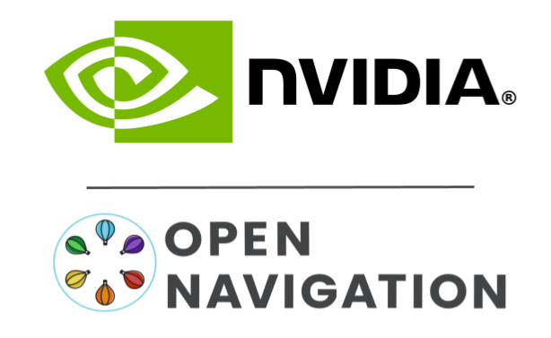

# Open Navigation's Nav2 Docking Framework

This package contains an automatic robot docking framework & auxiliary tools. It uses plugin `dock` implementations for a particular platform to enable the framework to generalize to robots of many different kinematic models, charging methods, sensor modalities, and so on. It can also handle a database of many different docking locations and dock models to handle a heterogeneous environment. This task server is designed be called by an application BT or autonomy application to dock once completed with tasks or battery is low -- _not_ within the navigate-to-pose action itself (though `undock` may be called from inside navigate actions!).

This work is sponsored by [NVIDIA](https://www.nvidia.com/en-us/) and created by [Open Navigation LLC](https://opennav.org).

This is split into 4 packages

- `opennav_docking`: Contains the main docking framework
- `opennav_docking_core`: Contains the dock plugin header file to be implemented for each dock type
- `opennav_docking_bt`: Contains behavior tree nodes and example XML files using the docking task server
- `nova_carter_docking`: Contains an implementation using the Docking system with the Nvidia [Nova Carter](https://robotics.segway.com/nova-carter/) Robot platform and dock.



[](https://youtu.be/J3ygkehttlg)

Click on the image above to see an extended video of docking in action.

## Architecture

The Docking Framework has 5 main components:
- `DockingServer`: The main action server and logic for performing the docking/undocking actions
- `Navigator`: A NavigateToPose action client to navigate the robot to the dock's staging pose if not with the prestaging tolerances 
- `DockDatabase`: A database of dock instances in an environment and their associated interfaces for transacting with each type. An arbitrary number of types are supported.
- `Controller`: A spiral-based graceful controller to use for the vision-control loop for docking
- `ChargingDock`: Plugins that describe the dock and how to transact with it (check if charging, detection, etc). You can find this plugin header in the `opennav_docking_core` package.

The `ChargingDock` plugins are the heart of the customizability of the framework to support any type of charging dock for any kind of robot. The `DockDatabase` is how you describe where these docks exist in your environment to interact with and any of them may be used in your docking request. 

The docking procedure is as follows:
1. Take action request and obtain the dock's plugin and its pose
2. If the robot is not within the prestaging tolerance of the dock's staging pose, navigate to the staging pose
3. Use the dock's plugin to initially detect the dock and return the docking pose
4. Enter a vision-control loop where the robot attempts to reach the docking pose while its actively being refined by the vision system
5. Exit the vision-control loop once contact has been detected or charging has started 
6. Wait until charging starts and return success.

If anywhere this procedure is unsuccessful, `N` retries may be made by driving back to the dock's staging pose and trying again. If still unsuccessful, it will return a failure code to indicate what kind of failure occurred to the client.

Undocking works more simply:
1. If previously docked, use the known dock information to get the dock type. If not, use the undock action request's indicated dock type
2. Find the staging pose for this dock and back out to that pose
3. Check if successfully backed out to the pose and charging has stopped

## Interfaces 

### Docking Action

The docking action can either operate on a dock in the `DockDatabase` or from a dock specified in the docking request. This second option is useful for testing or when dock's locales are not necessarily known in advance. 
If `use_dock_id = true`, it uses the `dock_id` field to specify which dock in the database to use.
Else, you must populate the `dock_pose` and `dock_type` fields.

If you wish for the docking server to stage your robot at the the dock's staging pose for you, `navigate_to_staging_pose` must be true.
Else, you can send your robot to this pose and it will be skipped as long as the robot is within the prestaging tolerances. 
You may set the maximum time for navigation using `max_staging_time`.

In return, you obtain the `num_retries`, for the number of attempted retries of the action; `success`, if the action worked and the robot is successfully charging; and `error_code` to return a semantically meaningful error code about what kind of error occurred, if any. See `DockRobot.action` for more details. 

While the action is performing, you can obtain feedback about the current `state` of docking, how much time `docking_time` has elapsed, and the current number of retries attempted.

### Undocking Action

Undocking is similarly laid out. The action request contains the `dock_type` which is optional if the docking server previously docked the robot at its current dock. Else, it is required so that the undocking action can obtain the staging pose to back out to **if** there are multiple dock plugins specified (else, will use the default).
There is also a maximum undocking time as a timeout for failures to uncouple itself from the dock, `max_undocking_time`.

The result similarly contains `success` and semantic `error_code` with no feedback.

### Reload Database Service

This service exists to potentially reload the dock server's known dock database with a new file of docks after it is loaded. Simply provide the `filepath` to your new set of docks and it shall be done!

## Dock Specification

There are two unique elements to consider in specifying docks: dock _instances_ and dock _plugins_. Dock instances are instances of a particular dock in the map, as the database may contain many known docks (and you can specify which by name you'd like to dock at). Dock plugins are the model of dock that each is an instance of. The plugins contain the capabilities to generically detect and connect to a particular dock model. This separation allows us to efficiently enable many individual docking locations of potentially several different revisions with different attributes.

The **dock plugins** are specified in the parameter file as shown below. If you're familiar with plugins in other Nav2 servers, this should look like a familiar design pattern. Note that there is no specific information about the dock's pose or instances. These are generic attributes about the dock revision (such as staging pose, enable charging command, detection method, etc). You can add additional parameters in the dock's namespace as you choose (for example `timeout`).

```
dock_plugins: ["dockv1", "dockv3"]
dockv1:
  plugin: "my_custom_dock_ns::Dockv1"
dockv3:
  plugin: "my_custom_dock_ns::Dockv3"
  timeout: 10.0
```

There are two ways to populate the database of **dock instances** in your environment: through the parameter file or an external file. If you'd like to embed your dock information in your Docking Server config file (if you only have a couple of docks), you may use a similar method as defining the dock plugins, specifying the docks in the ``docks`` parameter. Note that we specify the plugin type and the dock's location `[x, y, theta]` in a particular frame.

```
docks: ['dock1', 'dock2']
dock1:
  type: "dockv3"
  frame: map
  pose: [0.3, 0.3, 0.0]
  id: "kitchen_dock"
dock2:
  type: "dockv1"
  frame: map
  pose: [0.0, 0.0, 0.4]
  id: "42"
```

If you'd prefer to specify the docks using an external file, you may use the `dock_database` parameter to specify the filepath to the yaml file. The file should be laid out like:

```
docks:
  dock1:
    type: "dockv3"
    frame: map
    pose: [0.3, 0.3, 0.0]
    id: "kitchen_dock"
  dock2:
    type: "dockv1"
    frame: map
    pose: [0.0, 0.0, 0.4]
    id: "42"
```

Note that you may leave the `type` to an empty string **if** there is only one type of dock being used. The `frame` will also default to `map` if not otherwise specified. The `type` and `pose` fields are required. Note also that these can be in any frame, not just map (i.e. `odom`, `base_link`, etc) in both the database and action requests. You may also specify the `id` field, for example to select the associated AprilTag. If the dock plugin does not use it, you can leave it unspecified.

## Dock Plugin API

The dock plugin has several key functions to implement. First, there are two
functions related to poses:

 * `getStagingPose`: This function should transform the dock pose into a
   pose for staging into the docking maneuver. Nav2 will be used to move the robot to the staging pose if not already within prestaging tolerances.
 * `getRefinedPose`: This function can be used refine the dock pose using sensors.
   Depending on how the robot can detect the dock, this might use laser scan data
   or camera data.

There are two functions used during dock approach:

 * `isDocked`: As the robot approaches the dock, this function should tell us when
   to stop driving forward. There are many ways this function could be implemented
   depending on the robot hardware:
   * If a charge dock communicates before charging starts, this should be done here.
     If the charge dock needs an "enable" message to be sent, this is a good place to send it.
   * If the charge dock doesn't use any sort of communications, you might still be
     able to detect contact with the dock by looking at the motor effort/current,
     or determining that velocity has dropped to zero.
   * In the absolute simplest case, `isDocked` might just call `isCharging` if there
     is no other feedback to know when we are docked.
 * `isCharging`: The approach stops when the robot reports `isDocked`, then we wait
   for charging to start by calling `isCharging`.
   * This may be implemented using the `sensor_msgs/BatteryState` message to check the power status or for charging current.

Similarly, there are two functions used during undocking:

 * `disableCharging`: This function is called before undocking commences to help
   prevent wear on the charge contacts. If the charge dock supports turning off
   the charge current, it should be done here.
 * `hasStoppedCharging`: This function is called while the controller is undocking.
   Undocking is successful when charging has stopped and the robot has returned to
   the staging pose.

Keep in mind that the docking and undocking functions should return quickly as they
will be called inside the control loop. Also make sure that `isDocked` should
return true if `isCharging` returns true.

### Simple Charging Dock Plugin

The `SimpleChargingDock` plugin is an example with many common options which may be fully functional for
some robots.

`getStagingPose` applys a parameterized translational and rotational offset to the dock pose to obtain the staging pose.

`getRefinedPose` can be used in two ways. 
1. A blind approach where the returned dock pose will simply be equal to whatever was passed in from the dock database. This may work with a reduced success rate on a real robot (due to global localization error), but is useful for initial testing and simulation.
2. The more realistic use case is to use an AR marker, dock pose detection algorithm, etc. The plugin will subscribe to a `geometry_msgs/PoseStamped` topic `detected_dock_pose`. This can be used with the `image_proc/TrackMarkerNode` for Apriltags or other custom detectors for your dock. It is unlikely the detected pose is actually the pose you want to dock with, so several parameters are supplied to represent your docked pose relative to the detected feature's pose.

During the docking approach, there are two options for detecting `isDocked`:
1. We can check the joint states of the wheels if the current has spiked above a set threshold to indicate that the robot has made contact with the dock or other physical object.
2. The dock pose is compared with the robot pose and `isDocked` returns true when the distance drops below the specified `docking_threshold`.

The `isCharging` and `hasStoppedCharging` functions have two options:
1. Subscribing to a `sensor_msgs/BatteryState` message on topic `battery_state`. The robot is considered charging when the `current` field of the message exceeds the `charging_threshold`.
2. We can return that we are charging is `isDocked() = true`, which is useful for initial testing or low-reliability docking until battery state or similar information is available.

For debugging purposes, there are several publishers which can be used with RVIZ:

| Topic                        | Description                                             | Type   |
|------------------------------|---------------------------------------------------------|--------|
| dock_pose         | The current transformed dock pose         | `geometry_msgs/PoseStamped` |
| filtered_dock_pose         | The current un-transformed dock pose         | `geometry_msgs/PoseStamped` |
| staging_pose         | The staging pose for the dock          | `geometry_msgs/PoseStamped` |

## Configuration

| Parameter                    | Description                                             | Type   | Default   |
|------------------------------|---------------------------------------------------------|--------|-----------|
| controller_frequency         | Control frequency (Hz) for vision-control loop          | double | 50.0      |
| initial_perception_timeout   | Timeout (s) to wait to obtain intial perception of the dock | double | 5.0   |
| wait_charge_timeout          | Timeout (s) to wait to see if charging starts after docking  | double | 5.0  |
| dock_approach_timeout        | timeout (s) to attempt vision-control approach loop    | double |  30.0      |
| undock_linear_tolerance      | Tolerance (m) to exit the undocking control loop at staging pose    | double |  0.05      |
| undock_angular_tolerance     | Angular Tolerance (rad) to exist undocking loop at staging pose    | double |  0.05      |
| max_retries        | Maximum number of retries to attempt    | int |  3      |
| base_frame        | Robot's base frame for control law   | string |  "base_link"      |
| fixed_frame        | Fixed frame to use, recommended to be a smooth odometry frame **not** map   | string |  "odom"      |
| dock_backwards        | Whether the robot is docking with the dock forward or backward in motion | bool |  false      |
| dock_prestaging_tolerance  |  L2 distance in X,Y,Theta from the staging pose to bypass navigation | double |  0.5      |
| dock_plugins  | A set of dock plugins to load | vector<string> |  N/A      |
| dock_database  |  The filepath to the dock database to use for this environment | string |  N/A  |
| docks  |  Instead of `dock_database`, the set of docks specified in the params file itself | vector<string> | N/A     |
| navigator_bt_xml  | BT XML to use for Navigator, if non-default | string | ""     |
| controller.k_phi  | TODO | double | 3.0  |
| controller.k_delta  |  TODO | double | 2.0     |
| controller.beta  |  TODO | double | 0.4  |
| controller.lambda  |  TODO | double | 2.0     |
| controller.v_linear_min  |  TODO | double | 0.1     |
| controller.v_linear_max |  TODO | double | 0.25    |
| controller.v_angular_max |  TODO | double | 0.75    |
| controller.slowdown_radius |  TODO | double | 0.25     |

Note: `dock_plugins` and either `docks` or `dock_database` are required.


| SimpleChargingDock Parameter | Description                                             | Type   | Default   |
|------------------------------|---------------------------------------------------------|--------|-----------|
| use_battery_status         | Whether to use the battery state message or `isDocked()` for `isCharging()` | bool | true      |
| use_external_detection_pose   | Whether to use external detection topic for dock or use the databases' pose | bool | false  |
| external_detection_timeout          | Timeout at which if the newest detection update does not meet to fail  | double | 1.0  |
| external_detection_translation_x        | X offset from detected pose for docking pose (m)    | double |  -0.20      |
| external_detection_translation_y        | Y offset from detected pose for docking pose (m)    | double |  0.0      |
| external_detection_rotation_yaw        | Yaw offset from detected pose for docking pose (rad)    | double |  0.0      |
| external_detection_rotation_pitch        | Pitch offset from detected pose for docking pose (rad)    | double |  1.57      |
| external_detection_rotation_roll        | Roll offset from detected pose for docking pose (rad)    | double |  -1.57      |
| filter_coef        | Dock external detection method filtering algorithm coefficient   | double |  0.1      |
| charging_threshold        | Threshold of current in battery state above which `isCharging() = true`    | double |  0.5      |
| use_stall_detection        | Whether or not to use stall detection for `isDocked()` or positional threshold    | bool |  false      |
| stall_joint_names        | Names in `joint_states` topic of joints to track   | vector<string> | N/A      |
| stall_velocity_threshold        | The joint velocity below which to trigger `isDocked() = true`    | double |  1.0      |
| stall_effort_threshold        | Current or motor effort in joint state to trigger `isDocked() = true`    | double |  1.0      |
| docking_threshold        | If not using stall detection, the pose threshold to the docking pose where `isDocked() = true`    | double |  0.05     |
| staging_x_offset        | Staging pose offset forward (negative) of dock pose (m)    | double |  -0.7    |
| staging_yaw_offset        | Staging pose angle relative to dock pose (rad)    | double |  0.0    |

Note: The external detection rotation angles are setup to work out of the box with Apriltags detectors in `image_proc` and `isaac_ros`.

## Etc

### On Staging Poses

Staging poses are where the robot should navigate to in order to start the docking procedure. This pose should be close enough to the dock to accurately detect the dock's presence, but far enough that if its moved slightly or the robot's localization isn't perfect it can still be detected and have enough room to adjust. The robot's charging contacts or charging location should be pointed towards the dock in this staging pose. That way, a feasible global planner can be used to model your robot's real constraints while getting to the docking pose (non-circular, non-holonomic), rather than complicating the docking process itself.

