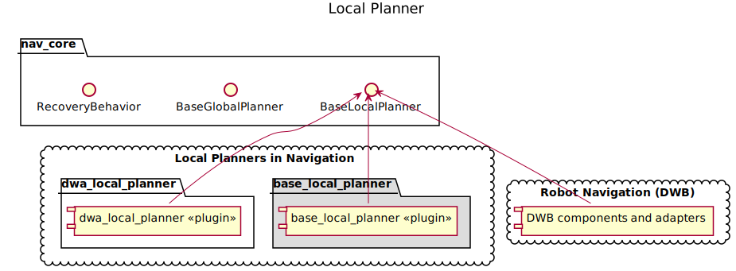
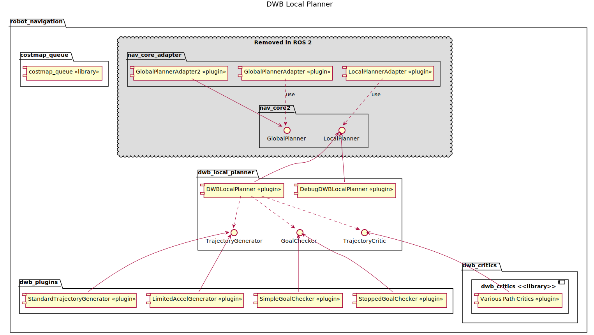

# Local Planner

## Local Planner under ROS 1

Under ROS 1, the navigation stack provides a `BaseLocalPlanner` interface
used by `MoveBase`. The `BaseLocalPlanner` component is expected to take a path and current position and produce a command velocity. The most commonly used implementation of the local planner uses the DWA algorithm, however, the Trajectory Rollout algorithm is also available in the ROS 1 navigation stack.

The navigation repository provides two implementations of the DWA algorithm: `base_local_planner` and `dwa_local_planner`. In addition, there is another DWA based planner in the [Robot Navigation repository](https://github.com/locusrobotics/robot_navigation) called DWB. The `dwa_local_planner` was meant to replace `base_local_planner` and provides a better DWA algorithm, but failed to
provide the Trajectory Rollout algorithm, so was unable to completely replace
`base_local_planner`.

DWB was meant to replace both the planners in the navigation repository and provides
an implementation of both DWA and Trajectory Rollout.

## Migrating to ROS 2

Rather than continue with 3 overlapping implementations of DWA, the DWB planner
was chosen to use as the default controller plugin.

The advantages of DWB were:
* it was designed with backwards compatibility with the other controllers
* it was designed with clear extension points and modularity

## Changes to DWB

For the most part, the DWB codebase is unchanged, other than what was required for ROS2 and the `nav2_core` interface for Controllers.

## New local planner interface

See `nav2_core` `Controller` interface, which defines an interface for the controller plugins. These plugins are loaded into the `nav2_controller_server` to compute control commands from requests to the ROS2 action server.

## DWB Plugins

DWB is highly configurable through the use of plugins. There are three types of
plugins used. For each of them, a few implementations are available but you can
create custom ones if you need to.

### Trajectory Generator Plugins

These plugins generate the set of possible trajectories that should be evaluated
by the critics. The trajectory with the best score determines the output command
velocity.

There are two trajectory generators provided with Navigation 2. Only one can be
loaded at a time.

* **StandardTrajectoryGenerator** - This is similar to the trajectory rollout
  algorithm used in base_local_planner in ROS 1.
* **LimitedAccelGenerator** - This is similar to DWA used in ROS 1.

### Goal Checker Plugins

These plugins check whether we have reached the goal or not. Again, only one can
be loaded at a time.

* **SimpleGoalChecker** - This checks whether the robot has reached the goal pose
* **StoppedGoalChecker** - This checks whether the robot has reached the goal pose
  and come to a stop.

### Critic Plugins

These plugins score the trajectories generated by the trajectory generator.
Multiple plugins can be loaded and the sum of their scores determines the chosen
command velocity.

* **BaseObstacle** - Scores a trajectory based on where the path passes over the
  costmap. To use this properly, you must use the inflation layer in costmap to
  expand obstacles by the robot's radius.
* **ObstacleFootprint** - Scores a trajectory based on verifying all points along
  the robot's footprint don't touch an obstacle marked in the costmap.
* **GoalAlign** - Scores a trajectory based on how well aligned the trajectory is
  with the goal pose.
* **GoalDist** - Scores a trajectory based on how close the trajectory gets the robot
  to the goal pose.
* **PathAlign** - Scores a trajectory based on how well it is aligned to the path
  provided by the global planner.
* **PathDist** - Scores a trajectory based on how far it ends up from the path
  provided by the global planner.
* **PreferForward** - Scores trajectories that move the robot forwards more highly
* **RotateToGoal** - Only allows the robot to rotate to the goal orientation when it
  is sufficiently close to the goal location
* **Oscillation** - Prevents the robot from just moving backwards and forwards.
* **Twirling** - Prevents holonomic robots from spinning as they make their way to
  the goal.
