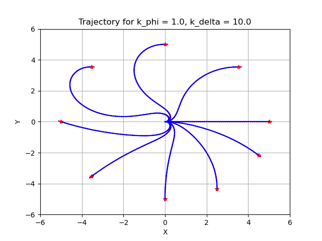

# Graceful Motion Controller
The graceful motion controller implements a controller based on the works of Jong Jin Park in "Graceful Navigation for Mobile Robots in Dynamic and Uncertain Environments". (2016). In this implementation, a `motion_target` is set at a distance away from the robot that is exponentially stable to generate a smooth trajectory for the robot to follow.

See its [Configuration Guide Page](https://navigation.ros.org/configuration/packages/configuring-graceful-motion-controller.html) for additional parameter descriptions.

## Smooth control law
The smooth control law is a pose-following kinematic control law that generates a smooth and confortable trajectory for the robot to follow. It is Lyapunov-based feedback control law made of three components:
* The egocentric polar coordinates of the motion target (r, phi, delta) with respect to the robot frame.
* A slow subsystem which describes the position of the robot.
* A fast subsystem which describes the steering angle of the robot.

## Parameters

| Parameter | Description | 
|-----|----|
| `transform_tolerance` | The TF transform tolerance. | 
| `motion_target_dist` | The lookahead distance to use to find the motion_target point. This distance should be a value around 1.0m but not much farther away. Greater values will cause the robot to generate smoother paths but not necessarily follow the path as closely. |
| `max_robot_pose_search_dist` | Maximum integrated distance along the path to bound the search for the closest pose to the robot. This is set by default to the maximum costmap extent, so it shouldn't be set manually unless there are loops within the local costmap. | 
| `k_phi` | Ratio of the rate of change in phi to the rate of change in r. Controls the convergence of the slow subsystem. If this value is equal to zero, the controller will behave as a pure waypoint follower. A high value offers extreme scenario of pose-following where theta is reduced much faster than r. **Note**: This variable is called k1 in earlier versions of the paper. | 
| `k_delta` | Constant factor applied to the heading error feedback. Controls the convergence of the fast subsystem. The bigger the value, the robot converge faster to the reference heading. **Note**: This variable is called k2 in earlier versions of the paper. | 
| `beta` | Constant factor applied to the path curvature. This value must be positive. Determines how fast the velocity drops when the curvature increases. | 
| `lambda` | Constant factor applied to the path curvature. This value must be greater or equal to 1. Determines the sharpness of the curve: higher lambda implies sharper curves. | 
| `v_linear_min` | Minimum linear velocity. Units: meters/sec. | 
| `v_linear_max` | Maximum linear velocity. Units: meters/sec. | 
| `v_angular_max` | Maximum angular velocity produced by the control law. Units: radians/sec. | 
| `slowdown_radius` | Radius around the goal pose in which the robot will start to slow down. Units: meters. | 
| `initial_rotation` | Enable a rotation in place to the goal before starting the path. The control law may generate large sweeping arcs to the goal pose, depending on the initial robot orientation and k_phi, k_delta. | 
| `initial_rotation_min_angle` | The difference in the path orientation and the starting robot orientation to trigger a rotate in place, if `initial_rotation` is enabled. | 
| `final_rotation` | Similar to `initial_rotation`, the control law can generate large arcs when the goal orientation is not aligned with the path. If this is enabled, the final pose will be ignored and the robot will follow the orientation of he path and will make a final rotation in place to the goal orientation. | 
| `rotation_scaling_factor` | The scaling factor applied to the rotation in place velocity. | 
| `allow_backward` | Whether to allow the robot to move backward. |

## Topics

| Topic  | Type | Description | 
|-----|----|----|
| `transformed_global_plan`  | `nav_msgs/Path` | The global plan transformed into the robot frame. | 
| `local_plan`  | `nav_msgs/Path` | The local plan generated by appliyng iteratively the control law upon a set of motion targets along the global plan. | 
| `motion_target`  | `geometry_msgs/PointStamped` | The current motion target used by the controller to compute the velocity commands. | 
| `slowdown`  | `visualization_msgs/Marker` | A flat circle marker of radius slowdown_radius around the motion target. | 
