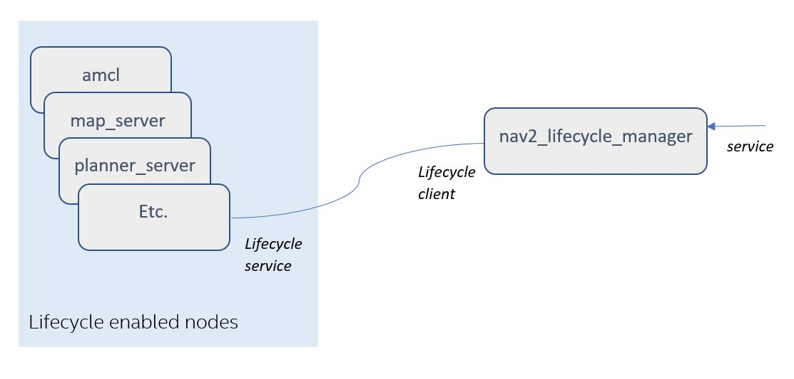

### Background on lifecycle enabled nodes
Using ROS2’s managed/lifecycle nodes feature allows the system startup to ensure that all required nodes have been instantiated correctly before they begin their execution. Using lifecycle nodes also allows nodes to be restarted or replaced on-line. More details about managed nodes can be found on [ROS2 Design website](https://design.ros2.org/articles/node_lifecycle.html). Several nodes in the navigation2 stack, such as map_server, planner_server, and controller_server, are lifecycle enabled. These nodes provide the required overrides of the lifecycle functions: ```on_configure()```, ```on_activate()```, ```on_deactivate()```, ```on_cleanup()```, ```on_shutdown()```, and ```on_error()```.


### nav2_lifecycle_manager
Navigation2’s lifecycle manager is used to change the states of the lifecycle nodes in order to achieve a controlled _startup_, _shutdown_, _reset_, _pause_, or _resume_ of the navigation stack. The lifecycle manager presents a ```lifecycle_manager/manage_nodes``` service, from which clients can invoke the startup, shutdown, reset, pause, or resume functions. Based on this service request, the lifecycle manager calls the necessary lifecycle services in the lifecycle managed nodes. Currently, the RVIZ panel uses this ```lifecycle_manager/manage_nodes``` service when user presses the buttons on the RVIZ panel (e.g.,startup, reset, shutdown, etc.).

In order to start the navigation stack and be able to navigate, the necessary nodes must be configured and activated. Thus, for example when _startup_ is requested from the lifecycle manager's manage_nodes service, the lifecycle managers calls _configure()_ and _activate()_ on the lifecycle enabled nodes in the node list.

The lifecycle manager has a default nodes list for all the nodes that it manages. This list can be changed using the lifecycle manager’s _“node_names”_ parameter.

The diagram below shows an _example_ of a list of managed nodes, and how it interfaces with the lifecycle manager.


The UML diagram below shows the sequence of service calls once the _startup_ is requested from the lifecycle manager.

