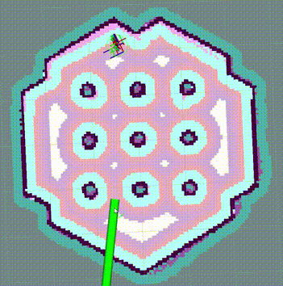

# Model Predictive Path Integral Controller



## Overview

This is a predictive controller (local trajectory planner) that implements the [Model Predictive Path Integral (MPPI)](https://ieeexplore.ieee.org/document/7487277) algorithm to track a path with adaptive collision avoidance. It contains plugin-based critic functions to impact the behavior of the algorithm. It was created by [Aleksei Budyakov](https://www.linkedin.com/in/aleksei-budyakov-334889224/) and adapted & developed for Nav2 by [Steve Macenski](https://www.linkedin.com/in/steve-macenski-41a985101/).

This plugin implements the ``nav2_core::Controller`` interface allowing it to be used across the navigation stack as a local trajectory planner in the controller server's action server (``controller_server``).

This controller is measured to run at 50+ Hz on a modest Intel processor (4th gen i5). See its Configuration Guide Page for additional parameter descriptions.

It works currently with Differential, Omnidirectional, and Ackermann robots.

## MPPI Description

The MPPI algorithm is an MPC variant that finds a control velocity for the robot using an iterative approach. Using the previous time step's best control solution and the robot's current state, a set of randomly sampled perturbations from a Gaussian distribution are applied. These noised controls are forward simulated to generate a set of trajectories within the robot's motion model.

Next, these trajectories are scored using a set of plugin-based critic functions to find the best trajectory in the batch. The output scores are used to set the best control with a soft max function.

This process is then repeated a number of times and returns a converged solution. This solution is then used as the basis of the next time step's initial control.

## Features

- Predictive MPC trajectory planner
- Utilizes plugin-based critics which can be swapped out, tuned, or replaced easily by the user
- Highly optimized CPU-only performance using vectorization and tensor operations
- Supports a number of common motion models, including Ackermann, Differential-Drive, and Omni-directional
- Includes fallback mechanisms to handle soft-failures before escalating to recovery behaviors
- High-quality code implementation with Doxygen, high unit test coverage, documentation, and parameter guide
- Easily extensible to support modern research variants of MPPI
- Comes pre-tuned for good out-of-the-box behavior

## Configuration

### Controller
 | Parameter                  | Type   | Definition                                                                                                                                                                                                                                                                                                           |
 | ---------------------      | ------ | -------------------------------------------------------------------------------------------------------- |
 | motion_model               | string | Default: DiffDrive. Type of model [DiffDrive, Omni, Ackermann].                                          |
 | critics                    | string | Default: None. Critics (plugins) names                                                                   |
 | iteration_count            | int    | Default 1. Iteration count in MPPI algorithm. Recommend to keep as 1 and prefer more batches.            |
 | batch_size                 | int    | Default 1000. Count of randomly sampled candidate trajectories                                            |
 | time_steps                 | int    | Default 56. Number of time steps (points) in each sampled trajectory                                     |
 | model_dt                   | double | Default: 0.05. Time interval (s) between two sampled points in trajectories.                              |
 | vx_std                     | double | Default 0.2. Sampling standard deviation for VX                                                          |
 | vy_std                     | double | Default 0.2. Sampling standard deviation for VY                                                          |
 | wz_std                     | double | Default 0.4. Sampling standard deviation for Wz                                                          |
 | vx_max                     | double | Default 0.5. Max VX (m/s)                                                                                |
 | vy_max                     | double | Default 0.5. Max VY in either direction, if holonomic. (m/s)                                             |
 | vx_min                     | double | Default -0.35. Min VX (m/s)                                                                              |
 | wz_max                     | double | Default 1.9. Max WZ (rad/s)                                                                              |
 | temperature                | double | Default: 0.3. Selectiveness of trajectories by their costs (The closer this value to 0, the "more" we take in consideration controls with less cost), 0 mean use control with best cost, huge value will lead to just taking mean of all trajectories without cost consideration                                                   |
 | gamma                      | double | Default: 0.015. A trade-off between smoothness (high) and low energy (low). This is a complex parameter that likely won't need to be changed from the default of `0.1` which works well for a broad range of cases. See Section 3D-2 in "Information Theoretic Model Predictive Control: Theory and Applications to Autonomous Driving" for detailed information.       |
 | visualize                  | bool   | Default: false. Publish visualization of trajectories, which can slow down the controller significantly. Use only for debugging.                                                                                                                                       |
 | retry_attempt_limit        | int    | Default 1. Number of attempts to find feasible trajectory on failure for soft-resets before reporting failure.                                                                                                                                                                                                       |
<<<<<<< HEAD
| reset_period            | double    | Default 1.0. required time of inactivity to reset optimizer  (only in Humble due to backport ABI policies)            |
=======
 | regenerate_noises          | bool   | Default false. Whether to regenerate noises each iteration or use single noise distribution computed on initialization and reset. Practically, this is found to work fine since the trajectories are being sampled stochastically from a normal distribution and reduces compute jittering at run-time due to thread wake-ups to resample normal distribution. |
>>>>>>> 924f1673 ([MPPI Optimization] adding regenerate noise param + adding docs (#3868))

#### Trajectory Visualizer
 | Parameter             | Type   | Definition                                                                                                  |
 | ---------------       | ------ | ----------------------------------------------------------------------------------------------------------- |
 | trajectory_step       | int    | Default: 5. The step between trajectories to visualize to downsample candidate trajectory pool.             |
 | time_step             | int    | Default: 3. The step between points on trajectories to visualize to downsample trajectory density.          |

#### Path Handler
 | Parameter                  | Type   | Definition                                                                                                  |
 | ---------------            | ------ | ----------------------------------------------------------------------------------------------------------- |
 | max_robot_pose_search_dist | double | Default: Costmap half-size. Max integrated distance ahead of robot pose to search for nearest path point in case of path looping.   |
 | prune_distance             | double | Default: 1.5. Distance ahead of nearest point on path to robot to prune path to.                            |
 | transform_tolerance        | double | Default: 0.1. Time tolerance for data transformations with TF.                                              |
 | enforce_path_inversion        | double | Default: False. If true, it will prune paths containing cusping points for segments changing directions (e.g. path inversions) such that the controller will be forced to change directions at or very near the planner's requested inversion point. This is targeting Smac Planner users with feasible paths who need their robots to switch directions where specifically requested.      |
 | inversion_xy_tolerance        | double | Default: 0.2. Cartesian proximity (m) to path inversion point to be considered "achieved" to pass on the rest of the path after path inversion.      |
 | inversion_yaw_tolerance        | double | Default: 0.4. Angular proximity (radians) to path inversion point to be considered "achieved" to pass on the rest of the path after path inversion. 0.4 rad = 23 deg.  |

#### Ackermann Motion Model
 | Parameter            | Type   | Definition                                                                                                  |
 | -------------------- | ------ | ----------------------------------------------------------------------------------------------------------- |
 | min_turning_r        | double | minimum turning radius for ackermann motion model                                                           |

#### Constraint Critic
 | Parameter             | Type   | Definition                                                                                                  |
 | ---------------       | ------ | ----------------------------------------------------------------------------------------------------------- |
 | cost_weight           | double | Default 4.0. Weight to apply to critic term.                                                                |
 | cost_power            | int    | Default 1. Power order to apply to term.   

#### Goal Angle Critic
 | Parameter                        | Type   | Definition                                                                                                  |
 | ---------------                  | ------ | ----------------------------------------------------------------------------------------------------------- |
 | cost_weight                      | double | Default 3.0. Weight to apply to critic term.                                                                |
 | cost_power                       | int    | Default 1. Power order to apply to term.                                                                    |
 | threshold_to_consider            | double | Default 0.5. Minimal distance between robot and goal above which angle goal cost considered.               |

#### Goal Critic
 | Parameter            | Type   | Definition                                                                                                  |
 | -------------------- | ------ | ----------------------------------------------------------------------------------------------------------- |
 | cost_weight          | double | Default 5.0. Weight to apply to critic term.                                                                |
 | cost_power           | int    | Default 1. Power order to apply to term.                                                                    |
 | threshold_to_consider      | double | Default 1.4. Distance between robot and goal above which goal cost starts being considered                                    |


#### Obstacles Critic
 | Parameter            | Type   | Definition                                                                                                  |
 | ---------------      | ------ | ----------------------------------------------------------------------------------------------------------- |
 | consider_footprint   | bool   | Default: False. Whether to use point cost (if robot is circular or low compute power) or compute SE2 footprint cost. |
 | critical_weight          | double | Default 20.0. Weight to apply to critic for near collisions closer than `collision_margin_distance` to prevent near collisions **only** as a method of virtually inflating the footprint. This should not be used to generally influence obstacle avoidance away from critical collisions.                                                                |
 | repulsion_weight          | double | Default 1.5. Weight to apply to critic for generally preferring routes in lower cost space. This is separated from the critical term to allow for fine tuning of obstacle behaviors with path alignment for dynamic scenes without impacting actions which may directly lead to near-collisions. This is applied within the `inflation_radius` distance from obstacles.                                                                |
 | cost_power           | int    | Default 1. Power order to apply to term.                                                                    |
 | collision_cost       | double | Default 10000.0. Cost to apply to a true collision in a trajectory.                                          |
 | collision_margin_distance   | double    | Default 0.10. Margin distance from collision to apply severe penalty, similar to footprint inflation. Between 0.05-0.2 is reasonable. |
 | near_goal_distance          | double    | Default 0.5. Distance near goal to stop applying preferential obstacle term to allow robot to smoothly converge to goal pose in close proximity to obstacles.   
 | cost_scaling_factor       | double    | Default 10.0. Exponential decay factor across inflation radius. This should be the same as for your inflation layer (Humble only)
 | inflation_radius          | double    | Default 0.55. Radius to inflate costmap around lethal obstacles. This should be the same as for your inflation layer (Humble only)

#### Path Align Critic
 | Parameter                  | Type   | Definition                                                                                                                         |
 | ---------------            | ------ | -----------------------------------------------------------------------------------------------------------                        |
 | cost_weight                | double | Default 10.0. Weight to apply to critic term.                                                                                       |
 | cost_power                 | int    | Default 1. Power order to apply to term.                                                                                           |
 | threshold_to_consider      | double | Default 0.5. Distance between robot and goal above which path align cost stops being considered                                    |
 | offset_from_furthest      | double | Default 20. Checks that the candidate trajectories are sufficiently far along their way tracking the path to apply the alignment critic. This ensures that path alignment is only considered when actually tracking the path, preventing awkward initialization motions preventing the robot from leaving the path to achieve the appropriate heading.  |
 | trajectory_point_step      | double | Default 4. Step of trajectory points to evaluate for path distance to reduce compute time. Between 1-10 is typically reasonable.   |
 | max_path_occupancy_ratio   | double | Default 0.07 (7%). Maximum proportion of the path that can be occupied before this critic is not considered to allow the obstacle and path follow critics to avoid obstacles while following the path's intent in presence of dynamic objects in the scene.  |
 | use_path_orientations   | bool | Default false. Whether to consider path's orientations in path alignment, which can be useful when paired with feasible smac planners to incentivize directional changes only where/when the smac planner requests them. If you want the robot to deviate and invert directions where the controller sees fit, keep as false. If your plans do not contain orientation information (e.g. navfn), keep as false.  |

Note: There is a "Legacy" version of this critic also available with the same parameters of an old formulation pre-October 2023.

#### Path Angle Critic
 | Parameter                 | Type   | Definition                                                                                                  |
 | ---------------           | ------ | ----------------------------------------------------------------------------------------------------------- |
 | cost_weight               | double | Default 2.0. Weight to apply to critic term.                                                                |
 | cost_power                | int    | Default 1. Power order to apply to term.                                                                    |
 | threshold_to_consider     | double | Default 0.5. Distance between robot and goal above which path angle cost stops being considered             |
 | offset_from_furthest      | int    | Default 4. Number of path points after furthest one any trajectory achieves to compute path angle relative to.  |
 | max_angle_to_furthest     | double | Default 1.2. Angular distance between robot and goal above which path angle cost starts being considered           |
 | forward_preference     | bool | Default true. Whether or not your robot has a preference for which way is forward in motion. Different from if reversing is generally allowed, but if you robot contains *no* particular preference one way or another.           |


#### Path Follow Critic
 | Parameter             | Type   | Definition                                                                                                  |
 | ---------------       | ------ | ----------------------------------------------------------------------------------------------------------- |
 | cost_weight           | double | Default 5.0. Weight to apply to critic term.                                                                |
 | cost_power            | int    | Default 1. Power order to apply to term.   |
 | offset_from_furthest  | int    | Default 6. Number of path points after furthest one any trajectory achieves to drive path tracking relative to.     |
 | threshold_to_consider        | float  | Default 1.4. Distance between robot and goal above which path follow cost stops being considered  | 

#### Prefer Forward Critic
 | Parameter             | Type   | Definition                                                                                                  |
 | ---------------       | ------ | ----------------------------------------------------------------------------------------------------------- |
 | cost_weight           | double | Default 5.0. Weight to apply to critic term.                                                                |
 | cost_power            | int    | Default 1. Power order to apply to term.                                                                    |
 | threshold_to_consider | double | Default 0.5. Distance between robot and goal above which prefer forward cost stops being considered         |


#### Twirling Critic
 | Parameter             | Type   | Definition                                                                                                  |
 | ---------------       | ------ | ----------------------------------------------------------------------------------------------------------- |
 | cost_weight           | double | Default 10.0. Weight to apply to critic term.                                                               |
 | cost_power            | int    | Default 1. Power order to apply to term.                                                                    |

### XML configuration example
```
controller_server:
  ros__parameters:
    controller_frequency: 30.0
    FollowPath:
      plugin: "nav2_mppi_controller::MPPIController"
      time_steps: 56
      model_dt: 0.05
      batch_size: 2000
      vx_std: 0.2
      vy_std: 0.2
      wz_std: 0.4
      vx_max: 0.5
      vx_min: -0.35
      vy_max: 0.5
      wz_max: 1.9
      iteration_count: 1
      prune_distance: 1.7
      transform_tolerance: 0.1
      temperature: 0.3
      gamma: 0.015
      motion_model: "DiffDrive"
      visualize: false
      TrajectoryVisualizer:
        trajectory_step: 5
        time_step: 3
      AckermannConstrains:
        min_turning_r: 0.2
      critics: ["ConstraintCritic", "ObstaclesCritic", "GoalCritic", "GoalAngleCritic", "PathAlignCritic", "PathFollowCritic", "PathAngleCritic", "PreferForwardCritic"]
      ConstraintCritic:
        enabled: true
        cost_power: 1
        cost_weight: 4.0
      GoalCritic:
        enabled: true
        cost_power: 1
        cost_weight: 5.0
        threshold_to_consider: 1.4
      GoalAngleCritic:
        enabled: true
        cost_power: 1
        cost_weight: 3.0
        threshold_to_consider: 0.5
      PreferForwardCritic:
        enabled: true
        cost_power: 1
        cost_weight: 5.0
        threshold_to_consider: 0.5
      ObstaclesCritic:
        enabled: true
        cost_power: 1
        repulsion_weight: 1.5
        critical_weight: 20.0
        consider_footprint: false
        collision_cost: 10000.0
        collision_margin_distance: 0.1
        near_goal_distance: 0.5
      PathAlignCritic:
        enabled: true
        cost_power: 1
        cost_weight: 14.0
        max_path_occupancy_ratio: 0.05
        trajectory_point_step: 3
        threshold_to_consider: 0.5
        offset_from_furthest: 20
        use_path_orientations: false
      PathFollowCritic:
        enabled: true
        cost_power: 1
        cost_weight: 5.0
        offset_from_furthest: 5
        threshold_to_consider: 1.4
      PathAngleCritic:
        enabled: true
        cost_power: 1
        cost_weight: 2.0
        offset_from_furthest: 4
        threshold_to_consider: 0.5
        max_angle_to_furthest: 1.0
        forward_preference: true
      # TwirlingCritic:
      #   enabled: true
      #   twirling_cost_power: 1
      #   twirling_cost_weight: 10.0
```
## Topics

| Topic                     | Type                             | Description                                                           |
|---------------------------|----------------------------------|-----------------------------------------------------------------------|
| `trajectories`            | `visualization_msgs/MarkerArray` | Randomly generated trajectories, including resulting control sequence |
| `transformed_global_plan` | `nav_msgs/Path`                  | Part of global plan considered by local planner                       |

## Notes to Users

### General Words of Wisdom

The `model_dt` parameter generally should be set to the duration of your control frequency. So if your control frequency is 20hz, this should be `0.05`. However, you may also set it lower **but not larger**.

Visualization of the trajectories using `visualize` uses compute resources to back out trajectories for visualization and therefore slows compute time. It is not suggested that this parameter is set to `true` during a deployed use, but is a useful debug instrument while tuning the system, but use sparingly. Visualizing 2000 batches @ 56 points at 30 hz is _a lot_.

The most common parameters you might want to start off changing are the velocity profiles (`vx_max`, `vx_min`, `wz_max`, and `vy_max` if holonomic) and the `motion_model` to correspond to your vehicle. Its wise to consider the `prune_distance` of the path plan in proportion to your maximum velocity and prediction horizon. The only deeper parameter that will likely need to be adjusted for your particular settings is the Obstacle critics' `repulsion_weight` since the tuning of this is proportional to your inflation layer's radius. Higher radii should correspond to reduced `repulsion_weight` due to the penalty formation (e.g. `inflation_radius - min_dist_to_obstacle`). If this penalty is too high, the robot will slow significantly when entering cost-space from non-cost space or jitter in narrow corridors. It is noteworthy, but likely not necessary to be changed, that the Obstacle critic may use the full footprint information if `consider_footprint = true`, though comes at an increased compute cost.

If you don't require path following behavior (e.g. just want to follow a goal pose and let the model predictive elements decide the best way to accomplish that), you may easily remove the PathAlign, PathFollow and PathAngle critics. 

By default, the controller is tuned and has the capabilities established in the PathAlign/Obstacle critics to generally follow the path closely when no obstacles prevent it, but able to deviate from the path when blocked. See `PathAlignCritic::score()` for details, but it is disabled when the local path is blocked so the obstacle critic takes over in that state.

### Prediction Horizon, Costmap Sizing, and Offsets

As this is a predictive planner, there is some relationship between maximum speed, prediction times, and costmap size that users should keep in mind while tuning for their application. If a controller server costmap is set to 3.0m in size, that means that with the robot in the center, there is 1.5m of information on either side of the robot. When your prediction horizon (time_steps * model_dt) at maximum speed (vx_max) is larger than this, then your robot will be artificially limited in its maximum speeds and behavior by the costmap limitation. For example, if you predict forward 3 seconds (60 steps @ 0.05s per step) at 0.5m/s maximum speed, the **minimum** required costmap radius is 1.5m - or 3m total width.

The same applies to the Path Follow and Align offsets from furthest. In the same example if the furthest point we can consider is already at the edge of the costmap, then further offsets are thresholded because they're unusable. So its important while selecting these parameters to make sure that the theoretical offsets can exist on the costmap settings selected with the maximum prediction horizon and velocities desired. Setting the threshold for consideration in the path follower + goal critics as the same as your prediction horizon can make sure you have clean hand-offs between them, as the path follower will otherwise attempt to slow slightly once it reaches the final goal pose as its marker.

The Path Follow critic cannot drive velocities greater than the projectable distance of that velocity on the available path on the rolling costmap. The Path Align critic `offset_from_furthest` represents the number of path points a trajectory passes through while tracking the path. If this is set either absurdly low (e.g. 5) it can trigger when a robot is simply trying to start path tracking causing some suboptimal behaviors and local minima while starting a task. If it is set absurdly high (e.g. 50) relative to the path resolution and costmap size, then the critic may never trigger or only do so when at full-speed. A balance here is wise. A selection of this value to be ~30% of the maximum velocity distance projected is good (e.g. if a planner produces points every 2.5cm, 60 can fit on the 1.5m local costmap radius. If the max speed is 0.5m/s with a 3s prediction time, then 20 points represents 33% of the maximum speed projected over the prediction horizon onto the path). When in doubt, `prediction_horizon_s * max_speed / path_resolution / 3.0` is a good baseline.

### Obstacle, Inflation Layer, and Path Following

There also exists a relationship between the costmap configurations and the Obstacle critic configurations. If the Obstacle critic is not well tuned with the costmap parameters (inflation radius, scale) it can cause the robot to wobble significantly as it attempts to take finitely lower-cost trajectories with a slightly lower cost in exchange for jerky motion. The default behavior was tuned for small AMRs (e.g. turtlebots or similar), so if using a larger robot, you may want to reduce the `repulsion_weight` in kind. It may also perform awkward maneuvers when in free-space to try to maximize time in a small pocket of 0-cost over a more natural motion which involves moving into some low-costed region. Finally, it may generally refuse to go into costed space at all when starting in a free 0-cost space if the gain is set disproportionately higher than the Path Follow scoring to encourage the robot to move along the path. This is due to the critic cost of staying in free space becoming more attractive than entering even lightly costed space in exchange for progression along the task. 

Thus, care should be taken to select weights of the obstacle critic in conjunction with the costmap inflation radius and scale so that a robot does not have such issues. How I (Steve, your friendly neighborhood navigator) tuned this was to first create the appropriate obstacle critic behavior desirable in conjunction with the inflation layer parameters. Its worth noting that the Obstacle critic converts the cost into a distance from obstacles, so the nature of the distribution of costs in the inflation isn't overly significant. However, the inflation radius and the scale will define the cost at the end of the distribution where free-space meets the lowest cost value within the radius. So testing for quality behavior when going over that threshold should be considered.

As you increase or decrease your weights on the Obstacle, you may notice the aforementioned behaviors (e.g. won't overcome free to non-free threshold). To overcome them, increase the FollowPath critic cost to increase the desire for the trajectory planner to continue moving towards the goal. Make sure to not overshoot this though, keep them balanced. A desirable outcome is smooth motion roughly in the center of spaces without significant close interactions with obstacles. It shouldn't be perfectly following a path yet nor should the output velocity be wobbling jaggedly.

Once you have your obstacle avoidance behavior tuned and matched with an appropriate path following penalty, tune the Path Align critic to align with the path. If you design exact-path-alignment behavior, its possible to skip the obstacle critic step as highly tuning the system to follow the path will give it less ability to deviate to avoid obstacles (though it'll slow and stop). Tuning the critic weight for the Obstacle critic high will do the job to avoid near-collisions but the repulsion weight is largely unnecessary to you. For others wanting more dynamic behavior, it _can_ be beneficial to slowly lower the weight on the obstacle critic to give the path alignment critic some more room to work. If your path was generated with a cost-aware planner (like all provided by Nav2) and providing paths sufficiently far from obstacles for your satisfaction, the impact of a slightly reduced Obstacle critic with a Path Alignment critic will do you well. Not over-weighting the path align critic will allow the robot to  deviate from the path to get around dynamic obstacles in the scene or other obstacles not previous considered during path planning. It is subjective as to the best behavior for your application, but it has been shown that MPPI can be an exact path tracker and/or avoid dynamic obstacles very fluidly and everywhere in between. The defaults provided are in the generally right regime for a balanced initial trade-off. 
