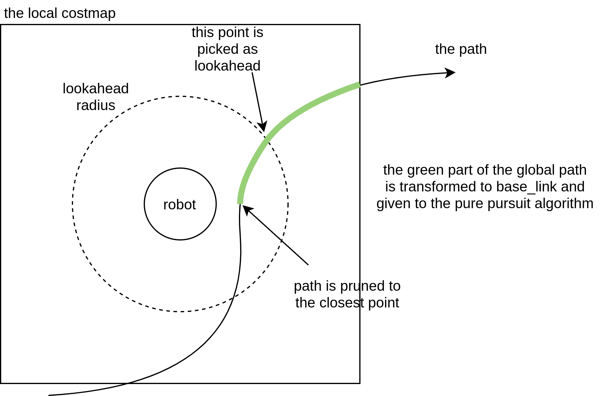

# Nav2 Regulated Pure Pursuit Controller

This is a controller (local trajectory planner) that implements a variant on the pure pursuit algorithm to track a path. This variant we call the Regulated Pure Pursuit Algorithm, due to its additional regulation terms on collision and linear speed. It also implements the basics behind the Adaptive Pure Pursuit algorithm to vary lookahead distances by current speed. It was developed by [Shrijit Singh](https://www.linkedin.com/in/shrijitsingh99/) and [Steve Macenski](https://www.linkedin.com/in/steve-macenski-41a985101/) while at [Samsung Research](https://www.sra.samsung.com/) as part of the Nav2 working group.

Code based on a simplified version of this controller is referenced in the [Writing a New Nav2 Controller](https://navigation.ros.org/plugin_tutorials/docs/writing_new_nav2controller_plugin.html) tutorial.

This plugin implements the `nav2_core::Controller` interface allowing it to be used acros the navigation stack as a local trajectory planner in the controller server's action server (`controller_server`).

It builds on top of the ordinary pure pursuit algorithm in a number of ways. It also implements all the common variants of the pure pursuit algorithm such as adaptive pure pursuit. This controller is suitable for use on all types of robots, including differential, legged, and ackermann steering vehicles. It may also be used on omni-directional platforms, but won't be able to fully leverage the lateral movements of the base (you may consider DWB instead).

This controller has been measured to run at well over 1 kHz on a modern intel processor.

<p align="center">
  
</p>

## Pure Pursuit Basics

The Pure Pursuit algorithm has been in use for over 30 years. You can read more about the details of the pure pursuit controller in its [introduction paper](http://www.enseignement.polytechnique.fr/profs/informatique/Eric.Goubault/MRIS/coulter_r_craig_1992_1.pdf). The core idea is to find a point on the path in front of the robot and find the linear and angular velocity to help drive towards it. Once it moves forward, a new point is selected, and the process repeats until the end of the path. The distance used to find the point to drive towards is the `lookahead` distance. 

In order to simply book-keeping, the global path is continuously pruned to the closest point to the robot (see the figure below) so that we only have to process useful path points. Then, the section of the path within the local costmap bounds is transformed to the robot frame and a lookahead point is determined using a predefined distance.

Finally, the lookahead point will be given to the pure pursuit algorithm which finds the curvature of the path required to drive the robot to the lookahead point. This curvature is then applied to the velocity commands to allow the robot to drive.



## Regulated Pure Pursuit Features

We have created a new variation on the pure pursuit algorithm that we dubb the Regulated Pure Pursuit algorithm. We combine the features of the Adaptive Pure Pursuit algorithm with rules around linear velocity with a focus on consumer, industrial, and service robot's needs. We also implement several common-sense safety mechanisms like collision detection and ensuring that commands are kinematically feasible that are missing from all other variants of pure pursuit (for some remarkable reason).

The Regulated Pure Pursuit controller implements active collision detection. We use a parameter to set the maximum allowable time before a potential collision on the current velocity command. Using the current linear and angular velocity, we project forward in time that duration and check for collisions. Intuitively, you may think that collision checking between the robot and the lookahead point seems logical. However, if you're maneuvering in tight spaces, it makes alot of sense to only search forward a given amount of time to give the system a little leeway to get itself out. In confined spaces especially, we want to make sure that we're collision checking a reasonable amount of space for the current action being taken (e.g. if moving at 0.1 m/s, it makes no sense to look 10 meters ahead to the carrot, or 100 seconds into the future). This helps look further at higher speeds / angular rotations and closer with fine, slow motions in constrained environments so it doesn't over report collisions from valid motions near obstacles. If you set the maximum allowable to a large number, it will collision check all the way, but not exceeding, the lookahead point. We visualize the collision checking arc on the `lookahead_arc` topic.

The regulated pure pursuit algorithm also makes use of the common variations on the pure pursuit algorithm. We implement the adaptive pure pursuit's main contribution of having velocity-scaled lookahead point distances. This helps make the controller more stable over a larger range of potential linear velocities. There are parameters for setting the lookahead gain (or lookahead time) and thresholded values for minimum and maximum.

We also implement kinematic speed limits on the linear velocities in operations and angular velocities during pure rotations. This makes sure that the output commands are smooth, safe, and kinematically feasible. This is especially important at the beginning and end of a path tracking task, where you are ramping up to speed and slowing down to the goal.

The final minor improvement we make is slowing on approach to the goal. Knowing that the optimal lookahead distance is `X`, we can take the difference in `X` and the actual distance of the lookahead point found to find the lookahead point error. During operations, the variation in this error should be exceptionally small and won't be triggered. However, at the end of the path, there are no more points at a lookahead distance away from the robot, so it uses the last point on the path. So as the robot approaches a target, its error will grow and the robot's velocity will be reduced proportional to this error until a minimum threshold. This is also tracked by the kinematic speed limits to ensure drivability.

The major improvements that this work implements is the regulations on the linear velocity based on some cost functions.  They were selected to remove long-standing bad behavior within the pure pursuit algorithm. A major downside of this approach is the overshoot and poor handling in particularly high curvature (or extremely rapidly changing curvature) environments. It is commonly known that this will cause the robot to overshoot from the path and potentially collide with the environment. These cost functions were also chosen based on common requirements and needs of mobile robots uses in service, commercial, and industrial use-cases; scaling by curvature creates intuitive behavior of slowing the robot when making sharp turns and slowing when its near a potential collision so that small variations don't clip obstacles.

The cost functions penalize the robot's speed based on its proximity to obstacles and the curvature of the path. This is helpful to slow the robot when moving close to things in narrow spaces and scaling down the linear velocity by curvature helps to stabilize the controller over a larger range of lookahead point distances. This also has the added benefit of removing the sensitive tuning of the lookahead point / range, as the robot will track paths far better. Tuning is still required, but it is substantially easier to get reasonable behavior with minor adjustments.

An unintended tertiary benefit of scaling the linear velocities by curvature is that a robot will natively rotate to rough path heading when using holonomic planners that don't start aligned with the robot pose orientation. As the curvature will be very high, the linear velocity drops and the angular velocity takes over to rotate to heading. While not perfect, it does dramatically reduce the need to rotate to a close path heading before following and opens up a broader range of planning techniques. Pure Pursuit controllers otherwise would be completely unable to recover from this in even modestly confined spaces. 

Mixing the proximity and curvature regulated linear velocities with the time-scaled collision checker, we see a near-perfect combination allowing the regulated pure pursuit algorithm to handle high starting deviations from the path and navigate collision-free in tight spaces without overshoot. 

## Configuration

| Parameter | Description | 
|-----|----|
| `desired_linear_vel` | The desired maximum linear velocity to use. | 
| `max_linear_accel` | Acceleration for linear velocity | 
| `max_linear_decel` | Deceleration for linear velocity | 
| `lookahead_dist` | The lookahead distance to use to find the lookahead point | 
| `min_lookahead_dist` | The minimum lookahead distance threshold when using velocity scaled lookahead distances | 
| `max_lookahead_dist` | The maximum lookahead distance threshold when using velocity scaled lookahead distances | 
| `lookahead_time` | The time to project the velocity by to find the velocity scaled lookahead distance. Also known as the lookahead gain. | 
| `rotate_to_heading_angular_vel` | If rotate to heading is used, this is the angular velocity to use. | 
| `transform_tolerance` | The TF transform tolerance | 
| `use_velocity_scaled_lookahead_dist` | Whether to use the velocity scaled lookahead distances or constant `lookahead_distance` | 
| `min_approach_linear_velocity` | The minimum velocity threshold to apply when approaching the goal | 
| `use_approach_linear_velocity_scaling` | Whether to scale the linear velocity down on approach to the goal for a smooth stop | 
| `max_allowed_time_to_collision` | The time to project a velocity command to check for collisions | 
| `use_regulated_linear_velocity_scaling` | Whether to use the regulated features for curvature | 
| `use_cost_regulated_linear_velocity_scaling` | Whether to use the regulated features for proximity to obstacles | 
| `regulated_linear_scaling_min_radius` | The turning radius for which the regulation features are triggered. Remember, sharper turns have smaller radii | 
| `regulated_linear_scaling_min_speed` | The minimum speed for which the regulated features can send, to ensure process is still achievable even in high cost spaces with high curvature. | 
| `use_rotate_to_heading` | Whether to enable rotating to rough heading when using holonomic planners. Recommended on for all robot types except ackermann, which cannot rotate in place. | 
| `rotate_to_heading_min_angle` | The difference in the path orientation and the starting robot orientation to trigger a rotate in place, if enabled. | 
| `max_angular_accel` | Maximum allowable angular acceleration while rotating to heading, if enabled | 


Example fully-described XML with default parameter values:

```
controller_server:
  ros__parameters:
    use_sim_time: True
    controller_frequency: 20.0
    min_x_velocity_threshold: 0.001
    min_y_velocity_threshold: 0.5
    min_theta_velocity_threshold: 0.001
    progress_checker_plugin: "progress_checker"
    goal_checker_plugin: "goal_checker"
    controller_plugins: ["FollowPath"]

    progress_checker:
      plugin: "nav2_controller::SimpleProgressChecker"
      required_movement_radius: 0.5
      movement_time_allowance: 10.0
    goal_checker:
      plugin: "nav2_controller::SimpleGoalChecker"
      xy_goal_tolerance: 0.25
      yaw_goal_tolerance: 0.25
      stateful: True
    FollowPath:
      plugin: "nav2_regulated_pure_pursuit_controller::RegulatedPurePursuitController"
      desired_linear_vel: 0.5
      max_linear_accel: 2.5
      max_linear_decel: 2.5
      lookahead_dist: 0.6
      min_lookahead_dist: 0.3
      max_lookahead_dist: 0.9
      lookahead_time: 1.5
      rotate_to_heading_angular_vel: 1.8
      transform_tolerance: 0.1
      use_velocity_scaled_lookahead_dist: false
      min_approach_linear_velocity: 0.05
      use_approach_linear_velocity_scaling: true
      max_allowed_time_to_collision: 1.0
      use_regulated_linear_velocity_scaling: true
      use_cost_regulated_linear_velocity_scaling: false
      regulated_linear_scaling_min_radius: 0.9
      regulated_linear_scaling_min_speed: 0.25
      use_rotate_to_heading: true
      rotate_to_heading_min_angle: 0.785
      max_angular_accel: 3.2
```

## Topics

| Topic  | Type | Description | 
|-----|----|----|
| `lookahead_point`  | `geometry_msgs/PointStamped` | The current lookahead point on the path | 
| `lookahead_arc`  | `nav_msgs/Path` | The drivable arc between the robot and the carrot. Arc length depends on `max_allowed_time_to_collision`, forward simulating from the robot pose at the commanded `Twist` by that time. In a collision state, the last published arc will be the points leading up to, and including, the first point in collision. | 

Note: The `lookahead_arc` is also a really great speed indicator, when "full" to carrot or max time, you know you're at full speed. If 20% less, you can tell the robot is approximately 20% below maximum speed. Think of it as the collision checking bounds but also a speed guage.

## Notes to users

By default, the `use_cost_regulated_linear_velocity_scaling` is set to `false` because the generic sandbox environment we have setup is the TB3 world. This is a highly constrained environment so it overly triggers to slow the robot as everywhere has high costs. This is recommended to be set to `true` when not working in constantly high-cost spaces.

To tune to get Adaptive Pure Pursuit behaviors, set all boolean parameters to false except `use_velocity_scaled_lookahead_dist` and make sure to tune `lookahead_time`, `min_lookahead_dist` and `max_lookahead_dist`.

To tune to get Pure Pursuit behaviors, set all boolean parameters to false and make sure to tune `lookahead_dist`.

Currently, there is no rotate to goal behaviors, so it is expected that the path approach orientations are the orientations of the goal or the goal checker has been set with a generous `min_theta_velocity_threshold`. Implementations for rotating to goal heading are on the way.

The choice of lookahead distances are highly dependent on robot size, responsiveness, controller update rate, and speed. Please make sure to tune this for your platform, although the `regulated` features do largely make heavy tuning of this value unnecessary. If you see wiggling, increase the distance or scale. If it's not converging as fast to the path as you'd like, decrease it.
