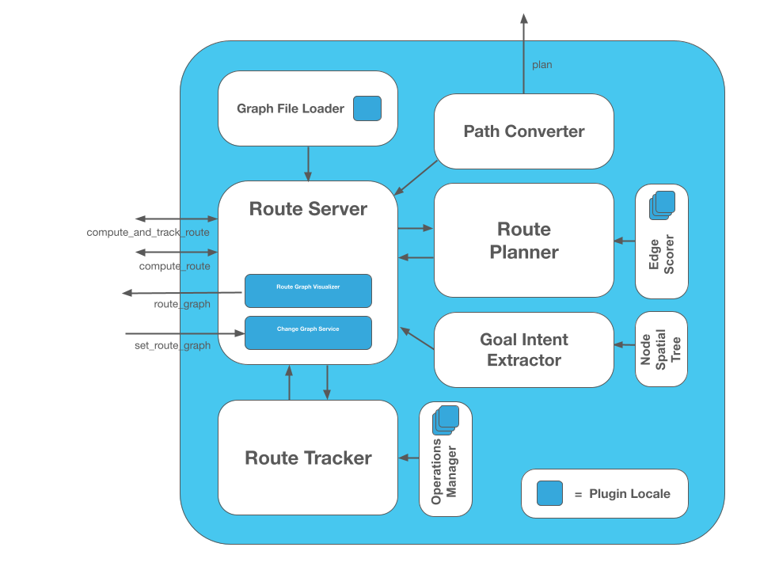

# Nav2 Route Server

The Route Server is a Nav2 Task server to compliment the Planner Server's free-space planning capabilities with pre-defined Navigation Route Graph planning, created by [Steve Macenski](https://www.linkedin.com/in/steve-macenski-41a985101/) at [Open Navigation](https://www.opennav.org/) with assistance from [Josh Wallace](https://www.linkedin.com/in/joshua-wallace-b4848a113/) at Locus Robotics. It can be used to:
* Fully replace free-space planning when following a particular route closely is required (less Controller plugins' tuning to deviate or track the path closely), or
* Augment the global planner with long-distance routing to a goal and using free-space feasible planning in a more localized fashion for the immediate 10m, 100m, etc future.

This graph has very few rules associated with it and may be generated manually or automatically via AI, geometric, or probabilistic techniques.
docs.nav2.org includes tutorials for how to generate such a graph by annotations on a grid map created via SLAM, but can also be procedurally generated using a tool like [NVIDIA's SWAGGER](https://github.com/nvidia-isaac/SWAGGER).
This package then takes a planning request and uses this graph to find a valid route through the environment via an optimal search-based algorithm. It uses plugin-based scoring functions applied each edge based on arbitrary user-defined semantic information and the chosen optimization criteria(s).

The Nav2 Route Server may also live monitor and analyze the route's process to execute custom behaviors on entering or leaving edges or achieving particular graph nodes. These behaviors are defined as another type of plugin and can leverage the graph's edges' and nodes' arbitrary semantic data.

There are plugin interfaces throughout the server to enable a great deal of application-specific customization:
- Custom search-prioritization behavior with edge scoring plugins (e.g. minimize distance or time, mark blocked routes, enact static or dynamic penalties for danger and application-specific knowledge, prefer main arteries)
- Custom operations to perform during route execution: (a) triggered when entering or leaving an edge, (b) achieving a graph node on the route, (c) performed consistently (e.g. open door, pause at node to wait for clearance, adjust maximum speed, turn on lights, change mode, check for future collisions)
- Parsers of navigation graph files to use any type of format desirable (e.g. geoJSON, OpenStreetMap)

Additionally, the server leverages **additional arbitrary metadata** specified within the navigation graph files to store information such as speed limits, added costs, or operations to perform.
Thus, we do not restrict the data that can be embedded in the navigation route graph for an application and this metadata is communicated to the edge scoring and operations plugins to adjust behavior as demanded by the application.
Note that plugins may also use outside information from topics, services, and actions for dynamic behavior or centralized knowledge sharing as well if desired.

[A rudimentary demo of the basic features can be seen here](https://www.youtube.com/watch?v=T57pac6q4RU) using the `route_example_launch.py` provided in `nav2_simple_commander`.

## Features

- 98% Unit Test Coverage
- Optimized Dikjstra's planning algorithm modeled off of the Smac Planner A* implementation
- Use of Kd-trees for finding the nearest node(s) to arbitrary start and goal poses in the graph for pose-based planning requests. Optional use of Breadth-First Search to refine those nearest node(s) from simply Euclidean distance to considering traversibility length in the costmap.
- Highly efficient graph representation to maximize caching in a single data structure containing both edges' and nodes' objects and relationships with localized information
- All edges are directional allowing for single-direction lanes or planning
- Data in files may be with respect to any frame in the TF tree and are transformed to a centralized frame automatically
- Action interface response returns both a sparse route of nodes and edges for client applications with navigation graph knowledge and `nav_msgs/Path` dense paths minimicking freespace planning for drop-in behavior replacement of the Planner Server.
- Action interface request can process requests with start / goal node IDs or euclidean poses
- Service interface to change navigation route graphs at run-time
- Edge scoring dynamic plugins return a cost for traversing an edge and may mark an edge as invalid in current conditions from sensor or system state information
- Graph file parsing dynamic plugins allow for use of custom or proprietary formats
- Operation dynamic plugins to perform arbitrary tasks at a given node or when entering or leaving an edge on the route
- Operation may be graph-centric (e.g. graph file identifies operation to perform at a time) or plugin-centric (e.g. plugins self-identify nodes and edges to act upon during execution)
- Operations may trigger rerouting if necessary (e.g. due to new information, blockages, multi-robot data, etc)
- The nodes and edges metadata may be modified or used to communicate information across plugins including different types across different runs
- The Route Tracking action returns regular feedback on important events or state updates (e.g. rerouting requests, passed a node, triggered an operation, etc)
- If rerouting occurs during Route Tracking along the previous current edge, that state will be retained for improved behavior and provide an interpolated nav_msgs/Path from the closest point on the edge to the edge's end (or rerouting's starting node) to minimize free-space planning connections where a known edge exists and is being continued.

## Practical Architectures for Use

There are several practical architectures and designs for how this Route Serve can be assembled into a robotics solution.
Which to use depends on the nature of an application's needs and behavior.
This is not an exhaustive list, but enough to get users started thinking about how to fit this into their system.
Architectures (1) and (2) are implemented and tested in `nav2_bt_navigator/behavior_trees` for immediate use!

* 1. Route Server's output dense path -> Controller Server for direct route following
  - This is most useful when close or exact route following is required, fully replaces the Planner Server
  - Considering adding in the Smoother Server or spline fitting between the Route Server and Controller Server in a Behavior Tree to smooth out the edge transitions for following
  - Consider ComputingPathToPose for first-mile and last-mile on and off the route if leaving the graph is desirable.
* 2. Route Server's output sparse route -> Planner Server to plan to the next node(s) -> Controller Server to track global path
  - This is useful when you want to follow the general route, but wish to have the flexibility to leave the route when obstacles are in the way and need the free-space planner to do so
  - This is also useful in conjunction with (1) above as a fallback behavior to follow the route when possible, leave when blocked (after some time, or proactively when it sees blocked in immediate future), and then track the route again. This is great in situations where you want to only leave the route when required but otherwise track the route closely
  - Consider using ComputePathToPose to plan to the next node in the route and change nodes as you approach the next
  - Consider using ComputePathThroughPoses to plan through several nodes in the future to have smooth interchange
* 3.  Route Server's output sparse route -> Waypoint Follower or Navigate Through Poses to navigate with task
  - Similar to (2), this is useful to take the nodes and edges and navigate along the intended route using intelligent navigation
  - This architecturally puts the route planning in the higher-level application-autonomy logic rather than with in the main navigation-planning task logic, which could be useful separation of concerns for some applications.
* 4. Create a behavior tree to NavigateToPose to the first node in the graph, then select (1) or (2) to track the route, finally NavigateToPose to get to the final goal pose off of the graph
  - This is useful when the start and/or goal poses are not on the navigation graph, and thus the robot needs to navigate to its starting node or final goal pose in a 'first-mile' and 'last-mile' style task
* 5. Route Server's `ComputeAndTrackRoute` instead of `ComputeRoute` and send the dense path in (1) or sparse route in (2) or (3)
  - This is useful to track the progress of the route in the Route Server while following the route as an application sees fit. This process allows for the triggering of spatial, graph, or contextual behaviors while executing the task like adjusting speeds, turning on lights, rerouting due to multi-robot coordination resource constraints, opening doors, etc. This has a wide ranging set of applications.
* 6. Teleoping a robot -> having a script which automatically stores new nodes and/or operator manually triggers a node capture -> saving this to file -> annotating file with operation plugin to do at each waypoint (if any) -> later using the graph to navigate the robot and perform tasks
  - This is one possible way to setup a Teach-and-Repeat behavior using the route server with custom behaviors at each node. There are likely many.
* 7. Multi-floor navigation using graph nodes as terminals for stairs, elevators, etc
  - Then free-space planning can be used between on-floor nodes and graph connections for floor connectors to enact specific behaviors to call elevators, climb stairs, etc.

## Design

The Nav2 Route Server is designed as several composed objects to make the system easy to understand and easily unit testable. The breakdown exists between different classes of capabilities like ROS 2 Interfaces (e.g. actions, services, debugging topics), the core search algorithm, scoring factory, route progress tracking, operations factory, file parsing, and action request 'intent' extraction. This distinction makes a relatively complex system easier to grasp, as there are a number of moving pieces. Luckily, few of these pieces (tracker is the exception) don't need to know much about each other so they can be isolated.

The diagram below provides context for how the package is structured from the consititutent files you'll find in this project.

<p align="center">
  
</p>

Each have their own complete unit testing files named similarly in the `test/` directory. As the diagram suggests, plugin interfaces exist in the file loader, edge scorer, and operations manager to enable customizable behavior for different applications.

### Plugin Interfaces

Several plugin interfaces are provided to enable customizable behavior in the route search, route operation, and route graph file formatting. This allows for a great deal of customization for any number of applications which might want to (1) prioritize time, distance, or other application-specific criteria in routing; (2) perform custom operations or rerouting mechanics at run-time while progressing along the route such as adjusting speed or opening doors; (3) be able to integrate your own custom file format or another format of your interest.

The interface definitions can be found in the `include/nav2_route/interfaces` directory and are mostly self explanatory via their method names and provided doxygen documentation.

## Metrics

A set of 1,000 experiments were run with the route planner with randomly selected start and goal poses, with various sized graphs. These metrics provide some reasonable benchmarking for performance of how the route server will perform in your application with various sized graphs that represent your environment:

| Graph size  | Ave. Search Time    |
| ----------- | ------------------- |
| 100         | 0.0031 ms           |
| 10,000      | 0.232 ms            |
| 90,000      | 3.75 ms             |
| 250,000     | 11.36 ms            |
| 1,000,000   | 44.07 ms            |

This is in comparison with typical run-times of free-space global planners between 50 ms - 400 ms (depending on environment size and structure). Thus, the typical performance of using the route planner - even in truly massive environments to need hundreds of thousands of nodes of interest or importance - is well in excess of freespace planning. This enables Nav2 to operate in much larger spaces and still perform global routing. There's little reason then to use a heuristic-driven A* when Dikjstra's Algorithm is plenty fast for even massively connected graphs.

The script used for this analysis can be found in `test/performance_benchmarking.cpp`.

## Parameters

```
route_server:
  ros__parameters:

    base_frame: "base_link"                       # Robot's base frame
    route_frame: "map"                            # Global reference frame
    path_density: 0.05                            # Density of points for generating the dense nav_msgs/Path from route (m)
    max_iterations: 0                             # Maximum number of search iterations, if 0, uses maximum possible
    max_planning_time: 2.0                        # Maximum planning time (seconds)
    smooth_corners: true                          # Whether to smooth corners formed by adjacent edges or not
    smoothing_radius: 1.0                         # Radius of corner to fit into the corner
    costmap_topic: 'global_costmap/costmap_raw'   # Costmap topic when enable_nn_search is enabled. May also be used by the collision monitor operation and/or the costmap edge scorer if using the same topic to share resources.

    graph_file_loader: "GeoJsonGraphFileLoader"   # Name of default file loader
      plugin: nav2_route::GeoJsonGraphFileLoader  # file loader plugin to use
    graph_filepath: ""                            # file path to graph to use

    edge_cost_functions: ["DistanceScorer", "DynamicEdgesScorer"]  # Edge scoring cost functions to use
    DistanceScorer:
      plugin: "nav2_route::DistanceScorer"
    DynamicEdgesScorer:
      plugin: "nav2_route::DynamicEdgesScorer"

    operations: ["AdjustSpeedLimit", "ReroutingService"] # Route operations plugins to use
    AdjustSpeedLimit:
      plugin: "nav2_route::AdjustSpeedLimit"
    ReroutingService:
      plugin: "nav2_route::ReroutingService"

    tracker_update_rate: 50.0                     # Rate at which to check the status of path tracking
    aggregate_blocked_ids: false                  # Whether to aggregate the blocked IDs reported by route operations over the lifespan of the navigation request or only use the currently blocked IDs.
    boundary_radius_to_achieve_node: 1.0          # Radius (m) near boundary nodes (e.g. start/end) to enable evaluation of achievement metric
    radius_to_achieve_node: 2.0                   # Radius (m) near route nodes as preliminary condition for evaluation of achievement metric

    max_prune_dist_from_edge: 8.0                       # Max distance from an edge to consider pruning it as in-progress (e.g. if we're too far away from the edge, its nonsensical to prune it)
    min_prune_dist_from_goal: 0.15                      # Min distance from goal node away from goal pose to consider goal node pruning as considering it as being passed (in case goal pose is very close to a goal node, but not exact)
    min_prune_dist_from_start: 0.10                     # Min distance from start node away from start pose to consider start node pruning as considering it as being passed (in case start pose is very close to a start node, but not exact)
    prune_goal: true                              # Whether pruning the goal nodes from the route due to being past the goal pose requested is possible (pose requests only)
    enable_nn_search: true                        # Whether to enable breadth first search considering the costmap to find the node closest to the start and edge poses, rather than using the euclidean nearest neighbor alone.
    max_nn_search_iterations: 10000               # Maximum number of iterations for breadth-first search.
    num_nearest_nodes: 5                          # The number of nearest-neighbors to extract for breadth-first search to consider.
```

#### `CostmapScorer`

This edge scoring plugin will score based on the costmap values of the edge (e.g. using either maximum cost on the edge or average cost)

| Parameter             | Description                                                         |
|-----------------------|---------------------------------------------------------------------|
| weight                | Relative scoring weight (1.0)                                       |
| costmap_topic         | Costmap topic for collision checking (`global_costmap/costmap_raw`) |
| max_cost              | Maximum cost to consider an route blocked (253.0)                   |
| use_maximum           | Whether to score based on single maximum or average (true)          |
| invalid_on_collision  | Whether to consider collision status as a terminal condition (true) |
| invalid_off_map       | Whether to consider route going off the map invalid (true)          |
| check_resolution      | Resolution to check costs at (1 = costmap resolution, 2 = 2x costmap resolution, etc) |

#### `DistanceScorer`

This edge scoring plugin will score based on the distance length of the edge, weighted proportionally to percentage-based speed limits (if set in the graph)

| Parameter             | Description                                                         |
|-----------------------|---------------------------------------------------------------------|
| weight                | Relative scoring weight (1.0)                                       |
| speed_tag             | Graph metadata key to look for % speed limits (speed_limit)         |

#### `DynamicEdgesScorer`

This edge scoring plugin will score based on the requested values from a 3rd party application via a service interface. It can set dynamically any cost for any edge and also be used to close and reopen particular edges if they are blocked, in use by other robots locking out its shared use by other robots, higher cost due to overlap with other platforms in service, increased cost due to fleet manager analytics that this space is underperforming throughput, or otherwise temporarily non-traversible. For example, if other robots report an edge to be blocked, all robots can avoid this edge/aisle/etc.

#### `TimeScorer`

This edge scoring plugin will score based on the time to traverse the length of the edge. This will use the distance of the edge weighted in proportion to the absolute speed limits of the robot over an edge. If none is set in the graph, a parameterized maximum speed will be used. If an actual, measured time of a previous traversal is in the edge's metadata, this will be used.

| Parameter             | Description                                                         |
|-----------------------|---------------------------------------------------------------------|
| weight                | Relative scoring weight (1.0)                                       |
| speed_tag             | Graph metadata key to look for abs speed limits (abs_speed_limit)   |
| time_tag              | Graph metadata key to look for abs traversal times (abs_time_taken) |
| max_vel               | Maximum velocity to use if speed limit or time taken is not set     |

#### `PenaltyScorer`

This edge scoring plugin will score based on a statically set penalty in the graph file for a particular edge. This can be based on application known logic to weight preferences of navigation tactics in a space.

| Parameter             | Description                                                         |
|-----------------------|---------------------------------------------------------------------|
| weight                | Relative scoring weight (1.0)                                       |
| penalty_tag           | Graph metadata key to look for penalty value (penalty)              |

#### `SemanticScorer`

This edge scoring plugin will score based on semantic information provided in the graph file. It can either check for the edge's semantic class via a parameterized key's value **or** search all key names to match known semantic classes to apply weight (e.g. `class: highway` or `highway: <some other application info>`).

| Parameter             | Description                                                         |
|-----------------------|---------------------------------------------------------------------|
| weight                | Relative scoring weight (1.0)                                       |
| semantic_classes      | A list of semantic classes possible in your graph                   |
| `<for each class>`    | The cost to apply for a class (e.g. `highway: 8.4`)                 |
| semantic_key          | Key to search edges for for semantic data (class). If empty string, will look at key names instead. |

#### `StartPoseOrientationScorer`

This edge scoring plugin will score an edge starting at the start node (vector from start->goal) based on its angular proximity to the starting pose's orientation.
This will either score a weighted-angular distance or reject traversals that are outside of a set threshold to force the route to go down a particular direction (i.e. direction robot is already facing).

| Parameter             | Description                                                         |
|-----------------------|---------------------------------------------------------------------|
| orientation_weight    | Relative scoring weight (1.0)                                       |
| use_orientation_threshold  | Whether to use orient. threshold or weighted-angular distance scoring (false)  |
| orientation_tolerance | The angular threshold to reject edges' angles if greater than this w.r.t. starting pose, when `use_orientation_threshold: true` (PI/2) |

#### `GoalPoseOrientationScorer`

This edge scoring plugin will score a an edge with terminus of the goal node (vector from start->goal) based on its angular proximity to the goal pose's orientation.
This will either score a weighted-angular distance or reject traversals that are outside of a set threshold to force the route to go down a particular direction (i.e. direction robot wants to be facing).

| Parameter             | Description                                                         |
|-----------------------|---------------------------------------------------------------------|
| orientation_weight    | Relative scoring weight (1.0)                                       |
| use_orientation_threshold  | Whether to use orient. threshold or weighted-angular distance scoring (false)  |
| orientation_tolerance | The angular threshold to reject edges' angles if greater than this w.r.t. goal pose, when `use_orientation_threshold: true` (PI/2) |

#### `AdjustSpeedLimit`

This route operation will check the graph at each state change (e.g. node passed) if the new edge entered contains speed limit restrictions. If so, it will publish those to the speed limit topic to be received by the controller server.

| Parameter             | Description                                                         |
|-----------------------|---------------------------------------------------------------------|
| speed_limit_topic     | Topic to publish new speed limits to (speed_limit)                  |
| speed_tag             | Graph metadata key to look for % speed limits (speed_limit)         |

#### `CollisionMonitor`

This route operation will evaluate a future-looking portion of the route for validity w.r.t. collision in the costmap. If it is blocked, it sets the edge blocked as blocked for rerouting around the blocked edge.

| Parameter             | Description                                                         |
|-----------------------|---------------------------------------------------------------------|
| costmap_topic         | Costmap topic (global_costmap/costmap_raw)                          |
| rate                  | Throttled rate to evaluate collision at, rather than `tracker_update_rate` which might be excessively expensive for forward looking non-control collision checking (1.0 hz)             |
| max_cost              | Max cost to be considered invalid (253.0)                           |
| max_collision_dist    | How far ahead to evaluate the route's validity (5.0 m)              |
| check_resolution      | Resolution to check costs at (1 = costmap resolution, 2 = 2x costmap resolution, etc) |
| reroute_on_collision  | Whether to reroute on collision or exit tracking as failed when a future collision is detected (default: true) |

#### `ReroutingService`

This route operation will receive service requests from a 3rd party application to cause a rerouting request.

#### `TimeMarker`

This route operation will track times taken to traverse particular edges to write times to for later improved navigation time estimation.

| Parameter             | Description                                                         |
|-----------------------|---------------------------------------------------------------------|
| time_tag              | Graph edge metadata key to write to (abs_time_taken)                |

#### `TriggerEvent`

This route operation will trigger an external service when a graph node or edge contains a route operation of this name. It uses a `std_srvs/Trigger` interface and is a demonstration of the `RouteOperationClient<SrvT>` base class which can be used to trigger other events of other types of other names as desired (opening doors, calling elevators, etc).

## ROS Interfaces


| Topic           | Type                                |
|-----------------|-------------------------------------|
| plan            | nav_msgs/msg/Path                   |
| speed_limit     | nav2_msgs/msg/SpeedLimit            |
| route_graph     | visualization_msgs/msg/MarkerArray  |

| Service                                          | Description                                                    |
|--------------------------------------------------|----------------------------------------------------------------|
| `route_server/set_route_graph`                   | Sets new route graph to use                                    |
| `route_server/<DynamicEdgesScorer>/adjust_edges` | Sets adjust edge values and closure from 3rd party application |
| `route_server/<ReroutingService>/reroute`        | Trigger a reroute from a 3rd party                             |

| Action                           | Description                                                           |
|----------------------------------|-----------------------------------------------------------------------|
| `compute_route`                  | Computes and returns a sparse graph route and dense interpolated path |
| `compute_and_track_route`        | Computes and tracks a route for route operations and progress, returns route and path via process feedback also containing current state and operations triggered |

## File Formats

The graphs may be stored in one of the formats the parser plugins can understand or implement your own parser for a particular format of your interest!
A parser is provided for GeoJSON formats.
The only three required features of the navigation graph is (1) for the nodes and edges to have identifiers from each other to be unique for referencing and (2) for edges to have the IDs of the nodes belonging to the start and end of the edge and (3) nodes contain coordinates.
This is strictly required for the Route Server to operate properly in all of its features.

Besides this, we establish some conventions for route graph files to standardize this information to offer consistent and documented behavior with our provided plugins.
The unique identifier for each node and edge should be given as `id`. The edge's nodes are `startid` and `endid`. The coordinates are given in an array called `coordinates`.
While technically optional, it is highly recommended to also provide:
- The node's frame of reference (`frame`), if not the global frame and you want it transformed
- The Operation's `trigger` (e.g. enter, exit edge, node achieved) and `type` (e.g. action to perform), as relevant

While optional, it is somewhat recommended to provide, if relevant to your needs:
- The edge's `cost`, if it is fixed and known at graph generation time or edge scoring plugins are not used
- Whether the edge's cost is `overridable` with edge scoring plugins, if those plugins are provided.

Otherwise, the Node, Edge, and Operations may contain other arbitrary application-specific fields with key-value pairs under the `metadata` key-name.
These can be primitive types (float, int, string, etc), vector types (e.g. a polygon or other vector of information), or even contain information nested under namespaces - whereas a metadata object may exist as a key's value within `metadata`.

While GeoJSON is not YAML-based, the following YAML file is provided as a more human-readable example for illustration of the conventions above.
Usable real graph file demos can be found in the `graphs/` directory. However, the
`sample_graph.geojson` in the `graph/` directory exists to show the different API for options
for operations, metadata, recursive metadata and vectors.

```
example_graph.yaml

Node1:                     // <-- If provided by format, stored as name in metadata
  id: 1                    // <-- Required
  coordinates: [0.32, 4.0] // <-- Required
  frame: "map"             // <-- Highly recommended
  metadata:
    class: "living_room"   // <-- Metadata for node (arbitrary)
  operation:
    pause:                 // <-- If provided by format, stored as name in metadata
      type: "stop"         // <-- Required
      trigger: ON_ENTER    // <-- Required
      metadata:
        wait_for: 5.0      // <-- Metadata for operation (arbitrary)

Edge1:                     // <-- If provided by format, stored as name in metadata
  id: 2                    // <-- Required
  startid: 1               // <-- Required
  endid: 3                 // <-- Required
  overridable: False       // <-- Recommended
  cost: 6.0                // <-- Recommended, if relevant
  metadata:
    speed_limit: 85        // <-- Metadata for edge (arbitrary). Use abs_speed_limit if not a percentage
  operations:
    open_door:             // <-- If provided by format, stored as name in metadata
      type: "open_door"    // <-- Required
      trigger: ON_EXIT     // <-- Required
      metadata:
        door_id: 54        // <-- metadata for operation (arbitrary)
        service_name "open-door"  // <-- metadata for operation (Recommended)
```

### Metadata Conventions for Convenience

While other metadata fields are not required nor necessarily needed, there are some useful standards which may make your life easier within in the Route Server framework.
These are default fields for the provided plugins, but you're free to embed this information anyway you like (but may come at the cost of needing to re-implement provided capabilities).
A set of conventions are shown in the table below. The details regarding the convention and where they are used within the codebase follows in more detail.

| Graph File Key  | Information Stored |
| --------------- | ------------- |
| `speed_limit`    | Speed limit, represented in percentage 0.0-100.0.  |
| `abs_speed_limit`    | Speed limit, represented in `m/s`.  |
| `penalty`    | A cost penalty to apply to a node or edge. |
| `class`    | The semanic class this node belongs to.  |
| `service_name`    | Which service to call, if node or edge should trigger an event.  |
| `abs_time_taken`    | Time taken to traverse an edge in `s`.  |

<details>
  <summary>Click me to see expansive detail about these conventions and uses</summary>

  The `DistanceScorer` edge scoring plugin will score the L2 norm between the poses of the nodes constituting the edge as its unweighted score.
  It contains a parameter `speed_tag` (Default: `speed_limit`) which will check the edge's metadata if it contains an entry for speed limit information, represented as a percentage of the maximum speed.
  If so, it will adjust the score to instead be proportional to the time rather than distance.
  Further, the `AdjustSpeedLimit` Route Operation plugin will utilize the same parameter and default `speed_limit` value to check each edge entered for a set speed limit percentage.
  If present, it will request an adjusted speed limit by the controller server on each edge entered.
  Thus, by convention, we say that `speed_limit` attribute of an edge should contain this information.

  The `TimeScorer` plugin operates with an exact analog to the `DistanceScorer`, except rather than using speed limits based on percentages of maximum, it uses actual speed limits in `m/s`. As such the `speed_tag` parameter (Default: `abs_speed_limit`) is used to represent absolute speed limits in the metadata files. By convention, we say that the `abs_speed_limit` attribute of an edge should contain this information.

  Similarly, the `penalty_tag` parameter (Default: `penalty`) in the `PenaltyScorer` can be used to represent a static unweighted cost to add to the sum total of the edge scoring plugins.
  This is useful to penalize certain routes over others knowing some application-specific information about that route segment. Technically this may be negative to incentivize rather than penalize.
  Thus, by convention, we say the `penalty` attribute of an edge should contain this information.

  By convention, to use the `SemanticScorer` edge scoring plugin, we expect the semantic class of a node or edge to be stored in the `class` metadata key (though is reconfigurable to look at any using the `semantic_key` parameter). This can be used to store arbitrary semantic metadata about a node or edge such as `living_room`, `bathroom`, `work cell 2`, `aisle45`, etc which is then correlated to a set of additional class costs in the plugin's configuration. However, if the `semantic_key` parameter is set to empty string, then instead it checks **all keys** in the metadata of a node or edge if they match any names  of the semantic classes. This way, semantic information may be embedded as keys with other values (for another application) or as values themselves to the `class` key if only needing to specify its membership.

The Route Operation `TriggerEvent` and more broadly any operation plugins derived from `RouteOperationClient<SrvT>` (a service-typed template route operation base class to simplify adding in custom plugins based on service calls) relies on the parameter and matching metadata key `service_name` to indicate the service name to call with the corresponding route operation. When set in the parameter file, this will be used for all instances when called in the navigation route graph. When `service_name` is set in the operation metadata in the route graph, it can be used to specify a particular service name of that service type to use at that particular node/edge, created on the fly (when a conflict exists, uses the navigation graph as the more specific entry).
  That way both design patterns work for a Route Operation `OpenDoor` of service type `nav2_msgs/srv/OpenDoor`, for example:
  - A `open_door/door1` (and `door2` and so on) service specific to each node containing a door to open may be called contextually and correctly at each individual door in the graph file metadata. This way you can have individual services (if desired) without having to have individual repetitive operation plugin definitions.
  - A `open_doors` general service specified in the parameter file to call to open a door specified in the service's `request` field, so that one service is called for all instances of doors in the graph file without repetition in the graph file and storing client resources (just adding info about which one from the node metadata).

  Thus, we say that `service_name` is a key to correspond to a string of the service's name to call in an operation to use `TriggerEvent` and `RouteOperationClient<SrvT>` plugins and base classes.

  By convention, we reserve the edge metadata field `abs_time_taken` for representing actual navigation times along the edge. This is populated by the `TimeMarker` route operation plugin and utilized by the `TimeScorer` to more accurately represent the times to navigate along an edge based on the real execution time. While this is used as an internal mechanism to share data between live operations and route planning, it is also possible to set `last_time_taken` in your navigation graph file based on many execution runs to use in the `TimeScorer` to optimize system performance for a fleet or over long durations (and remove `TimeMarker` operation for live updates).


</details>

## Etc. Notes

### Metadata Communication

The metadata contained in the graph's nodes and edges can serve a secondary purpose to communicating arbitrary information from the graph file for use in routing behavior or operations. It may also be used to communicate or store information about a node or edge during run-time to query from a plugin in a future iteration, from another plugin in the system, or from another plugin type entirely.

For example:
- If the collision monitor Route Operation identifies an edge as being blocked on a regular basis, a counter can be used to track the number of times this edge is blocked and if exceeding a threshold, it adds additional costs to that edge to incentivize taking another direction in an Edge Scorer.
- If we want to minimize the time to traverse the space, rather than estimating the times to traverse an edge, we can store actual times to navigate into the metadata of the edges. This can be stored as part of a route operation after completing an edge and retrieved at planning time by an edge scorer.

All of this is made possible by the centralized graph representation and pointers back to its memory locations at each stage of the system.

### Node Achievement

The Route Tracker will track the progress of a robot following a defined route over time. When we achieve a node, that is to say, we pass it, that triggers events based on reaching a node (Also: exiting an old edge, entering a new edge). Thus, the specification of node achievement is worth some discussion for users so they can best use this powerful feature.

The node achievement logic will first check if the robot is within a configurable radius of a node. This radius should be **generous** and not equatable to the goal tolerance. This should be sufficiently large that by the mechanics of your control, you can achieve a node when you pass it considering realistic deviations of path tracking by your trajectory planner. This may not need to be very large if using an exact path follower controller but may need to be relatively large for a dynamic obstacle avoidance planner. If in doubt, make it **larger** since this is merely the first stage for checking node achievement, not the metric itself.

Once we're within the range of a node that we need to consider whether or not we've achieved the node, we evaluate a mathematical operation to see if the robot has moved from the regime of the previous edge into the next edge spatially. We do this by finding the bisecting vector of the two edge vectors of interest (e.g. last edge and next edge) and comparing that with the distance vector from the node. When the dot product is 0, that means the we're at the orthogonal vector to the bisector moving from one regime to the next. Thus, we can check the sign of this dot product to indicate when we transition from one edge to the next while allowing for significant deviation from the node itself due to path tracking error or dynamic behavior.

For the edge boundary cases where there is no last edge (e.g. starting) or next edge (e.g. finishing), we use the boundary radius only (separate param from otherwise used radius). Recall that this only applies the routing part of the navigation request, the controller will still continue tracking the path until your goal achievement defined in your local trajectory planner's configurations. However, any Route Operations to be performed at the start or end nodes will be slightly preempted when compared to the others, by the choice of this radius.

A special case exists for rerouting, where as if we reroute along the same edge as we were previously routing through, the tracker state will be reloaded. While the current edge is not reported in the route message (because the last node is passed), that information is inserted back in the tracker to perform edge exit route operations -- and most importantly, the refined bisector-based node achievement criteria (which is why Steve went through the sheer pain to make it possible).

### Gap and Trivial Routing

If a routing or rerouting request is made using poses which are not known to be nodes in the graph, there may be a gap between the robot's pose and the start of the route (as well as the end of the route and the goal pose) -- or a "last-mile" problem. This gap may be trivial to overcome with denser graphs and small distances between nodes that a local trajectory planner can overcome. However, with sparser graphs, some kind of augmentation would likely be required. For example:
- (A) Using a behavior tree which uses free-space planning to connect the robot and goal poses with the start / end of the route
- (B) Using the waypoint follower (or navigate through poses or otherwise) that takes the nodes and uses them as waypoints terminating with the goal pose for freespace navigation using the route as a general prior
- (C) Using the Route as a goal route to the goal, global planner to make a feasible plan for the next 100 meters (or so), and use the controller to track the global feasible path rather than the general route
- (D) some other solution which will get the robot from its pose, through the route, to the goal
- (E) The trajectory planner can handle these gaps itself, so Route dense path to the controller directly

A special condition of this when a routing or rerouting request is made up of only 1-2 edges, whereas both the start and the goal are not 'on or near' the terminal nodes (e.g. they're already along an edge meaningfully, so going to a goal node and then the final pose would involve back tracking), the edges may be pruned away leaving only a single node as the route. This is since we have already passed the starting node of the initial edge and/or the goal is along the edge before the ending node of the final edge. This is not different than the other conditions, but is a useful edge case to consider while developing your application solution.

This is an application problem which can be addressed above but may have other creative solutions for your application. It is on you as an application developer to determine if this is a problem for you and what the most appropriate solution is, since different applications will have different levels of flexibility of deviating from the route or extremely strict route interpretations.

Note that there are parameters like `prune_route`, `min_prune_distance_from_start` and `min_prune_distance_from_goal` which impact the pruning behavior while tracking a route using poses. There is also the option to request routes using NodeIDs instead of poses, which obviously would never have this issue since they are definitionally on the route graph at all times. That bypasses the entire issue if the goal(s) are always known to be on the graph.

### Graph Generation

There are tutorials on docs.nav2.org regarding how to generate a file for your application, please review those for more information on how to generate a graph file for your application.
