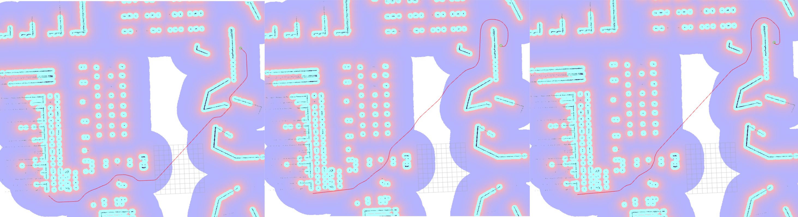
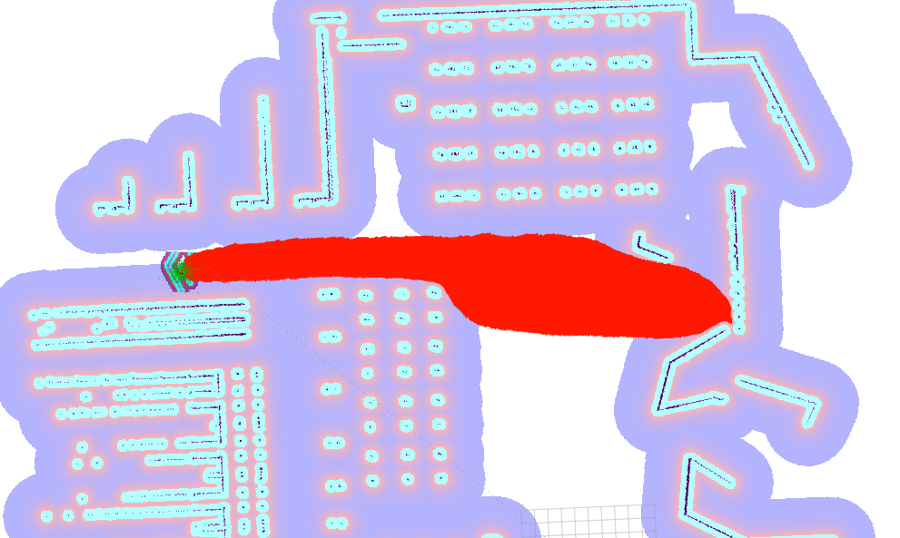
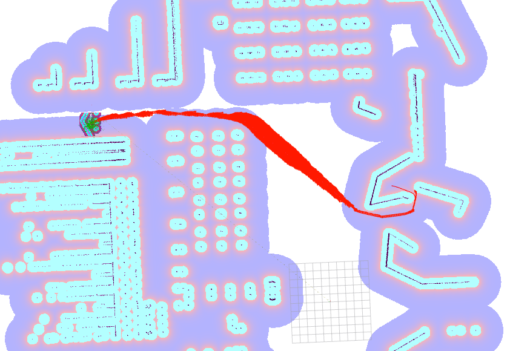

# Smac Planner

The SmacPlanner is a plugin for the Nav2 Planner server. It includes currently 3 distinct plugins:
- `SmacPlannerHybrid`: a highly optimized fully reconfigurable Hybrid-A* implementation supporting Dubin and Reeds-Shepp models (legged, ackermann and car models).
 - `SmacPlannerLattice`: a highly optimized fully reconfigurable State Lattice implementation supporting configurable minimum control sets, with provided control sets for Ackermann, Legged, Differential and Omnidirectional models.
- `SmacPlanner2D`: a highly optimized fully reconfigurable grid-based A* implementation supporting 8-connected neighborhood models.

It also introduces the following basic building blocks:
- `CostmapDownsampler`: A library to take in a costmap object and downsample it to another resolution.
- `AStar`: A generic and highly optimized A* template library used by the planning plugins to search. Additional template for  planning also could be made available using it.
- `CollisionChecker`: Collision check based on a robot's radius or footprint.
- `Smoother`: A simple path smoother to smooth out 2D, Hybrid-A\*, and State Lattice paths.

We have users reporting using this on:
- Delivery robots
- Industrial robots
- Vertical farming
- Solar farms

See its [Configuration Guide Page](https://navigation.ros.org/configuration/packages/configuring-smac-planner.html) for additional parameter descriptions.

## Introduction

The `nav2_smac_planner` package contains an optimized templated A* search algorithm used to create multiple A\*-based planners for multiple types of robot platforms. It was built by [Steve Macenski](https://www.linkedin.com/in/steve-macenski-41a985101/) while at [Samsung Research](https://www.sra.samsung.com/). We support **circular** differential-drive and omni-directional drive robots using the `SmacPlanner2D` planner which implements a cost-aware A\* planner. We support **legged, cars, car-like, and ackermann vehicles** using the `SmacPlannerHybrid` plugin which implements a Hybrid-A\* planner.  We support **non-circular, arbitrary shaped, any model vehicles** using the `SmacPlannerLattice` plugin which implements a State Lattice planner. It contains control sets and generators for ackermann, legged, differential drive and omnidirectional vehicles, but you may provide your own for another robot type or to have different planning behaviors. The last two plugins are also useful for curvature constrained or kinematically feasible planning, like when planning robot at high speeds to make sure they don't flip over or otherwise skid out of control. It is also applicable to non-round robots (such as large rectangular or arbitrary shaped robots of differential/omnidirectional drivetrains) that need pose-based collision checking.

The `SmacPlannerHybrid` implements the Hybrid-A* planner as proposed in [Practical Search Techniques in Path Planning for Autonomous Driving](https://ai.stanford.edu/~ddolgov/papers/dolgov_gpp_stair08.pdf), with modifications to the heuristic, traversal functions to increase path quality without needing expensive optimization-based smoothing.

The `SmacPlannerLattice` implements the State Lattice planner. While we do not implement it precisely the same way as [Optimal, Smooth, Nonholonomic MobileRobot Motion Planning in State Lattices](https://www.ri.cmu.edu/pub_files/pub4/pivtoraiko_mihail_2007_1/pivtoraiko_mihail_2007_1.pdf) (with control sets found using [Generating Near Minimal Spanning Control Sets for Constrained Motion Planning in Discrete State Spaces](https://www.ri.cmu.edu/pub_files/pub4/pivtoraiko_mihail_2005_1/pivtoraiko_mihail_2005_1.pdf)), it is sufficiently similar it may be used as a good reference. Additional optimizations for on-approach analytic expansions and improved heuristic functions were used, largely matching those of Hybrid-A\* to allow them to share these optimized implementations to drive search towards the goal, faster.

In summary...

The `SmacPlannerHybrid` is designed to work with:
- Ackermann, car, and car-like robots
- High speed or curvature constrained robots (as to not flip over, skid, or dump load at high speeds)
- Arbitrary shaped, non-circular differential or omnidirectional robots requiring kinematically feasible planning with SE2 collision checking
- Legged robots

The `SmacPlannerLattice` is designed to work with:
- Arbitrary shaped, non-circular robots requiring kinematically feasible planning with SE2 collision checking using the full capabilities of the drivetrain
- Flexibility to use other robot model types or with provided non-circular differential, ackermann, and omni support

The `SmacPlanner2D` is designed to work with:
- Circular, differential or omnidirectional robots
- Relatively small robots with respect to environment size (e.g. RC car in a hallway or large robot in a convention center) that can be approximated by circular footprint.

## Features 

We further improve on Hybrid-A\* in the following ways:
- Remove need for upsampling by searching with 10x smaller motion primitives (same as their upsampling ratio).
- Multi-resolution search allowing planning to occur at a coarser resolution for wider spaces (O(N^2) faster).
- Cost-aware penalty functions in search resulting in far smoother plans (further reducing requirement to smooth).
- Gradient-descent, basic but fast smoother
- Faster planning than original paper by highly optimizing the template A\* algorithm.
- Faster planning via custom precomputed heuristic, motion primitive, and other functions.
- Automatically adjusted search motion model sizes by motion model, costmap resolution, and bin sizing.
- Closest path on approach within tolerance if exact path cannot be found or in invalid space.
- Multi-model hybrid searching including Dubin and Reeds-Shepp models. More models may be trivially added.
- High unit and integration test coverage, doxygen documentation.
- Uses modern C++14 language features and individual components are easily reusable.
- Speed optimizations: no data structure graph lookups in main loop, near-zero copy main loop, dynamically generated graph and dynamic programming-based obstacle heuristic, optional recomputation of heuristics for subsequent planning requests of the same goal, etc.
- Templated Nodes and A\* implementation to support additional robot extensions.
- Selective re-evaluation of the obstacle heuristic per goal/map or each iteration, which can speed up subsequent replanning 20x or more.

Most of these features (multi-resolution, models, smoother, etc) are also available in the `SmacPlanner2D` and `SmacPlannerLattice` plugins.

The 2D A\* implementation also does not have any of the weird artifacts introduced by the gradient wavefront-based 2D A\* implementation in the NavFn Planner. While this 2D A\* planner is slightly slower, I believe it's well worth the increased quality in paths.

Note: In prior releases, a CG smoother largely implementing the original Hybrid-A\* paper's. However, this smoother failed to consistently provide useful results, took too much compute time, and was deprecated. While smoothing a path 95% of the time seems like a "good" solution, we need something far more reliable for practical use. Since we are working with mobile robots and not autonomous cars at 60 mph, we can take some different liberties in smoothing knowing that our local trajectory planners are pretty smart. If you are looking for it, it now lives in the new Smoothing Server as the Cost-aware smoother. This smoother has been replaced by a simpler optimization inspired solution which is faster, far more consistent, and simpler to understand. While this smoother is **not** cost-aware, we have added cost-aware penalty functions in the planners themselves to push the plans away from high-cost spaces and we do check for validity of smoothed sections to ensure feasibility. It will through terminate when paths become in collision with the environment. If you would like to use this smoother, however, it is available in the smoother server, though it will take some additional compute time.

## Metrics

The original Hybrid-A\* implementation boasted planning times of 50-300ms for planning across 102,400 cell maps with 72 angular bins. We see much faster results in our evaluations:

- **2-20ms** for planning across 147,456 (1.4x larger) cell maps with 72 angular bins.
- **30-200ms** for planning across 344,128 (3.3x larger) cell map with 72 angular bins.

An example of the 3 planners can be seen below, planning a roughly 75 m path.
- 2D A* computed the path in 243ms (Panel 1)
- Hybrid-A* computed the path in 144ms (Panel 2)
- State Lattice computed the path in 113ms (Panel 3)
- For reference: NavFn compute the path in 146ms, including some nasty path discontinuity artifacts



## Design

The basic design centralizes a templated A\* implementation that handles the search of a graph of nodes. The implementation is templated by the nodes, `NodeT`, which contain the methods needed to compute the hueristics, travel costs, and search neighborhoods. The outcome of this design is then a standard A\* implementation that can be used to traverse any type of graph as long as a node template can be created for it.

We provide 3 nodes by default currently. The 2D node template (`Node2D`) which does 2D grid-search with either 4 or 8-connected neighborhoods. We also provide a Hybrid A\* node template (`NodeHybrid`) which does SE2 (X, Y, theta) search and collision checking on Dubin or Reeds-Shepp motion models. We also provide the Lattice (`NodeLattice`) node for state lattice planning making use of the wider range of velocity options available to differential and omnidirectional robots. Additional templates could be easily made and included for 3D grid search and non-grid base searching like routing.

In the ROS2 facing plugin, we take in the global goals and pre-process the data to feed into the templated A\* used. This includes processing any requests to downsample the costmap to another resolution to speed up search and smoothing the resulting A\* path (not available for State Lattice due to the lattices generated are dependent on costmap resolution). For the `SmacPlannerHybrid` and `SmacPlannerLattice` plugins, the path is promised to be kinematically feasible due to the kinematically valid models used in branching search. The 2D A\* is also promised to be feasible for differential and omni-directional robots.

We isolated the A\*, costmap downsampler, smoother, and Node template objects from ROS2 to allow them to be easily testable independently of ROS or the planner. The only place ROS is used is in the planner plugins themselves. 

## Parameters

See inline description of parameters in the `SmacPlanner`. This includes comments as specific parameters apply to `SmacPlanner2D` and `SmacPlanner` in place.

```
planner_server:
  ros__parameters:
    planner_plugins: ["GridBased"]
    use_sim_time: True

    GridBased:
      plugin: "nav2_smac_planner/SmacPlannerHybrid"
      tolerance: 0.5                      # tolerance for planning if unable to reach exact pose, in meters
      downsample_costmap: false           # whether or not to downsample the map
      downsampling_factor: 1              # multiplier for the resolution of the costmap layer (e.g. 2 on a 5cm costmap would be 10cm)
      allow_unknown: false                # allow traveling in unknown space
      max_iterations: 1000000             # maximum total iterations to search for before failing (in case unreachable), set to -1 to disable
      max_on_approach_iterations: 1000    # maximum number of iterations to attempt to reach goal once in tolerance
      max_planning_time: 3.5              # max time in s for planner to plan, smooth, and upsample. Will scale maximum smoothing and upsampling times based on remaining time after planning.
      motion_model_for_search: "DUBIN"    # For Hybrid Dubin, Redds-Shepp
      cost_travel_multiplier: 2.0         # For 2D: Cost multiplier to apply to search to steer away from high cost areas. Larger values will place in the center of aisles more exactly (if non-`FREE` cost potential field exists) but take slightly longer to compute. To optimize for speed, a value of 1.0 is reasonable. A reasonable tradeoff value is 2.0. A value of 0.0 effective disables steering away from obstacles and acts like a naive binary search A*.
      angle_quantization_bins: 64         # For Hybrid nodes: Number of angle bins for search, must be 1 for 2D node (no angle search)
      analytic_expansion_ratio: 3.5       # For Hybrid/Lattice nodes: The ratio to attempt analytic expansions during search for final approach.
      analytic_expansion_max_length: 3.0    # For Hybrid/Lattice nodes: The maximum length of the analytic expansion to be considered valid to prevent unsafe shortcutting (in meters). This should be scaled with minimum turning radius and be no less than 4-5x the minimum radius
      minimum_turning_radius: 0.40        # For Hybrid/Lattice nodes: minimum turning radius in m of path / vehicle
      reverse_penalty: 2.1                # For Reeds-Shepp model: penalty to apply if motion is reversing, must be => 1
      change_penalty: 0.0                 # For Hybrid nodes: penalty to apply if motion is changing directions, must be >= 0
      non_straight_penalty: 1.20          # For Hybrid nodes: penalty to apply if motion is non-straight, must be => 1
      cost_penalty: 2.0                   # For Hybrid nodes: penalty to apply to higher cost areas when adding into the obstacle map dynamic programming distance expansion heuristic. This drives the robot more towards the center of passages. A value between 1.3 - 3.5 is reasonable.
      retrospective_penalty: 0.025        # For Hybrid/Lattice nodes: penalty to prefer later maneuvers before earlier along the path. Saves search time since earlier nodes are not expanded until it is necessary. Must be >= 0.0 and <= 1.0
      rotation_penalty: 5.0               # For Lattice node: Penalty to apply only to pure rotate in place commands when using minimum control sets containing rotate in place primitives. This should always be set sufficiently high to weight against this action unless strictly necessary for obstacle avoidance or there may be frequent discontinuities in the plan where it requests the robot to rotate in place to short-cut an otherwise smooth path for marginal path distance savings.
      lookup_table_size: 20.0               # For Hybrid nodes: Size of the dubin/reeds-sheep distance window to cache, in meters.
      cache_obstacle_heuristic: True      # For Hybrid nodes: Cache the obstacle map dynamic programming distance expansion heuristic between subsiquent replannings of the same goal location. Dramatically speeds up replanning performance (40x) if costmap is largely static.  
      allow_reverse_expansion: False      # For Lattice nodes: Whether to expand state lattice graph in forward primitives or reverse as well, will double the branching factor at each step.   
      smooth_path: True                   # For Lattice/Hybrid nodes: Whether or not to smooth the path, always true for 2D nodes.
      smoother:
        max_iterations: 1000
        w_smooth: 0.3
        w_data: 0.2
        tolerance: 1.0e-10
        do_refinement: true               # Whether to recursively run the smoother 3 times on the results from prior runs to refine the results further
```

## Topics

| Topic           | Type              |
|-----------------|-------------------|
| unsmoothed_path | nav_msgs/Path     |


## Install

```
sudo apt-get install ros-<ros2-distro>-nav2-smac-planner
```

## Etc (Important Side Notes)

### Potential Fields

Many users and default navigation configuration files I find are really missing the point of the inflation layer. While it's true that you can simply inflate a small radius around the walls, the _true_ value of the inflation layer is creating a consistent potential field around the entire map. 

Some of the most popular tuning guides for Navigation / Nav2 even [call this out specifically](https://arxiv.org/pdf/1706.09068.pdf) that there's substantial benefit to creating a gentle potential field across the width of the map - after inscribed costs are applied - yet very few users do this. 

This habit actually results in paths produced by NavFn, Global Planner, and now SmacPlanner to be somewhat suboptimal. They really want to look for a smooth potential field rather than wide open 0-cost spaces in order to stay in the middle of spaces and deal with close-by moving obstacles better.

So it is my recommendation in using this package, as well as all other cost-aware search planners available in ROS, to increase your inflation layer cost scale in order to adequately produce a smooth potential across the entire map. For very large open spaces, its fine to have 0-cost areas in the middle, but for halls, aisles, and similar; **please create a smooth potential to provide the best performance**. 

### Hybrid-A* and State Lattice Turning Radius'

A very reasonable and logical assumption would be to set the `minimum_turning_radius` to the kinematic limits of your vehicle. For an ackermann car, that's a physical quantity; while for differential or omni robots, its a bit of a dance around what kind of turns you'd like your robot to be able to make. Obviously setting this to something insanely small (like 20 cm) means you have alot of options, but also probably means the raw output plans won't be very straight and smooth when you have 2+ meter wide aisles to work in.

I assert that you should also consider the environment you operate within when setting this. While you should **absolutely not** set this to be any smaller than the actual limits of your vehicle, there are some useful side effects of increasing this value in practical use. If you work in an area wider than the turning circle of your robot, you have some options that will ultimately improve the performance of the planner (in terms of CPU and compute time) as well as generate paths that are more "smooth" directly out of the planner -- not requiring any explicit path smoothing. 

By default, `0.4m` is the setting which I think is "reasonable" for the smaller scale industrial grade robots (think Simbe, the small Fetch, or Locus robots) resulting in faster plans and less "wobbly" motions that do not require post-smoothing -- further improving CPU performance. I selected `0.4m` as a trade off between practical robots mentioned above and hobbyist users with a tiny-little-turtlebot-3 which might still need to navigate around some smaller cavities.

### Costmap Resolutions

We provide for the Hybrid-A\*, State Lattice, and 2D A\* implementations a costmap downsampler option. This can be **incredible** beneficial when planning very long paths in larger spaces. The motion models for SE2 planning and neighborhood search in 2D planning is proportional to the costmap resolution. By downsampling it, you can N^2 reduce the number of expansions required to achieve a particular goal. However, the lower the resolution, the larger small obstacles appear and you won't be able to get super close to obstacles. This is a trade-off to make and test. Some numbers I've seen are 2-4x drops in planning CPU time for a 2-3x downsample rate. For long and complex paths, I was able to get it << 100ms at only a 2x downsample rate from a plan that otherwise took upward of 400ms.

I recommend users using a 5cm resolution costmap and playing with the different values of downsampling rate until they achieve what they think is optimal performance (lowest number of expansions vs. necessity to achieve fine goal poses). Then, I would recommend to change the global costmap resolution to this new value. That way you don't own the compute of downsampling and maintaining a higher-resolution costmap that isn't used.

Remember, the global costmap is **only** there to provide an environment for the planner to work in. It is not there for human-viewing even if a more fine resolution costmap is more human "pleasing". If you use multiple planners in the planner server, then you will want to use the highest resolution for the most needed planner and then use the downsampler to downsample to the Hybrid-A* resolution. 

### Penalty Function Tuning

The penalty function defaults are tuned for all of the planners based on a 5cm costmap. While some change in this should not largely impact default behavior, it may be good to tune for your specific application and needs. The default values were tuned to have decent out of the box behavior for a large number of platforms and resolutions. In most situations, you should not need to play with them. 

**However**, due to the nature of the State Lattice planner being able to use any number of custom generated minimum control sets, this planner may require more tuning to get good behavior. The defaults for State Lattice were generated using the 5cm Ackermann files you can find in this package as initial examples. After a change in formulation for the Hybrid-A* planner, the default of change penalty off seems to produce good results, but please tune to your application need and run-time speed requirements.

When tuning, the "reasonable" range for each penalty is listed below. While you may obviously tune outside of these ranges, I've found that they offer a good trade-off and outside of these ranges behaviors get suboptimal quickly.
- Cost: 1.7 - 6.0
- Non-Straight: 1.0 - 1.3
- Change: 0.0 - 0.3
- Reverse: 1.3 - 5.0

Note that change penalty must be greater than 0.0. The non-straight, reverse, and cost penalties must be greater than 1.0, strictly.

### No path found for clearly valid goals or long compute times

Before addressing the section below, make sure you have an appropriately set max iterations parameter. If you have a 1 km2 sized warehouse, clearly 5000 expansions will be insufficient. Try increasing this value if you're unable to achieve goals or disable it with the `-1` value to see if you are now able to plan within a reasonable time period. If you still have issues, there is a secondary effect which could be happening that is good to be aware of.

In maps with small gaps or holes, you may see an issue planning to certain regions. If there are gaps small enough to be untraversible yet large enough that inflation doesn't close it up with inflated costs, then it is recommended to lightly touch up the map or increase your inflation to remove those spaces from non-lethal space. 

Seeing the figures below, you'll see an attempt to plan into a "U" shaped region across the map. The first figure shows the small gap in the map (from an imperfect SLAM session) which is nearly traversible, but not quite. From the starting location, that gap yeilds the shortest path to the goal, so the heuristics will attempt to route the paths in that direction. However, it is not possible to actually pass with a kinematically valid path with the footprint set. As a result, the planner expands all of its maximum 1,000,000 iterations attempting to fit through it (visualized in red). If an infinite number of iterations were allowed, eventually a valid path would be found, but might take significant time.

By simply increasing the footprint (a bit hackier, the best solution is to edit the map to make this area impassible), then that gap is now properly blocked as un-navigable. In the second figure, you can see that the heuristics influence the expansion down a navigable route and is able to find a path in less than 10,000 iterations (or about 110ms). It is easy now!

As such, it is recommended if you have sparse SLAM maps, gaps or holes in your map, that you lightly post-process them to fill those gaps or increasing your footprint's padding or radius to make these areas invalid. Without it, it might waste expansions on this small corridor that: A) you dont want your robot actually using B) probably isnt actually valid and a SLAM artifact and C) if there's a more open space, you'd rather it use that. 




One interesting thing to note from the second figure is that you see a number of expansions in open space. This is due to travel / heuristic values being so similar, tuning values of the penalty weights can have a decent impact there. The defaults are set as a good middle ground between large open spaces and confined aisles (environment specific tuning could be done to reduce the number of expansions for a specific map, speeding up the planner). The planner actually runs substantially faster the more confined the areas of search / environments are -- but still plenty fast for even wide open areas!

Sometimes visualizing the expansions is very useful to debug potential concerns (why does this goal take longer to compute, why can't I find a path, etc), should you on rare occasion run into an issue. The following snippet is what I used to visualize the expansion in the images above which may help you in future endevours.

``` cpp
// In createPath()
static auto node = std::make_shared<rclcpp::Node>("test");
static auto pub = node->create_publisher<geometry_msgs::msg::PoseArray>("expansions", 1);
geometry_msgs::msg::PoseArray msg;
geometry_msgs::msg::Pose msg_pose;
msg.header.stamp = node->now();
msg.header.frame_id = "map";

...

// Each time we expand a new node 
msg_pose.position.x = _costmap->getOriginX() + (current_node->pose.x * _costmap->getResolution());
msg_pose.position.y = _costmap->getOriginY() + (current_node->pose.y * _costmap->getResolution());
msg.poses.push_back(msg_pose);

... 

// On backtrace or failure
pub->publish(msg);
```
