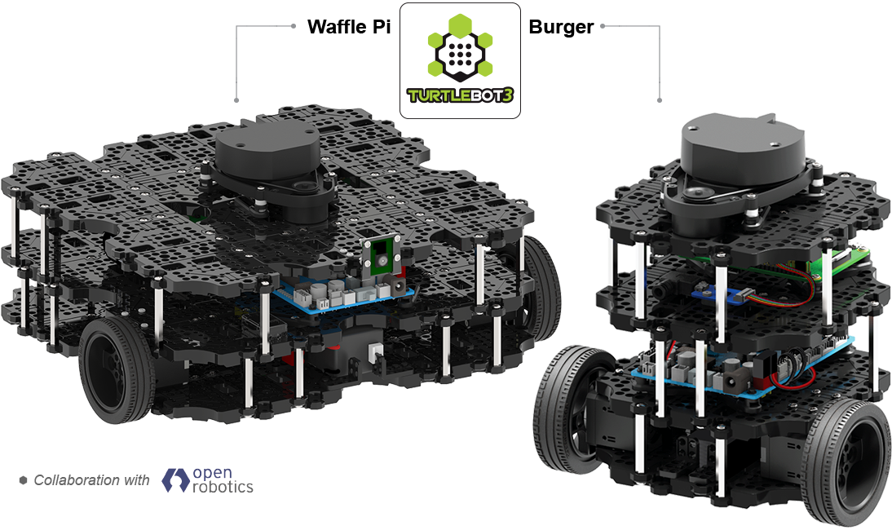
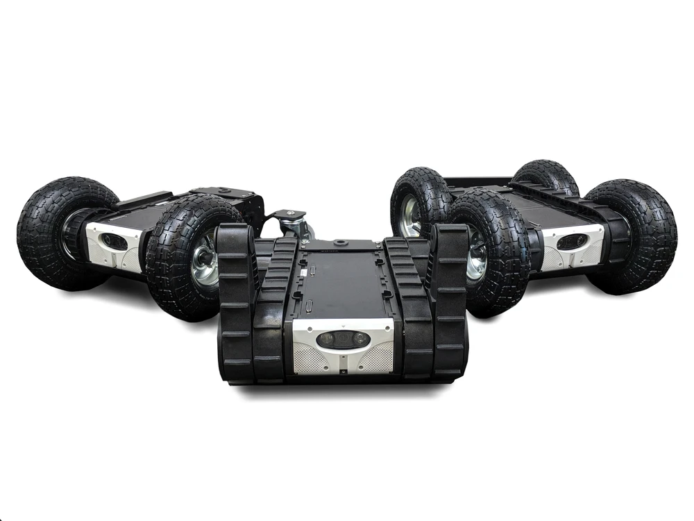

.. _robots:

Robots Using
############

It's always helpful (and fun!) to have a list of robots using or ship with our work.
Below is a very early list of robots we have encountered using our software as examples.

Click on the images below for a link to the drivers or navigation configurations.

+------------------------+------------------------+------------------------+
|         |tb2|          +          |tb3|         |        |rover|         |
+------------------------+------------------------+------------------------+
|         |soon|         +         |soon|         +         |soon|         |
+------------------------+------------------------+------------------------+
|         |soon|         +         |soon|         +         |soon|         |
+------------------------+------------------------+------------------------+

.. |tb2| image:: images/tb2.png
    :width: 100%
    :align: middle
    :alt: Turtlebot2
    :target: https://github.com/kobuki-base/kobuki_ros

.. |soon| image:: images/coming_soon.jpeg
    :width: 100%
    :align: middle
    :alt: Coming Soon
    :target: https://www.youtube.com/watch?v=oHg5SJYRHA0
