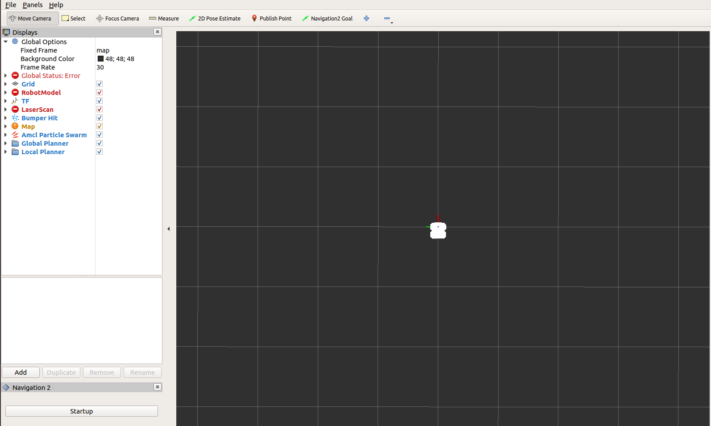
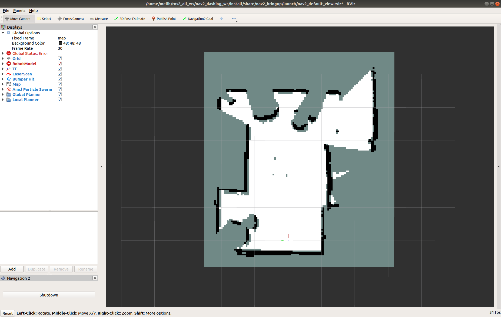
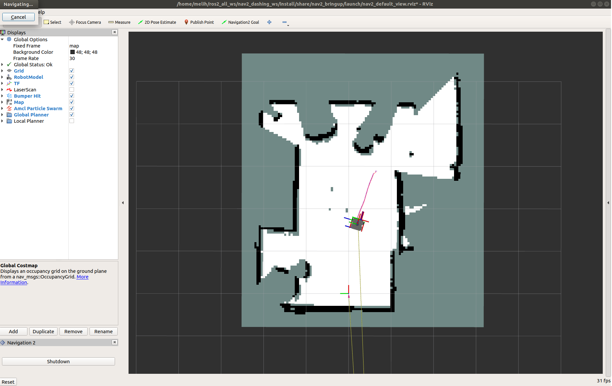

.. _navigation2-on-real-turtlebot3:

Navigation2 on a Physical Turtlebot 3
*************************************

- `Overview`_
- `Requirements`_
- `Tutorial Steps`_
- `Videos`_

Overview
========

This tutorial shows how to control and navigate Turtlebot 3 using the ROS2 Navigation2 on a physical Turtlebot 3 robot.
Before completing this tutorials, completing the :ref:`navigation2-with-turtlebot3-in-gazebo`. is highly recommended especially if you are new to ROS and Navigation2.

This tutorial consists of two parts. In the first part, you learned how to use Turtlebot 3 robots in simulation (Gazebo).
In this part, you will learn how to control a physical Turtlebot Waffle using Navigation2.

``ROS2 Dashing`` and ``Navigation2 Dashing 0.2.4`` are used to create this tutorial.
You should be able to do this tutorial using other Navigation2 versions as well.

This tutorial may take about 1 hour to complete. 
It depends on your experience with ROS, robots, and what computer system you have.

Requirements
============

You must install Navigation2, Turtelbot3. 
If you don't have them installed, please follow :ref:`navigation2-with-turtlebot3-in-gazebo`.

Tutorial Steps
==============

0- Setup Your Enviroment Variables
----------------------------------

Run the following commands first whenever you open a new terminal during this tutorial.

- ``source /opt/ros/<ros2-distro>/setup.bash``
- ``export TURTLEBOT3_MODEL=waffle``

1- Launch Turtlebot 3 Robot State Publisher
-------------------------------------------

Launch Turtlebot 3 robot state publisher,

  ``ros2 launch turtlebot3_bringup turtlebot3_state_publisher.launch.py use_sim_time:=False``

Note: use_sim_time is set to **False** because we're on a physical robot.

2- Launch Navigation2
---------------------

You need to have a map of the environment where you want to Navigate Turtlebot 3, or create one live with SLAM.

In case you are interested, there is a use case tutorial which shows how to use Navigation2 with SLAM.
`Navigation2 with SLAM <https://github.com/ros-planning/navigation2/blob/master/doc/use_cases/navigation_with_slam.md>`_

Required files:

   - ``your-map.map``
   - ``your-map.yaml``

``<your_map>.yaml`` is the configuration file for the map we want to provide Navigation2.
In this case, it has the map resolution value, threshold values for obstacles and free spaces, and a map file location.
You need to make sure these values are correct.
More information about the map.yaml can be found `here <http://wiki.ros.org/map_server>`_.

Launch Navigation 2. If you set autostart:=False, you need to click on the start button in RViz to initialize the nodes.
Make sure `use_sim time` is set to **False**, because we want to use the system time instead of the time simulation time from Gazebo.

``ros2 launch nav2_bringup nav2_bringup_launch.py use_sim_time:=False autostart:=False map:=/path/to/your-map.yaml``

Note: Don't forget to change **/path/to/your-map.yaml** to the actual path to the your-map.yaml file.

3-  Launch RVIZ
---------------

Launch RVIZ with a pre-defined configuration file.

  ``ros2 run rviz2 rviz2 -d $(ros2 pkg prefix nav2_bringup)/share/nav2_bringup/launch/nav2_default_view.rviz``

Now, you should see a shadow of Turtlebot 3 robot model in the center of the plot in Rviz.
Click on the Start button (Bottom Left) if you set the auto_start parameter to false.

Now, the map should appear in RViz.

4- Initialize the Location of Turtlebot 3
-----------------------------------------

First, find where the robot is on the map. Check where your robot is in the room.

Set the pose of the robot in RViz.
Click on the 2D Pose Estimate button and point the location of the robot on the map. 
The direction of the green arrow is the orientation of Turtlebot.

.. image:: images/Navigation2_on_real_Turtlebot3/rviz_set_initial_pose.png
    :height: 720px
    :width: 1024px
    :alt: Set initial pose in RViz

Now, the 3D model of Turtlebot should move to that location. 
A small error in the estimated location is tolerable.

5-  Send a Goal Pose
--------------------

Pick a target location for Turtlebot on the map. 
You can send Turtlebot 3 a goal position and a goal orientation by using the **Navigation2 Goal** or the **GoalTool** buttons.

Note: Navigation2 Goal button uses a ROS2 Action to send the goal and the GoalTool publishes the goal to a topic.

.. image:: images/Navigation2_on_real_Turtlebot3/rviz_send_goal.png
    :height: 720px
    :width: 1024px
    :alt: Send goal pose in RViz

Once you define the target pose,  Navigation2 will find a global path and start navigating the robot on the map.

Now, you can see that Turtlebot 3 moves towards the goal position in the room. See the video below.

Videos
------

.. raw:: html

    

      <iframe width="960" height="720" src="https://www.youtube.com/embed/ZeCds7Sv-5Q" frameborder="0" allow="accelerometer; autoplay; encrypted-media; gyroscope; picture-in-picture" allowfullscreen></iframe>
    

