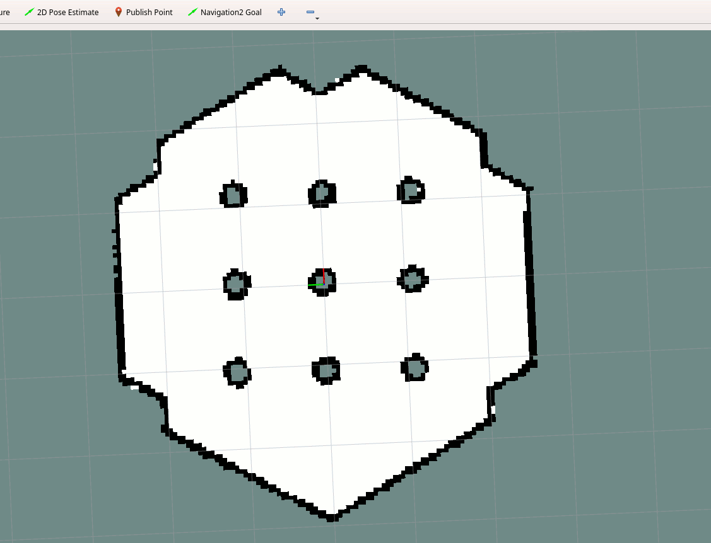
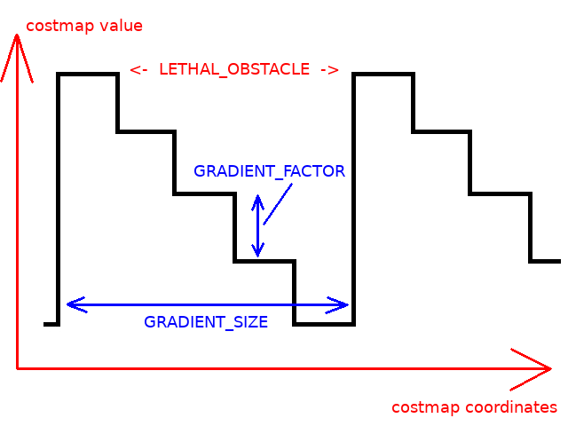
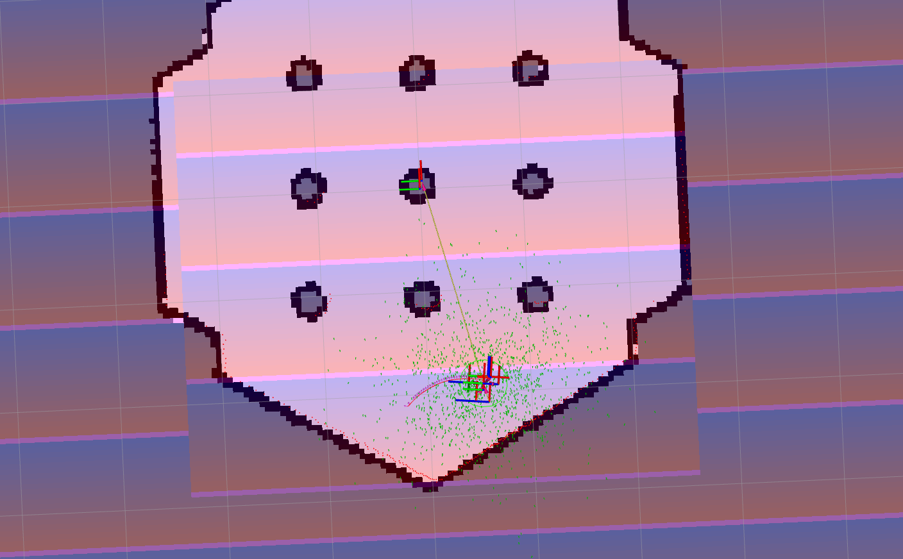

.. _writing_new_costmap2d_plugin:

Writing a New Costmap2D Plugin
******************************

- `Overview`_
- `Requirements`_
- `Tutorial Steps`_

Overview
========

This tutorial shows how to create your own simple `plugin <http://wiki.ros.org/pluginlib>`_ for Costmap2D.

Before starting the tutorial, please check this `video <https://vimeo.com/106994708>`_ which contains information about Costmap2D layers design and plugins basic operational principals.

Requirements
============

It is assumed that ROS2, Gazebo and TurtleBot3 packages are installed or built locally. Please make sure that Navigation2 project is also built locally as it was made in :ref:`build-instructions`.

Tutorial Steps
==============

1- Write a new Costmap2D plugin
-------------------------------

For a demonstration, this example will creates a costmap plugin that puts repeating costs gradients in the costmap.
The annotated code for this tutorial can be found in `navigation2_tutorials <https://github.com/ros-planning/navigation2_tutorials>`_ repository as the ``nav2_gradient_costmap_plugin`` ROS2-package.
Please refer to it when making your own layer plugin for Costmap2D.

The plugin class ``nav2_gradient_costmap_plugin::GradientLayer`` is inherited from basic class ``nav2_costmap_2d::Layer``:

.. code-block:: c

  namespace nav2_gradient_costmap_plugin
  {
  
  class GradientLayer : public nav2_costmap_2d::Layer

The basic class provides the set of virtual methods API for working with costmap layers in a plugin. These methods are calling in runtime by ``LayeredCostmap``. The list of methods, their description and necessity to have these methods in plugin's code is presented in the table below:

+----------------------+----------------------------------------------------------------------------+-------------------------+
| **Virtual method**   | **Method description**                                                     | **Requires override?**  |
+----------------------+----------------------------------------------------------------------------+-------------------------+
| onInitialize()       | Method is called at the end of plugin initialization. There is usually     | No                      |
|                      | declarations of ROS parameters. This is where any required initialization  |                         |
|                      | should occur.                                                              |                         |
+----------------------+----------------------------------------------------------------------------+-------------------------+
| updateBounds()       | Method is called to ask the plugin: which area of costmap layer it needs   | Yes                     |
|                      | to update. There are 3 input parameters of method: robot position and      |                         |
|                      | orientation and 4 output parameters: pointers to window bounds.            |                         |
|                      | These bounds are used for performance reasons: to update the area          |                         |
|                      | inside the window where is new info available, avoiding updates of whole   |                         |
|                      | costmap on every iteration.                                                |                         |
+----------------------+----------------------------------------------------------------------------+-------------------------+
| updateCosts()        | Method is called each time when costmap re-calculation is required. It     | Yes                     |
|                      | updates the costmap layer only within its bounds window. There are 4 input |                         |
|                      | parameters of method: calculation window bounds and 1 output parameter:    |                         |
|                      | reference to a resulting costmap ``master_grid``. The ``Layer`` class      |                         |
|                      | provides the plugin with an internal costmap, ``costmap_``, for updates.   |                         |
|                      | The ``master_grid`` should be updated with values within the window bounds |                         |
|                      | using one of the following update methods: ``updateWithAddition()``,       |                         |
|                      | ``updateWithMax()``, ``updateWithOverwrite()`` or                          |                         |
|                      | ``updateWithTrueOverwrite()``.                                             |                         |
+----------------------+----------------------------------------------------------------------------+-------------------------+
| matchSize()          | Method is called each time when map size was changed.                      | No                      |
+----------------------+----------------------------------------------------------------------------+-------------------------+
| onFootprintChanged() | Method is called each time when footprint was changed.                     | No                      |
+----------------------+----------------------------------------------------------------------------+-------------------------+
| reset()              | It may have any code to be executed during costmap reset.                  | Yes                     |
+----------------------+----------------------------------------------------------------------------+-------------------------+

In our example these methods have the following functionality:

1. ``GradientLayer::onInitialize()`` contains declaration of ROS parameter with its default value:

.. code-block:: c

  declareParameter("enabled", rclcpp::ParameterValue(true));
  node_->get_parameter(name_ + "." + "enabled", enabled_);

and sets ``need_recalculation_`` bounds recalculation indicator:

.. code-block:: c

   need_recalculation_ = false;

2. ``GradientLayer::updateBounds()`` re-calculates window bounds if ``need_recalculation_`` is ``true`` and updates them regardless of ``need_recalculation_`` value.

3. ``GradientLayer::updateCosts()`` - in this method the gradient is writing directly to the resulting costmap ``master_grid`` without merging with previous layers. This is equal to working with internal ``costmap_`` and then calling ``updateWithTrueOverwrite()`` method. Here is the gradient making algorithm for master costmap:

.. code-block:: c

  int gradient_index;
  for (int j = min_j; j < max_j; j++) {
    // Reset gradient_index each time when reaching the end of re-calculated window
    // by OY axis.
    gradient_index = 0;
    for (int i = min_i; i < max_i; i++) {
      int index = master_grid.getIndex(i, j);
      // setting the gradient cost
      unsigned char cost = (LETHAL_OBSTACLE - gradient_index*GRADIENT_FACTOR)%255;
      if (gradient_index <= GRADIENT_SIZE) {
        gradient_index++;
      } else {
        gradient_index = 0;
      }
      master_array[index] = cost;
    }
  }

where the ``GRADIENT_SIZE`` is the size of each gradient period in map cells, ``GRADIENT_FACTOR`` - decrement of costmap's value per each step:

These parameters are defined in plugin's header file.

4. ``GradientLayer::onFootprintChanged()`` just resets ``need_recalculation_`` value.

5. ``GradientLayer::reset()`` method is dummy: it is not used in this example plugin. It remaining there since pure virtual function ``reset()`` in parent ``Layer`` class required to be overriden.

2- Export and make GradientLayer plugin
---------------------------------------

The written plugin will be loaded in runtime as it's basic parent class and then will be called by plugin handling modules (for costmap2d by ``LayeredCostmap``). Pluginlib opens a given plugin in run-time and provides methods from exported classes to be callable. The mechanism of class exporting tells pluginlib which basic class should be used during these calls. This allows to extend an application by plugins without knowing application source code or recompiling it.

In our example the ``nav2_gradient_costmap_plugin::GradientLayer`` plugin's class should be dynamically loaded as a ``nav2_costmap_2d::Layer`` basic class. For this the plugin should be registered as follows:

1. Plugin's class should be registered with a basic type of loaded class. For this there is a special macro ``PLUGINLIB_EXPORT_CLASS`` should be added to any source-file composing the plugin library:

.. code-block:: text

  #include "pluginlib/class_list_macros.hpp"
  PLUGINLIB_EXPORT_CLASS(nav2_gradient_costmap_plugin::GradientLayer, nav2_costmap_2d::Layer)

This part is usually placed at the end of cpp-file where the plugin class was written (in our example ``gradient_layer.cpp``). It is good practice to place these lines at the end of the file but technically, you can also place at the top.

2. Plugin's inormation should be stored to plugin description file. This is done by using separate XML (in our example ``gradient_plugins.xml``) in the plugin's package. This file contains information about:

 - ``path``: Path and name of library where plugin is placed.
 - ``name``: Plugin type referenced in ``plugin_types`` parameter (see next section for more details). It could be whatever you want.
 - ``type``: Plugin class with namespace taken from the source code.
 - ``basic_class_type``: Basic parent class from which plugin class was derived.
 - ``description``: Plugin description in a text form.

.. code-block:: xml

  <library path="nav2_gradient_costmap_plugin_core">
    <class name="nav2_gradient_costmap_plugin/GradientLayer" type="nav2_gradient_costmap_plugin::GradientLayer" base_class_type="nav2_costmap_2d::Layer">
      <description>This is an example plugin which puts repeating costs gradients to costmap</description>
    </class>
  </library>

The export of plugin is performed by including ``pluginlib_export_plugin_description_file()`` cmake-function into ``CMakeLists.txt``. This function installs plugin description file into ``share`` directory and sets ament indexes for plugin description XML to be discoverable as a plugin of selected type:

.. code-block:: text

  pluginlib_export_plugin_description_file(nav2_costmap_2d gradient_layer.xml)

Plugin description file is also should be added to ``package.xml``. ``costmap_2d`` is the package of the interface definition, for our case ``Layer``, and requires a path to the xml file:

.. code-block:: text

  <export>
    <costmap_2d plugin="${prefix}/gradient_layer.xml" />
    ...
  </export>

After everything is done put the plugin package into ``src`` directory of a certain ROS2-workspace, build the plugin package (``colcon build --packages-select nav2_gradient_costmap_plugin --symlink-install``) and source ``setup.bash`` file when it necessary.

Now the plugin is ready to use.

3- Enable the plugin in Costmap2D
---------------------------------

At the next step it is required to tell Costmap2D about new plugin. For that the plugin should be added to ``plugin_names`` and ``plugin_types`` lists in ``nav2_params.yaml`` optionally for ``local_costmap``/``global_costmap`` in order to be enabled in run-time for Controller/Planner Server. ``plugin_names`` list contains the names of plugin objects. These names could be anything you want. ``plugin_types`` contains types of listed in ``plugin_names`` objects. These types should correspond to ``name`` field of plugin class specified in plugin description XML-file.

For example:

.. code-block:: diff

  --- a/nav2_bringup/bringup/params/nav2_params.yaml
  +++ b/nav2_bringup/bringup/params/nav2_params.yaml
  @@ -124,8 +124,8 @@ local_costmap:
         width: 3
         height: 3
         resolution: 0.05
  -      plugin_names: ["obstacle_layer", "voxel_layer", "inflation_layer"]
  -      plugin_types: ["nav2_costmap_2d::ObstacleLayer", "nav2_costmap_2d::VoxelLayer", "nav2_costmap_2d::InflationLayer"]
  +      plugin_names: ["obstacle_layer", "voxel_layer", "gradient_layer"]
  +      plugin_types: ["nav2_costmap_2d::ObstacleLayer", "nav2_costmap_2d::VoxelLayer", "nav2_gradient_costmap_plugin/GradientLayer"]
         robot_radius: 0.22
         inflation_layer:
           cost_scaling_factor: 3.0
  @@ -171,8 +171,8 @@ global_costmap:
         robot_base_frame: base_link
         global_frame: map
         use_sim_time: True
  -      plugin_names: ["static_layer", "obstacle_layer", "voxel_layer", "inflation_layer"]
  -      plugin_types: ["nav2_costmap_2d::StaticLayer", "nav2_costmap_2d::ObstacleLayer", "nav2_costmap_2d::VoxelLayer", "nav2_costmap_2d::InflationLayer"]
  +      plugin_names: ["static_layer", "obstacle_layer", "voxel_layer", "gradient_layer"]
  +      plugin_types: ["nav2_costmap_2d::StaticLayer", "nav2_costmap_2d::ObstacleLayer", "nav2_costmap_2d::VoxelLayer", "nav2_gradient_costmap_plugin/GradientLayer"]
         robot_radius: 0.22
         resolution: 0.05
         obstacle_layer:

YAML-file may also contain the list of parameters (if any) for each plugin, identified by plugins object name.

NOTE: there could be many simultaneously loaded plugin objects of one type. For this, ``plugin_names`` list should contain different plugins names whether the ``plugin_types`` will remain the same types. For example:

.. code-block:: text

  plugin_names: ["obstacle_layer", "gradient_layer_1", "gradient_layer_2"]
  plugin_types: ["nav2_costmap_2d::ObstacleLayer", "nav2_gradient_costmap_plugin/GradientLayer", "nav2_gradient_costmap_plugin/GradientLayer"]

In this case each plugin object will be handled by its own parameters tree in a YAML-file, like:

.. code-block:: text

  gradient_layer_1:
    enabled: True
    ...
  gradient_layer_2:
    enabled: False
    ...

4- Run GradientLayer plugin
---------------------------

Run Turtlebot3 simulation with enabled navigation2. Detailed instructuction how to make it are written at :ref:`getting_started`. Below is shortcut command for that:

.. code-block:: bash

  $ ros2 launch nav2_bringup tb3_simulation_launch.py

Then goto RViz and click on the "2D Pose Estimate" button at the top and point the location on map as it was described in :ref:`getting_started`. Robot will be localized on map and the result should be as presented at picture below. There is could be seen the gradient costmap. There are also 2 noticeable things: dynamically updated by ``GradientLayer::updateCosts()`` costmap within its bounds and global path curved by gradient:

